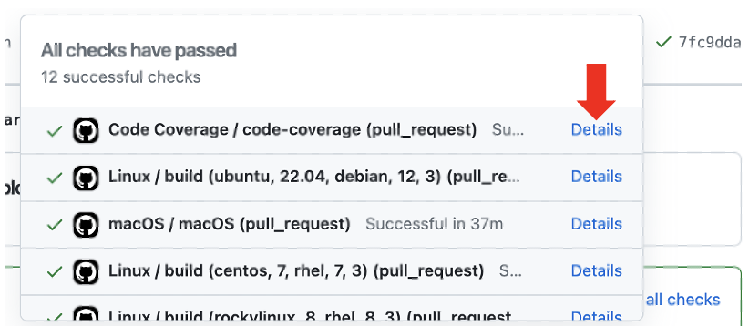

| [Home](/trick) → [Developer Docs](Developer-Docs-Home) → CI |
|------------------------------------------------------------------|


# CI System

Trick's CI is run through Github Actions. The workflows are defined in yaml files that live under [`.github/workflows`](https://github.com/nasa/trick/tree/master/.github/workflows). 


## On push to master and pull requests

Trick's CI runs the test suite on a representative sample of OS configurations on each push to master or pull request. 

Workflows run on push to master and pull requests:
- [test_macos.yml](https://github.com/nasa/trick/tree/master/.github/workflows/test_macos.yml)
- [test_linux.yml](https://github.com/nasa/trick/tree/master/.github/workflows/test_linux.yml)
- [code_coverage.yml](https://github.com/nasa/trick/tree/master/.github/workflows/code_coverage.yml)

`test_macos` only runs the test suite on Mac, `test_linux` runs on the following configurations:
```
    - { os: ubuntu,      tag: 22.04,    arch: debian, arch_ver: 12 }
    - { os: centos,      tag: 7,        arch: rhel,   arch_ver: 7  }
    - { os: rockylinux,  tag: 8,        arch: rhel,   arch_ver: 8  }
    - { os: oraclelinux, tag: 8,        arch: rhel,   arch_ver: 8  }
```
`code_coverage` runs on OracleLinux8 and takes the following steps:
- builds Trick with gcov enabled
- Runs the test suite
- Generates coverage information
- Uploads the coverage information to Coveralls

All of these use Python3.

Of these, Centos7 is the oldest and causes the most issues. 

After these workflows finished, another workflow is triggered to upload the results:
- [report_macos.yml](https://github.com/nasa/trick/tree/master/.github/workflows/report_macos.yml)
- [report_linux.yml](https://github.com/nasa/trick/tree/master/.github/workflows/report_linux.yml)

These use a 3rd party action to upload and display the XML JUnit output of the unit tests. The report step is intended to fail if failing unit tests are detected.

## Scheduled CI Jobs

Trick runs the test suite on a wider set of OS configurations on master once a week. The workflows run weekly are:

- [test_linux_py2.yml](https://github.com/nasa/trick/tree/master/.github/workflows/test_linux_py2.yml)
```
    - { os: ubuntu,      tag: 22.04,    arch: debian, arch_ver: 12 }
    - { os: centos,      tag: 7,        arch: rhel,   arch_ver: 7  }
    - { os: rockylinux,  tag: 8,        arch: rhel,   arch_ver: 8  }
    - { os: oraclelinux, tag: 8,        arch: rhel,   arch_ver: 8  }
python: [2]
```

- [alt_linux_distros.yml](https://github.com/nasa/trick/tree/master/.github/workflows/alt_linux_distros.yml)
```
    - { os: ubuntu,      tag: 18.04,    arch: debian, arch_ver: 10 }
    - { os: ubuntu,      tag: 20.04,    arch: debian, arch_ver: 11 }
    - { os: debian,      tag: 10,       arch: debian, arch_ver: 10 }
    - { os: debian,      tag: 11,       arch: debian, arch_ver: 11 }
    - { os: debian,      tag: bookworm, arch: debian, arch_ver: 12 }
    - { os: almalinux,   tag: 8,        arch: rhel,   arch_ver: 8  }
python: [2, 3]
```

The python2 and alt linux have report uploaders as well:
- [report_linux_py2.yml](https://github.com/nasa/trick/tree/master/.github/workflows/report_linux_py2.yml)
- [report_alt_linux_distros.yml](https://github.com/nasa/trick/tree/master/.github/workflows/report_alt_linux_distros.yml)


- [test_32.yml](https://github.com/nasa/trick/tree/master/.github/workflows/test_32.yml)
```
Centos 7, Python2, 32 bit build
```

- [test_32_oracle.yml](https://github.com/nasa/trick/tree/master/.github/workflows/test_32_oracle.yml)
```
OracleLinux8, Python3.6, 32 bit build
```

- [trickops.yml](https://github.com/nasa/trick/tree/master/.github/workflows/trickops.yml)
    - Runs the TrickOps test suite.


## Deprecated Workflows

There are a few workflow files in the workflow directory that are mysterious to the trick developers themselves.

- [docker.yml](https://github.com/nasa/trick/tree/master/.github/workflows/docker.yml)
    - This appears to try to pull a Trick image from Docker's image libary, but started failing recently. Did we have images uploaded at some point???
- Civetweb Tests
    - [python_tests_32.yml](https://github.com/nasa/trick/tree/master/.github/workflows/python_tests_32.yml)
    - [python_tests_linux.yml](https://github.com/nasa/trick/tree/master/.github/workflows/python_tests_linux.yml)
    - [python_tests_macos.yml](https://github.com/nasa/trick/tree/master/.github/workflows/python_tests_macos.yml)
    - These workflows run civetweb tests located in [`share/trick/pymods/trick/tests/civet_server`](https://github.com/nasa/trick/tree/master/share/trick/pymods/trick/tests/civet_server). These workflows are disabled.


## Misc Debugging Tips

The logs from each CI run can be viewed either from the `Actions` tab on Github, or by clicking on the status icon listed next to a commit and then "Details". These logs include all build and unit test output, but only the results of the simulation tests (TrickOps suppresses the normal output). 




TrickOps must run with the `--quiet` argument, which suppresses the status bars that are usually displayed. All output of the tests are redirected into files under `trickops_logs`, which are currently not uploaded to Github and are lost when run in CI. This should be fixed. TrickOps will dump the output of any failing jobs to the terminal at the end of a test suite run, which partially mitigates the issue. Currently, if a sim test hangs, TrickOps has no way to recover, and it will run until the Github runner terminates the workflow (6 hours) and won't output the status of the sims. There is a fix for this in the works. 

To debug a failing workflow in a Linux distro that you do not have physical access to, use Docker or Podman to run it in a container. The logs for a CI run show the exact commands that are run to set up the environment in the container. 

On Podman, the Centos7 image that is automatically pulled is different from the one that is pulled by Docker on Github which creates different results. To get the exact same container, pull from `docker.io/library/centos:7`.  


## Bugs

The report upload step often doesn't work as intended. The report steps are supposed to run after a test workflow, upload the Junit xml test results into a readable format, and fail if any failing unit tests are found. Instead it often fails because it couldn't find the results at all. The reports often get attached to incorrect workflows or put in a location that can't be viewed. 

The action used as the test reporter is the [Dorny Test Reporter](https://github.com/marketplace/actions/test-reporter), and it often has it's own problems. The matrix of different OS configurations appears to cause issues with this reporter as well. 

