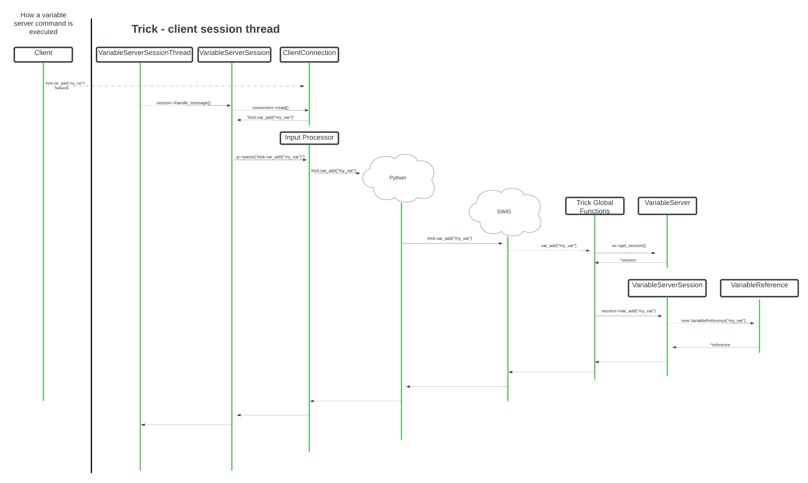
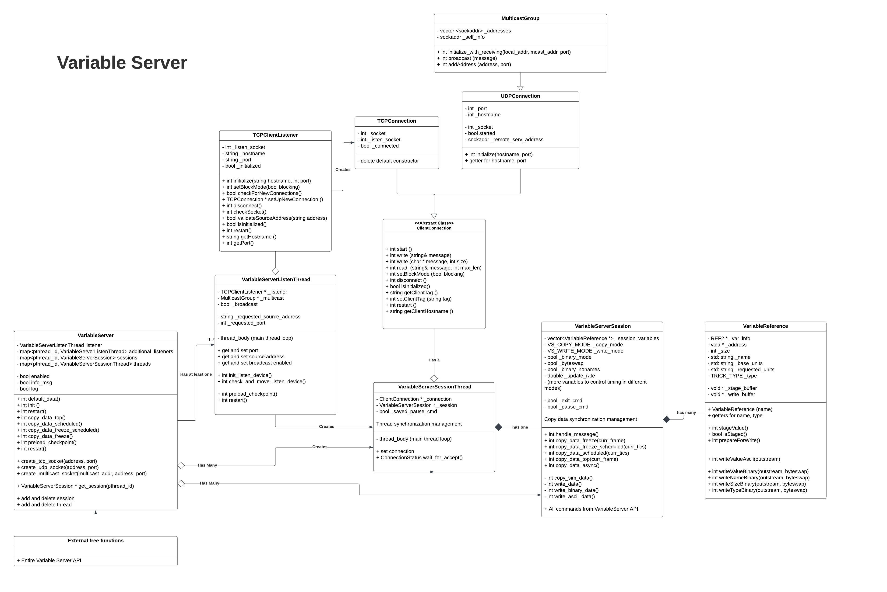

# Variable Server Refactor

The goals of this refactor were as follows:

1. Test the Trick Variable Server
    - At the start, the variable server was completely uncovered by CI. This can be seen in the earliest builds uploaded to Coveralls (https://coveralls.io/builds/53258598)
    - Identified a need for both unit and sim tests
    - Significant refactoring was needed to be able to do any unit tests
2. Create a generic representation for a session that can be used in the webserver as well
    - Currently, the webserver implementation is completely separate from the variable server, even through they do they same thing. There is a lot of repeated functionality between the two.
    - The current implementation of the variable server made it impossible to reuse any of its code.
3. Clarify and document code. 


## Class Structure

### VariableServer.hh
The overarching variable server object. It is instantiated in VariableServerSimObject and is intended to be a singleton.

Responsibilities:
- Initialize a listen thread
- Keep track of all sessions
- Interface with the Trick scheduler through the Trick jobs, and delegate to sessions
- Provide the API for all variable server commands to go through, and delegate to correct session


### VariableServerListenThread.hh
Opens a TCP port and listens for new client connections until shut down. Only 1 exists by default as a member of VariableServer,
but additional listen threads can be created through a call to trick.var_server_create_tcp_socket()

Responsibilities:
- Open a TCP port for listening
- Continuously listen on the port
- Broadcast the port on the multicast channel
- When a client connection comes in, set up the connection, start a thread, and wait for the thread to start the connection
    - Delete the thread if the connection fails

### VariableServerSessionThread.hh
Runs asynchronous parts for the single VariableServerSession.

Responsibilities:

- Accept the connection and pass it into the VariableServerSession
- Delete the session and close the connection on shutdown
- Run the parts of VariableServerSession that run asynchronously until user commands shutdown or sim shutdown, including:
    - Tell VSSession to read from connection and execute command
    - Tell VSSession to copy sim data (if in correct mode)
    - Tell VSSession to write data (if in correct mode)


### VariableServerSession.hh
Track information and execute commands for a single client session.

Responsibilities:
- Keep track of the list of variables
- Track desired copy/write mode and timing
- Overrideable behaviors:
    - Write out to connection when commanded
    - Read in and execute commands from connection when commanded

### VariableReference.hh
Represent a single variable in a session

Responsibilities:
- Copy sim data into internal buffer when commanded
- Write sim data into stream when commanded 
- Provide functions to write ASCII and binary data
- Track what units the user has requested
- Survive a checkpoint restart

### TCPClientListener.hh
Represents a listening TCP server

Responsibilities:
- Encapsulate network code
- Provide an interface to start a server, listen for new connections, and create new connections
- Create a TCPConnection when a client connects

### ClientConnection.hh

Responsibilities
Abstract class representing a connection to a client. Inherited classes to handle TCP, UDP, and Multicast connections
- Encapsulate network code
- Provide a generic interface for initializing, starting, shutting down, reading, and writing to network regardless of connection type

## Threading changes

### VariableServerListenThread is required to wait for VariableServerSessionThread to notify it when the connection has been accepted.
This was present in old design, but not implemented safely.

#### Old design:

```
VariableServerSessionThread
    + wait_for_accept()
    - bool connection_accepted = false
```

`wait_for_accept` just busy waits on `connection_accepted` with no synch constructs (John Borland would be horrified)
VariableServerListenThread calls `VsThread.wait_for_accept()`

No error handling if connection failed, which can result in hanging listen thread and extra VSThreads bc of other problems in listen thread

#### New Design

```
VariableServerSessionThread
    + enum ConnectionStatus { CONNECTION_PENDING, CONNECTION_SUCCESS, CONNECTION_FAIL };
    + wait_for_accept()

    - ConnectionStatus _connection_status = CONNECTION_PENDING
    - pthread_mutex_t _connection_status_mutex
    - pthread_cond_t _connection_status_cv


VariableServerSessionThread::thread_body
    Try to accept connection
    if connection fails:
        with _connection_status_mutex:
            set _connection_status to CONNECTION_FAIL
            signal on _connection_status_cv
        exit thread
    
    Do some other setup
    with _connection_status_mutex:
        set _connection_status to CONNECTION_SUCCESS
        signal on _connection_status_cv 

    Run loop


VariableServerSessionThread::wait_for_accept
    with _connection_status_mutex:
        while _connection_status == CONNECTION_PENDING:
            wait on _connection_status_cv

    return _connection_status


VariableServerListenThread::thread_body
    When we're trying to set up a connection:
        Create new VSThread, set up the connection, start the thread
        status = VSThread->wait_for_accept()
        if status is CONNECTION_FAIL:
            make sure the thread has exited and delete it
        
```

### VariableServerSessionThread and VariableServerListenThread no longer use pthread_cancel
New termination design: 
```
Additions to Threadbase
    + test_shutdown(/* optional exit handler args */) 
    + thread_shutdown(/* optional exit handler args */)

    - bool cancellable = true
    - pthread_mutex_t shutdown_mutex
    - bool should_shutdown = false

ThreadBase::test_shutdown:
    with shutdown_mutex
    if should_shutdown:
        call thread_shutdown
    
ThreadBase::thread_shutdown
    Call exit handler if one passed
    Call pthread_exit(0)

Addition to function of Threadbase::cancel_thread():
    with shutdown_mutex: Set should_shutdown to true 
    if cancellable == true, call pthread_cancel
```

Threads can set cancellable to false in their constructor, which VariableServerSessionThread and VariableServerListenThread do
Instead, they call test_shutdown at points that would be appropriate to shutdown in their loops
Careful design consideration and testing was taken so that if the threads never start, or various error cases are hit, this still goes ok


### VariableServerSessionThread and VariableServerListenThread pause on checkpoint reload

#### Old design:

```
VariableServerSessionThread and VariableServerListenThread
    - pthread_mutex_t restart_pause
```

This mutex is acquired by the top of the loops while they do their main processing, and released at the bottom of the loop.

The main thread acquires the mutex in preload_checkpoint jobs and releases in restart jobs.

This created a few bugs:
- a deadlock in VariableServerSessionThread due to a lock inversion with the VariableServer map mutex
- For some reason, holding the lock while blocked on the select syscall by the VariableServerListenThread could cause some really weird bugs, so the lock was acquired after the select call and only if it returned true. Because of this, select could be run while checkpoint restart was happening, which sometimes resulted in false positives, which created extra VariableServerSessionThreads, and the connection status was never checked so they would never shut down and cause all kinds of problems.

#### New design

```
Addition to SysThread
    + void force_thread_to_pause()
    + void unpause_thread()
    + void test_pause()

    - pthread_mutex_t _restart_pause_mutex
    - bool _thread_should_pause                
    - pthread_cond_t _thread_wakeup_cv          
    - bool _thread_has_paused                   
    - pthread_cond_t _thread_has_paused_cv      
```

This design still ensures that thread can be paused, and that the main thread will wait until the threads are paused. It uses condvars to solve the deadlock problem and doesn't cause bugs observed in the old design. 

The main thread can control the SysThread by calling `thread->force_thead_to_pause()`, which will block until the SysThread has paused, and `thread->unpause_thread()`. The SysThread loops must call `test_pause()` at points that would be appropriate to pause. 

SysThread uses a monitor pattern internally to implement this behavior. Pseudocode for the pause managment:

```
// Called from main thread
SysThread::force_thread_to_pause()
    with _restart_pause_mutex:
        _thread_should_pause = true
        while !_thread_has_paused:
            wait on _thread_has_paused_cv

// Called from main thread
SysThread::unpause_thread():
    with _restart_pause_mutex:
        _thread_should_pause = false
        signal on _thread_wakeup_cv

// Called from SysThread
SysThread::test_pause():
    with _restart_pause_mutex:
        if _thread_should_pause:
            _thread_has_paused = true
            signal on _thread_has_paused_cv

            while _thread_should_pause
                wait on _thread_wakeup_cv

        _thread_has_paused = false
```

## VariableReference

The VariableReference class existed in the old version only to hold buffers for copied values, it had no methods. 

In the refactored version, the VariableReference class encapsulates all interaction with the memory manager and sim variables, including copying and formatting the values. VariableReference keeps track of the units that have been requested for this variable in this session. VariableReference provides an interface to write out the value of a variable in either Ascii or binary format.

It still uses REF2 internally, but the encapsulation will make the (hopefully) impending transition to something else easier to manage.

The VariableReference class is covered by unit tests.

```
VariableReference Interface
    + VariableReference(std::string var_name)

    + std::string getName()
    + TRICK_TYPE getType()

    + std::string getBaseUnits()
    + int setRequestedUnits(std::string new_units)

    + int stageValue ()
    + int prepareForWrite ()
    + bool isStaged ()
    + bool isWriteReady ()

    + int writeValueAscii( std::ostream& out )
    + int writeValueBinary( std::ostream& out , bool byteswap = false)
    + ((Other methods to write out information about the binary or ascii formats))
```

## VariableServerSession

The VariableServerSession class is a new class created in this refactor. A lot of the behavior of the old VariableServerSessionThread class is now in this class.

A VariableServerSession represents a single client session. It tracks the list of variables that are being sent, the copy and write mode, output format mode, cycle, pause state, exit command. 

The VariableServerSession has methods that should be called from Trick job types to implement correct moding - 

```
// Called from different types of Trick jobs. 
// Determines whether this session should be copying and/or writing, and performs those actions if so
+ int copy_and_write_freeze(long long curr_frame);
+ int copy_and_write_freeze_scheduled(long long curr_tics);
+ int copy_and_write_scheduled(long long curr_tics);
+ int copy_and_write_top(long long curr_frame);

// Called from VariableServerSessionThread
+ virtual int copy_and_write_async();
```

The VariableServerSession has a method that should be called when it is time to handle a message and act on it. This is called from the VariableServerSessionThread loop.
```
+ virtual int  handle_message();
```

The VariableServerSession has the entirety of the documented VariableServer API as methods as well. These are called from the single VariableServer object after looking up the session.


The VariableServerSession class is covered by unit tests.


## VariableServerSessionThread

The VariableServerSessionThread class runs and manages the lifetime and synchronization of a VariableServerSessionThread, sets up and closes the connection for the VariableServerSession, and calls any VariableServerSession methods that are designed to be asynchronous with the main thread. This includes `handle_message` and `copy_and_write_async`. It also creates the cycle of the session. 

```
VariableServerSessionThread_loop.cpp
    - void thread_body()

VariableServerSessionThread.cpp
    + void preload_checkpoint()
    + void restart()

    + ConnectionStatus wait_for_accept()
```

`thread_body()` runs the main loop of the VST. 

`preload_checkpoint()` and `restart()` are called from their respective Trick jobs in the main thread.


## VariableServer

The VariableServer class itself has been the least changed by this refactor. 

Its main job is to delegate between the Trick jobs and the various sessions and threads. The VariableServer is a singleton that is declared as part of a SimObject in `default_trick_sys.sm`
```
VariableServerSimObject {
    VariableServer vs;

    {TRK} ("default_data") vs.default_data() ;
    {TRK} P0 ("initialization") trick_ret = vs.init() ;
    {TRK} ("preload_checkpoint") vs.suspendPreCheckpointReload();
    {TRK} ("restart") vs.restart();
    {TRK} ("restart") vs.resumePostCheckpointReload();
    {TRK} ("top_of_frame") vs.copy_and_write_top() ;
    {TRK} ("automatic_last") vs.copy_and_write_scheduled() ;

    {TRK} ("freeze_init") vs.freeze_init() ;
    {TRK} ("freeze_automatic") vs.copy_and_write_freeze_scheduled() ;
    {TRK} ("freeze") vs.copy_and_write_freeze() ;

    {TRK} ("shutdown") vs.shutdown() ;
}
```

In each job:
- default_data: Initialize the listening socket with any port
- initialization: If the user has requested a different port, set that up. Start the listening thead.
- preload_checkpoint: call methods of all VariableServerListenThreads and VariableServerSessionThreads to pause in preparation for checkpoint
- restart: recreate listening threads if necessary, and call restart methods of all VariableServerListenThreads and VariableServerSessionThreads
- top_of_frame, automatic_last, freeze, freeze_automatic: Loop through all VariableServerSessions and call the appropriate copy_data_ variant
- shutdown: cancel all VariableServerListenThreads and VariableServerSessionThreads

The VariableServer implements part of the dataflow for commands that come in through the input processor.

The VariableServer's external API is the entry point of the variable server commands that are passed though the input processor. These commands go to a C-style API, which query the static global singleton VariableServer object. Each of these commands will look up the correct session by pthread_id and call the session's command.

```
Client sends `"trick.var_add("my_variable")\n"`
`VariableServerSessionThread::thread_body` calls `VariableServerSession::handle_mesage`
`VariableServerSession::handle_mesage` reads from the client connection and calls `ip_parse("trick.var_add("my_variable")\n")`
Python interpreter runs (on the variable server thread) back through the SWIG layer to invoke global method `var_add("my_variable")` in var_server_ext.cpp
`var_add()` calls the static global variable server object to look up the current session, mapped to the current pthread_id
`var_add()` calls `session->var_add("my_variable")`
session will add my_variable to its list of variables
Return from `ip_parse`, continue `thread_body` processing
```

Code snippets (some minor modifications for clarity):

```
// var_server_ext.cpp
int var_add(std::string in_name) {
    Trick::VariableServerSession * session = get_session();
    
    if (session != NULL ) {
        session->var_add(in_name) ;
    }
    return(0) ;
}

Trick::VariableServerSession * get_session() {
    return the_vs->get_session(pthread_self()) ;
}

// VariableServer.cpp
Trick::VariableServerSession * Trick::VariableServer::get_session(pthread_t thread_id) {
    Trick::VariableServerSession * ret = NULL ;
    pthread_mutex_lock(&map_mutex) ;
    auto it = var_server_sessions.find(thread_id) ;
    if ( it != var_server_sessions.end() ) {
        ret = (*it).second ;
    }
    pthread_mutex_unlock(&map_mutex) ;
    return ret ;
}

// VariableServerSession_commands.cpp
int Trick::VariableServerSession::var_add(std::string in_name) {

    VariableReference new_var = new VariableReference(in_name);
    _session_variables.push_back(new_var) ;

    return(0) ;
}
```



Both var_server_ext.cpp and VariableServerSession_commands.cpp have a method for each command in the user facing variable server API. 

### Special case listen threads and sessions

The user can request addition TCP, UDP, or multicast servers from the input file. This is handled in the VariableServer class.

```
VariableServer {
    + int create_tcp_socket(const char * address, unsigned short in_port )
    + int create_udp_socket(const char * address, unsigned short in_port )
    + int create_multicast_socket(const char * mcast_address, const char * address, unsigned short in_port )
}
```

Calling `create_tcp_socket` will create an additional listen thread, which will operate in the same way as the default listen thread. The VariableServer will create a TCPClientListener and start the listen thread, just like it does for the default listen thread.

`create_udp_socket` will open a UDP socket. Since it does not require a listener, the VariableServer creates a VariableServerSessionThread and a UDPConnection directly, and starts the thread. The output for this session is sent to whatever host a message is received from. 

`create_multicast_socket` will create a UDP socket and add it to a multicast group. It will also create and start a VariableServerSessionThread and MulticastGroup object. The output for this session is broadcast on the multicast address given.

## ClientConnection and TCPClientListener

The purpose of these classes are to abstract away all of the network code and the differences between TCP, UDP, and multicast connections for the purpose of the VariableServerSession. 

The VariableServerListenThread uses a TCPClientListener to listen for connections on an open socket, and when one comes in, the TCPClientListener will create a TCPConnection to service the connection. 

In the UDP and Multicast case, the connection is created directly in the VariableServer class and passed into the VariableServerSessionThread.


## Class Diagram



