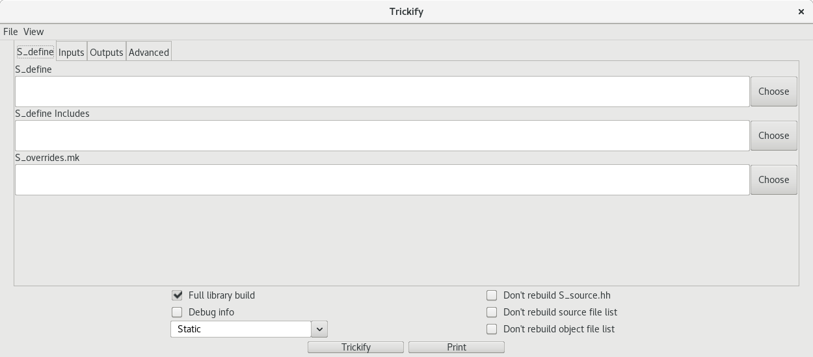
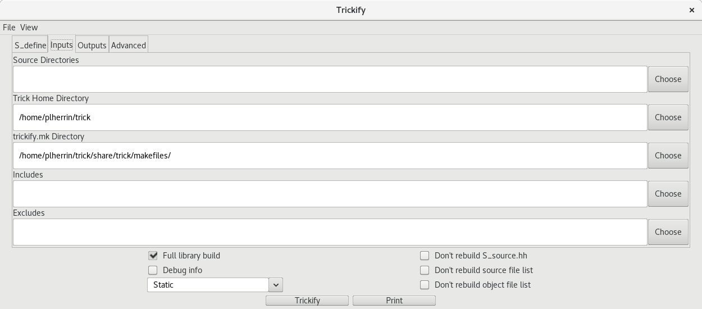
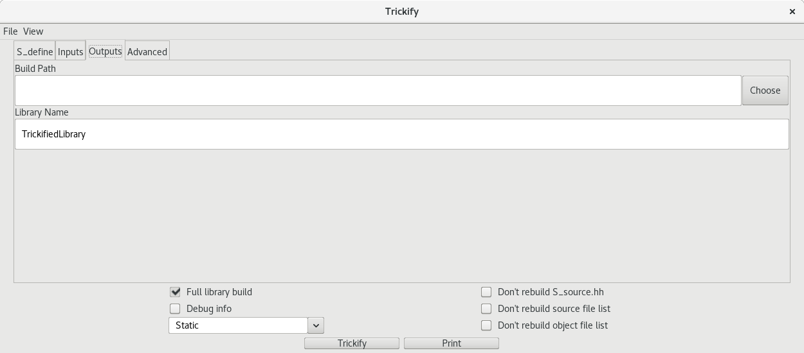
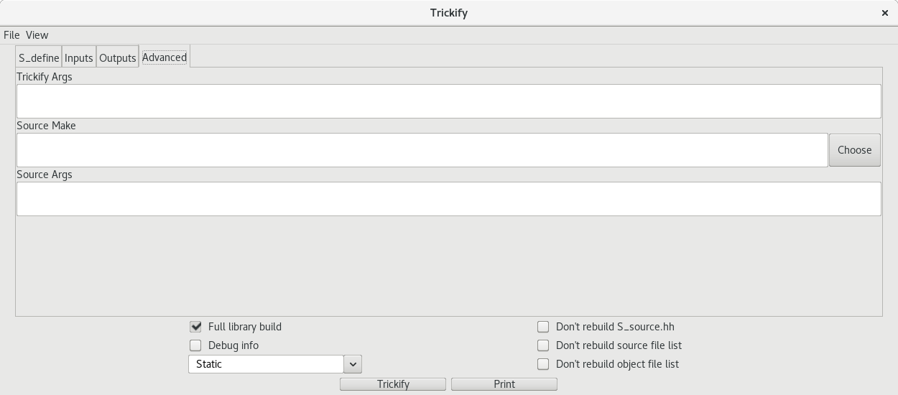

| [Home](/trick) → [Documentation Home](../Documentation-Home) → [Building a Simulation](Building-a-Simulation) → Trickified Project Libraries |
|------------------------------------------------------------------|

# Classic Trickify
This document details the revamped form of Trickify added in Trick-25. For the original documentation, see [Trickified Project Libraries Classic](Trickified-Project-Libraries-Classic)

# Overview
During a simulation build, Trick generates several rounds of files to support data recording, checkpointing, and Python access:

* Trick generates `S_source.hh` from the `S_define`
* ICG recursively builds a tree of all header files included from `S_source.hh` and generates an `io_*.cpp` and `*_py.i` file for each
* SWIG converts all `*_py.i` to `*_py.cpp` files
* Trick compiles all `io_*.cpp` and `*_py.cpp` files along with the original source files

Due to the framework Trick creates, it is not feasible to build external libraries with Trick utilities enabled. The external libraries must either be rebuilt with each clean sim build, or pre-compiled and sacrifice Trick utilities.

This is where Trickification comes in. Trickfication is a utility that allows external libraries to be compiled with Trick utilities included. This convenience feature is intended to save time on unnecessary rebuilding of external libraries that are not going be changed as part of normal workflow.

# Who's Responsible?
Support of Trickification is the project owner's responsibility. While it is possible for anyone to Trickify any set of files, you really want the project to maintain the files we're going to talk about. This will ensure that's it done correctly, in one place, and stays synchronized with the project.

# Trickifying Your Project
Trickifying your project requires only a few steps.
   1. Identify the files you want included in your library. You do not necessarily need to manually create a list of files. Trick-ify just needs to know what directories to look in.
   2. Run the Trickify script. 
   3. Include S\_overrides\_trickify.mk in your sims trickify.mk. S\_overrides\_trickify.mk is generated by Trickify. trickify.mk is a list of all Trickified libraries you want to include in your build. trickify.mk must be created by you, in the same directory as your S\_define. Note, you should use -include in your trickify.mk, otherwise it can interfere with trick-CP.

## Checking In Your Trickified Library
If you would like to check in your Trickification to a repository, you only need to push two files. First is the trickify.mk file you created in your sim directory. The second is the core makefile in the Trickified build directory. The core makefile contains a command to rebuild the library, so no other files from the build directory are needed.

Note: Before you check in your makefile, make sure the Trickify call only contains relative paths.

# Trick-ify Script
The core script behind Trickification is the trick-ify script (which lives at $(TRICK\_HOME)/bin/). While this script contains everything you need to Trickify, it can be tedious to work with directly. We advise you check out the GUI section for a friendlier way to construct your Trickify commands.

IMPORTANT: If you are not using absolute paths, all paths other than the build directory must be relative to the Trickified build directory! The build directory must be relative to where you invoke Trickify!

## Trick-ify Input Arguments
* --s\_define {path of your sims S\_define}
    * Optional argument that allows Trickify to be built in the context of a particular sim.
        * Allows for Trickify to automatically build the library based on what your sim actually uses. For example, if you wanted to build a Trickified library from JEOD, this option would allow you to build a library that only contains JEOD files your sims uses, rather than the entire JEOD library.
* --s\_define\_filter {list of paths}
    * This argument provides the list of directories to search under, if you provided an S\_define. Going back to the JEOD example, your arguments would look like `--s_define $(S_DEFINE_PATH) --s_define_filter $(JEOD_HOME)`. In this example, you would build a Trickified library with only the JEOD files your sim uses.
* -d {list of paths}
    * List of directories for Trickify to include in the library. Trick-ify will recursively search these paths for all c/c++ files. Also accepts individual files. This argument can be used independently or alongside the above s\_define arguments.
* -ex {list of paths}
    * List of directories to exclude from your Trickified library.

## Trick-ify Build Arguments
* --no\_source
    * Disables the building of source code. The Trickified library will only contain ICG/SWIG files for the selected source code.
        * This is primarily a legacy feature to recreate old Trickify functionality.
* --build {path}
    * Build directory for the Trickified library. By default will be the working directory. Not recommended to be your sim directory.
* --include {list of paths}
    * Paths to use as -I includes during the library compilation.
* --s\_overrides {path}
    * S\_overrides.mk to include during the library build. Necessary if the library files expect an environment configured within an S\_overrides.
* --trick_home {path}
    * Location of your Trick home. Defaults to the same Trick install that the Trickify script lives in.
* -b {a, o, so}
    * Which type of library to build (archive, object, or shared object).
* -n {string}
    * Name of the library. Needs to be unique if more than one library is included in the sim build.

## Trick-ify Advanced Make Arguments
These are additional build arguments that are not intended to be used by the vast majority of users. These options allow the user to modify some internal Trickify behaviors. Unless you are trying to do something hacky, you can safely skip these options.

* --trickify\_args {string}
    * Make arguments to be provided when the Trickify script calls trickify.mk.
        * make $(TRICKIFY\_ARGS) -f trickify.mk trickify
* --source\_make {string}
    * This argument overrides the default Trickify gcc call to compile source code with an arbitrary system call. It is expected that this call will compile all source files needed for the library, depositing the .o's in the same paths as the source files.
* --source\_make\_args {string}
    * Arguments to be provided to gcc when compiling the source files of the library. Note, this only applies if you are using the default Trickify gcc call, and not using source\_make.
        * gcc $(TRICKIFY_SRC_MAKE_ARGS) source_file.cpp -o source_file.o
* --no\_clean\_s\_source 
    * Trickify will not generate a S_source.hh, instead using the one already in place
* --no\_clean\_src\_list
    * Trickify will not generate a source file list, instead using the one already in place
* --no\_clean\_obj\_list
    * Trickify will not generate an object file list, instead using the one already in place

## Trick-ify Other Arguments
* -v
    * Verbose mode.
* --trickify\_make {path}
    * Location of the trickify.mk script. Defaults to the path located in the same Trick install. User should not need to worry about this.

# Trick-ify GUI
The Trickify GUI is a covenience feature for generating Trickify commands. The GUI is not required to Trickify your project, nor does it provide any additional features compared to the core script. However, the GUI can simplify the process of formatting your script arguments.

The GUI allows for it's state to be exported/imported as a config file, with the options under the File menu item.

## Trickify GUI - Overview

The Trickify GUI consists of several tabs of text fields, several buttons for discrete options, and two buttons for generating the Trickify command.

### Discrete Options
* Full library build - Enabled by default. This option toggles whether the Trickified library will contain source code object files or not. If disabled, the library will only contain swig and icg support files. 
    * Correlates to the script option --no\_source
* Debug info - Enables verbose mode 
    * Correlates to the script option -v
* Build Mode Dropdown Menu - Selects the type of library to create (.o, .a, .so).
    * Correlates to the script option -b
* Don't rebuild S\_source.hh - Disables the regeneration of the S\_source.hh, which contains the list of header files pulled into the library. Most users should leave this off.
    * Correlates to the script option --no\_clean\_s\_source
* Don't rebuild source file list - Disables the regeneration of the source file list, which contains the list of source files pulled into the library. Most users should leave this off.
    * Correlates to the script option --no\_clean\_src
* Don't rebuild object file list - Disables the regeneration of the object file list, which contains the list of object files pulled into the library. Most users should leave this off.
    * Correlates to the script option --no\_clean\_obj

### Buttons
* Trickify - Runs your Trickify command. Will run with respect to GUI's working directory.
* Print - Prints your Trickify command to the console, without running the command. 

## Trickify GUI - S\_define Tab

This tab is for building a library with respect to a particular sim. By Trickifying with an S\_define, Trickify is able to automatically generate the list of files you need from a particular repository. On top of simplifying the Trickifcation process, this method ensures only files your sim uses are included in the library, reducing the the library size and build time.

For example, say you have a sim that makes use of JEOD. If you only wish to include JEOD files your sim actually uses, instead of the full JEOD library, you would use this method.

Limitation: If you have multiple sims that make use of the same repository, this method would require you to Trickify each sim separately. If you want to create a generic library for a repository, that includes all of its files, see the Input tab below.

* S\_define - Which S\_define you wish to build your library in respect to. Trickify will use the S_define to generate a dependency list.
    * Correlates to the script option --s\_define
* S\_define Includes - A list of paths. Using the dependency list from the above S_define, Trickify will pull files into the library if they fall under any of the paths listed here.
    * Correlates to the script option --s\_define\_filter
* S\_overrides.mk - This S\_overrides.mk will be used during the Trickify build. You typically want to use whichever S\_overrides.mk is associated with the above S\_define. Note, even if you are not using an S\_define you can still choose to include an S\_overrides.mk in the build process.
    * Correlates to the script option --s\_overrides

## Trickify GUI - Inputs Tab

This tab is for generic input options that are indifferent to the S_define options.

* Source Directories - Provided paths will be recursively searched for all files with common C/C++ extensions. All identified files will be included in the library. This option can be used independently of or alongside S\_define options.
    * Correlates to the script option -d
* Trick Home Directory - Path to your Trick installation. Auto-populated by default.
    * Correlates to the script option --trick\_home
* trickify.mk Directory - Path to your Trick installations makefile directory. Auto-populated by default.
    * Correlates to the script option --trickify\_make
* Includes - -I includes to provide to gcc
    * Correlates to the script option --include
* Excludes - Paths to exclude from the library. After the total list of files has been generated from the source directories and S\_define, the list will be filtered for paths found in this argument.
    * Correlates to the script option --ex

## Trickify GUI - Outputs Tab

This tab details where the library should be built

* Build Path - Where the library, along with all build artifacts, will be created. If left empty, will build in the working directory.
    * Correlates to the script option --build
* Library Name - Name of the library. Extension will be appended automatically.
    * Correlates to the script option -n

## Trickify GUI - Advanced Tab

This tab is for advanced options, that 99% of users won't care about. These are all optional, and only exists for compatiability purposes with libraries that don't like being Trickified.

* Trickify Args - The final step of Trickification is calling the makefile $(TRICK\_HOME)/share/trick/makefiles/trickify.mk. This argument is passed directly into that make call.
    * Correlates to the script option --trickify\_args
* Source Make - This argument is used to build the source files of the library, overriding trick-ify's own build process. This argument is expected to build all of the source files, and leave their associated .o in the same path. This argument is expected to be a full command line instruction, and will be executed as is.
    * Correlates to the script option --source\_make
* Source Args - This argument is passed directly into Trickify's default gcc calls. Only valid if not using the above Source Make option.
    * Correlates to the script option --source\_make\_args

# Additional Features and Options
Once you have linked in an S\_overrides\_trickify.mk into your sim, you gain access to several additional benefits and customization options.

## Make Targets
Trickify provides additional make targets to make managing your library easier. These can be invoked from your sim directory, just like other sim make options.
* rebuild-trickify - Your original Trickify command. Rebuilds the Trickified library.
* clean\_trickify - Removes your library and python module, alongside all Trickify build artifacts. Leaves only the Trickify makefiles. After this option is run, you still have access to all of these make options.
* nuke\_trickify - Removes everything except the core makefile in your Trickified directory. After this option, you will no longer have access to these make options, and your Trickified library will no longer be linked into your sim build. The remaining core makefile retains the Trickify command that built the library. You can restore your library afterwards by using the rebuild\_trickify target in the core makefile.

NOTE: The standard trick "make apocalypse" also invokes clean_trickify.

## Automatic Rebuilding
When running trick-CP, by default your Trickified libraries will be rebuilt if they are out of date. To disable this check, set TRICKIFY\_AUTO\_REBUILD to 0 in either your S_overrides.mk or trickify.mk.

## Trickify Link Flags
Trickify uses the flag TRICKIFY\_LD\_FLAGS to provide the list of Trickified libraries to link during the sim build. By default, TRICKIFY\_LD\_FLAGS are linked in prior to TRICK\_LD\_FLAGS. If your sim requires the Trickified libraries to be linked in another order, you can set the flag MANUAL\_TRICKIFY\_LD to 1 in either your S\_overrides.mk or trickify.mk. This flag disables TRICKIFY\_LD\_FLAGS, allowing you to include your Trickified libraries in your TRICK\_LD\_FLAGS list in the needed order.

# Trickify Directory
A Trickified build directory contains a lot more than just a library. There are a handful of supporting makefiles, as well as many build artifacts that can be useful in debugging.

## Core files
* Trickified\_Library - Your Trickified library; the whole reason you read this document.
* python - Python modules generated by SWIG.
* makefile - The core makefile, which contains the build rules for the Trickified library. This is the only file from the build directory that needs to be checked in to your repository, as it contains a call to rebuild the library. Simply calling `make` in the build directory will rebuild your library.

## Supporting Makefiles
* S\_overrides\_trickify.mk - This makefile is the interface between your sim and the Trickified library. By including this file in your sim build, your library will automatically be linked into your sim build.
    * To include this file in your build, create a file called trickify.mk in the same directory as your S_define. Add the line `-include <path to build dir>/S\_overrides\_trickfiy.mk`. That's it!
* trickify_dep.mk - This makefile contains the rule for automatically triggering the library rebuild, if any of it's contents are touched.

## Build Metadata
* extra\_file\_list - Due to how Trick's SWIG/ICG auto code is generated, SWIG/ICG support files need their full dependency tree to compile. As such, sometimes Trickify has to generate SWIG/ICG files for source code outside of the specified directories. These additional files do not inherently cause issues. However, if the user were unaware the library contained these additional SWIG/ICG files, they could potentially build with mismatching SWIG/ICG files in the sim and library. This could result in nasty bugs. This file exists to clarify which, if any, additional ICG/SWIG files were generated. If this file is not empty, a warning will be printed at the end of the library build.
* full\_file\_list - This file is a list of all files linked into the library.
* S\_source.hh - This file is a list of all headers used in the library build. Note, this is not a typical S\_source.hh generated by trick-CP. It simply uses the same name to piggyback off hardcoded file scripts.
* trickify\_src\_list - This file contains a list of all source files used in the library build.
* trickify\_dep\_list - This file is a list of all dependencies of the library. This is the same list used in trickify\_dep.mk to trigger a rebuild.
* trickify\_obj\_list - After compiling all source files, Trickify will scan source code directories for .o files. This is what it found.

## Build Artifacts
* get\_vars.mk - This makefile is used to extract Trick makefile variables from S\_overrides.mk, and store them in var\_dump.mk
* var\_dump.mk - Holds extracted variables from S\_overrides.mk
* trickify\_src.mk - Makefile to compile all source files needed for the library.
* build - Trickify will run parts of trick-CP to generate build artifacts. This is the leftovers.

# Limitations
As of writing this, Trickify is still a very new feature. It has only been tested on a handful of real sims, so compatability issues are expected. If your sim has problems running with Trickify, please write an issue on the Trick Github page, so that this feature can be made more robust.

Trickify currently has a handful of known limitations.
* You cannot build a sim with multiple Trickified libraries linked in. However, you can link a single Trickified library built with multiple repositories. This will be resolved in a future release.
* Every Trickified library linked into a sim build must have a unique name. Otherwise, certain makefile targets will collide.
* Currently, S_overrides.mk variables that contain hard-coded paths will not work with Trickify. This is planned to be resolved in the near future.
    * Example of a path that won't work: '-I ../../models/includes/'
    * Example of a path that will work:  '-I $(MY\_SIM\_HOME)/models/includes/'
        * A workaround for -I options in your S_overrides.mk, is to list them as --include options to Trickify.
* Paths provided to Trickify need to be relative to the Trickify build dir, not relative to the working directory of Trickify.

# Demo
The Trick repository contains an example of a Trickified sim 'trick/trick_sims/SIM_trickified_demo'. This sim is based on another Trick sim, the Ball sim. You will notice two additions compared to the normal Ball sim. First is a trickify.mk file under the sim directory, which links the Trickified library to the sim. The second addition is a "trickified" directory, which contains the core makefile for the Trickified library. These are the only two files that should be added to a Trickified sim's repository.

Note: You don't have to put your Trickified library in a dir named "trickified", that's just the name we used.

The demo Trickified library was initially built with the following command. Most sims will likely use something similar.

'trick-ify --trick_home "../../../" --trickify_make "../../../share/trick/makefiles/" --include "../models/Core_Model ../models/Support_Code" --s_define "../S_define" --s_define_filter "../models/Support_Code" --build "/home/\<user\>/trick/trick_sims/SIM_trickified_demo/trickified" --s_overrides "../S_overrides.mk" -n "Ball_Lib" -b "a"'

To build the demo sim, first go to the "trickified" directory and make. Afterwards, run trick-CP like any other sim.

That's all there is to it. All Trickified libraries should operate exactly the same as the demo once configured. The only difference would be setting up the initial Trickify build command.

