There are two main GUIs for viewing Trick logged data:

- TrickDP
- TrickQP

These two applications work together and allow the user to plot and tabularize Trick data.

- Viewing Data

This section gives various examples of viewing Trick logged data using Trick DP and Trick QP.

### Trick DP - Data Products Application

The trick_dp (data products) is designed to make use of data product specification files (DP files). DP specification
files are input files which tell data products how and what to display in plots and tables. If time is taken to create the DP
specification files, this tool shows its power in perusing large sets of data. The "Help" menu option on the GUI also gives
detailed information on its use. To launch the program:

- <b>UNIX Prompt></b> trick_dp&


### Trick DP GUI

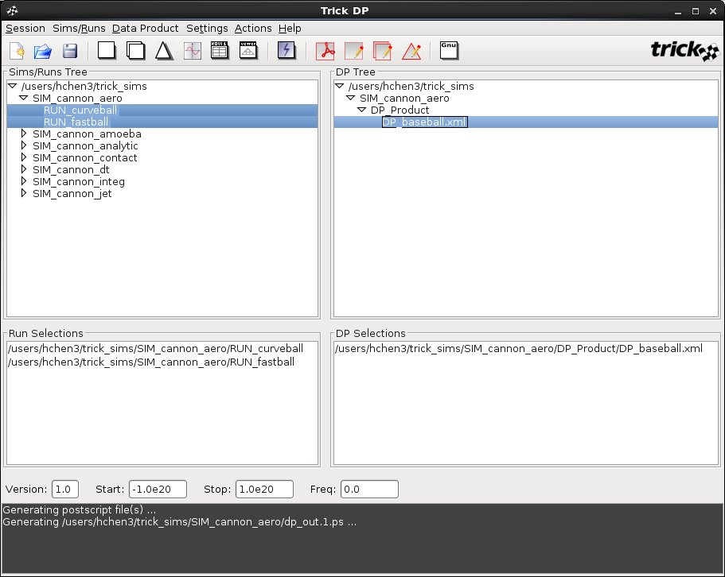

The graphical user interface of trick_dp contains the menu bar, toolbar and five display areas
as shown in the above image. The interface is explained with further details in the following sections:

- Menu bar
- Toolbar
- Display areas


#### Trick DP Menu bar

##### Trick DP Session Menu


- <b>New...</b>
    - Starts a new session.
- <b>Open...</b>
    - Brings up the Open File dialog box to let the user to open a session file.
- <b>Save...</b>
    - Brings up the Save File dialog box to let the user to save the current session to a file.
- <b>Refresh...</b>
    - Refreshes the Sims/Runs Tree.
- <b>Look and Feel</b>
    - Changes the Look and Feel for the GUI.
- <b>Show Exit Confirmation Prompt</b>
    - Toggles whether to show the Confirm Exit dialog box before exiting the GUI.
- <b>Exit</b>
    - Exits the GUI. If Show Exit Confirmation Prompt is checked, Confirm Exit dialog box would be displayed. Otherwise, exits immediately.

##### Trick DP Simrun Menu

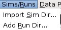

- <b>Import Sim Dir...</b>
    - Imports a SIM dir that will be added to the Sims/Runs Tree area.
- <b>Add Run Dir...</b>
    - Adds the selected RUN dir to the Run Selections area.

<b>Data Product</b>

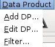

- <b>Add DP...</b>
    - Adds the selected DP file to the "DP Selections" area.
- <b>Edit DP...</b>
    - Edits the selected DP file by opening up the Quickplot Application.
- <b>Filter...</b>
    - Filters the displayed "DP Tree" so that is shows only DP files that contain the specified characters.

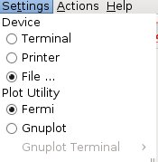
- <b>Device</b>
    - This option sets where the plot should go to. 3 available options are:
        - Terminal (by default)
        - Printer
        - File
- <b>Plot Utility</b>
    - This option sets which plotting utility to use. 2 available options:
        - Fermi
        - Gnuplot

##### Trick DP Actions Menu

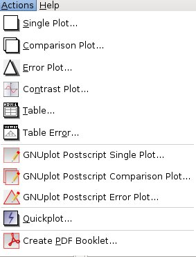

- <b>Single Plot...</b>
    - Displays the data products independently for all data sets specified.
- <b>Comparison Plot...</b>
    - Displays the data from all data sets in the same display.
- <b>Error Plot...</b>
    - Subtracts the nth data set data from the first data set data and presents the result for data set 2 through n in the same display.
- <b>Contrast Plot...</b>
    - Displays a comparison plot and a delta plot on the same page.
- <b>Table...</b>
    - Displays selected variable data in a table.
- <b>Table Error...</b>
    - TBD.
- <b>GNUplot Postscript Single Plot...</b>
    - TBD.
- <b>GNUplot Postscript Comparison Plot...</b>
    - TBD.
- <b>GNUplot Postscript Error Plot...</b>
    - TBD.
- <b>Quickplot</b>
    - Launches the Quickplot application.
- <b>Create PDF Booklet...</b>
    - Allows users to view, merge, or create a PDF file for the selected postscript file(s).

##### Trick DP Help Menu

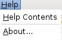

- <b>Help Contents</b>
    - Brings up on-line help.
- <b>About...</b>
    - Shows the information about this application.

#### Toolbar


These icon buttons eables easier access to those commonly used functions. The functionality of each button is the same as
the menu item that shares the same icon. A tooltip of the button will be displayed if moving the mouse pointer over any
of these buttons.

#### Display areas

There are 5 display areas that are Sims/Runs Tree (upper left), DP Tree (upper right),
Run Selections (middle left), DP Selections (middle right) and the bottom is
a message display area.

Please note that all sim directories start with <b>SIM</b>, all run directories starts with <b>RUN</b> or <b>MONTE_RUN</b>, and
all data product files start with <b>DP</b> and are placed in <b>DP_Product</b> directory within a <b>SIM</b> directory.

##### Sims/Runs Tree

Launching trick_dp in a directory that contains SIM directories will cause those SIM directories to be displayed
in this area as shown below. If no SIM directories exist in the launch directory, trick_dp will display SIMs from
$TRICK_USER_HOME by default. If $TRICK_USER_HOME is not defined, SIMs from $HOME will be displayed. If this is not
the first time to run trick_dp on this machine, all previously imported SIMs will be displayed also.

SIMs initially appear unexpanded in the Sims/Runs Tree. Double clicking a SIM node or
single clicking the node icon on the left will show runs contained in that SIM. Runs in black contain data and
in grey contain no data.

<b>Trick DP - Sims/Runs Tree</b>

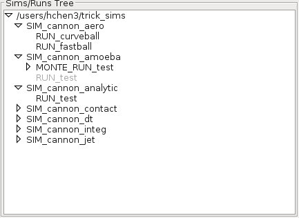

##### Sims/Runs Tree Popup Menus

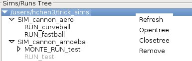

- <b>Refresh</b>
    - Refreshes the highlighted directory.
- <b>Opentree</b>
    - Expands the highlighted directory.
- <b>Closetree</b>
    - Collapses the highlighted directory.
- <b>Remove</b>
    - Removes the highlighted directory from the tree. It does not physically remove the directory from your file system.

##### Sims/Runs Tree Popup Menus

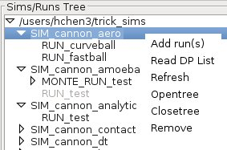

- <b>Add run(s)</b>
    - Adds all RUN directories that contains data in all highlighted SIM directories to the "Run Selections" area.
- <b>Read DP List</b>
    - Adds all DP files in that SIM directory to the DP Tree area if any of RUN directories in that
      SIM directory contains data.
- <b>Refresh</b>
    - Refreshes the highlighted directory.
- <b>Opentree</b>
    - Expands the highlighted directory.
- <b>Closetree</b>
    - Collapses the highlighted directory.
- <b>Remove</b>
    - Removes the selected directory from the tree. It does not physically remove the directory from your file system.

###### Sims/Runs Tree Popup Menus


- <b>Add run(s)</b>
    - Adds all highlighted RUN directories that contains data to the "Run Selections" area.
- <b>Quickplot...</b>
    - Launches the Quickplot application.
- <b>Run Sim</b>
    - Runs the sim from each sim directory using the input.py from the corresponding highlighted RUN directory.

###### DP Tree

DP files in DP_Product of SIM directories are displayed here in a tree structure. Double clicking a SIM node
or single clicking the node icon on the left of a SIM node from the Sims/Runs Tree will make all DP files
displayed here automatically. You also can add all DP files in a desired SIM directory by right clicking it
from Sims/Runs Tree and selecting Read DP List from the popup menu list.

<b>Trick DP - DP Tree</b>


###### DP Tree Popup Menus

Right clicking on a tree node at any level from the DP Tree as shown above causes a corresponding popup menu displayed.

###### DP Tree Popup Menus


- <b>Add DPs</b>
    - Adds all DP files in the highlighted directories to the DP Selections.
- <b>Refresh</b>
    - Refreshes all highlighted directories.
- <b>Remove</b>
    - Removes the highlighted directory from the tree. It does not physically remove the directory from your file system.

###### DP Tree Popup Menus

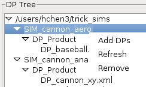

- <b>Add DPs</b>
    - Adds all DP files in the highlighted directories to the DP Selections.
- <b>Refresh</b>
    - Refreshes all highlighted directories.
- <b>Remove</b>
    - Removes the highlighted directory from the tree. It does not physically remove the directory from your file system.

###### DP Tree Popup Menus

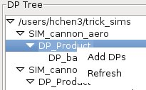

- <b>Add DPs</b>
    - Adds all DP files in the highlighted directories to the "DP Selections".
- <b>Refresh</b>
    - Refreshes all highlighted directories.

###### DP Tree Popup Menus

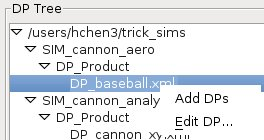

- <b>Add DPs</b>
    - Adds all highlighted DP files to the DP Selections.
- <b>Edit DP...</b>
    - Opens the selected DP file with Quickplot application for editing.

###### Run Selections

All selected RUN directories for retriving data from for plotting are listed here. You can select a RUN or RUN(s) by:
- Double clicking a RUN directory in black from Sims/Runs Tree
- Right clicking on highlighted RUN directories and selecting Add Runs
- Right clicking on highlighted SIM directories and selecting Add Runs
<b>Trick DP - Run Selections</b>

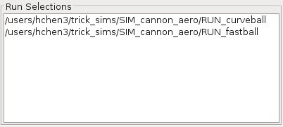

###### Run Selections Popup Menus

Right clicking on a RUN from the list brings up a popup menu.

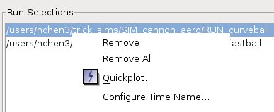

- <b>Remove</b>
    - Removes all of highlighted RUN from the list.
- <b>Remove All</b>
    - Removes all RUN directories from the list.
- <b>Quickplot...</b>
    - Launches Quickplot application for the selected RUN(s).
- <b>Configure Time Name...</b>
    - Brings up the following input dialog to let users to configure the RUN's time name.
    - By default, RUN's time name is sys.exec.out.time


###### DP Selections

All selected DP files that tell data products how and what to display in plots and tables are listed here.
<b>Trick DP - DP Selections</b>


###### DP Selections Popup Menus

Right clicking on a DP file from the list brings up a popup menu.

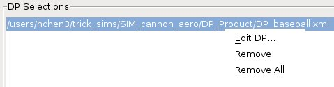

- <b>Edit DP...</b>
    - Opens the selected DP file with Quickplot application for editing.
- <b>Remove</b>
    - Removes all of highlighted DP files from the list.
- <b>Remove All</b>
    - Removes all DP files from the list.

###### Message Display

This display redirects all screen printout to here to let users know what it is been doing or what has gone wrong.
<b>Trick DP - Message Display</b>


### Trick QP - Quickplot Application

The trick_qp is designed for a quick peek at data in a particular RUN. It is also designed to create the DP specification
files that the trick_dp uses. Quickplot usage can be abused. It is best to take time to make a DP specification file using
Quickplot, then use the trick_dp for plotting. To launch the quickplot program:

```
<b>UNIX Prompt></b> trick_dp
```

Select a RUN directory (or multiple RUN directories if comparing data sets).
Click the blue lightning bolt icon to launch Quickplot.

OR

```
<b>UNIX Prompt></b> trick_qp RUN<name> &
```

#### Trick QP GUI

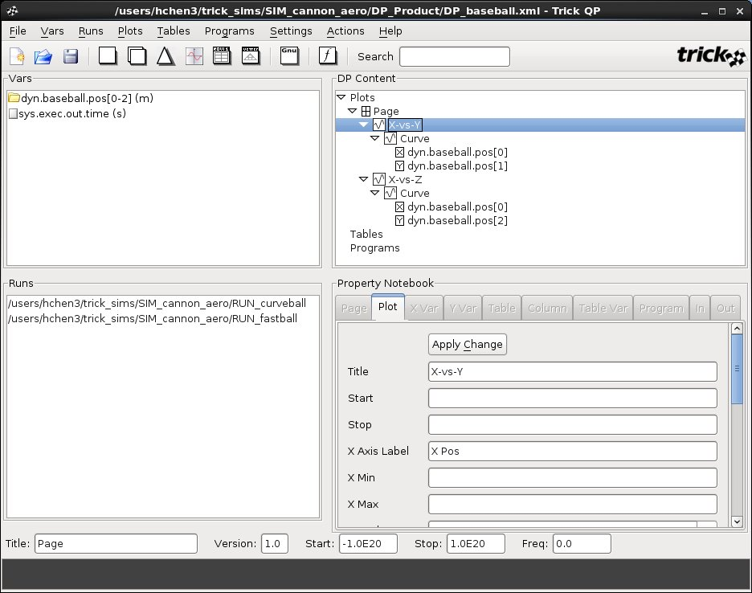

Similar to Trick DP, the graphical user interface of Trick QP also contains the menu bar, toolbar and five display areas
as shown in the above image. The interface is explained with further details in the following sections:

- Menu bar
- Toolbar
- Display areas

##### Menu bar

This table shows all of the menus along with their menu items and functionalities related to the Trick QP menu bar:

##### Trick QP File Menu


- <b>New DP...</b>
    - Starts a new DP file.
- <b>Open DP...</b>
    - Brings up the Open File dialog box to let the user to open a DP file.
- <b>Refresh...</b>
    - Refreshes all variables in "Vars" area.
- <b>Save...</b>
    - Saves to the currently opened DP file if available, otherwise, users can sepecify a file to save to.
- <b>Save As...</b>
    - Brings up the Save File dialog box to let the use to save to a specified DP file.
- <b>Look and Feel</b>
    - Changes the Look and Feel for the GUI.
- <b>Show Exit Confirmation Prompt</b>
    - Toggles whether to show the Confirm Exit dialog box before exiting the GUI.
- <b>Exit</b>
    - Exits the GUI. If Show Exit Confirmation Prompt is checked, Confirm Exit dialog box would be displayed. Otherwise, exits immediately.

##### Trick QP Vars Menu

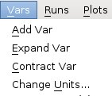

- <b>Add Var</b>
    - Adds the Vars highlighted variables to DP Content on the right.
        - If nothing is highlighted or if "Plots" is highlighted:
            - One plot per page for each selected variable will be created.
        - If "Tables" is highlighted:
            - One table with each variable representing one column will be created.
        - If "Programs" is highlighted :
            - Nothing will happen.
        - If any sub node of "Plots", "Tables", or "Programs" is highlighted:
            - Variables will be added to the corresponding node if possible.
- <b>Expand Var</b>
    - Expands the Vars highlighted variables.
- <b>Contract Var</b>
    - Collaps the Vars highlighted variables.
- <b>Change Units...</b>
    - Prompts for changing highlighted variables (first one if multiple variables selected) units.

##### Trick QP Runs Menu

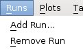

- <b>Add Run...</b>
    - Adds the highlighted RUN directory to "Runs" area.
- <b>Remove Run</b>
    - Removes all highlighted RUN directories from "Runs" area.

##### Trick QP Plots Menu

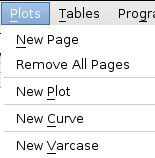

- <b>New Page</b>
    - Adds an empty new page.
- <b>Remove All Pages</b>
    - Removes all currently shown pages.
- <b>New Plot</b>
    - Adds a new empty plot to the currently selected page.
- <b>New Curve</b>
    - Adds a new empty curve to the currently selected plot.
- <b>New Varcase</b>
    - Adds a new varcase to the currently selected curve.

##### Trick QP Tables Menu

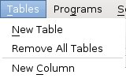

- <b>New Table</b>
    - Adds a new empty table.
- <b>Remove All Tables</b>
    - Removes all tables.
- <b>New Column</b>
    - Adds a new empty column to the currently selected table.

##### Trick QP Programs Menu


- <b>New Program</b>
    - Adds a new empty program.
    - See External Programs for more details about a program.
- <b>Remove All Programs</b>
    - Removes all programs.
- <b>New Output...</b>
    - Adds a new output for the currently selected program.

##### Trick QP Programs Menu

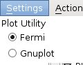

- <b>Plot Utility</b>
    - Selects either Fermi or Gnuplot for plotting.

##### Trick QP Programs Menu


- <b>Single Plot...</b>
    - Displays the data products independently for all data sets specified.
- <b>Comparison Plot...</b>
    - Displays the data from all data sets in the same display.
- <b>Error Plot...</b>
    - Subtracts the nth data set data from the first data set data and presents the result for data set 2 through n in the same display.
- <b>Contrast Plot...</b>
    - Displays a comparison plot and a delta plot on the same page.
- <b>Table...</b>
    - Displays selected variable data in a table.
- <b>Table Error...</b>
    - TBD.

##### Trick QP Programs Menu

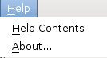

- <b>Help Contents</b>
    - Brings up on-line help.
- <b>About...</b>
    - Shows the information about this application.

##### Toolbar


These icon buttons eables easier access to those commonly used functions. The functionality of each button is the same as
the menu item that shares the same icon. A tooltip of the button will be displayed if moving the mouse pointer over any
of these buttons.


##### Display areas

There are 5 display areas that are Vars (upper left), DP Content (upper right),
Runs (middle left), Property Notebook (middle right) and the bottom is
a message display area.


##### Vars

All variables that are found in Trick log data files from the selected RUN directories are listed here. If variables shown in red, means that they do not exist in every RUN directory.

<b>Trick QP - Vars</b>


##### Vars Popup Menus

Right clicking on a variable from the Vars as shown above causes a corresponding popup menu displayed. This menu is actually the same as Vars menu.

##### Vars Popup Menus


- <b>Add Var</b>
    - Adds the Vars highlighted variables to DP Content on the right.
        - If nothing is highlighted or if "Plots" is highlighted:
            - One plot per page for each selected variable will be created.
        - If "Tables" is highlighted:
            - One table with each variable representing one column will be created.
        - If "Programs" is highlighted :
            - Nothing will happen.
        - If any sub node of "Plots", "Tables", or "Programs" is highlighted:
            - Variables will be added to the corresponding node if possible.
- <b>Expand Var</b>
    - Expands the Vars highlighted variables.
- <b>Contract Var</b>
    - Collaps the Vars highlighted variables.
- <b>Change Units...</b>
    - Prompts for changing highlighted variables (first one if multiple variables selected) units.

###### DP Content

DP Content area presents the content of a DP file graphically.

<b>Trick QP - DP Content</b>

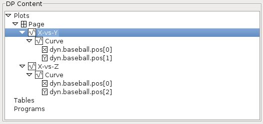

###### DP Content Popup Menus

Right clicking on a tree node at any level from the DP Content as shown above causes a corresponding popup menu displayed.

###### DP Content Popup Menus

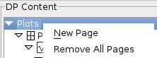

- <b>New Page</b>
    - Creates a new page node.
- <b>Remove All Pages</b>
    - Removes all pages.

###### DP Content Popup Menus

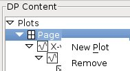

- <b>New Plot</b>
    - Creates a new plot node for the page.
- <b>Remove</b>
    - Removes this page.

###### DP Content Popup Menus


- <b>New Curve</b>
    - Creates a new curve node for the plot.
- <b>Remove</b>
    - Removes this plot.

###### DP Content Popup Menus


- <b>Add Var</b>
    - Adds the highlighted variable from Vars to this curve.
        - If more than one variables are highlighted, error window will be shown.
        - Only one variable can be added to a curve and by default, the X variable is sys.exec.out.time.
        - A variable from Vars can be dragged over sys.exec.out.time to replace it.
        - Also, a variable from Vars can be added to a curve by dragging it over the curve node.
- <b>Remove</b>
    - Removes this curve.
- <b>New Varcase</b>
    - Adds a new varcase node.
        - If there are already variables added for this curve, new varcase node can not be added.

###### DP Content Popup Menus


- <b>Remove</b>
    - Removes this variable.
        - X variable can not be removed.
        - X variable can be replaced.
        - Y variable can be removed.
        - Y variable can not be replaced. You need to simply remove the Y variable, and then add a new variable.

###### DP Content Popup Menus

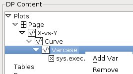

- <b>Add Var</b>
    - Adds the highlighted variable from Vars to the varcase.
        - If more than one variables are highlighted, error window will be shown.
        - Only one variable can be added to a varcase and by default, the X variable is sys.exec.out.time.
        - A variable from Vars can be dragged over sys.exec.out.time to replace it.
        - Also, a variable from Vars can be added to a varcase by dragging it over the varcase node.
- <b>Remove</b>
    - Removes this variable.
        - X variable can not be removed.
        - X variable can be replaced.
        - Y variable can be removed.
        - Y variable can not be replaced. You need to simply remove the Y variable, and then add a new variable.

###### DP Content Popup Menus


- <b>New Table</b>
    - Creates a new table without any columns.
- <b>Remove All Tables</b>
    - Removes all tables.

###### DP Content Popup Menus


- <b>Add Var</b>
    - Adds highlighted variables from Vars to this table. Each variable represents a column.
- <b>Remove</b>
    - Removes this table.

###### DP Content Popup Menus


- <b>Remove</b>
    - Removes this column.

###### DP Content Popup Menus

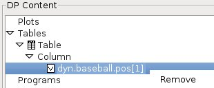

- <b>Remove</b>
    - Removes the this hightlighted variable.
    - Also removes the column which it belongs to as each column has only on variable associated with it.

###### DP Content Popup Menus

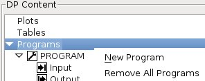

- <b>New Program</b>
    - Adds a new PROGRAM.
    - See External Programs for more details about a program.
- <b>Remove All Programs</b>
    - Removes all programs. Currently only one program is supported.

###### DP Content Popup Menus


- <b>Remove</b>
    - Removes the program.

###### DP Content Popup Menus

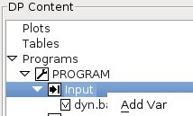

- <b>Add Var</b>
    - Adds highlighted variables from Vars to Input.

###### DP Content Popup Menus

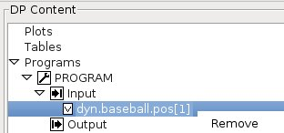

- <b>Remove</b>
    - Removes the highlighted variable.

###### DP Content Popup Menus

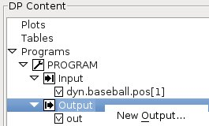

- <b>New Output</b>
    - Brings up a window for users to enter the output name for the program.

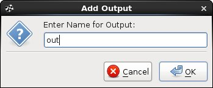

- Accepts the entered name by clicking Ok and the output name will be added to Vars in red such as "out" as shown .

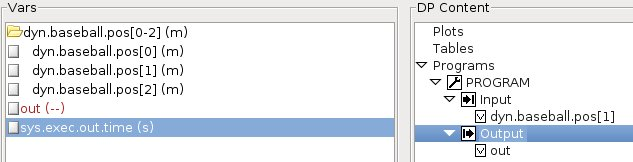

##### Trick QP Run Selections
All selected RUN directories for retriving data from for plotting are listed here.

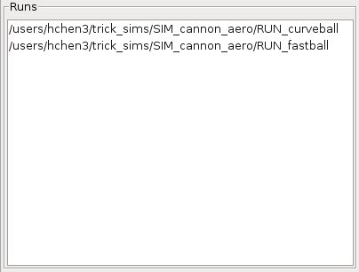
###### Runs Popup Menus

Right clicking on a RUN from the list brings up a corresponding popup menu.

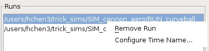

- <b>Remove</b>
    - Removes all of highlighted RUN from the list.
- <b>Configure Time Name...</b>
    - Brings up the following input dialog to let users to configure the RUN's time name.
    - By default, RUN's time name is sys.exec.out.time

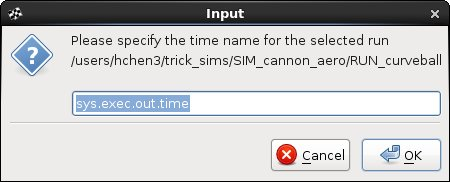
###### Property Notebook

All editable data entries for the selected node from DP Content are displayed here.
You are required to click <b>Apply Change</b> button to save all the changes made.
Otherwise, all changes will be lost if browsing a different node and come back to it.
<b>Trick QP - Property Notebeook</b>

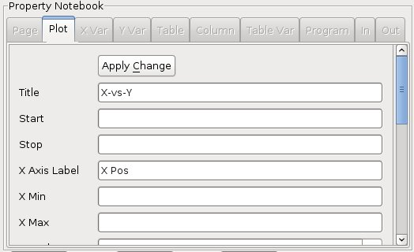

###### Message Display

This display redirects all screen printout to here to let users know what it is been doing or what has gone wrong.
<b>Trick QP - Message Display</b>


### Viewing Data

In this section, <b>SIM_cannon_analytic</b> that comes with Trick distribution and is located at $TRICK_HOME/trick_sims will be used.
Assuming you already have had corresponding data recorded by executing the related sim. The data from a single run will be viewed
using Trick DP together with Trick QP. When plotting, single plotting is used. Please see Trick Tutorial
for more examples that also have comparison or error plotting with multiple runs. You certainly can perform similar exercises using your own sim.

#### Plotting With Trick DP & Trick QP

Begin by launching Trick DP.

```
<b>UNIX Prompt></b> cd <path_to_sim_cannon_analytic>/SIM_cannon_analytic
<b>UNIX Prompt></b> trick_dp &
```

##### Plotting Time -vs- Postion

1. Double click the pathname containing your sim directory if it is not expanded yet (or single click the symbol next to the name)
1. Double click the SIM_cannon_analytic name in the Sims/Runs Tree. This will reveal the RUN_test directory.
1. Double click the RUN_test name or right click the RUN_test followed by selecting "Add run(s)".
   This will bring RUN_test into the RUN Selections below.
1. Click the blue lightning button in the tool bar to launch Quickplot application (Trick QP). The Trick QP GUI will pop up.
1. In Trick QP, right click dyn.cannon.pos[0-1] and select "Expand Var" if the interested variable is one of the element in an array
   which is not expanded yet.
1. Double click the dyn.cannon.pos[0] variable in the left pane. This sets up to create one page with one plot (time -vs- pos[0]).
    - Make sure nothing is highlighted or "Plots" is highlighted on the right in DP Content
    - If "Tables" is highlighted, it sets up to create a table with one column instead.
    - The X variable is sys.exec.out.time by default and the Y variable is dyn.cannon.pos[0].
    - Later, you will learn how to replace the X (sys.exec.out.time) with a different variable.
1. Now click the dyn.cannon.pos[1] variable and drag it to the pane on the right. Drop it on the line with "Page" (see the white-n-black window looking icon).
   This will result in one page containing two plots.
1. In Trick QP, click the plain white sheet icon located on the toolbar. A single window with two plots should pop up:

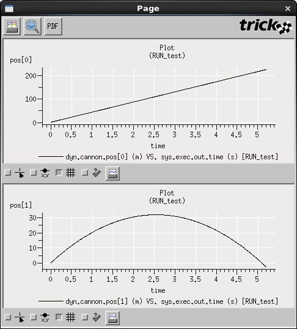

1. If you want to specify the number of plots horizontally and vertically on a page, click "Page" node and edit its Horizontal Cells and Vertical Cells
   propterties from Proptery Notebook (use the scroll bar or change the GUI window size if necessary). Change Horizontal Cells
   from 0 to 2 and Vertical Cells from 0 to 1 and click "Apply Change" button on the top of Proptery Notebook.
   If click the plain white sheet icon located on the toolbar, a single window with two plots side by side should pop up:
    - "Apply Change" needs to be selected to save the changes made to the Proptery Notebook.

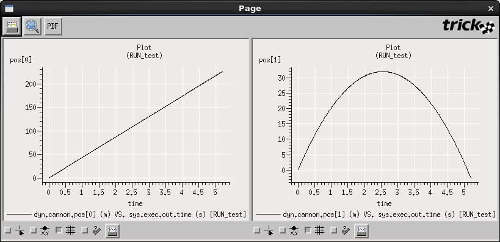

##### Plotting XPosition -vs- YPosition

Now, let's change the default X variable from sys.exec.out.time to a different variable.
1. Assuming the Trick QP application is still up, click the "New" plot icon located on the far left of the toolbar.
   Click "Ok" when asked if you want to start over. This will clear the plots from the DP Content.
1. Double-click dyn.cannon.pos[1].
1. Drag-n-drop the dyn.cannon.pos[0] variable over the sys.exec.out.time variable in the Plot located in the DP Content.
   You will be asked to confirm the replacement. Click "Ok".
    - Now, the X variable is dyn.cannon.pos[0] and the Y variable is dyn.cannon.pos[1].
1. To see the plot, click the white sheet icon on the toolbar.


#### Creating DP Product File

The information needed for the plot created earlier can be saved off to a file using Trick QP and can be reused by both
Trick DP and Trick QP. This example shows how to save XPosition -vs- YPosition plotting stated earlier
to a file named as DP_cannon_xy.
1. With the Trick QP GUI still up and the x -vs- y position still chosen, click the dyn.cannon.pos[1]
variable located in the pane on the right. The dyn.cannon.pos[1] variable should be highlighted in dark blue.
The "Y Var" notebook page should be visible in the lower right pane.
1. In the "Y Var" notebook page, select "Symbol Style->Circle" from the drop-down menu.
1. In the "Y Var" notebook page, select "Symbol Size->Tiny" from the drop-down menu.
1. Click the "Apply Change" button (you may need to scroll up/down to see all the fields/button).
1. Save this information by clicking the menu option "File->Save As". Click "New Folder"
button to create the DP_Product folder if necessary.
Choose the directory button SIM_cannon_analytic/DP_Product". Enter file name as "DP_cannon_xy".
    - A file called DP_cannon_xy.xml is saved as it is in XML format.
1. Close the quick plot GUI, but keep trick_dp up and running.

#### Plotting with only Trick DP using a DP file

Now that DP_cannon_xy has been saved, the data can be viewed with Trick DP.
1. Assuming the Trick DP is still up and running from the previous steps, Click "Session->Refresh..."
and double click SIM_cannon_analytic to reveal DP_cannon_xy.xml in the top right pane.
    - If the Trick DP is not up, go to the sim directory and launch it as:
        - <b>UNIX Prompt></b> trick_dp &
1. Make sure that Sims/Runs->SIM_cannon_analytic/RUN_test has been selected.
    - You can tell by checking to see if it is listed in Run Selections.
1. Choose the DP_cannon_xy.xml in the top right pane by double clicking it or right click followed by selecting "Add DPs".
    - This will bring the DP_cannon_xy.xml into the DP selections pane.
1. To see the trajectory again, click the plain white single sheet icon on the toolbar.
Zoom in by holding the middle mouse button and drag across a section of the plot. Then release the
mouse button. Notice that there is a tiny circle on each x-y point recorded.


#### Plotting with only Trick QP

1. Go to the SIM directory we have worked on earlier and launch Trick QP as:
    - <b>UNIX Prompt></b> trick_qp RUN_test &
    - Once Trick QP is up, you should notice that:
        - "<path_to_sim_cannon_analytic>/SIM_cannon_analytic/RUN_test" is listed in Runs.
        - All logged variables found from "<path_to_sim_cannon_analytic>/SIM_cannon_analytic/RUN_test" are listed in Vars.
        - You can add more runs by clicking "Runs->Add Run..." if needed.
1. Select variables from Vars for plotting as exercises done earlier.
1. Or click "File->Open DP..." or click the open file icon on the toolbar.
    - Select a DP file such as DP_cannon_xy.xml and click "Ok".
        - If intertested file is not listed, make sure you are in the right directory.
        - The selected DP_ file is presented graphically in DP Content
1. To see the trajectory again, click the plain white single sheet on the toolbar.

#### Creating DP Session File

1. Launch Trick DP as:
    - <b>UNIX Prompt></b> trick_dp &
1. Select RUN directories from Sims/Runs Tree and add them to Run Selections.
1. Select DP files from DP Tree and add them to DP Selections.
1. Click "Session->Save..." or click save icon on the toolbar to save the current session to a DP session file.
    - By default, the session file is saved in your SIM directory.
    - A file with xml extension is saved as the session file is in XML format.


#### Plotting from the Command Line
Once you a DP session file created, you can view the data the way as you specified using "fxplot" or "gxplot" command.
- Go to the SIM directory you have your session file saved.
    - <b>UNIX Prompt></b> fxplot <session_file>
    - Or
    - <b>UNIX Prompt></b> gxplot <session_file>
- You should see plots as you specified in the file.


#### Using Tables

##### Using Tables Exercise A

1. Go to the SIM_cannon_analytic directory and launch Trick QP as:
    - <b>UNIX Prompt></b> trick_qp RUN_test &
    - Only using Trick QP to simply the example. In some cases, you'll still need to start "trick_dp" and then "trick_qp".
1. Click "Tables" shown under DP Content. The "Tables" node should be highlighted in blue.
    - Make sure "Tables" node is selected.
1. Double click dyn.cannon.pos[0-1] or right click it followed by selecting "Add Var".
    - A "Table" node is created under "Tables".
    - This table has 3 columns: sys.exec.out.time (added by default), dyn.cannon.pos[0], and dyn.cannon.pos[1].
1. Click the table icon on the toolbar or click "Actions->Table..." to view the data in a table.
    - You can save the current tabular data in a text file through the "Save" button on the left top corner.

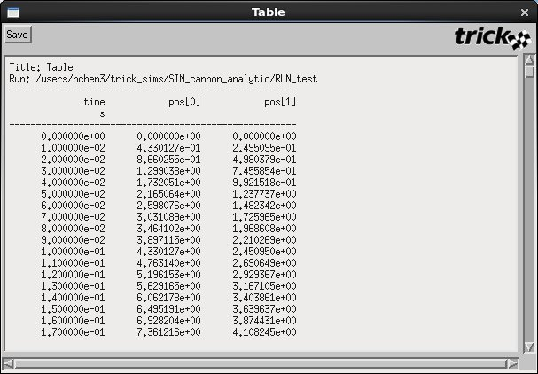

##### Using Tables Exercise B

1. Go to the SIM_cannon_analytic directory and launch Trick QP as:
    - <b>UNIX Prompt></b> trick_qp RUN_test &
1. Click "Tables->New Table" or right click "Tables" under DP Content followed by selecting "New Table".
    - Now you see a new "Table" node is created under "Tables".
1. Click the newly created "Table" node. It should be highlighted in blue.
1. Right click dyn.cannon.pos[0-1] and then select "Expand Var".
1. Click dyn.cannon.pos[0] and then "Shift"+click dyn.cannon.pos[1]. These 2 variables should be highlighed in blue.
1. Right click the highlighted variables and then select "Add Var"
    - Now 2 columns are inserted to the currently selected "Table": dyn.cannon.pos[0] and dyn.cannon.pos[1].
1. Click the table icon on the toolbar or click "Actions->Table..." to view the data in a table.


#### Using External Program

The external program $TRICK_HOME/trick_source/data_products/Apps/ExternalPrograms/dp_substract.c that comes with Trick distribution will be used in this section. This program takes 2 double inputs and returns the subtraction of these 2 inputs. Assuming the program is alreay built and the corresponding shared object is available for use.

1. Go to the SIM_cannon_analytic directory and launch Trick QP as:
    - <b>UNIX Prompt></b> trick_qp RUN_test &
1. Click "Programs->New Program" or right click "Programs" under DP Content followed by selecting "New Program".
    - Now you see a new "PROGRAM" node with "Input" and "Output" is created under "Programs".
    - Please note that only one program at a time is currently supported.
1. Click "PROGRAM" and click "Browse..." from Property Notebook to select the shared object for the program.
    - In this case, select the file dp_subtract.so that is located at "$TRICK_HOME/trick_source/data_products/Apps/ExternalPrograms/object_Linux_4.4_x86_64/".
1. Click "Apply Change". The name of "PROGRAM" is now changed to the full path of the shared object.
1. Click "Input" so it is highlighted in blue.
1. Double click dyn.cannon.pos[0-1]. Both dyn.cannon.pos[0] and dyn.cannon.pos[1] are inserted under "Input".
1. Right click Output and then select "New Output...". Enter a name for the output as prompted such as "out" and then click "Ok".
    - Now you should see "out" in red shown in Vars list.
1. Drag "out" to "Plots" under DP Content. A page with one plot with one curve is created.
    - The X variable is sys.exec.out.time.
    - The Y variable is out which is the subtraction of dyn.cannon.pos[0] and dyn.cannon.pos[1].
1. Click the plain white single sheet icon on the toolbar to see the plot.

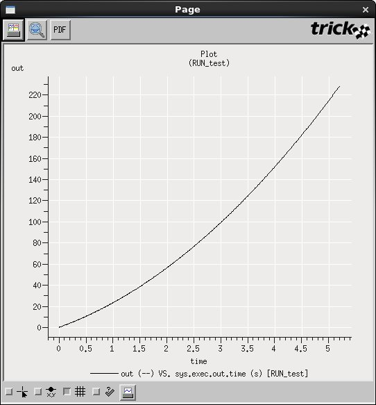

[Continue to Simulation Capabilities](../simulation_capabilities/Simulation-Capabilities)
