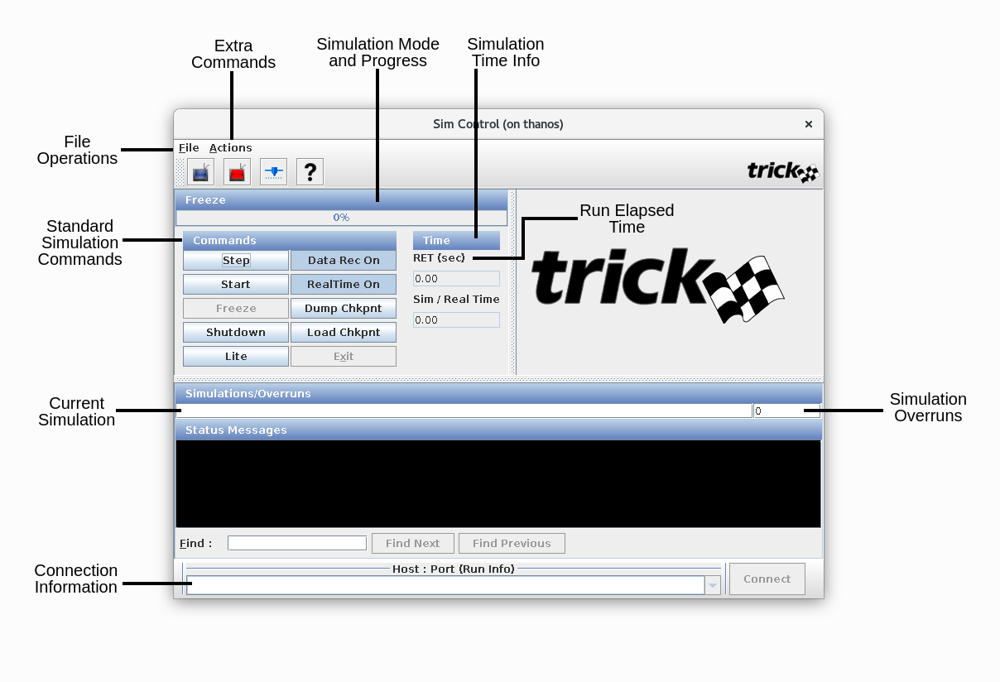
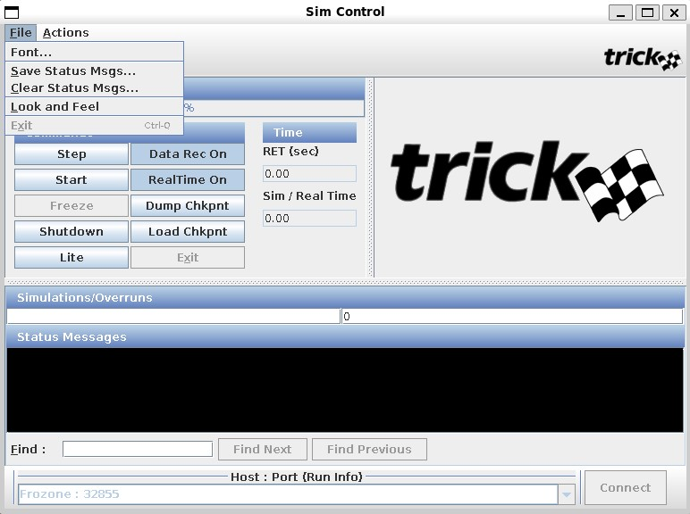
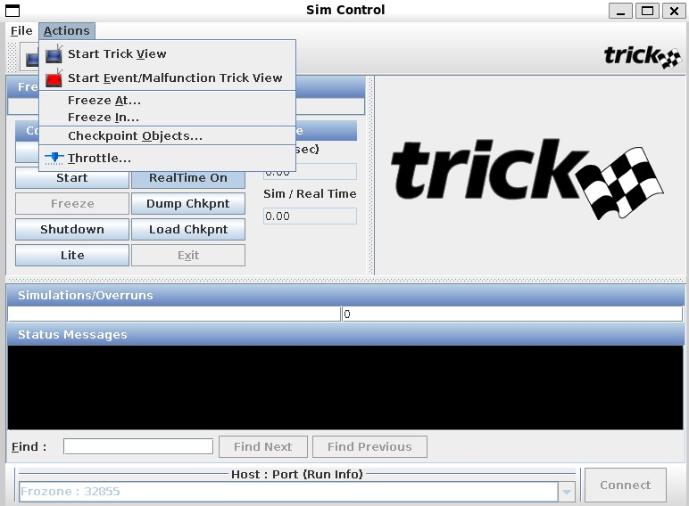

| [Home](/trick) → [Documentation Home](../../Documentation-Home) → [Running a Simulation](../Running-a-Simulation) → [Runtime GUIs](Runtime-GUIs) → Sim Control Panel |
|------------------------------------------------------------------|

## Sim Control Panel

The Sim Control Panel is a graphical user interface that allows users to control and view the state of a simulation.

### Launching

The Panel can be launched in two ways:

- Via the command line `${TRICK_HOME}/bin/trick-simcontrol [host name] [port number]` 
  - The host name and port number are optional

- Using the input file to launch it automatically, see [Automatically Launching Applications](Runtime-GUIs#automatically-launching-applications)

### The GUI

The GUI pictured below may have a different look and feel based on the architecture of the machine on which it is running, but the functionality will remain the same.
RET=RUn Elapsed Time

#### File Menu

The File menu pictured below contains operations to manage the Sim Control Panel's status messages as well as its look and feel.

- **Font:** Opens a dialogue to customize the font of the status message pane

- **Save Status Messages:** Opens a file chooser that allows you to save the current status messages to a specific file

- **Clear Status Message Log:** Clears any messages within the status message pane

- **Look and Feel:** Changes the theme and color palette of the Sim Control Panel

- **Exit:** Exits the application

#### Actions Menu

- **Start Trick View:** Opens an instance of the Trick View application connected to the current simulation. See [Trick View](TrickView) for more details.

- **Start Event/Malfunction Trick View:** Opens an instance of the Events/Malfunctions Trick View application connected to the current simulation. See [Events/Malfunctions Trick View](MalfunctionsTrickView) for more details.

- **Freeze At:** Sets the simulation to enter freeze mode at a specific simulation time

- **Freeze In:** Puts the simulation in freeze mode after a specified number of simulation seconds

- **Checkpoint Objects:** Specifies which objects are to be checkpointed when [Dump Chkpnt](#dump-chkpnt) is pressed

- **Throttle:** Opens a dialogue with a slider for you to set the maximum Sim Time / Real Time Ratio. The scale is between 1.0 and 10.0 by default, but you can increase the maximum to 1000. It functionally allows simulations to run faster than real time up to their maximum capable speed

#### Command Panel

- **Step:** Steps through each executing job, pausing before proceeding to the next

- **Start:** Starts the simulation

- **Freeze:** Freezes the simulation

- **Shutdown:** Shuts the simulation down

- **Lite:** Shrinks the Sim Control Panel to hide the status message pane and Trick Logo or returns it to the default size via a toggle button

- **Data Rec On:** Toggles data recording on or off

- **RealTime On:** Toggles real time mode in a simulation

- **Dump Chkpnt:** Opens a file chooser to save a checkpoint file

- **Load Chkpnt:** Opens a file chooser to choose a checkpoint file to load into the simulation

- **Exit:** Closes the Sim Control Panel

#### Misc

##### Simulation Overruns
The Sim Control Panel shows which simulation is running and keeps count of its overruns.

##### Status Message Panel
This panel is where any error or status messaging for the simulation appears. The search bar at the bottom allows the user to find specific text within the panel.

##### Simulation Connection
The bottom part of the Sim Control Panel has a dropdown where the user can input the host name and port number of the simulation to which the user is attempting to connect. The host name and port number must be separated by either a space or a colon. The user can also use the dropdown menu to select a simulation. The Connect button next to the dropdown initiates the connection attempt. 
