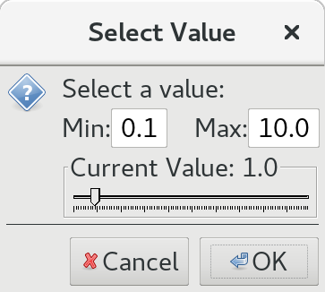

| [Home](/trick) → [Documentation Home](../../Documentation-Home) → [Running a Simulation](../Running-a-Simulation) → [Runtime GUIs](Runtime-GUIs) → Simulation Control Panel |
|------------------------------------------------------------------|

## Simulation Control Panel

The Simulation Control Panel, also known as the Sim Control Panel, is a graphical user interface that allows users to control and view the state of a simulation.

### Launching

The Panel can be launched in a few ways:

- Via the command line `trick-simcontrol [host name] [port number]`

- Using the input file to launch it automatically, see [Automatically Launching Applications](Runtime-GUIs#automatically-launching-applications)

### The GUI

The GUI pictured below may have a different look and feel based on the architecture of the machine on which it is running, but the functionality will remain the same.

#### File Menu

The File menu pictured below contains operations to manage the Sim Control Panel's status messages as well as its look and feel.

- **Font:** Opens a dialogue to customize the font of the status message pane

- **Save Status Messages:** Opens a file chooser that allows you to save the current status messages to a specific file

- **Clear Status Message Log:** Clears any messages within the status message pane

- **Look and Feel:** Changes the theme and color palette of the Sim Control Panel

- **Exit:** Exits the application

#### Actions Menu

- **Start Trick View:** See [Start TV](#start-tv)

- **Start Event/Malfunction Trick View:** See [Start MTV](#start-mtv)

- **Freeze At:** Set the simulation to freeze at a specific time

- **Freeze In:** Freeze the simulation in a specified number of seconds

- **Checkpoint Objects:** Specify which objects are going to be checkpointed when [Dump Chkpnt](#dump-chkpnt) is pressed

- **Throttle:** See [Throttle](#throttle)

#### Toolbar

##### Start TV

Opens an instance of the Trick View application connected to the current simulation. See [Trick View](TrickView) for more details.

##### Start MTV

Opens an instance of the Events/Malfunctions Trick View application connected to the current simulation. See [Events/Malfunctions Trick View](MalfunctionsTrickView) for more details.

##### Throttle

Opens a dialogue with a slider for you to set the maximum Sim Time / Real Time Ratio. Functionally allows simulations to run in real time at a faster speed. The scale is between 1.0 and 10.0 by default, but you can increase the maximum to 1000.

#### Command Panel

##### Step
Step through each executing job, pausing before proceeding to the next.

##### Start
Starts the simulation.

##### Freeze
Freezes the simulation.

##### Shutdown
Shuts the simulation down.

##### Lite
A toggle button that shrinks the Sim Control Panel to hide the status message pane and Trick Logo or returns it to the default size.

##### Data Rec On
A toggle button that switches data recording on or off.

##### RealTime On
A toggle button that controls whether the simulation is running in real time or not.

##### Dump Chkpnt
Opens a file chooser to save a checkpoint file.

##### Load Chkpnt
Opens a file chooser to choose a checkpoint file to load into the simulation.

##### Exit
Closes the Sim Control Panel.

#### Misc

##### Simulation Overruns
The Sim Control Panel shows which simulation is running and keeps count of its overruns.

##### Simulation Connection
The bottom part of the Sim Control Panel has a dropdown where you can input the host name and port number for the simulation to be connected to. In terms of formatting, you will need to separate the host and port by either a space or colon. The user can also use the dropdown menu to select a simulation. The Connect button next to that dropdown initiates the connection attempt. 
