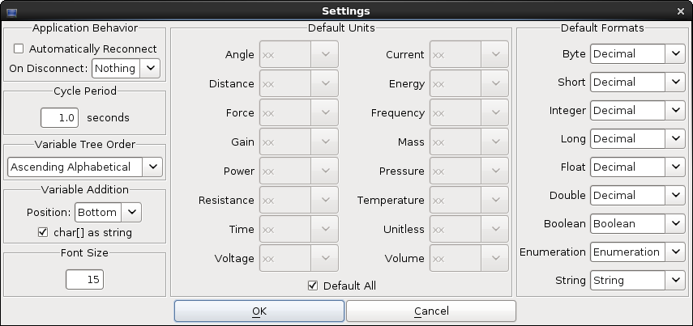
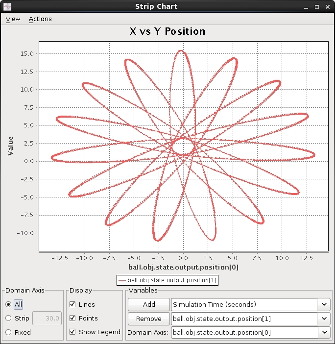
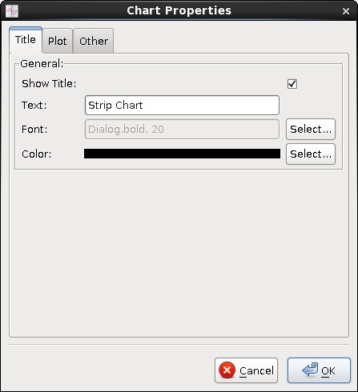
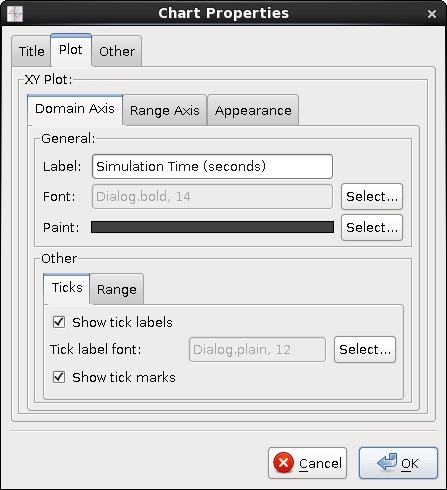
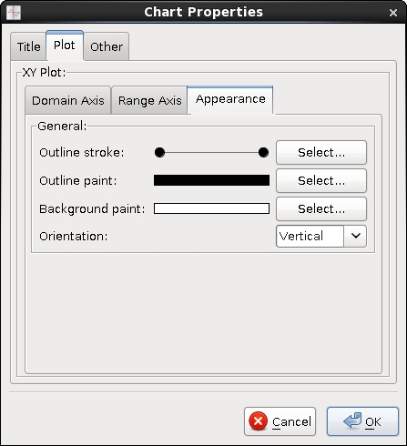

Trick View (hereafter referred to as TV) is a graphical user interface that allows users to view and modify Trick-managed variables in a simulation while it is running. It also provides for the launching of integrated strip charts and can save and restore lists of variables and their associated strip charts.

#### Launching
TV can be launched via one of:

- From the Simulation Control Panel, under the **Actions** menu.

 - From the command line:  
   `trick-tv [options]`  
   The TV launch script is located in `$TRICK_HOME/bin`. Pass `--help` for a description of available options.

For additional launching options, see [Automatically Launching Applications](Runtime-GUIs#automatically-launching-applications).

#### Automatically Opening Files

Files that are to be automatically opened when TV launches can be specified via one of:

- From the command line, use the `--open` option.  
  File paths are relative to the directory from which TV launches.

- From the input file or user model code, use `Trick::TrickView::set_auto_open_file`.  
  File paths are relative to the directory containing the S_main executable.

Opening a TV file will overwrite the current cycle period or any argument to `--cycle` with the value from the file, subject to the minimum cycle period.

#### Automatically Opening and Setting Files

Files that are to be automatically opened and set when TV launches can be specified via one of:

- From the command line, use the `--openSet` option.  
  File paths are relative to the directory from which TV launches.

- From the input file or user model code, use `Trick::TrickView::set_auto_open_and_set_file`.  
  File paths are relative to the directory containing the S_main executable.

Opening a TV file will overwrite the current cycle period or any argument to `--cycle` with the value from the file, subject to the minimum cycle period.

#### Automatically Setting Files

Files that are to be automatically set when TV launches can be specified via one of:

- From the command line, use the `--set` option.  
  File paths are relative to the directory from which TV launches.

- From the input file or user model code, use `Trick::TrickView::set_auto_set_file`.  
  File paths are relative to the directory containing the S_main executable.

#### Strip-Chart-Only Mode

Once a collection of strip charts is established and saved to a TV file, you may wish to prevent future launches from displaying the main GUI window to allow users to view the strip charts without providing them (potentially dangerous) access to the simulation's internal variables. You can cause Trick View to launch in strip-chart-only mode via one of:

- From the command line, use the `--stripChartsOnly` option.

- From the input file or user model code, use `Trick::TrickView::set_strip_charts_only`.

Note that you must provide a TV file to be automatically opened as described above when launching in strip-chart-only mode.

#### The Trick View GUI

The GUI pictured below may have a different look and feel based on the architecture of the machine on which it is running, but the functionality will remain the same.

##### File Buttons

The file buttons provide persistent storage of variable lists. From left to right, they are:

- **New**  
  Clears the variable table.

- **Open**  
  Opens a dialog allowing the user to select a TV file. The variable table will be cleared and replaced by the variables from the file. The saved cycle period and any strip charts will be restored.

- **Open And Set**  
  Opens a dialog allowing the user to select a TV file. The variable table will be cleared and replaced by the variables from the file. Additionally, the variables will be set to their corresponding values in the file. The saved cycle period and any strip charts will be restored.

- **Set**  
  Opens a dialog allowing the user to select a TV file. The variables listed in the file will be set to their corresponding values in the file. The variable table, cycle period, and any strip charts will be unaffected.

- **Save**  
  Opens a dialog allowing the user to specify a file name. The variables in the variable table and their associated information, the cycle period, and any strip charts will be written to the file.

##### Monitor Button

The monitor button displays the current state of the monitor and allows the user to toggle receiving updates on the variables in the variable table. A blue screen indicates that updates are being received. A black screen indicates they are not.

##### Variable Buttons

The variable buttons affect variables in the variable table. From left to right, they are:

- **Strip Chart**  
  Launches a strip chart that will plot all selected variables on the same graph while the simulation is running.

- **Delete**  
  Removes the selected variables from the variable table and all strip charts.

##### Variable Hierarchy Tree

This panel displays all of the simulation's Trick-managed variables in a hierarchical format. Initially, only the top-level simulation objects are displayed. A variable representing a structure or class containing variables can be expanded or collapsed by double-clicking its name or by single-clicking the expand/collapse node to the left of its name. Double-clicking a variable that does not represent a structure or class will add it to the variable table. Multiple variables can be simultaneously selected via the shift and control (command on Mac) keys. Variables can also be added by selecting them, right-clicking anywhere in the variable hierarchy tree, and selecting **Add Selection** from the pop-up menu. Adding a variable that represents a structure or class will add all of its contained variables (at all lower levels). The top layer of the variable hierarchy tree will be populated when TV has finished parsing the information from the simulation, which takes place in the background. Lower levels are loaded on-demand as the tree is expanded. Although unlikely to occur in practice, it is possible that expanding every node in a large simulation will consume all of the application's available memory, in which case it will become unresponsive.

##### Search Panel

The search panel allows the user to search the variable hierarchy tree by partial name or regular expression, with an option for case sensitivity. Resulting listed variables can be added to the variable table in manners similar to those of the variable hierarchy tree. The search panel becomes available for use at the same time as the variable hierarchy tree. Search progress is indicated by a progress bar below the results list. During the initial search, only an indication of activity is given while the application counts the total number of variables. In subsequent searches, a quantitative value of progress is displayed.

##### Index Specification Window

When adding variables to the variable table, if any variables are pointers or arrays, the index specification window will be displayed, allowing the user to specify the ranges to add.

Each array displays a combo box over its allowable range. Each pointer has a single text box that accepts values in the form `minimum-maximum`. Character pointers and arrays have a check box allowing them to be treated as strings. The position radio buttons specify where in the variable table the variables will be added, relative to the currently selected row.

##### Variable Table

The variable table lists all the added variables, displaying their names, values, units, and formats. Columns can be freely rearranged by clicking and dragging their headers. Rows can be sorted by clicking the column header corresponding to the property by which they should be sorted. Rows are sorted first by the most recently clicked column header, then by the header clicked before that, and so forth. Rows can be manually reordered by clicking and dragging them. Note that manual reordering will remove any currently applied sorting. Further display customization is available via the Column Control Menu, which is accessed by clicking the miniature table icon in the upper right-hand corner of the table. Pressing the **Delete** key while the variable table has focus is equivalent to clicking the delete variable button.

While you cannot actually change a variable's name, you can quickly add another variable of a similar name by double-clicking the name cell of a variable and modifying it. The original variable will remain unchanged, and a variable of the new name will be added.

Each variable's value is displayed according to its type and format. Booleans are represented by check boxes; enumerated types, by combo boxes; and all other types, by a string. Modifying a variable's value is achieved by clicking the check box, selecting a value from the combo box, or directly entering a new value. Inputs are validated against the variable's type before being submitted to the Variable Server. Note that the displayed value will not change until the Variable Server reflects the change.

Variable units are displayed via a combo box containing all of the supported units. To change a variable's units, click its units cell and select a new value. Note that the displayed units will not change until the Variable Server reflects the change.

Variable formats are displayed via a combo box containing all of the supported formats for the variable's type. To change a variable's format, click its format cell and select a new value. The displayed value will be updated immediately.

Multiple, non-contiguous selections are allowed and may be used to affect mass value, unit, and format changes. When performing a mass edit, the assigned/selected value will only be applied to variables that can accept it.

###### Invalid References

Variables that the Variable Server failed to resolve display values of **\<Invalid Reference\>** and are highlighted in red. Such a variable's value and units cannot be changed, but its name can still be modified for the purpose of adding new variables.

##### Manual Entry Field

The manual entry field provides the user a means by which to directly add a variable of any name. This is useful if a variable's information is not present in the S_sie.resource file or the file itself is not present, or if the variable is a pointer to the beginning of an array. Multiple elements of an arrayed variable can be added by specifying the range within the brackets, such as:

`ball.obj.state.output.position[0-1]`

Note that pointers cannot be dereferenced using the pointer dereference operator (*) in TV. Instead, the user should treat the pointer as a single-element array and append the variable's name with `[0]`.

##### Purge Button

The purge button removes all variables from the variable table that have a value of **\<Invalid Reference\>**.

##### Resolve Button

The resolve button submits a request to the Variable Server to attempt to resolve all invalid references to legal values, which can be useful if a previously null pointer has become valid.

##### Connection Status Bar

The connection panel displays host and port information when TV is connected to a simulation. When disconnected, clicking on the combo box displays a list of available simulations to which to connect. Alternately, the information can be entered directly into the panel in the form of `host:port`.

##### Clearing Logged Data

TV records the value of every variable in the variable table each time the Variable Server sends a report. This allows newly launched strip charts to include data going back all the way to the point at which the variable was first added. This can eventually result in a large amount of memory usage. If performance begins to degrade, you can clear the log of all values via the **Action** menu of either TV or any strip chart. Note that this will erase any data currently being displayed on any strip charts.

##### Settings

The Settings dialog can be accessed via the **File** menu and allows the user to alter the behavior of TV.
See [[Runtime GUIs]] for a detailed description of Application Behavior and Cycle Period options.

###### Variable Tree Order

The order in which the variable hierarchy is displayed has three options:

- **None**  
  Top-level variables are sorted alphabetically A to Z. Lower-level variables are sorted according to their order of declaration within the simulation.

- **Ascending Alphabetical**  
  Variables are sorted alphabetically A to Z.

- **Descending Alphabetical**  
  Variables are sorted alphabetically Z to A.

###### Variable Addition

The placement of newly added variables within the variable table is specified via the Position combo box. The available options are **Top**, **Before**, **After**, and **Bottom**. The **Before** and **After** options are relative to the currently selected row.

Character pointers and arrays can be treated as strings by default by checking the **char[] as string** check box. When added as such, arrays will be collapsed into single string entries. Otherwise, they will be displayed element by element.

###### Font Size

This setting affects the variable hierarchy tree, search panel, and variable table text size.

###### Default Units

Default units for each unit type can be specified via its corresponding combo box, which lists all of its available units. Selecting **xx** results in units as specified in the model code. The **Default All** check box, when selected, is equivalent to selecting **xx** for all unit types.

###### Default Formats

Default formats for each variable type can be specified via its corresponding combo box.

#### The Strip Chart GUI

Strip charts allow users to plot variables in the variable table in real-time. The GUI pictured below may have a different look and feel based on the architecture of the machine on which it is running, but the functionality will remain the same.

##### Domain Axis Panel

The domain axis panel allows the user to affect the range of the domain axis.

- **All**  
  The domain axis will continuously adjust to contain the entirety of all plotted variables' domain values.

- **Strip**  
  The domain axis will continuously scroll such that the latest sub-set (as set by the adjacent text box) of domain values is contained.

- **Fixed**  
  The domain axis will not automatically change.

##### Display Panel

The display panel allows the user to specify whether or not the chart should display certain features.

- **Lines**  
  When enabled, lines will be drawn between the data points.

- **Points**  
  When enabled, the data points themselves will be drawn.

- **Legend**  
  When enabled, the chart's legend will be shown.

##### Variables Panel

The variables panel allows the user to add and remove dependent variables, and to change the independent variable. To add a dependent variable, select it from the adjacent combo box and click the **Add** button. To remove a dependent variable, select it from the adjacent combo box and click the **Remove** button. To change the independent variable, select it from the adjacent combo box.

##### Right-Click Menu

Right-clicking the plot area will display a context menu with the following options:

- **Properties**  
  Opens a dialog allowing the user to customize the plot as described below.

- **Copy**  
  Copies the plot to the clipboard, allowing the user to paste the content into other applications.

- **Save As...**  
  Opens a dialog allowing the user to save the plot as a PNG file.

- **Print...**  
  Opens a dialog allowing the user to print the plot.

- **Zoom In**  
  Zooms in either or both axes. This can also be achieved by left-click-dragging a box from its top-left to bottom-right
  corner.

- **Zoom Out**  
  Zooms out either or both axes. This can also be achieved by left-click-dragging any other way than described above.

- **Auto Range**  
  Automatically adjusts one or both axes.

##### Chart Properties Dialog
The Chart Properties dialog can be opened by selecting **Properties** from the plot's right-click menu. It allows the user to customize the appearance of the chart. These settings are part of the properties that are saved in TV files.

The **Title** tab allows the user to toggle visibility of the title and to set the title's text, font, size, and color.

The **Plot** tab allows the user to set the label text, font, size, and color for the domain and range axes. It also provides for toggling the visibility of each axis' tick labels and marks, for setting each axis' label font and size, and for adjusting the range of each axis.

The **Appearance** tab within the **Plot** tab allows the user to set the plot's border's width and color and the plot's background color. It also provides for inverting the axes.

The **Other** tab allows the user to set the background color of the area surrounding the plot (outside of the plot's borders) and also provides for toggling of the anti-aliasing feature. Modifying series properties is not currently supported.

#### TV Files

TV files allow the user to store the states of the variable table and any existing strip charts to persistent memory. This saves configuration time for commonly used variable lists and strip chart selections.

TV files are stored as XML, the schema for which can be found [here](https://github.com/nasa/trick/blob/master/trick_source/java/src/trick/tv/resources/trickView.xsd). Trick 15 TV files are not backwards compatible with any previous version of Trick. However, a script exists to convert Trick 13 TV files. See ${TRICK_HOME}/bin/convert_tv_file.

While it is possible to manually modify TV files, users do so at their own risk. TV only checks that a file is well-formed. No further validation is performed.

Forward compatibility of TV files with future releases is not guaranteed.
