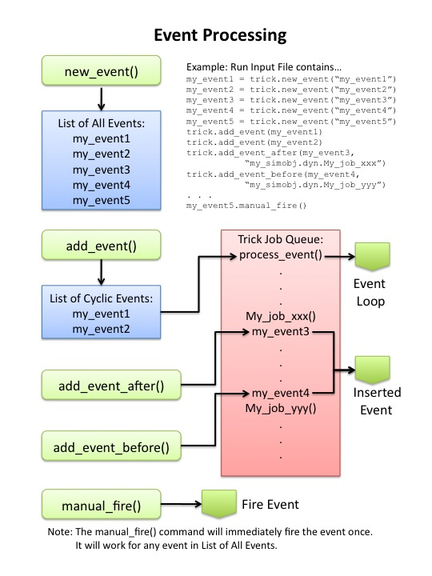

This page describes the methods available in the Trick::EventManager and Trick::EventProcessor class.
See [Input_File](/trick/documentation/running_a_simulation/Input-File) for detailed information on the syntax of the input processor file.

### User accessible routines

These commands are for adding and removing events from the Event Manager

```
Event * get_event() @endlink
int add_event( Trick::Event * in_event )
int add_event_after( Trick::Event * in_event, std::string target_name, unsigned int target_inst )
int add_event_before( Trick::Event * in_event, std::string target_name, unsigned int target_inst )
int remove_event( Trick::Event * in_event )
```

### Event Processing Flow

The next set of flowcharts details how the %Trick Event Processor processes events.



<b>Figure IP_1 Input Processor Event Processing</b>

Each thread in the simulation has an event processing job.

[Continue to Realtime](Realtime)
