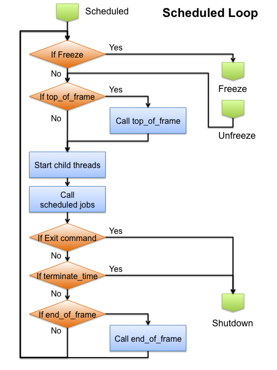
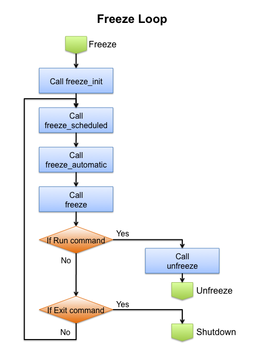
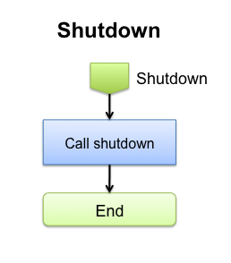

This scheduler or derivative of this class is required for Trick simulations to run.

The scheduler is in charge of simulation execution.  The scheduler maintains simulation elapsed time.  The scheduler has 4 modes of operation, Initialization, Run, Freeze, and Shutdown.  The scheduler maintains the simulation mode.  Within each mode of operation the executive/scheduler calls different sets of user and system jobs.

The scheduler is implemented by the Trick::Executive class.

### Executive Flow

The next set of flowcharts details how the Trick main executable runs.


**Figure 1 Executive Initialization**

During the Initialization phase three job classes are called, default data, input_processor, and initialization.  All jobs of these classes are executed in the main thread.  Not shown in the picture is any job returning a non-zero value to "trick_ret" will cause the simulation immediately to go to shutdown.  Execution continues to the Scheduled loop.



**Figure 2 Scheduled Loop**

Run mode is also called the Scheduled loop.  The Scheduled loop calls the top_of_frame, the scheduled jobs, and the end_of_frame jobs.  Both the top_of_frame and end_of_frame jobs are called at the software_frame cycle rate.  The scheduled jobs include these job classes:

- integ_loop.  The integ_loop includes derivative, integration, dynamic_event, and post_integration.
- automatic
- environment
- sensor
- sensor_receiver
- scheduled, effector
- effector_emitter
- effector_receiver
- automatic_last
- logging
- advance_sim_time

Receiving a freeze command diverts execution to the Freeze loop.  Execution is resumed in the scheduled loop when returning to run mode.

The loop is run until an exit condition is met.  The exit conditions include receiving an exit command, reaching the termination time, or a job returning a non-zero value to "trick_ret".  Upon meeting an exit condition, execution continues to the Shutdown phase.



**Figure 3 Freeze Loop**

Execution is diverted to the Freeze loop when the Freeze command is set in the Scheduled loop.  When entering freeze the freeze_init jobs are called. The freeze loop cyclically calls the freeze scheduled jobs, freeze_automatic, and freeze jobs.  Elapsed freeze time is kept and cycle times for the freeze_scheduled jobs are followed.  freeze_automatic jobs are assumed to set their own next call time.  Freeze jobs are called at the end of the freeze_software_frame.  The loop is run until a run command is received or an exit condition is met.  Upon receiving a run command, execution is returned to the Scheduled loop.  The exit conditions include receiving an exit command or a job returning a non-zero value to "trick_ret". Upon meeting an exit condition, execution continues to the Shutdown phase.



**Figure 4 Shutdown**

The shutdown phase calls the shutdown phase jobs and exits.  Easy peasy.

### Executive Time

Accessing the simulation time is one of the more common user interactions with the executive.  The executive keeps track of only simulation time.  The executive does not keep track of realtime.  That is the job of Trick::RealtimeSync.  The executive also does not keep track of other times including mission elapsed time, universal time, or other model generated time.

#### Reading the Time

The executive provides 2 calls to get the simulation time.

```
double exec_get_sim_time() ;
long long exec_get_time_tics() ;
```

exec_get_sim_time() is a returns a double representing simulation elapsed seconds.  exec_get_sim_time() will not return an exact value when time values are large due to roundoff error.

exec_get_time_tics() returns the number of elapsed time tics.  The time tic is explained below.

#### Setting the Time

Trick provides 2 calls to set the simulation time.

```c
int exec_set_time( double in_time ) ;
int exec_set_time_tics( long long in_time_tics ) ;
```

exec_set_time() sets the current simulation time to the incoming value.  This should normally be done at initialization.  Doing this while running is not defined.

exec_set_time_tics() sets the simulation time based on time tics.  The time tic is explained below.

#### Time tic

```c
int exec_get_time_tic_value( void ) ;
int exec_set_time_tic_value( int num_of_tics_per_second ) ;
```

A time tic is a fraction of a second equal to 1s/<number_of_tics_per_second>.  The time tic default is 1us.  Scheduled job cycles are converted to numbers of tics.  For instance a 1ms cycle job will be run every 1000 tics.  All job cycles should be a multiple of the time tic value.  If they are not the number of time tics is rounded down to the nearest number of tics.  The time tic value can be changed with the exec_set_time_tic_value() call.

Example 1:  A job is set to run at 128Hz or at 0.0078125 seconds.  This is converted to 7812.5 tics using the default tic value.  The job will end up running incorrectly every 7812 tics.  To correct this we call exec_set_time_tic_value(10000000) to set the time tic value to 100ns.  With a 100ns time tic value the job will be called every 78125 tics, which is (10000000/78125) = 128Hz.

Example 2:  Job 1 is set to run at 300Hz, 0.003333 seconds.  This is converted to 3333 tics and will not run at exactly 300Hz using the default 1us time tic.  Job 2 is set to run at 100Hz. To run both jobs at their correct rates, we call exec_set_time_tic_value(3000000).  Job 1 will run every 10000 tics.  Job 2 will run every 30000 tics.

### Software Frame

The software frame sets the cycle rates of the top_of_frame and end_of_frame class jobs.  Jobs run at the software frame are used to synchronize to real-time, synchronize multiple simulations together, and inject variables values.  The scheduled loop and the freeze loop have separate software frame values.  They are read and written with the following commands.

```c
int exec_set_software_frame(double) ;
double exec_get_software_frame() ;
long long exec_get_software_frame_tics() ;

int exec_set_freeze_frame(double) ;
double exec_get_freeze_frame() ;
long long exec_get_freeze_frame_tics() ;
```

exec_set_software_frame(double) and exec_set_freeze_frame(double) both take frame values in seconds.  
exec_get_software_frame() and exec_get_freeze_frame() return the frame values in seconds.  
exec_get_software_frame_tics() and exec_get_freeze_frame_tics() return the frame values in number of tics.

### User Mode Control

Users may toggle the Executive mode between Freeze and Run as well as command simulation Shutdown.

#### Getting the current mode

```
# Python code
SIM_MODE trick.exec_get_mode()
```

exec_get_mode returns the current mode of the simulation.  See the SIM_MODE definition for the enumeration values.

#### Commanding to Freeze

```c
// C/C++ code
#include "sim_services/Executive/include/exec_proto.h"
exec_freeze()
```

```
# Python code
trick.freeze()
trick.freeze(<double freeze_time>)
```

Users may command freeze in model code by calling exec_freeze().  Inside the input file users may call freeze with an optional time argument.  Calling trick.freeze() without an argument will freeze the simulation when all jobs at the current time step are complete.  Using a freeze_time argument will freeze the simulation in the future.  The freeze_time argument must be greater than the current time.  The freeze_time argument is elapsed simulation seconds.

```
# Python code
trick.exec_set_freeze_command(int on_off)
```

Calling exec_set_freeze_command() with a non-zero argument will start the simulation in freeze.  This is here to replicate a call from previous versions of Trick.  A call to trick.freeze() in the input file will accomplish the same result.  A call to trick.freeze(0.0) will not work.  This is because freeze times must be greater than the current sim time.

```
# Python code
trick.exec_set_freeze_on_frame_boundary(int on_off)
```

Calling exec_set_freeze_on_frame_boundary() with a non-zero argument will force all freezes to synchronize with the software frame.  Freeze commands received in the middle of the frame will be saved and executed at the next available frame boundary.

```
# Python code
trick.exec_set_enable_freeze( int on_off )
int trick.exec_get_enable_freeze() ;
```

Calling exec_set_enable_freeze() with a non-zero argument will enable the CTRL-C keyboard interrupt signal to freeze/unfreeze the simulation.  The default is off.  When enable_freeze is off, a CTRL-C keystroke will terminate the simulation.

#### Commanding to Run

```
exec_run()
```

exec_run() is called when the Run button on an attached sim_control panel is pressed.  It is rare that a user job calls exec_run.

#### Commanding to Shutdown

```
# Python code
trick.exec_set_terminate_time(double time_value)
double trick.exec_get_terminate_time() ;
```

The most common way to shutdown a simulation is setting a terminate time.  When simulation elapsed time reaches the terminate time, the shutdown jobs are executed and the program terminates.

```c
exec_terminate(const char *file_name, const char *error)
exec_terminate_with_return(int ret_code, const char *file_name, int line, const char *error)
```

Users may terminate simulation execution at any time by calling one of the exec_terminate varieties.  Both versions set the the Executive mode to shutdown.  The exec_terminate routine The exec_terminate_with_return allows users to set the simulation exit code as well as include a line number in the error message.

### Job Control

The executive provides routines to control job execution.

#### Turning Jobs On/Off

```
# Python code
trick.exec_set_job_onoff(char * job_name , int instance_num , int on) ;
```

The exec_set_job_onoff() routine allows users to turn individual jobs on and off.  The job name is the concatenation of the sim_object name and the job name.  The instance_num argument is used when jobs have the same name.  Jobs with unique names are always instance_num 1.  Jobs with identical names start at instance_num 1 and increment for each job as they appear in the sim object.

If there is a job tag specified for one of more jobs in the S_define file, you can turn all jobs with that tag on/off by specifying the tag as the job_name argument.

```
# Python code
trick.exec_set_sim_object_onoff(char * job_name , int on) ;
```

The exec_set_sim_object_onoff routine allows users to turn individual whole sim_objects on and off.

#### Job Cycle Time

```
# Python code
trick.exec_set_job_cycle(char * job_name, int instance_num, double in_cycle)
double trick.exec_get_job_cycle(char * job_name)
```

Each job cycle time is available to read and to set.  Some job classes ignore cycle times, i.e. initialization and shutdown.  The user may change the cycle time set in the S_define file with the exec_set_job_cycle() call.  The instance_num argument is used when jobs have the same name (see exec_set_job_onoff above).

If there is a job tag specified for one of more jobs in the S_define file, you can set the cycle for all jobs with that tag by specifying the tag as the job_name argument.

### Thread Control

Jobs may be assigned to specific threads.  See the Simulation Definition File -> Child Thread Specification section for information about assigning jobs to threads.

Trick provides 3 types of threads.  Each thread type synchronizes to the main threads differently.  Setting the thread process type determines how the executive synchronizes child threads to run.

```
# Python code
trick.exec_set_thread_process_type( unsigned int thread_id , int process_type )
```

Sets the synchronization type of a child thread. There are three synchronization types, PROCESS_TYPE_SCHEDULED, PROCESS_TYPE_ASYNC_CHILD, and PROCESS_TYPE_AMF_CHILD.  See the Trick::ProcessType.

#### PROCESS_TYPE_SCHEDULED Threads

Jobs in scheduled threads run in step with the main thread.  The main thread will wait for jobs in scheduled threads to finish before advancing to the simulation time step.  Scheduled thread simulation time always matches the main thread.

#### PROCESS_TYPE_ASYNC_CHILD Threads

Asynchronous threads have 2 modes of operation depending on if a synchronization time is specified. A cycle synchronization time is set through the exec_set_thread_async_cycle_time call.

```
# Python code
trick.exec_set_thread_async_cycle_time( unsigned int thread_id , double cycle_time ) ;
```

If the synchronization cycle time is set to zero, then the asynchronous threads do not synchronize to the main thread.  Asynchronous jobs are often infinite loops.  If all jobs in an asynchronous thread finish, the thread is immediately restarted.  Execution frequencies for jobs in asynchronous threads are ignored.  All jobs are run each time an asynchronous thread is executed.  Asynchronous thread simulation time is set to the thread start time and is not updated while the thread is executing.

If the synchronization cycle time is non zero, then the asynchronous thread attempts to synchronize to the main thread.  At the end of the synchronization cycle if the asynchronous thread has completed, then it will be triggered to run its next frame of jobs.  If the asynchronous thread has not completed, then it will not be triggered to run the next frame of jobs.  This condition is not considered an overrun and is not logged as one.  The non completed thread will be checked at the next synchronization cycle time for completion.  Between synchronization times, async threads maintain their own simulation time.  The simulation time on the thread may not match the main thread.

#### PROCESS_TYPE_AMF_CHILD Threads

AMF stands for Asynchronous Must Finish.  Threads of this type synchronize to the main thread at regular intervals set by exec_set_thread_amf_cycle_time().  Between synchronizations, AMF threads maintain their own simulation time.  Jobs in AMF threads are run as fast as possible.  The AMF thread simulation time may not match the main thread

When using an AMF thread the executive needs to know how often to synchronize with the child thread.

```
# Python code
trick.exec_set_thread_amf_cycle_time( unsigned int thread_id , double cycle_time ) ;
```

exec_set_thread_amf_cycle_time sets the synchronization cycle rate with the main thread.

#### Main Thread CPU release.

```
# Python code
trick.exec_set_rt_nap(int on_off)
trick.exec_get_rt_nap()
```

While the main thread is waiting for child threads to finish execution, it furiously spins waiting for them to finish.  Calling exec_set_rt_nap() with a non-zero argument will tell the main thread to momentarily give up the CPU if it needs to wait for child threads to finish.

#### Asynchronous Threads at Shutdown

```
# Python code
trick.exec_set_thread_async_wait( unsigned int thread_id , int yes_no ) ;
```

By default the executive does not wait for asynchronous or AMF threads during shutdown.  Calling exec_set_thread_async_wait() will tell the executive to wait for a thread before calling shutdown routines and exiting.

#### Thread Priorities

```
# Python code
trick.exec_set_thread_priority(unsigned int thread_id , unsigned int req_priority)
```

exec_set_thread_priority() will set the thread's priority.  The main thread is thread_id=0, 1-n are the child threads. for req_priority, 1 is the highest priority.  This number is converted internally to the highest priority of the system automatically.

Setting a simulation to run as priority 1 may lock out keyboard and mouse processing.

```
# Python code
trick.exec_set_thread_cpu_affinity(unsigned int thread_id , int cpu_num) ;
```

exec_set_thread_cpu_affinity assigns a thread to a specific CPU. If called multiple times, you can add multiple CPUs to a thread and the OS scheduler will choose one of those CPUs for the thread. The main thread is thread_id=0. 1-n are the child threads.  Setting a thread to run on a CPU does not exclude other processes to continue to run on the same CPU.

#### Thread Priorities

```
# Python code
trick.exec_set_lock_memory(int yes_no) ;
```

Lock all of the process memory for best real-time performance.  This prevents process memory to be swapped out to virtual memory on disk. This option may move to the Trick::RealtimeSync class in the future.

#### Thread Job Dependencies

```
# Python code
trick.exec_add_depends_on_job(char * target_job_string , unsigned int t_instance ,
                              char * depend_job_string , unsigned int d_instance )
```

Jobs in different threads may need other jobs in other threads to run first before executing.  Trick provides a depends_on feature.  Jobs that depend on other jobs will not execute until all dependencies have finished.  The instance value in the above call to take care of the case where the same job name is called multiple times in a sim_object.  Instance values start at 1.

#### Getting Thread ID

```c
unsigned int exec_get_process_id() ;
unsigned int exec_get_num_threads() ;
```

exec_get_process_id() will return the current thread the caller is on.  0 = main thread, 1-n are the child threads.  If this call is issued through a variable server client, or a thread that was not spawned by the executive, a -1 error code is returned.

exec_get_num_threads() returns the number of child threads spawned by the main thread.

### Debugging Help

The Executive provides several parameters that can help a model developer debug a simulation.

#### Trapping signals

```
# Python code
trick.exec_set_trap_sigbus(int on_off)
trick.exec_set_trap_sigfpe(int on_off)
trick.exec_set_trap_sigsegv(int on_off)
trick.exec_set_trap_sigchld(int on_off)
trick.exec_get_trap_sigbus()
trick.exec_get_trap_sigfpe()
trick.exec_get_trap_sigsegv()
trick.exec_get_trap_sigchld()
```

The set_trap routines listed above set a signal handler for the SIGBUS, SIGFPE, SIGSEGV, and SIGCHLD signals respectively.  The get_trap routines return the on/off status of the trap.  Trapping the signals allows the Trick to gracefully shutdown the simulation and to possibly write important information about the signal before exiting execution.  Turning off the traps will revert signal handling to the default system signal handler.  By default the traps for SIGBUS, SIGSEGV, and SIGCHLD are true.  SIGFPE is not trapped by default.

#### Printing a Stack (Call) Trace on Signal

```
# Python code
trick.exec_set_stack_trace(int on_off)
```

This is a Linux only option.  By default, printing a stack trace when a signal is trapped is enabled.  When a signal is trapped a debugger is automatically connected to the running simulation and a printout of the calling stack is printed before the simulation exits.

#### Attaching a debugger on Signal

```
# Python code
trick.exec_set_attach_debugger(int on_off)
```

This is a Linux only option.  By default, this option is off.  If enabled, when a signal is trapped a debugger is automatically connected to the running simulation and an interactive debugging session is presented to the user.

The debugger executable may be set with the following.  The default is "/usr/bin/gdb".

```
# Python code
trick.exec_set_debugger_command(char * command)
char * trick.exec_get_debugger_command()
```

#### Getting Build Information

```
# Python code
char * trick.exec_get_current_version()
```

The executive stores the Trick version that was used to build the executable.  Use exec_get_current_version() to return the version string.

[Continue to Input Processor](Input-Processor)
