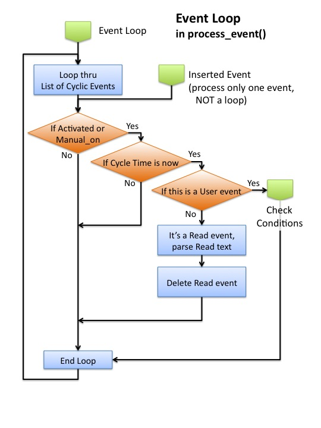
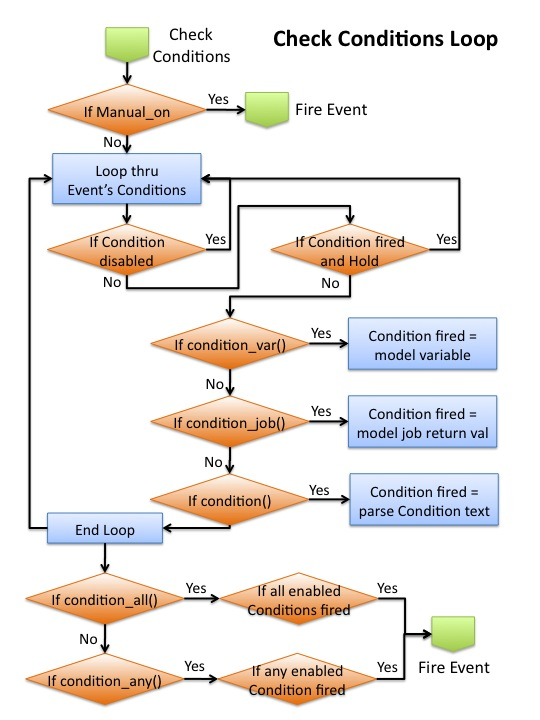
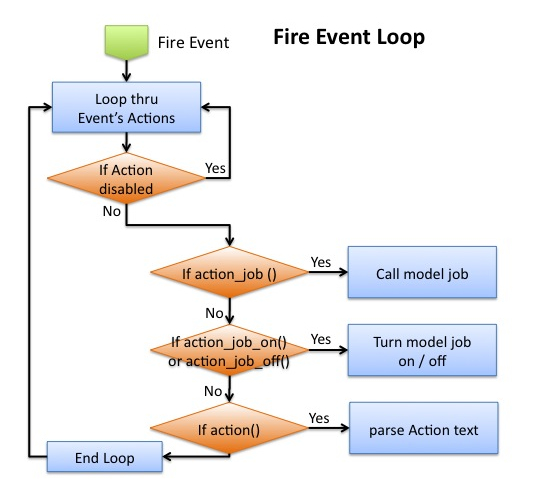

This page describes the methods available in the Trick::InputProcessor class.
<b>See [Input File](../running_a_simulation/Input-File) for detailed information on the syntax of the input processor file.

### User accessible routines

```
int shutdown()
```

These commands are for creating python events and manipulating them.

```
IPPythonEvent * new_event()
int add_read(double in_time , char * in_string)
int add_read(double in_time , char * in_string)
int delete_event(IPPythonEvent * in_event)
int manual_on(std::string name)
int manual_fire(std::string name)
int manual_off(std::string name)
int manual_done(std::string name)
```

The commands for setting up each event are described in Trick::IPPythonEvent

An event is in Normal mode by default, meaning its condition(s) are used to determine when to fire. Issuing one of the manual commands (manual_fire, 
manual_on, manual_off) puts an event in Manual mode, meaning its conditions are ignored and the type of manual command determines if the event fires.
Any event can be fired once immediately with the manual_fire command; the only way to fire non-"Added" events is with manual_fire().
An event will NOT fire when the manual_off() command is issued. An event returns to Normal mode by issuing the manual_done() command.
The commands described above can be done in the Run input file, and/or via the variable server, and/or via MTV (see MTV).



<b>Figure IP_2 Input Processor Event Loop</b>

The Trick process_event() job will execute the Event Loop for all events that were added with the add_event() command. For events that were added with
add_event_before() or add_event_after(), the Event Loop is effectively executed once for the event immediately before/after the event target job.



<b>Figure IP_3 Input Processor Event Check Conditions Loop</b>

The Check Conditions Loop is called from the Event Loop to determine if the event should fire. Notice that no checking is necessary in Manual mode, the event
simply fires.



<b>Figure IP_4 Input Processor Event Fire Event Loop</b>

The Fire Event Loop is called from the Check Conditions Loop or directly by the manual_fire() command, causing all of the event's enabled actions to run.

[Continue to JIT Input Processor](JIT-Input-Processor)
