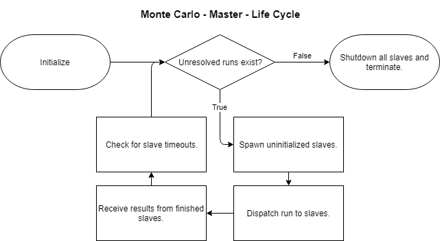
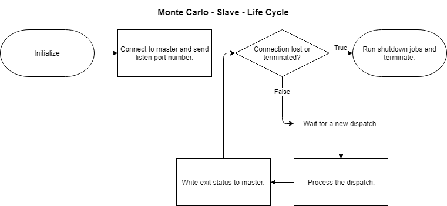
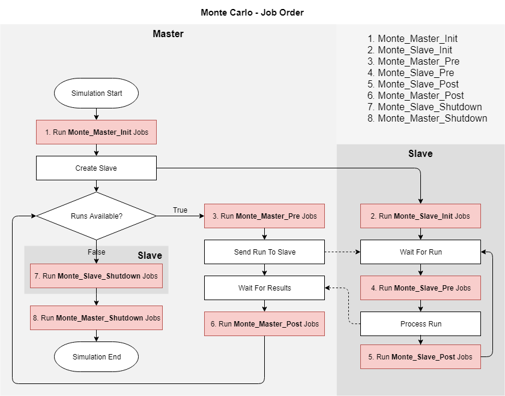

| [Home](Home) → [Documentation Home](Documentation-Home) → Monte Carlo |
|--------------------------------------------------------------------------------------|

# Introduction
Monte Carlo is an advanced simulation capability provided by Trick that allows users to repeatedly run copies of a simulation with different input values. Users can vary the input space of a simulation via input file, random value generation, or by calculating values from previous Monte Carlo runs in a process called optimization.

# Design
### Master
The master controller for any given Monte Carlo simulation delegates run information to distributed slave instances. The master is responsible for spawning and managing the state of all slaves for a given simulation.




### Slave
A Monte Carlo slave simulation is responsible for the execution of the runs delegated by the master controller. Should a simulation run fail, the slave will inform the master and continue running until explicitly killed or disconnected. Slaves consume only a single CPU and run only one job at a time. If you want to increases parallelism, you should create multiple slaves. Creating one slave per CPU is a reasonable approach.




### Monte Carlo Jobs
There are 8 Monte Carlo specific Trick jobs that users can use to direct how their Monte Carlo simulation runs.

| Trick Job						| Description																		|
|-------------------------------|-----------------------------------------------------------------------------------|
| **monte\_master\_init**		| Runs once in the master upon initialization and before any slaves are created.	|
| **monte\_master\_pre**		| Runs in the master before each run is dispatched.									|
| **monte\_master\_post**		| Runs in the master each time a slave completes a run.								|
| **monte\_master\_shutdown**	| Runs once in the master after all runs have completed.							|
| **monte\_slave\_init**		| Runs once in each slave upon initialization.										|
| **monte\_slave\_pre**			| Runs in the slave before each received dispatch is executed. 						|
| **monte\_slave\_post**		| Runs in the slave each time this slave completes a run.							|
| **monte\_slave\_shutdown**	| Runs once in the slave before termination.										|





# Using Monte Carlo
## Enabling Monte Carlo
In order to use Monte Carlo functionality, it is necessary to first enable Monte Carlo in the simulation input file.
```python
trick.mc_set_enabled(1)
```

## Variable Types
There are four different Monte Carlo variable types available to users: **File**, **Random**, **Calculated**, **Fixed**

### File
MonteVarFile allows users to store specific values in an column delimited input file.
```python
FileVariable = trick.MonteVarFile("variable_name", "input_file_name", column_number, "variable_unit")
trick_mc.mc.add_variable(FileVariable)
```

The columns in the input file can be separated by tabs or spaces; both will work and can even be combined in the same file on the same line. The left most column is typically the run number, though this is not a requirement; variable values can begin in this column if desired.
```
0 50 1959
1 60 1402
2 75	5832
3 43	7823
4	02	4935
5	19	6928
```

### Random
MonteVarRandom allows users to randomly generate input values by using a distribution formula.
```python
RandomVariable = trick.MonteVarRandom("variable_name", distribution, "variable_unit", engine)
RandomVariable.set_seed(1)
RandomVariable.set_sigma(0.6667)
RandomVariable.set_mu(4.0)
RandomVariable.set_min(-4.0)
RandomVariable.set_max(4.0)
RandomVariable.set_sigma_range(0)
trick_mc.mc.add_variable(RandomVariable)
```

There are three distribution methods for random value generation: **Gaussian**, **Poisson**, and **Flat**

[**Gaussian distribution**](https://en.wikipedia.org/wiki/Normal_distribution), otherwise known as normal distribution, will generate a typical bell curve of distributed values. <br>
[**Poisson distribution**](https://en.wikipedia.org/wiki/Poisson_distribution) will generate a distribution to match a Poisson curve. <br>
[**Flat distribution**](https://en.wikipedia.org/wiki/Uniform_distribution_(continuous)) will generate a uniform distribution of values between the minimum and maximum. This distribution can only use the **set\_min() and set\_max()** functions.

| Distribution Variables		| Function																				| Description																																																										|
|-------------------------------|---------------------------------------------------------------------------------------|---------------------------------------------------------------------------------------------------------------------------------------------------------------------------------------------------------------------------------------------------|
| Seed							| MonteVarRandom.set\_seed()															| This is the randomization seed.																																																					|
| Sigma							| MonteVarRandom.set\_sigma()															| This is the standard deviation. The larger this value, the broader the bell curve will be.																																						|
| Mu							| MonteVarRandom.set\_mu()																| This value specifies the center of the bell curve.																																																|
| Min <br> Max					| MonteVarRandom.set\_min() <br> MonteVarRandom.set\_max()								| These are the absolute cutoff limits. Any values outside of these bounds are discarded.																																							|
| Rel\_min <br> Rel\_max		| MonteVarRandom.set\_min\_is\_relative() <br> MonteVarRandom.set\_max\_is\_relative()	| These booleans specify if the minimum and maximum values are relative to the Mu value. If the **Mu** is 20 and both the **relative minimum** and **relative maximum** are 5, then the **actual minimum** is 15 and the **actual maximum** is 25.	|

There are also several different psuedo-random engines available to choose from. If no engine is specified, Trick will default to its own random number engine.

| Engine						|
|-------------------------------|
| NO\_ENGINE					|
| TRICK\_DEFAULT\_ENGINE		|
| RANLUX\_BASE\_01\_ENGINE		|
| RANLUX\_64\_BASE\_01\_ENGINE	|
| MINSTD\_RAND\_ENGINE			|
| MT19937\_ENGINE				|
| MT19937\_64\_ENGINE			|
| RANLUX\_24\_BASE\_ENGINE		|
| RANLUX\_44\_BASE\_ENGINE		|
| RANLUX\_24\_ENGINE			|
| RANLUX\_44\_ENGINE			|
| KNUTH\_B\_ENGINE				|

### Calculated
Calculated values are created in user-designed Monte Carlo jobs. The primary purpose of the MonteVarCalculated variable type is for optimization.
```python
CalculatedVariable = trick.MonteVarCalculated("variable_name", "variable_unit")
trick_mc.mc.add_variable(CalculatedVariable)
```

### Fixed
Fixed values are not changed from simulation to simulation.
```python
FixedVariable = trick.MonteVarFixed("variable_name", variable_value, "variable_unit")
trick_mc.mc.add_variable(FixedVariable)
```

## Runs
Users can specify how many times they wish for a simulation to run by using the following function:
```python
trick.mc_set_num_runs(100)
```

For a series of **randomly generated values**, Monte Carlo will execute the simulation the number of times specified.

For a series of values listed in an **input file**, Monte Carlo will execute the number of runs specified and will not exceed the number of runs in the input file.

For multiple variables listed in **multiple input files**, Monte Carlo will execute the fewest number of runs specified and will not exceed the fewest number of runs in any given input file.

## Ranges
After establishing the number of simulation runs, users can specify subsets within that number that the simulation should focus on. If no range is specified, all runs will be dispatched. 

```python
trick.mc_add_range(25, 50)
trick.mc_add_range(73)
trick.mc_add_range(90, 100)
```
These three function calls will tell Monte Carlo to only process runs 25-50, 73, and 90-100. The values are inclusive and additive.

## Creating Slaves
The simplest way to create a new slave is to call `trick.mc_add_slave` with the machine name in the input file.

```python
trick.mc_add_slave("localhost")
```

Each slave will consume a single CPU and run one job at a time. If you have multiple CPUs, it can be reasonable to create a slave for each.

```python
import multiprocessing
for i in range(multiprocessing.cpu_count()):
    trick.mc_add_slave("localhost")
```

You can distribute your slaves across any machines that have your simulation compiled on them.

```python
trick.mc_add_slave("localhost")
trick.mc_add_slave("remote-machine")
trick.mc_add_slave("other-machine")
trick.mc_add_slave("extra-machine")
trick.mc_add_slave("secret-machine")
```

### Modifying Slave Options

`trick.mc_add_slave` is nice and simple, and it's generally all you need. However, [`MonteSlave`](https://github.com/nasa/trick/blob/master/include/trick/MonteCarlo.hh) has a few options you might want to modify. For instance, you can change the remote shell from `ssh` to something else or add arguments to the remote shell invocation. To do that, you need a reference to the `MonteSlave`, but `mc_add_slave`, being a C function, cannot return a class instance. But don't worry! It's easy to create one yourself.

```python 
# instantiate the slave
slave = trick.MonteSlave("machine-name")
# now I can access its members
slave.remote_shell = trick.TRICK_RSH # who needs security?
# finally, add it to Trick
trick_mc.mc.add_slave(slave)
```

If you're curious about the last time, we are calling the `add_slave` function of the [`MonteCarlo`](https://github.com/nasa/trick/blob/master/include/trick/MonteCarlo.hh) instance (`mc`) of the [`MonteCarloSimObject`](https://github.com/nasa/trick/blob/master/share/trick/sim_objects/default_trick_sys.sm) instance (`trick_mc`).
## Notes
1. [SSH](https://en.wikipedia.org/wiki/Secure_Shell) is is the default remote shell.
1. Each slave will work in parallel with other slaves, greatly reducing the computation time of a Monte Carlo.
1. The faster a machine is, the more work it can do.
1. If a slave dies, the master will redistribute the missing work.
1. Communication between the master and slaves is done via sockets.
1. Monte Carlo slaves are CPU hogs. They do not play nice with the users of other machines.
1. Monte Carlo always runs distributed. If no slave is manually added, a single slave on `localhost` is created.
1. Slaves can be created in **monte\_master\_pre** and **monte\_master\_post** jobs.

## Data Logging
Each Monte Carlo run generates data logging files in a **MONTE_** directory on the machine that processed the run. Existing run directories are not cleaned and are overwritten when a new Monte Carlo simulation begins. 

| Data File					| Description																																												|
|---------------------------|-------------------------------------------------------------------------------------------------------------------------------------------------------------------------------------------|
| monte\_header				| This file contains the input file lines that configured the initial state of the Monte Carlo simulation. Information on the number of runs and the variables specified are in this file.	|
| monte\_runs				| This file lists the values used for each variable on each run.																															|
| run\_summary				| This file contains the summary statistical information that is printed out to the screen after a run completes.																			|
| monte\_input				| This file contains the input file commands necessary to rerun a single run as a stand alone simulation. It can be found in the RUN_ folder used to store the run's information.			|

## Dry Runs
A dry run generates only the **monte_runs** and **monte_header** files without actually processing any runs. Dry runs can be used to verify input values before dedicating resources to a full Monte Carlo simulation.
```python
trick.mc_set_dry_run(1)
```

## Optimization
Monte Carlo is capable of running input values that have been derived from the results of previous runs. Monte Carlo is not capable of autonomous and intelligent decision making; it is the responsibility of the user to design the optimization logic by hand.

Optimization code is typically located in either the **monte_master_pre** or **monte_master_post** jobs. There is no hard and fast rule on how to implement optimization, so choose the best method for your specific simulation.

## Function Overview
There are a number of Monte Carlo functions that are available to the user. The following table consists of various C functions that can be called in the input file via:
```python
trick.mc_function_name(function_parameter, "function_parameter2", . . .)
```

| Function Name							| Description																																														|
|--------------------------------------:|:--------------------------------------------------------------------------------------------------------------------------------------------------------------------------------------------------|
| mc\_add\_range						| Adds the specified range to the list of valid ranges. Both the start and end values are inclusive.																								|
| mc\_add\_slave						| Adds the specified slave.																																											|
| mc\_get\_connection\_device\_port		| Returns an integer containing the port of the connection device.																																	|
| mc\_get\_current\_run					| Returns an unsigned integer containing the current run being processed.																															|
| mc\_get\_custom\_post\_text			| Returns a string containing text to be appended to the core slave dispatch.																														|
| mc\_get\_custom\_pre\_text			| Returns a string containing text to be prepended to the core slave dispatch.																														|
| mc\_get\_custom\_slave\_dispatch		| Returns a boolean integer indicating if custom slave dispatches have been enabled.																												|
| mc\_get\_dry\_run						| Returns a boolean integer indicating if this run is a dry run.																																	|
| mc\_get\_enabled						| Returns a boolean integer indicating if this is a Monte Carlo simulation.																															|
| mc\_get\_localhost\_as\_remote		| Returns a boolean integer indicating if the localhost should be treated as a remote machine and use remote shells.																				|
| mc\_get\_max\_tries					| Returns an unsigned integer indicating the number of times that a run may be dispatched. Defaults to two. Zero is limitless.																		|
| mc\_get\_num\_runs					| Returns an unsigned integer indicating the number of runs specified by the user.																													|
| mc\_get\_slave\_id					| Returns an unsigned integer indicating the unique identifier assigned to the slave.																												|
| mc\_get\_timeout						| Returns a double indicating the number of seconds the master should wait for a run to complete.																									|
| mc\_get\_user\_cmd\_string			| Returns a string containing the options that are passed to the remote shell when spawning new slaves.																								|
| mc\_get\_verbosity					| Returns an integer indicating the level of verbosity. <br> 0 = No Messages <br> 1 = Error Messages <br> 2 = Error and Informational Messages <br> 3 = Error, Informational, and Warning Messages	|
| mc\_read								| Gets the connection device and reads the incoming string into a user specified buffer.																											|
| mc\_set\_current\_run					| Sets the current run being processed.																																								|
| mc\_set\_custom\_post\_text			| Sets the string to be appended to the core slave dispatch.																																		|
| mc\_set\_custom\_pre\_text			| Sets the string to be prepended to the core slave dispatch.																																		|
| mc\_set\_custom\_slave\_dispatch		| Sets the boolean integer indicating if custom slave dispatches have been enabled.																													|
| mc\_set\_dry\_run						| Sets the boolean integer indicating the current run is a dry run.																																	|
| mc\_set\_enabled						| Sets the boolean integer indicating if this is a Monte Carlo simulation.																															|
| mc\_set\_localhost\_as\_remote		| Sets the boolean integer indicating if the localhost should be treated as a remote machine and use remote shells.																					|
| mc\_set\_max\_tries					| Sets the number of times that a run may be dispatched. Default is two. Zero is limitless.																											|
| mc\_set\_num\_runs					| Sets the number of runs to do.																																									|
| mc\_set\_timeout						| Sets the number of seconds the master should wait for a run to complete.																															|
| mc\_set\_user\_cmd\_string			| Sets the string containing the options that are passed to the remote shell when spawning new slaves.																								|
| mc\_set\_verbosity					| Sets an integer indicating the level of verbosity. <br> 0 = No Messages <br> 1 = Error Messages <br> 2 = Error and Informational Messages <br> 3 = Error, Informational, and Warning Messages		|
| mc\_start\_slave						| Starts the specified slave.																																										|
| mc\_stop\_slave						| Stops the specified slave.																																										|
| mc\_write								| Gets the connection device and writes the user specified buffer into it.																															|
| mc\_is\_slave							| Returns a boolean integer indicating if the current executive is running as a slave.																												|

[Continue to Master Slave](Master-Slave)
