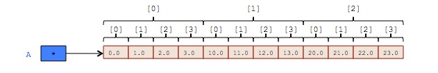
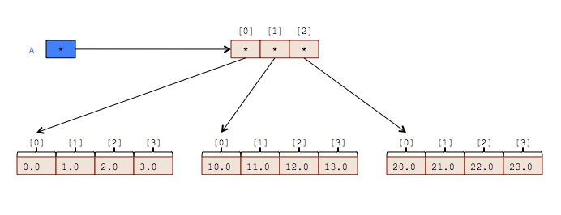
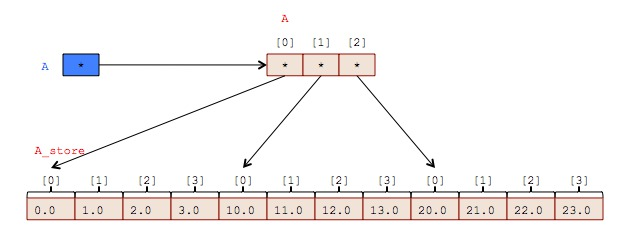

## Trick Memory Manager

The Memory Manager
- Maintains a list of memory objects with their associated data-types and
  optional names.
- Provides services based on this information such as:
  -  Creating and cataloging new data-type instances. (Memory allocation).
  -  Cataloging pre-existing memory objects.
  -  Writing the definitions and values of these memory objects to a checkpoint
     file or stream.
  -  Reading the definitions and values from a checkpoint file or stream and
     restoring the original
     objects back into memory
  -  Debugging support, to see exactly what is happening.
  -  C and C++ interfaces.

This makes other services possible, such as :
- Data recording
- Variable Server
  - Trick Sim Control Panel
  - Trick Strip Chart
  - TrickView (TV) Variable Viewer
  - Third-party simulation clients

### Memory Manager Interfaces
A Trick simulation contains exactly one Memory Manager. One can access it as follows:

```
#include "MemoryManager.hh"
extern Trick::MemoryManager* trick_MM;
```
From 'C' code, the Memory Manager can be accessed using a set of wrapper functions:
```
*memorymanager_c_intf.h*
```

### Registering an Object
The Memory Manager can either register a supplied object or it can allocate an
object as described by its declaration, and then register it. Here *object* just
means a chunk of memory that one would get by calling malloc, new, or mmap.
Registering the object associates it with a type-declaration and a name.

To allocate and then register an object, one would use a variant of the Memory
Manager member-function *declare_var()*. To register an existing object, one
would use a variant of *declare_extern_var()*. For each variant of declare_var()
there is a corresponding variant of declare_extern_var(). Their argument lists
are identical except that the first argument of declare_extern_var() is a pointer
to the supplied object.

Below following are the three variants of  *declare_var()*.

The first is the most commonly used. The declaration information is
specified entirely in a [declaration string](MemoryManager-Declaration-String).

```
void * Trick::MemoryManager:: declare_var (const char *declaration);
```

The next variant is a convenience function to allocate an anonymous,
one dimensional array.

```
void * Trick::MemoryManager:: declare_var (const char *type_spec,
                                           int n_elems);
```

The final variation is the the most flexible, but also the most complex.

```
void * Trick::MemoryManager:: declare_var (TRICK_TYPE type,
                                           std::string class_name,
                                           int n_stars,
                                           std::string var_name,
                                           int n_cdims,
                                           int *cdims);
```
Where:
- **type** specifies the data-type. See [TRICK_TYPE](MemoryManager-TRICK_TYPE).
- **class_name** is name of a user-defined type. This parameter is only applicable
  if *type* is TRICK_STRUCTURED, otherwise it is ignored.
- **n_stars** is simply the number of pointers (asterisks) in the declaration.
- **var_name** Optional name of the variable being created.
- **n_cdims** Number of array dimensions.
- **cdims** Sizes of each dimension.

To register an existing allocation use the following:
```
void * Trick::MemoryManager::declare_extern_var ( void* address,
                                                  const char *declaration);
```
Where:
- **address** is the address of the object to be register.
The remaining arguments are identical to those of declare_var.


### Example Allocations using C and C++ Interfaces

The following two *declare_var* calls do exactly the same thing.

```
#include "MemoryManager.hh"
extern trick::MemoryManager* trick_MM;
double *D = (double*)trick_MM->declare_var("double[3]");
double *D = (double*)trick_MM->declare_var("double",3);
```

The following two calls do exactly the same thing as each other, and as the two
C++ examples above.

```
#include "memorymanager_c_intf.h"
double *D = (double*)TMM_declare_var_s("double[3]");
double *D = (double*)TMM_declare_var_1d("double",3);
```

### Allocation Examples

Allocation of an anonymous double:
```
double *D = (double*)TMM_declare_var_s("double");
```

Allocation of an anonymous array of 3 doubles:
```
double *D = (double*) TMM_declare_var_s("double[3]");
```

Allocation of an anonymous array of 3 pointers to double:
```
double **D = (double**) TMM_declare_var_s("double*[3]");
```

Allocation of a named double:
```
double *D = (double*)TMM_declare_var_s("double mydbl"); 
```

Allocation of a named array of 3 Pointers to double:
```
double **D = (double**)TMM_declare_var_s("double* mydbl[3]");
```

Allocation of a named object of user-defined type "BAR":
```
BAR *D = (BAR*)TMM_declare_var_s("BAR mydbl");
```

Allocation of a named 2 dimensional array of user-defined type "BAR" in
namespace "FOO":
```
FOO::BAR (*A)[3][4] = (FOO::BAR(*)[3][4])TMM_declare_var_s("FOO::BAR my_array[3][4]");
```

### Checkpoints

A checkpoint is a textual representation of Trick managed memory objects at
a particular instance in time. When commanded, the MemoryManager (by way of a
CheckpointAgent) transforms the data-type descriptions and the values of memory
manager managed allocations into a human readable text format and writes it to a
file or stream.

Checkpoints contain three types of statements:

- Declaration Statements - are named [declarations](MemoryManager-Declaration-String)
followed by a semi-colon. They contain all of the information necessary to recreate
an instance of the object they represent. Anonymous 


They describe memory objects. These statements contain all of the information necessary to recreate an instance of the object they represent. 
They are a [declaration](MemoryManager-Declaration-String) followed by a semi-colon;


- Assignment Statements  - specify the values of objects. Composite objects
require one assignment for each of its non-composite data members.

-- Identifiers and References

- Checkpoint Directives - invoke a checkpoint specific command.


### Writing Checkpoints

Checkpoint every allocation that the MemoryManager knows about to a std::stream.
```
void Trick::MemoryManager::write_checkpoint (std::ostream &out_s);
```

Checkpoint the named allocation to a std::stream.
```
void Trick::MemoryManager::
    write_checkpoint ( std::ostream &out_s,
                       const char *var_name);
```

Checkpoint the listed named allocations to a std::stream.
```
void Trick::MemoryManager::
    write_checkpoint ( std::ostream &out_s,
                       std::vector< const char * > &var_name_list);
```

Checkpoint every allocation that the MemoryManager knows about to a file.
```
void Trick::MemoryManager::write_checkpoint (const char *filename);
```

Checkpoint the named allocation to a file.
```
void Trick::MemoryManager::
    write_checkpoint ( const char *filename,
                       const char *var_name);
```

Checkpoint the listed named allocations to a file.
```
void Trick::MemoryManager::
   write_checkpoint( const char *filename,
                     std::vector< const char * > &var_name_list);
```

Checkpoint every allocation that the MemoryManager knows about to a file.
```
void  TMM_write_checkpoint( const char* filename) ;
```

### Example - Checkpointing a Named, Local Allocation
In the example below we ask the Memory Manager to allocate an array of three
doubles named *dbl_array*. **declare_var** returns a pointer to the array. Using
the pointer, we then initialize the array. Finally we checkpoint the variable to
std::cout.
```
#include "MemoryManager.hh"
extern trick::MemoryManager* trick_MM;

double *dbl_p = (double*)trick_MM->declare_var("double dbl_array[3]");

dbl_p[0] = 1.1;
dbl_p[1] = 2.2;
dbl_p[2] = 3.3;

trick_MM->write_checkpoint( std::cout, "dbl_array");
```
The following would accomplish the exact same as the assignment above.
The **TMM** 'C' routines are just wrappers around the C++ calls.

```
double *dbl_p = (double*) TMM_declare_var_s("double dbl_array[3]");
```

When a checkpoint (shown below) is reloaded the declarations in the *Variable
Declarations* section cause variables to be allocated just like the declare_var()
call above.  The assignments in the *Variable Assignments* section restore the
values of the variables.

#### Checkpoint Content
```
// Variable Declarations.
double dbl_array[3];

// Variable Assignments.
dbl_array =
    {1.1, 2.2, 3.3};
```

### Example - Checkpointing an Anonymous, Local Allocation
In the following example, we are not giving a name to the variable that we are
creating.

```
#include "MemoryManager.hh"
extern trick::MemoryManager* trick_MM;
double *dbl_p = (double*)trick_MM->declare_var("double[3]");
dbl_p[0] = 1.1;
dbl_p[1] = 2.2;
dbl_p[2] = 3.3;
trick_MM->write_checkpoint( std::cout );
```
In the checkpoint below, notice that the variable is given a **temporary** name
for checkpointing.

#### Checkpoint Content
```
// Variable Declarations.
double trick_anon_local_0[3];

// Variable Assignments.
trick_anon_local_0 =
    {1.1, 2.2, 3.3};
```

### Example - Checkpointing a Named, External Allocation
In this example, we are allocating the memory for the variable directly rather
than asking the Memory Manager to do it.

```
#include "MemoryManager.hh"
extern trick::MemoryManager* trick_MM;
double *dbl_p = new double[3];
trick_MM->declare_extern_var(dbl_p, "double dbl_array[3]");
dbl_p[0] = 1.1;
dbl_p[1] = 2.2;
dbl_p[2] = 3.3;
trick_MM->write_checkpoint( std::cout );

```
Because this object is **extern**, the MemoryManager must be able to lookup its
address by name. Therefore the simulation must ensure that the object exists and
is cataloged before attempting to reload its contents from a checkpoint.

#### Checkpoint Content
```
// Variable Declarations.
// extern double dbl_array[3];

// Variable Assignments.
dbl_array =
    {1.1, 2.2, 3.3};
```

### Example - Checkpointing an Anonymous, External Allocation

In the following example, we are allocating the memory for the variable directly
and not giving it a name. **This is typically not a good idea**.

```
#include "MemoryManager.hh"
extern trick::MemoryManager* trick_MM;
double *dbl_p = new double[3];
trick_MM->declare_extern_var(dbl_p, "double[3]");
dbl_p[0] = 1.1;
dbl_p[1] = 2.2;
dbl_p[2] = 3.3;
trick_MM->write_checkpoint( std::cout);

```
Anonymous, extern objects cannot be reloaded from a checkpoint, because the
MemoryManager has no way to find the objects address. So if we need to reload an
extern object, we need to make sure that it has a name, and is cataloged.

In the checkpoint note the temporary name indciates that the variable is
allocated externally to the Memory Manager.

#### Checkpoint Content
```
// Variable Declarations.

// Variable Assignments.
trick_anon_extern_0 = 
    {1.1, 2.2, 3.3};
```

### Example - Checkpointing a Constrained Array

#### Allocation of an two-dimensional constrained array of doubles:

```
#include "memorymanager_c_intf.h"
double (*A)[3][4] = (double(*)[3][4]) TMM_declare_var_s("double A[3][4]");

(*A)[0][0] = 0.0;
(*A)[0][1] = 1.0;
(*A)[0][2] = 2.0;
(*A)[0][3] = 3.0;
(*A)[1][0] = 10.0;
(*A)[1][1] = 11.0;
(*A)[1][2] = 12.0;
(*A)[1][3] = 13.0;
(*A)[2][0] = 20.0;
(*A)[2][1] = 21.0;
(*A)[2][2] = 22.0;
(*A)[2][3] = 23.0;
```



#### Checkpoint Content
```
// Variable Declarations.
double A[3][4];

// Variable Assignments.

A =
    {
        {0, 1, 2, 3},
        {10, 11, 12, 13},
        {20, 21, 22, 23}
    };
```

### Example - Checkpointing an Unconstrained Array

#### Allocation of an anonymous two-dimensional unconstrained array of doubles:

```
#include "memorymanager_c_intf.h"
double **A = (double**)TMM_declare_var_s("double*[3]");
A[0] = (double*)TMM_declare_var_s("double[4]");
A[1] = (double*)TMM_declare_var_s("double[4]");
A[2] = (double*)TMM_declare_var_s("double[4]");

A[0][0] = 0.0;
A[0][1] = 1.0;
A[0][2] = 2.0;
A[0][3] = 3.0;
A[1][0] = 10.0;
A[1][1] = 11.0;
A[1][2] = 12.0;
A[1][3] = 13.0;
A[2][0] = 20.0;
A[2][1] = 21.0;
A[2][2] = 22.0;
A[2][3] = 23.0;
```



#### Checkpoint Content
```
// Variable Declarations.
double* trick_anon_local_0[3];
double trick_anon_local_1[4];
double trick_anon_local_2[4];
double trick_anon_local_3[4];

// Variable Assignments.
trick_anon_local_0 =
    {&trick_anon_local_1[0], &trick_anon_local_2[0], &trick_anon_local_3[0]};

trick_anon_local_1 =
    {0, 1, 2, 3};

trick_anon_local_2 =
    {10, 11, 12, 13};

trick_anon_local_3 =
    {20, 21, 22, 23};
```

### Example - Another Checkpoint of an Unconstrained Array

Allocation of a two-dimensional unconstrained array of doubles with contiguous storage:

```
#include "MemoryManager.hh"
extern trick::MemoryManager* trick_MM;

double **A = (double**)trick_MM->declare_var("double*A[3]");
double *A_store = (double*)trick_MM->declare_var("double A_store[3][4]");

A[0] = &A_store[0];
A[1] = &A_store[4];
A[2] = &A_store[8];

A[0][0] = 0.0;
A[0][1] = 1.0;
A[0][2] = 2.0;
A[0][3] = 3.0;
A[1][0] = 10.0;
A[1][1] = 11.0;
A[1][2] = 12.0;
A[1][3] = 13.0;
A[2][0] = 20.0;
A[2][1] = 21.0;
A[2][2] = 22.0;
A[2][3] = 23.0;
```



#### Checkpoint Content
```
// Variable Declarations.
double* A[3];
double A_store[3][4];

// Variable Assignments.
A =
    {&A_store[0], &A_store[4], &A_store[8]};

A_store =
    {
        {0, 1, 2, 3},
        {10, 11, 12, 13},
        {20, 21, 22, 23}
    };
```

### Reading and Restoring Checkpoints
Restoring a checkpoint consists of reading and executing the statements from a
checkpoint file or stream. Declaration statements cause data-typed objects to be
created and registered. Assignment statements cause values specified on the
right hand side to the variables identified on the right.

#### Checkpoint Restore Methods

Restore the checkpoint from the given std::stream:
```
int Trick::MemoryManager::read_checkpoint (std::istream *in_s)
```

Restore the checkpoint from the named file.
```
int Trick::MemoryManager::read_checkpoint (const char *filename);
```
```
int TMM_read_checkpoint( const char* filename);
```

Restore the checkpoint from the given character string.
```
int Trick::MemoryManager::read_checkpoint_from_string(const char *s);
```
```
int Trick::MemoryManager::read_checkpoint_from_string(const char *s);
```
### Example: Checkpoint Restore from C++

```
#include "MemoryManager.hh"
extern trick::MemoryManager* trick_MM;

double* dbl_ptr;
trick_MM->declare_extern_var( &dbl_ptr, "double* dbl_ptr");
trick_MM->read_checkpoint_from_string(
    "double trick_anon_local_0[10];"
    "trick_anon_local_0 = {1.0, 2.0, 3.0, 4.0, 5.0, 6.0, 7.0, 8.0, 9.0, 10.0};"
    "dbl_ptr = &trick_anon_local_0;"
);

for (int ii=0; ii < 10; ii++) {
    std::cout << dbl_ptr[ii] << " ";
}
std::cout << std::endl;
```
#### Output
```
1 2 3 4 5 6 7 8 9 10
```

### Checkpoint Tailoring Options
Checkpoint tailoring options allow one to generate checkpoints that most suite
their needs.

#### Reduced Checkpoint
This (default) option allows the MemoryManager to generate smaller checkpoints.
It does this by adding a **clear_all_vars** directive to the checkpoint
following the variable declarations. Then assignment statements are generated
only for non-zero valued variables.

```
void Trick::MemoryManager::set_reduced_checkpoint (bool flag)
```
Where:  **flag** - **true** means no zeroes are assigned, otherwise zeroes are
assigned.

Corresponding 'C' wrapper:
```
void TMM_reduced_checkpoint(int flag);
```
Where:  **flag** - **1** means no zeroes are assigned, otherwise zeroes are
assigned.


#### Hexfloat Checkpoint
This option causes floating point values in the checkpoint to be represented in
**Hex Float** format. This format preserves precision in floating point numbers.
The downside is that they are not very human readable. Not by normal humans
anyhow.

```
void Trick::MemoryManager::set_hexfloat_checkpoint (bool flag)
```

Where:
    **flag** - **true** means use hexfloat format for floating point variables,
    otherwise use normal decimal scientific notation.

C Wrapped version:
```
void  TMM_hexfloat_checkpoint(int flag);
```
Where:
   **flag** - **1** means no zeroes are assigned, otherwise zeroes are assigned.

### Unregistering/Deleting an Object
An object can be unregistered by name or by address.
```
int Trick::MemoryManager::delete_var (void *address);
int Trick::MemoryManager::delete_var (const char *var_name);
```
The corresponding C wrapper functions:
```
void TMM_delete_var_a(void* address);
void TMM_delete_var_n(const char* var_name);
```
If the object was originally allocated by **declare_var** then it will be
unregistered and then deleted. If on the otherhand the object was allocated
externally, and then registered using **declare_ext_var**, then delete_var will
unregister it but not deleted it. The MemoryManager will never attempt to delete
memory objects that it did not allocate.


[Continue to Integration](../Integrator)
