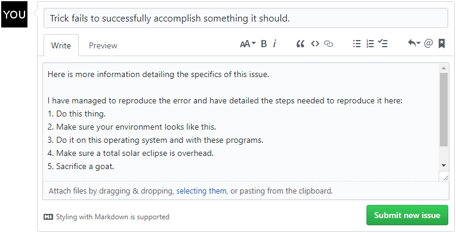
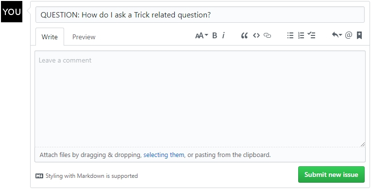

| [Home](/trick) → Frequently Asked Questions (FAQ) |
|-------------------------------------------------|

# Appendix
01. [What is Trick?](#whatistrick)
01. [Why should I use Trick?](#whyshouldiusetrick)
01. [What operating systems can Trick run on?](#whatoperatingsystemcantrickrunon)
    01. [Does Trick run on Windows?](#doestrickrunonwindows)
    01. [Which MacOSX package manager works best with Trick?](#whichmacosxpackagemanagerworksbestwithtrick)
01. [What is the current version of Trick?](#whatisthecurrentversionoftrick)
    01. [What are the differences between Trick versions?](#whatarethedifferencesbetweentrickversions)
01. [Can Trick interact with other applications?](#cantrickinteractwithotherapplications)
    01. [Does Trick work with MATLAB/Simulink?](#matlabsimulink)
    01. [Does Trick work with Core Flight Software (CFS)?](#coreflightsoftware)
01. [I found a bug with Trick, how do I tell someone?](#ifoundabugwithtrickhowdoitellsomeone)
01. [I have a question about Trick, where should I ask it?](#ihaveaquestionabouttrickwhereshouldiaskit)
01. [Why won't my Trick simulation compile?](#whywontmytricksimulationcompile)
01. [What units can Trick use?](#whatunitscantrickuse)
01. [Do I need internet access to build Trick?](#doineedinternetaccesstobuildtrick)
01. [Can I access class protected/private variables?](#caniaccessclassprotectedprivatevariables)
01. [Are there faster ways to implement events?](#aretherefasterwaystoimplementevents)
01. [Are there input file template limitations?](#arethereinputfiletemplatelimitations)
01. [Is Trick gluten-free, grass-fed, organic, non-GMO, environmentally conservative, free-range, vegan, and dolphin safe?](#istrickgfgfongmoecfrvads)

---
<a name="whatistrick"></a>

## What is Trick?
Trick is a simulation environment and toolkit that allows users to create complex physics simulations.

<a name="whyshouldiusetrick"></a>

## Why should I use Trick?
You should use Trick if you want to develop an accurate physics simulation without needing to develop core simulation capabilities manually. 

<a name="whatoperatingsystemcantrickrunon"></a>

## What operating systems can Trick run on?
Trick currently runs on all System V and POSIX compliant UNIX operating systems. MacOSX and most Linux distributions fall under this umbrella. 

<a name="doestrickrunonwindows"></a>

### Does Trick run on Windows?
Trick does not run natively on Windows, however it *is* possible to run Trick on the Windows 10 Linux Subsystem. Trick will not be ported to Windows until Windows is POSIX compliant, which is highly unlikely.

<a name="whichmacosxpackagemanagerworksbestwithtrick"></a>

### Which MacOSX package manager works best with Trick?
Homebrew.

<a name="whatisthecurrentversionoftrick"></a>

## What is the current version of Trick?
Trick 19 is the version currently being developed on GitHub. We also maintain a branch for Trick 15 and Trick 17.

<a name="whatarethedifferencesbetweentrickversions"></a>

### What are the differences between Trick versions?
Trick 15 marked the first iteration of an open source Trick Simulation Environment. Trick 17 has several bug fixes, new features, and is currently in active development; it should be used for all new simulation development.

<a name="cantrickinteractwithotherapplications"></a>

## Can Trick interact with other applications?
Trick is capable of interacting with other applications via the variable server; the variable server contains the values of a simulation which can then be sent over TCP/IP to a client application.

<a name="matlabsimulink"></a>

### MATLAB/Simulink
MathWorks developed a package to generate Trick friendly code from their models. An introduction video on Trick-MATLAB/Simulink interfacing can be found [here.](http://www.mathworks.com/videos/connecting-simulink-with-other-simulation-frameworks-86546.html)

<a name="coreflightsoftware"></a>

### Core Flight Software (CFS)
Trick and CFS can work together, but the software interfacing Trick and CFS is neither actively maintained nor open source.

<a name="ifoundabugwithtrickhowdoitellsomeone"></a>

## I found a bug with Trick, how do I tell someone?
Create an issue on GitHub [here](https://github.com/nasa/trick/issues/new). The more descriptive you are, the faster we can solve the issue.




<a name="ihaveaquestionabouttrickwhereshouldiaskit"></a>

## I have a question about Trick, where should I ask it?
Create an issue on GitHub [here](https://github.com/nasa/trick/issues/new) with "QUESTION: " appended to the title.




<a name="whywontmytricksimulationcompile"></a>

## Why won't my Trick simulation compile?
There are many reasons why a simulation will fail to compile properly.

01. Trick can't find your header files or source code.
02. You haven't properly set your environmental variables.
03. You haven't properly installed all required dependencies.

<a name="whatunitscantrickuse"></a>

## What units can Trick use?
Trick is capable of utilizing the vast majority of imperial and metric units. Trick uses the UDUNITS C library/database in its unit calculations. For a list of the most common units, run **trick-units** in a terminal window after installing Trick.

<a name="doineedinternetaccesstobuildtrick"></a>

## Do I need internet access to build Trick?
Trick's Java GUIs rely on several 3rd party .jar files which are normally downloaded during the initial compilation of Trick. If you are compiling on a machine without internet access you may copy the directory ${TRICK\_HOME}/libexec/trick/java/lib to a machine that does have internet access and run make on that machine.

<a name="caniaccessclassprotectedprivatevariables"></a>

## Can I access class protected/private variables?
If the Trick memory manager and init attribute function is made a friend of a class, we are able to access protected/private variables in the input file through the memory manager.

```c++
class A {
  // This class triggers Trick to process protected/private variables
  friend class InputProcessor ;
  // This friend function follows this naming convention "void init_attr ## <class_name>()"
  friend void init_attrA() ;
  private:
    int ii ;
} ;
```

Input File statements
```python
# Direct access will fail
my_sim_object.a.ii = 1  #fails
var = my_sim_object.a.ii  #fails

# Use the var_set and var_get commands to access protected/private variables
trick.var_set("my_sim_object.a.ii", 1)
var = trick.var_get("my_sim_object.a.ii")
```

<a name="aretherefasterwaystoimplementevents"></a>

## Are there faster ways to implement events?
Trick has a few alternatives to an input file event. Both method execute faster than a regular input processor event, but are not as flexible.

01.  [A Just in Time (JIT) input file](/trick/documentation/simulation_capabilities/JIT-Input-Processor.html) is C++ code that is
compiled and run during simulation execution.
02.  [Realtime Injection](/trick/documentation/simulation_capabilities/Realtime-Injector.html) stages variable assignments and executes them in bulk at the top of a software frame.

<a name="arethereinputfiletemplatelimitations"></a>

## Are there input file template limitations?
Trick input files understand a lot about templates, but there is a limitation when using them. Input files cannot access a fixed array of template types directly. There are memory manager calls accessible from the input file that may be used to to read and write arrayed templates.

```c++
template < typename T > class A {
  public:
    T t;
} ;

class B {
  public:
    A<double> a[4] ;
} ;
```
Here is an input file accessing the template type

```python
# direct access to arrayed template class will fail
my_sim_object.b.a[1].t = 1  # fails
var = my_sim_object.b.a[1].t = 2 # fails

# use these memory manager calls instead
trick.var_set("my_sim_object.b.a[1].t", 1)
var = trick.var_get("my_sim_object.b.a[1].t")
```

<a name="istrickgfgfongmoecfrvads"></a>

## Is Trick gluten-free, grass-fed, organic, non-GMO, environmentally conservative, free-range, vegan, and dolphin safe?
Yes.
