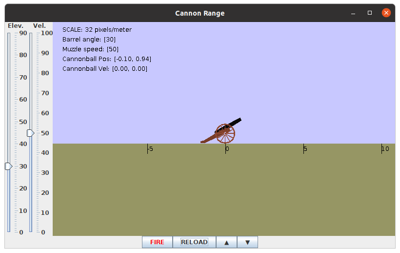

# How to "Containerize" Trick With Docker

This HOWTO assumes that we building our Docker images on a Linux system. If you're using
MacOS or Windows, the translation should hopefully be fairly straight forward.

**Contents**

* [Containerize a Basic Trick Environment](#containerize-a-basic-trick-environment)
* [Containerize a Trick Simulation](#containerize-a-trick-simulation)

***

## Prerequisites:

* Docker is installed on your machine.
* A basic familiarity with Docker. ["A Docker Tutorial for Beginners"](https://docker-curriculum.com) is an excellent way. 
* A basic familiarity with bash shell scripting.

## Create a Place to Build Our Docker Images

For this HOWTO we'll try to stay organized by first creating a directory in
which we can build our Docker images. Let's also create and environment
variable for this directory.

* Create the **DockerPlayGround** directory and **DOCKER_PLAYGROUND** environment variable.

```bash
mkdir DockerPlayGround
export DOCKER_PLAYGROUND="`pwd`/DockerPlayGround"
```
<a id=containerize-a-basic-trick-environment></a>
## Containerize a Basic Trick Environment

In this example we'll build a Docker image, based on Ubuntu 18.04, with Trick 19.5.1
installed.

### Dockerfile

```docker
# ------------------------------------------------------------------------------
# The image we are building with THIS Dockerfile is based on the ubuntu:18.04
# Docker image from dockerhub (hub.docker.com).
# ------------------------------------------------------------------------------
FROM ubuntu:18.04

# ------------------------------------------------------------------------------
# Install Trick Dependencies identified at
# https://nasa.github.io/trick/documentation/install_guide/Install-Guide#ubuntu
# ------------------------------------------------------------------------------
RUN apt-get update && apt-get install -y \
bison \
clang \
flex \
git \
llvm \
make \
maven \
swig \
cmake \
curl \
g++ \
libx11-dev \
libxml2-dev \
libxt-dev \
libmotif-common \
libmotif-dev \
python3-dev \
zlib1g-dev \
llvm-dev \
libclang-dev \
libudunits2-dev \
libgtest-dev \
openjdk-11-jdk \
zip

ENV PYTHON_VERSION=3

# ------------------------------------------------------------------------------
# Get Trick version 19.5.1 from GitHub, configure and build it.
# ------------------------------------------------------------------------------
# We want to clone Trick into the /apps directory of our image.
WORKDIR /apps
# Get the 19.5.1 branch (an official release) of Trick from Github.
RUN git clone -b 19.5.1 https://github.com/nasa/trick.git
# cd into the directory we just created and ..
WORKDIR /apps/trick
# configure and make Trick.
RUN ./configure && make

# ------------------------------------------------------------------------------
# Add ${TRICK_HOME}/bin to the PATH variable.
# ------------------------------------------------------------------------------
ENV TRICK_HOME="/apps/trick"
RUN echo "export PATH=${PATH}:${TRICK_HOME}/bin" >> ~/.bashrc

CMD ["/bin/bash"]
```

### Building the docker image:

* Create a directory for building this docker image:

  ```bash
  cd ${DOCKER_PLAYGROUND}
  mkdir TRICK_19_5_1
  cd TRICK_19_5_1
  ```

* Create a file named ```Dockerfile``` that contains the content listed above.

* Build the Docker image by executing: ```docker build --tag trick:19.5.1 .```

   :exclamation: This may take a few minutes.

* When the build completes, execute : ```docker images```.

   You should see a record of the image that you just created:

   ```
   REPOSITORY         TAG       IMAGE ID       CREATED        SIZE
   trick              19.5.1    1023a17d7b78   2 minutes ago  2.61GB
   ```

### Running the docker image:
To Instantiate a container from the image: ```docker run --rm -it trick:19.5.1```

You should see the bash shell prompt from your container. Something like:

```
root@8615d8bf75c5:/apps/trick#
```

Execute: ```ls``` at the prompt to see that it contains Trick.

```
CMakeLists.txt  Makefile                autoconf      configure  lib      test_overrides.mk trickops.py
CMakeModules.   README.md               bin           docs       libexec  test_sims.yml     trigger
CMakeTestFiles  TrickLogo.png           config.log    doxygen    share    trick_sims
LICENSE         TrickLogo_darkmode.png. config.status include    test     trick_source
root@8615d8bf75c5:/apps/trick#
```

This docker container contains a full Trick development environment. You can't run GUI applications on it but you can build a simulation.

<a id=containerize-a-trick-simulation></a>
## Containerize a Trick Simulation

### Prerequisites:

* The trick:19.5.1 docker image described above.

## Introduction

In this example, we'll create a docker image from which we can run (a version of) ```SIM_cannon_numeric```,
one of the variants of Trick's Cannon Ball simulation. This image will be based on the Trick:19.5.1 image the we previously built.

Our containerized simulation won't start any variable server clients like the sim-control panel or graphics clients,  because we can't easily run graphics clients from __within__ the container. But, we __can__ easily connect graphics clients running on the host machine to our containerized simulation.

### Creating a Docker friendly version of ```SIM_cannon_numeric```

* Create a directory for building this docker image:

   ```bash
   cd ${DOCKER_PLAYGROUND}
   mkdir SIM_cannon_docker_build
   cd SIM_cannon_docker_build
   ```
   
* Create a directory for our version of SIM_cannon.
   
   ```bash
   mkdir SIM_cannon_docker
   cd SIM_cannon_docker
   ```

* Copy the ```SIM_cannon_numeric``` **S_define** file into the current directory.
     
   ```bash
   curl -O https://raw.githubusercontent.com/nasa/trick/19.5.1/trick_sims/Cannon/SIM_cannon_numeric/S_define
   ```
   
* Copy ```SIM_cannon_numeric``` include files.

   ```bash
   curl --create-dirs --output models/cannon/gravity/include/cannon.h \
   https://raw.githubusercontent.com/nasa/trick/19.5.1/trick_sims/Cannon/models/cannon/gravity/include/cannon.h
   curl --create-dirs --output models/cannon/gravity/include/cannon_numeric.h \
   https://raw.githubusercontent.com/nasa/trick/19.5.1/trick_sims/Cannon/models/cannon/gravity/include/cannon_numeric.h
   ```
   
* Copy ```SIM_cannon_numeric``` source files.

   ```bash
   curl --create-dirs --output models/cannon/gravity/src/cannon_init.c \
   https://raw.githubusercontent.com/nasa/trick/19.5.1/trick_sims/Cannon/models/cannon/gravity/src/cannon_init.c
   curl --create-dirs --output models/cannon/gravity/src/cannon_numeric.c \
   https://raw.githubusercontent.com/nasa/trick/19.5.1/trick_sims/Cannon/models/cannon/gravity/src/cannon_numeric.c
   ```
   
* Create a file named ```S_overrides.mk ``` that contains the following content:

   ```make
   TRICK_CFLAGS   += -Imodels
   TRICK_CXXFLAGS += -Imodels
   ```
   
* Create and enter a directory named ```RUN_demo``` and enter it:

   ```bash
   mkdir RUN_demo
   cd RUN_demo
   ```

* Create a file named ```input.py ``` that contains the following content:

   ```python
   trick.real_time_enable()
   trick.exec_set_software_frame(0.1)
   trick.itimer_enable()
   trick.var_server_set_port(9001)
   ```
   
   :exclamation: Notice that we are NOT starting a SIM-control-panel, or the graphics client.
   
   :exclamation: Notice that we are explicitly setting the variable server listen port.


### The Graphics Client

   Even though the simulation won't be starting the graphics clients, we will be starting and connecting the graphics clients to the containerized simulation.

   * Download the graphics client's source and Makefile.
  
   ```bash
   cd ${DOCKER_PLAYGROUND}/SIM_cannon_docker_build/SIM_cannon_docker
   curl --create-dirs --output models/graphics/src/CannonDisplay.java \
   https://raw.githubusercontent.com/nasa/trick/19.5.1/trick_sims/Cannon/models/graphics/src/CannonDisplay.java
   curl --create-dirs --output models/graphics/Makefile \
   https://raw.githubusercontent.com/nasa/trick/19.5.1/trick_sims/Cannon/models/graphics/Makefile
   ```

   * Down-load the graphics client's sound files.

   There are two sound files necessary to build the graphics client, 1)  **CannonBoom.wav**, and 2) **Explosion.wav** .
   They both need to be placed into ```models/graphics/resources/```.
   
   * Create the resources directory.
   
   ```
   mkdir -p models/graphics/resources
   ```
   * Down-load the sound files.
   
   Unfortunately, binary files are more difficult to down-load from Github than text files. 
   
   For each, we have to go to their respective Github pages and click the "Download" button.
   
   * Download CannonBoom.wav from [here](https://github.com/nasa/trick/blob/master/trick_sims/Cannon/models/graphics/resources/CannonBoom.wav).
     
   * Download Explosion.wav  from [here](https://github.com/nasa/trick/blob/master/trick_sims/Cannon/models/graphics/resources/Explosion.wav).

:exclamation: When you download the wave files from Github, their names may be set to a flattened version of their full pathnames. So, we have to rename them to their real names.
      
   * Rename the down-loaded wave files to **CannonBoom.wav**, and **Explosion.wav** respectively, and move them both to ```models/graphics/resources/```.


* Build the cannon graphics client.

   ```bash
   cd ${DOCKER_PLAYGROUND}/SIM_cannon_docker_build/SIM_cannon_docker/models/graphics
   make
   ```

### Building the Docker Image


#### Dockerfile

```
# ------------------------------------------------------------------------------
# The image we are building with THIS Dockerfile is based on the trick:19.5.1
# Docker image that we built previously.
# ------------------------------------------------------------------------------
FROM trick:19.5.1

# ------------------------------------------------------------------------------
# Copy the simulation source code into the image and build it.
# ------------------------------------------------------------------------------
# Set current working directory to the directory where we want our SIM code.
WORKDIR /apps/SIM_cannon
# Copy the simulation source code from our (host) image-build directory into our
# image.
COPY SIM_cannon_docker .
# Build the SIM.
RUN /apps/trick/bin/trick-CP

# In out simulation, we decided to use port 9001 for our
# variable server port. We did this by adding
# "trick.var_server_set_port(9001)" to our input file.

#Expose the variable server port.
EXPOSE 9001/tcp

# Make a script to run SIM_cannon from the /apps directory.
RUN echo "#! /bin/bash" >> /apps/run_sim.sh
RUN echo "cd /apps/SIM_cannon" >> /apps/run_sim.sh
RUN echo "./S_main_Linux_7.5_x86_64.exe RUN_demo/input.py" >> /apps/run_sim.sh
RUN chmod +x /apps/run_sim.sh

CMD ["/apps/run_sim.sh"]
```

* Make sure you're in the right directory.

```bash
   cd ${DOCKER_PLAYGROUND}/SIM_cannon_docker_build
```

* Create a file named ```Dockerfile``` that contains the content listed above.

* Build the Docker image by executing: ```docker build --tag sim_cannon_docker .```

* When the build completes, execute : ```docker images```.

   You should see a record of the image that you just created:

   ```
   REPOSITORY          TAG       IMAGE ID       CREATED          SIZE
   sim_cannon_docker   latest    d4547502c2a4   13 seconds ago   2.61GB
   trick               19.5.1    1023a17d7b78   2 minutes ago    2.61GB
   ```
  
### Running the docker image:
To instanciate a container from the image: ```docker run --name misterbill --rm -P sim_cannon_docker &```

* In a host terminal (not in the container) execute: 
  
  ```bash
  docker port misterbill
  ```
  
to see what host-port container-port 9001 has been mapped to.

You should see something like:

```
     9001/tcp -> 0.0.0.0:32783
     9001/tcp -> [::]:32783
```

This shows that port 9001 in our container has been mapped to port 32783
on our host computer.  So, in this case we would connect our (host)
java client to port 32783.

To connect the CannonDisplay variable-server client to the containerized simulation:

```bash
java -jar SIM_cannon_docker/models/graphics/dist/CannonDisplay.jar <port> &
```

:warning: Don't just copy and paste. If you don't put the right port number it won't work.




* Click **RELOAD**. This re-initializes the cannon. Then click **FIRE**. The cannon will fire.
* Adjust the the controls on the left hand side of the graphics client.  **RELOAD** and **FIRE**.
* Do this until you're bored.

If Trick is installed on your host then you can also connect :

```bash
trick-simcontrol localhost <port> &
```

You can shut down the sim from the trick-simcontrol panel when you're done.
or if you don't have Trick installed, just use: ```docker kill misterbill```.

# THE END

