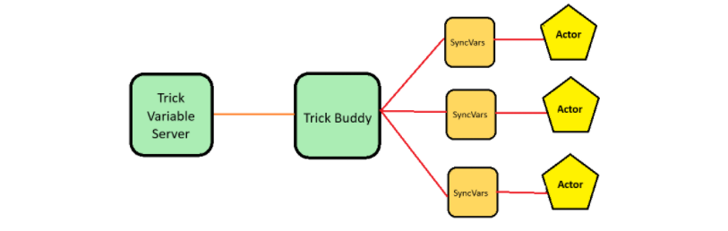
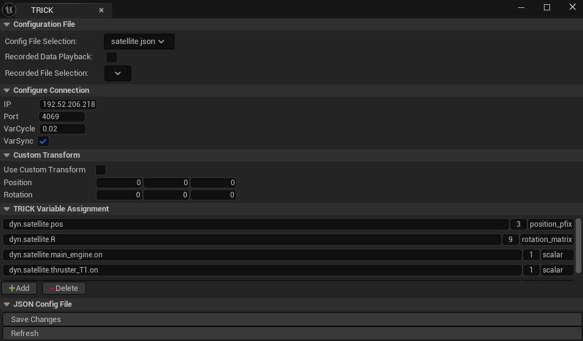
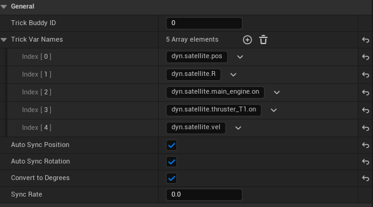
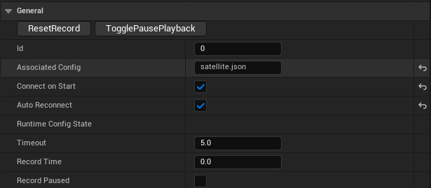

# How to connect a Trick sim to a Unreal Engine project
## Purpose & Overview
This document is to provide a  introduction into linking trick based sims with a unreal project. This guide requires the use of TUC which you must get from a "verified distributor". Towards the bottom are also some examples of more custom interfacing.

An unreal project called TRUE was developed to provide multiple examples of sims from the trick github adapted for unreal visualizations with TUC. If it is available it has code examples and pre setup enviornments for extending upon.

Unreal Engine 5.7 was utelized in the making of this guide. If you use a different version your process may be slightly different.


**Contents** 
* [Setting Up project](#setting-up-a-new-project--adding-plugin)
* [Adding tuc components](#adding-tuc-components)
* [Linking sim](#linking-sim)
* [Running sim](#running-sim)
* [Accessing values from c++ code](#optional-accessing-values-from-c-code)
* [Things to watch out for](#things-to-watch-out-for)


## Prerequisite Knowledge

* Completion of trick tutorial or understanding of the TVS
* Basic unreal engine knowledge
* Access to the TUC plugin for unreal


## Setting up a new project & Adding plugin
First to connect the sims you need , of course, a unreal engine project. You can modify and link an existing project or make a new one.
* Create UE project or use existing one.

<br>

After aquiring TUC add the plugin into your projects plugin folder. If your project does not have the folder you can just make one "Plugins". This is under your projects root directory.
* aquire TUC
* ensure "Plugins" folder exists

You need to reload your project after adding the plugin.

## Adding Tuc components
In the unreal editor after reopening your project there should be a new banner titled "Trick Unreal Connector". This banner allows you to modify the json file for TUC configuration through a GUI. You can also configure the TUC config directly through its json. 

_Example Banner_


<br>

You need 2 components to connect a trick sim with a ue project
1. Trick Buddy (Scene Component)
2. Sync Vars (Actor Component)

Only one trick buddy per project but you can use as many syncVars as needed. You add the trickbuddy through the "Place Actors" tab and syncVars through adding components to actors you want to be updated under the "Details" tab.
* Add trick buddy
* Add sync Vars to actors as needed

TrickBuddy handles sending commands and receiving the variable values from the trick variable server of the sim. Sync Vars will poll the FTrickVars and save it in a map for your actor to access and update its position/rotation automatically.

_Simple TUC connection Diagram_



## Linking sim
Click on the top trick header, it will open up a editor window for the tuc configuration: this is just a gui editor for a config json file. Change the ip , port, and trick variables to match the sim you are connecting to. You may consider making your trick sim utelize a specific port everytime to ensure the autoconnect works.

You can set a specific port for your trick sim's variable server by adding ``` trick.var_server_set_port(4069)``` to the sims input.py.

You can also specify the type of variable (position, rotation) This is important , without specifying the type of variable correctly, automatic positional and rotational updates will not work.

There are also built in conversions as trick sims usually use meters and ue5 is in cm requiring a *100 conversion. You can utelize these built in conversions by specifying the type as one of the following:

| Type | Conversion |
|---------------------|----------------|
|velocity_lunar |(x*100, -y*100, z*-100)|
|position_pfix  |(x*100, -y*100, z*100)|
|position_lunar |(y*100, -x*100, z*-100)|
|position_landerbody |(-x, y, z)|
|rotation_lunar| |
|rotation_pfix | |

<br>

If these conversion do not work for your application you can always grab the variables in your own script and modify it before applying the update to the actor: [explained here.](#optional-accessing-values-from-c-code)

<br>

_Example TUC Config_



Modify every sync Vars and make sure they have the correct variables needed to update the position and or rotation of the actor its attached to. The variables MUST match a variable in the json/editor for the TrickBuddy config or it will crash. Make sure to enable auto sync for position and rotation as needed. You can also enable custom transform, changing the position and rotation offset.

* Modify sync vars , enableing auto sync and variables

_Example syncVars details_



* on trick buddy enable auto reconnect and connect on start.

_Example trickBuddy details_



The sim should now be correctly configured.

## Running Sim
After starting the sim and the ue project, TUC should automatically connect to the trick variable server. You should see the actors update with the sim.

When packaging the sim you need to make sure the config is copied or else the trickBuddy cannot load the config json. This is done under : Project Settings -> Project - Packaging -> Additional non-asset directories to copy . Make sure to add the TRICKUnrealConnector folder to the list.

## (Optional) Accessing values from c++ code
Sometimes you may need to use the variables for more than just positional and rotational updates. You can still access the requested variables through the C++ code in ue. Below are some examples. 

**General code setup**
1. Get reference to sync vars or trick buddy
2. Get variable by name from FTrickVar map
3. Grab values from variable
4. Do something with it

<br>

**Example header import snippet from SIM_examples SIM_satellite**

You need to include both SyncVars and TRICKUnrealConnectorSubsystem to access , store, and utelize trick variables via c++. The subsystem has the struct for the FTrickVars and SyncVars stores the map/values.

    #include "SyncVars.h"
    #include "TRICKUnrealConnectorSubsystem.h"

**Example Code snippet from SIM_examples SIM_satellite**

In the code below we grab a FTrickVar from the sync vars map trickvars using the function get_variable. Then we can access its components to use in our conditionals: activating thrusters which are particle systems. This is just a example of how it could be used and may be different for your application.

    FTrickVar Uthruster_manager::get_variable(FString name){
	    return sync->TrickVars[name];
    }   

    void Uthruster_manager::update_thrusters(){ 
        //grab the thrusters on value  
        FTrickVar mainT = get_variable(var1); 
        FTrickVar rcsT = get_variable(var2); 

        //Main thrusters activate 
        if(mainT.Components.IsValidIndex(0)){ 
            if(mainT.Components[0] >= 1.0){ 
                thruster1->Activate(); 
                thruster2->Activate(); 
                thruster3->Activate(); 
            }else{ 

                thruster1->Deactivate(); 
                thruster2->Deactivate(); 
                thruster3->Deactivate(); 
            } 
        } 

        //RCS thrusters activate 
        if(rcsT.Components.IsValidIndex(0)){ 
            if(rcsT.Components[0] >= 1.0){ 
                thruster4->Activate(); 
                thruster5->Activate(); 
            }else{ 
                thruster4->Deactivate(); 
                thruster5->Deactivate(); 
            } 
        } 
    }


All you need to grab variables is a reference to a sync vars or trick buddy (preferably a sync vars).

You should include some kind of check to ensure the value you are trying to access exists , else you can crash your program.

## Things to watch out for
Below are some of the things mentioned throughout this guide to watchout for.

1. Make sure your trick buddy has the correct config.json name if you have multiple.

2. When accessing a trick variable value from c++ code include some kind of check to prevent an access error.

3. Make sure to enable auto sync for position and rotation for each actor your updating.

4. Ensure the type you give a variable in the json/editor has the correct modification. EX: position_pfix multiples your values by 100 and flips y.

5. Use only one trickbuddy per level or project

6. Limit fps of the project in project settings or else the utelization will be very high

7. Ensure the port is not blocked
