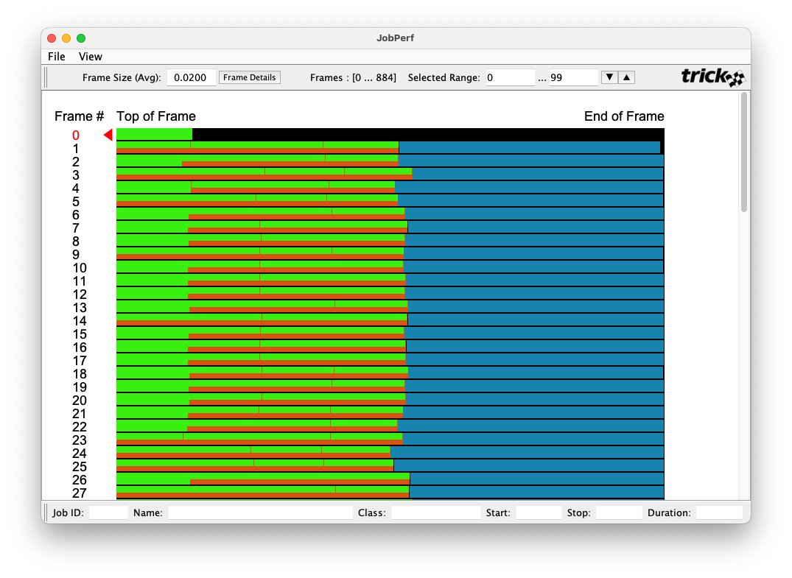
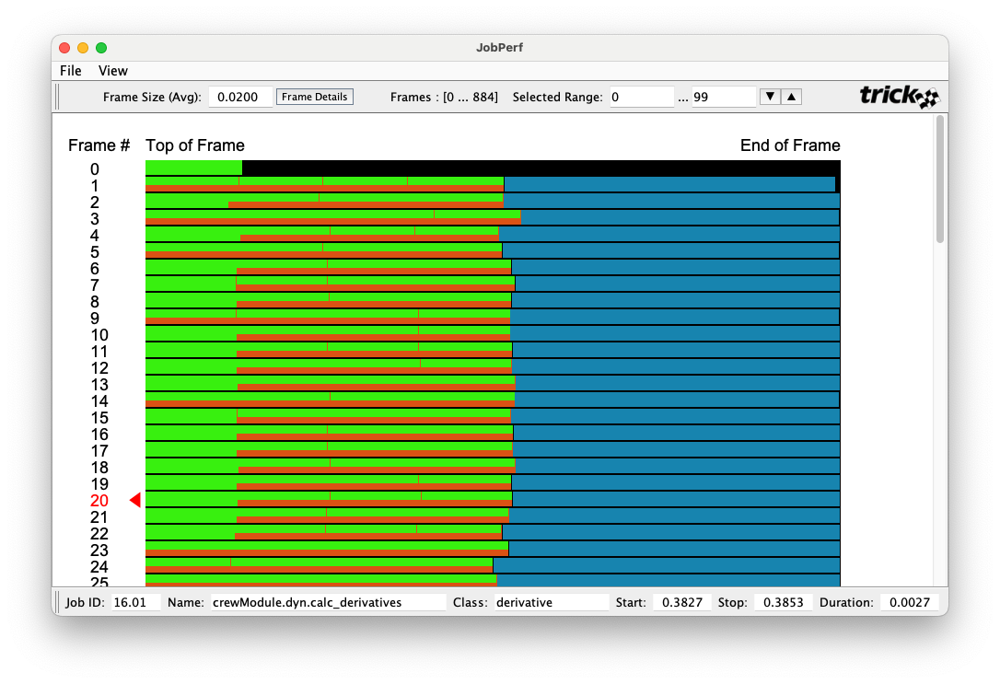
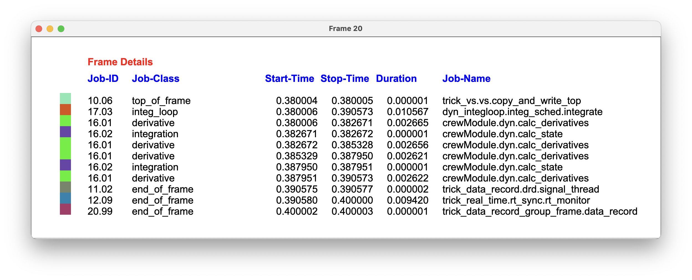
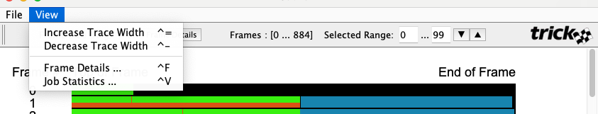
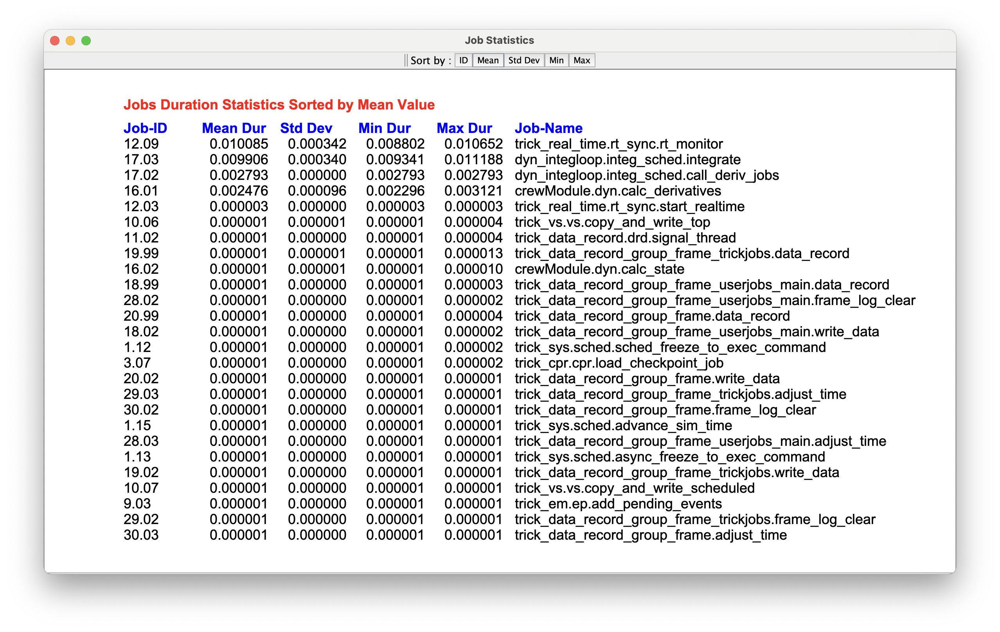

# trick-jperf

**Contents**

* [Purpose](#purpose)<br>
* [Introduction](#introduction)<br>
* [Prerequisite Knowledge](#prerequisite-knowledge)<br>
* [Recording Simulation Timeline Data](#recording-simulation-timeline-data)<br>
* [Running trick-jperf](#running-jperf)<br>
* [The trick-jperf GUI](#jperf-gui)<br>

---

<a id=purpose></a>
## Purpose
The purpose of this document is explain how to use **trick-jperf**.

<a id=introduction></a>
## Introduction

**trick-jperf** is a post-analysis tool that helps one to visualize and analyze the job execution time-line data of a real-time Trick simulation. 

Run interactively, trick-jperf graphically displays the job execution timeline of a realtime Trick simulation. The timeline is displayed as numbered job-frames, each containing (color-coded) jobs within those frames. One can display job statistics for the entire timeline or query the details of individually selected jobs or frames.

trick-jperf can also be run non-interactively from the command line to generate job-statistics reports.

---

<a id=prerequisite-knowledge></a>
## Prerequisite Knowledge
One should:

* Complete the [Trick Tutorial](https://nasa.github.io/trick/tutorial/Tutorial), and
* Read [Trick Realtime Best Practices](https://nasa.github.io/trick/howto_guides/Realtime-Best-Practices).

---

<a id=recording-simulation-timeline-data></a>
## Recording Simulation Timeline Data
**trick-jperf** requires timeline data from the simulation in question.

To collect this data, your simulation needs to run in real-time, with frame logging turn on. So, in your Trick sim's input file:

1. Enable realtime: ```trick.real_time_enable()```

2. Enable frame-logging: ```trick.frame_log_on()```

3. We also recommend that you disable itimers: ```trick.itimer_disable()```, or that you simply don't enable them. They are disabled by default. If they enabled when the timeline is collected, your frame boundaries will be ... sloppy.

--

<a id=the-timeline-data-file></a>
### The Timeline Data File

When you run your sim in real-time with frame logging enabled, a CSV file named ```log_newtimeline.csv``` will be generated in your sims ```RUN_``` directory. This file contains the timeline data for your sim's main thread.

#### Example:
```
jobID,startTime,stopTime
12.03, 0.000000, 0.000003
12.04, 0.000004, 0.000005
17.01, 0.000005, 0.000006
...
```

Each record in the time-line file consists of JobID, start-time, and stop-time.
The jobID is the same as the jobID's in the ```S_job_execution``` file. The start and stop times are ```real-time```, that is your simulation computer's system time.

If your simulation has child threads, time-line files will be generated for each of those as well. The first child thread's time-line data file will be named ```log_newtimelineC1.csv```, the second child thread ```log_newtimelineC2.csv``` nad so forth.

--

<a id=s_job_execution></a>
### ```The S_job_execution``` File

An ```The S_job_execution```, which is generated when your sim is run is also required by trick-jperf. It details the specifications of jobs running in your sim such as class, phase, ID, and name. This file is also required by trick-jperf.

---

<a id=running-jperf></a>
## Running trick-jperf

**trick-jperf** can run interactively with a GUI (the default) or non-interactively (batch). One might run in batch to automate generation of statistics reports, perhaps for continuuous integration.

### Command-Line Options
The following are the options for trick-jperf as displayed when one types ```trick-jperf --help```.

```
usage: trick-jperf [options] <file-name>

options: 
-h, --help
    Print this help text and exit.
-x, --nogui
    Don't run as a GUI application. Command line only.
-p, --report
    Write sorted job statics report to the terminal.
-s0, --sort=id
    Sort job statistics by identifier.
-s1, --sort=mean   [default]
    Sort job statistics by mean duration.
-s2, --sort=stddev
    Sort job statistics by standard deviation of duration.
-s3, --sort=min
    Sort job statistics by minimum duration.
-s4, --sort=max
    Sort job statistics by maximum duration.
```

#### Examples

Report job statistics to the terminal, sorting the output by mean (default) run time.
```% trick-jperf -x RUN_test/log_newtimeline.csv```

Report job statistics to the terminal, sorting the output by Job ID.
```% trick-jperf -x -s0 RUN_test/log_newtimeline.csv```


The default mode of JPerf is GUI / interactive mode.

```% trick-jperf RUN_test/log_newtimeline.csv```

---

<a id=jperf-gui></a>
## The trick-jperf GUI

```% trick-jperf RUN_test/log_newtimeline.csv```



In its main window **trick-jperf** graphically displays realtime software frames. The frame boundaries, that is **Top of Frame** and **End of Frame**, are where simulation time is synchronized to realtime. The jobs that run within frames are each represented as uniquely colored rectangles. The color assigned to each job is [customizable](#job-colors).

<a id=XXX></a>
### Frames Boundaries
Within the job-execution timeline, **trick-jperf** deduces the frame boundaries to be:

1. A non-top-of-frame job followed by a top-of-frame job, or
2. An end-of-frame job followed by a non-end-of-frame job.

&#9888; Take note these, as they can be useful in diagnosing certain kinds of bugs.

The average period between frame boundaries serves as an estimate of the simulation's intended **Frame Size**. This is initially displayed in the upper toolbar. It is used to scale the frames for rendering. If your sim is well behaved, this estimate will be accurate. If your sim has over-runs, the estimate will likely be off. In this case you can change it by entering your simulations's actual realtime software frame in the **Frame Size** text field.
 
The total number of frames in the timeline is displayed in the middle of the upper toolbar. From these, the **Selected Range** specifies the subset of frames to be rendered. Rendering a large number of frames at the one time can slow the responsiveness of the GUI.

The &#9660; and &#9650; buttons move the selected range forward and backward by 50.

<a id=XXX></a>
### Selecting Frames & Jobs

Left clicking on a job displays information about that job in the lower toolbar. In the following picture, we left clicked on a green box in frame 20. Looking at the lower toolbar we see that this "green job" represents the Job whose ID is 16.01, name is ```crewModule.dyn.calc_derivatives```, and job class is ```derivatiave```. 



On the left side of the display, the frame number is also selected. This is indicated by the red arrow pointing to red the frame number.

<a id=XXX></a>
### Frame Details

To get the details of the selected frame, we left-click the **Frame Details** button in the upper toolbar. This opens a window (shown below) with the details of frame 20. That is, it displays which and when each of the jobs within that frame were executed.



Frame Details can also be displayed using the **View** menu.



<a id=job-statistics></a>
### Job Statistics

From the **View** menu, we can also display run-time statistics for simulation jobs. 



In the toolbar, at the top of the window, are buttons to sort the table by different statistics. 

---

<a id=job-colors></a>
### Job Colors & How They Can Be Customized

Every Job is represented by a unique Color. Internally these associations are are stored as a Map of ```<JobID, Color>``` pairs, called the KeyedColorMap. Externally they are stored in a text file named ```IdToColors.txt```. Each row contains a job ID followed by RGB values.

```
9.03,149,247,37
17.01,24,96,254
19.02,247,74,230
17.02,138,109,140
17.03,219,82,20
20.99,171,55,105
18.99,228,154,65
...
```

When Jperf is run, it looks for a ```IdToColors.txt``` file in the same directory as the timeline file. If it exists, then it's read into the KeyedColorMap.

Jperf then checks the that every job ID in the timeline file has an associated color in the KeyedColorMap. If it doesn't, then a unique color is generated. The ```<JobID, Color>``` pair are then added to the KeyedColorMap.
When timeline processing is complete, the contents of the KeyedColorMap are written to the ```IdToColors.txt``` file.

Since the ```IdToColors.txt``` file is just a text file, it can be customized to use the colors you prefer.

--------------------------------------

