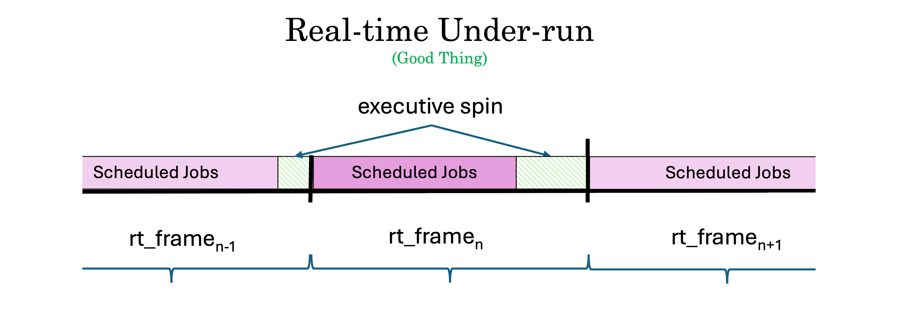
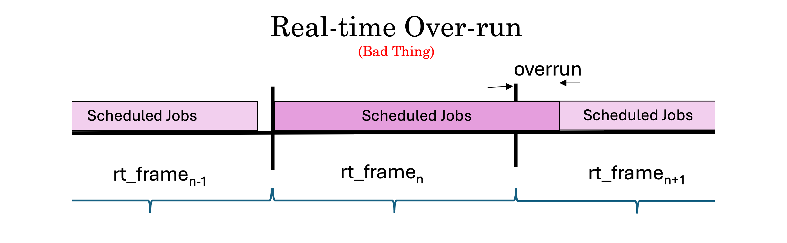
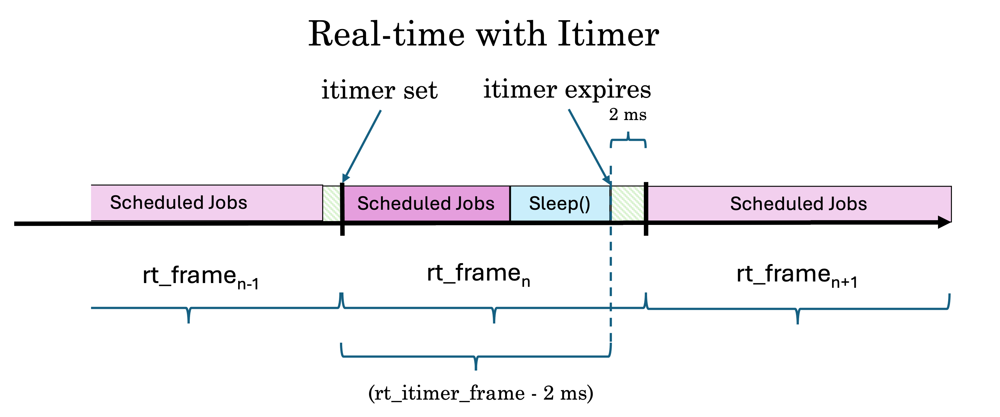
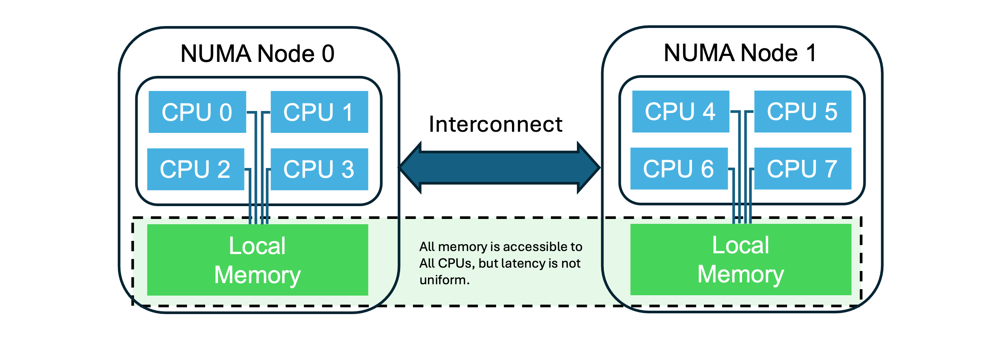

# Trick Realtime Best Practices

**Contents**

* [Purpose](#Purpose)<br>
* [Prerequisite Knowledge](#prerequisite-knowledge)<br>
* [Do's, Don'ts and Wisdom](#guidelines)<br>

<a id= introduction></a>

---
## Purpose
The intention of this document is to compile and share practical knowledge, based on the experience of people in the Trick simulation community regarding the development of realtime computer simulations.

<a id=prerequisite-knowledge></a>
## Prerequisite Knowledge
(Assuming you've completed the [Trick Tutorial](https://nasa.github.io/trick/tutorial/Tutorial))

---

<a id=simulation-time-vs-realtime></a>
### Simulation Time vs Realtime

Real world dynamic systems change in realtime (the time that you and I experience). A simulated dynamic system changes in simulation time. Simulation time begins at t=0, and runs until we stop it. Simulation time can elapse faster or slower than realtime.

If we want to interact with a simulation as if it were real, we need to synchronize simulation time to realtime. This requires that a simulation is capable of running at least as fast as realtime. If it is incapable, then it can not be made to run in realtime.

---

<a id=realtime-clock></a>
### Realtime Clock
* By default, the Trick realtime scheduler will synchronize to the system clock:
	* ```clock_gettime(CLOCK_REALTIME,…)``` [Linux]
	* ```gettimeofday()``` [Mac OS]

* The Trick realtime scheduler can also be configured to synchronize to a [custom realtime clock](https://nasa.github.io/trick/documentation/simulation_capabilities/Realtime-Clock).

---

<a id=enabling-realtime></a>
### Enabling Realtime

Trick tries to consistently and repetitively execute its scheduled math models to completion within some predetermined realtime interval for an indefinite period. This realtime interval is called the **realtime software frame**.

To enable realtime synchronization, call ```trick.real_time_enable()``` in the input file.

[Ref: Realtime](https://nasa.github.io/trick/documentation/simulation_capabilities/Realtime)

---

<a id=realtime-software-frame></a>
### Realtime Software Frame
The realtime software frame determines how often Trick will synchronize simulation time to the realtime clock.  Simulation time will run as fast as it can in the intervals between realtime synchronizations.

To set the realtime software frame, call the following in the input file:

```python
trick.exec_set_software_frame(double time)
```
[Ref: Software Frame](https://nasa.github.io/trick/documentation/simulation_capabilities/Executive-Scheduler#software-frame)

---

<a id=under-runs-and-over-runs></a>
### Under-runs and Over-runs

An **under-run** occurs when the Trick executive finishes running all of its scheduled jobs, between synchronizations to the realtime clock. This is a **good thing**. In this case the executive will enter a spin loop, waiting for the next realtime frame to start.

<a id=figure-realtime-under-run></a>


An **over-run** occurs if the executive does not finish running all of its scheduled jobs. This is a **bad-thing**. In this case, the executive will immediately start the next frame in an attempt to catch up.

<a id=figure-realtime-over-run></a>


---

<a id=itimers></a>
### Itimers ( Being Nice to Other Processes On Your System )

During real time under runs you may want to release the processor for other tasks to use instead of spinning waiting for the clock. Trick provides a realtime sleep timer based on itimers. You might think of it as a “snooze button”.

To enable itimers call ```trick.itimer_enable()``` from the input file.

With itimer_enabled, the simulation will sleep() after completing the jobs scheduled for the current frame. The itimer will then wake the sim 2ms before the realtime frame is to expire.  The executive will spin for the final 2ms. The 2ms spin is there because an itimer interval is not guaranteed to be perfectly precise.

<a id=figure-Realtime-with_itimer></a>


[Ref: Itimer](https://nasa.github.io/trick/documentation/simulation_capabilities/Realtime-Timer)

---

<a id=frame-logging></a>
### Frame-Logging ( Critical For Improving Sim Performance )

The failure of a simulation to meet its scheduling requirements can have many causes. To aid in solving these problems, Trick can gather simulation performance data, called **frame-logging** by calling:

```trick.frame_log_on()```

in your sim's input file.

Note that frame logging will add some overhead to a simulation as each job is timed and recorded.

[Ref: Frame-Logging](https://nasa.github.io/trick/documentation/simulation_capabilities/Frame-Logging)

<a id=frame-log-files></a>
#### Frame Log Files
Frame logging records the following data files in your sim’s RUN_ directory:

* [```log_frame.trk```](#log-frame-trk)<br>
* [```log_frame_trickjobs.trk```](#log-frame-trickjobs-trk)
* [```log_frame_userjobs_main.trk```](#log-frame-userjobs-main-trk)
* [```log_timeline.csv```](#log-timeline-csv)
* [```log_timeline_init.csv```](#log-timeline-csv)

Note that **main** in this file name refers to the main thread.
If child threads (for example: C1, C2, ...) have been specified in the sim then frame log files for those threads will also be created ( that is:```log_trick_frame_userjobs_C1.trk```, ```log_trick_frame_userjobs_C2.trk```, ```...```).

---

<a id=log-frame-trk></a>
#### ```log_frame.trk```
* Number of fields per record : 5

|#  | Name | Type | Units | Description |
|--:|:---- |:-----|:-----:|-------------|
| 1| ```sys.exec.out.time```                  | double | seconds |Simulation Time |
| 2| ```trick_real_time.rt_sync.frame_time``` | double | seconds | This badly named parameter expresses the amount of time that the scheduled jobs in this frame took to execute. See: [figure](#figure-realtime-under-run)|
|3| ```trick_real_time.rt_sync.frame_overrun ``` | double | seconds | The magnitude of the current overrun. See: [figure](#figure-realtime-over-run) |
|4| ```JOB_data_record_group_frame_userjobs.data_record...``` | double | s | How long the write job for the user Jobs data recording group took. |
|5| ```JOB_data_record_group.trickjobs...``` | double | seconds | How long did the write job for the Trick Jobs data recording group take. |

---

<a id=log-frame-userjobs-main-trk></a>
#### ```log_frame_userjobs_main.trk```
* Number of fields per record : 1 + *#user-jobs*

|#  | Name | Type | Units | Description |
|--:|:---- |:-----|:-----:|-------------|
| 1| ```sys.exec.out.time```                  | double | seconds |Simulation Time |
| n| *user-job-name* | double | seconds |How long the user-job took to execute. |

---

<a id=log-frame-trickjobs-trk></a>
#### ```log_frame_trickjobs.trk```
* Number of fields per record : 1 + *#trick-jobs*

|#  | Name | Type | Units | Description |
|--:|:---- |:-----|:-----:|-------------|
| 1| ```sys.exec.out.time```                  | double | seconds |Simulation Time |
| n| *trick-job-name* | double | seconds |How long the trick-job took to execute. |

<a id=log-timeline-csv></a>
#### ```log_timeline.csv``` & ```log_timeline_init.csv```
These files contain start and stop times for each of the jobs executed in a trick sim.
```log_timeline.csv``` contains times for jobs run during run-time. ```log_timeline_init.csv``` contains times for jobs run at initialization time.

Frankly this format is **weird**, but it contains useful information.
It's weird because of its redundancy, and that each job timing "record" consists of four CSV lines. 

Both files have the same format. They contain three columns, of ```float``` formatted numbers representing (in order, left to right):

1. time-stamp
2. trick job ID
3. user job ID
 
Each record consists of four rows in the CSV file representing the start and stop times of a job.

|row#|time-stamp|trick-job-id|user-job-id|
|---:|---:|---:|---:|
|4xRecord#+0|start-job-time|0|0|
|4xRecord#+1|start-job-time|trick job id|user-job-id|
|4xRecord#+2|stop-job-time|trick-job-id|user-job-id|
|4xRecord#+3|stop-job-time|0|0|

If **trick** job ID is non-zero, then the **user** job ID will be zero, and vice versa.
Within any four line record the job-ID will be recorded twice.

##### Example

The following is one four-line record from a ```log_timeline.csv``` file.

```
...
0.000026,0,0
0.000026,16.010000,0
0.000027,16.010000,0
0.000027,0,0
...
```
The first line of the record indicates that **some** job started at time=0.000026 seconds. It's not until the second line of the record that you find that the start time (0.000026) refers to the job with ID=16.01. The third line in the record indicates that the job with ID=16.01 stopped at 0.000027. The fourth line redundantly conveys that **some** job stopped at 0.000027. (I told you it was weird.)

To match the job ID's with the job names, see the ```S_job_execution``` file.

### Analyzing the Frame Log Files
There are several ways we can examine/ analyze the data logged in these files.

#### [trick-DP](https://nasa.github.io/trick/tutorial/ATutPlottingData)
When you build your Trick sim, the following data-product files are created for you to plot your sim's frame log data.

* ```DP_rt_frame.xml```
* ```DP_rt_timeline.xml```
* ```DP_rt_timeline_init.xml```
* ```DP_rt_trickjobs.xml```
* ```DP_rt_userjobs.xml```

#### [koviz](https://github.com/nasa/trick/koviz)
**koviz** Is an open-source project for plotting Trick data-recording files. It's particularly good for Monte Carlo data plotting. It also has a nifty feature for processing frame-log files. Not only can it plot them, but ```% koviz -rt RUN_directory``` will generate a report that will list the top 10 spikes in your frame log.

**TIP:**`` ```trick_real_time.rt_sync.rt_monitor``` (the Trick realtime monitor) should show the max job time. If not, you might have problems to solve.

---

### Other Useful Files Generated by a Trick Sim Run

| Name | Desscription|
|:-----|:------------|
|```RUN_*/S_job_execution```| Lists the simulation jobs by Name, Job ID, Trick Thread ID (PID) Job class, Phase, Start time, Stop time, Cycle, and whether the job is enabled.|
|```RUN_*/S_run_summary ```|(Should be called build_summary) - Documents the name and path of the executable and the input file, the build time of the simulation executable, and the Trick version. It also contains the list of environment variables used when the simulation was built and the model versions.|
|```RUN_*/send_hs ```|the end of this file contains run statistics that may be useful.|

---

### Trick Executive Scheduler

The
 [Executive Scheduler](https://nasa.github.io/trick/documentation/simulation_capabilities/Executive-Scheduler) determines how, when, and where (which CPU) the jobs in your Trick sim are executed.


* [Job Control](https://nasa.github.io/trick/documentation/simulation_capabilities/Executive-Scheduler#job-control) - describes the Trick job control interface.
* [Thread Control](https://nasa.github.io/trick/documentation/simulation_capabilities/Executive-Scheduler#thread-control)  - describes the attributes and behaviors of different Trick thread types.  

Thread control will in some cases require that you isolate CPUs at boot-time. This is usualy done with the **isolcpus** boot parameter:

```isolcpus= cpu_number[, cpu_number,...]```

Ref: [RedHat: Isolating CPUs Using tuned-profiles-realtime](https://access.redhat.com/documentation/en-us/red_hat_enterprise_linux_for_real_time/7/html/tuning_guide/isolating_cpus_using_tuned-profiles-realtime)


<a id=guidelines></a>
## Do's, Don'ts, and Wisdom

---
### 1 Trick
---

#### 1.1 Trick events are computationally expensive. Use them judiciously.

Trick events can provide a quick and easy way to customize the behavior of a sim, based on some condition. But, because they require Python interpretation, they are slow. They are not intended for implementation of permanent sim functionality. If they are over used, they can seriously degrade simulation performance. So, take it easy with the events.

See [Event Manager](https://nasa.github.io/trick/documentation/simulation_capabilities/Event-Manager).

#### 1.2 Disable Trick run-time components that your sim doesn't need.

```default_trick_sys.sm```, the file included at the top of any Trick ```S_define``` file defines numerous "modules" that provide functionality to a Trick sim. Whereas some of these modules ( like the Executive, MemoryManager, CommandLineArguments) are required for any Trick Simulation to function, many are optional. If the modules are not needed, then disabling them can improve simulation performance.

Inserting one or more of the ```#define``` statements listed below to the top of the ```S_define```, just before  the inclusion of ```default_trick_sys.sm``` will disable those modules.

```
#define TRICK_NO_EXECUTIVE
#define TRICK_NO_MONTE_CARLO
#define TRICK_NO_MEMORY_MANAGER
#define TRICK_NO_CHECKPOINT_RESTART
#define TRICK_NO_SIE
#define TRICK_NO_COMMANDLINEARGUMENTS
#define TRICK_NO_MESSAGE
#define TRICK_NO_INPUTPROCESSOR
#define TRICK_NO_VARIABLE_SERVER
#define TRICK_NO_DATA_RECORD
#define TRICK_NO_REALTIME
#define TRICK_NO_FRAMELOG
#define TRICK_NO_MASTERSLAVE
#define TRICK_NO_INSTRUMENTATION
#define TRICK_NO_INTEGRATE
#define TRICK_NO_REALTIMEINJECTOR
#define TRICK_NO_ZEROCONF
#define TRICK_NO_UNITTEST
```
##### Example
Using "SIM_submarine" as an example, the following demonstrates disabling unneeded ```default_trick_sys.sm``` modules.

```
/************************************************************
PURPOSE:
    ( Simulate a submarine. )
LIBRARY DEPENDENCIES:
    ((submarine/src/Submarine.cpp))
*************************************************************/
#define TRICK_NO_MONTE_CARLO
#define TRICK_NO_MASTERSLAVE
#define TRICK_NO_INSTRUMENTATION
#define TRICK_NO_REALTIMEINJECTOR
#define TRICK_NO_ZEROCONF
#define TRICK_NO_UNITTEST
#include "sim_objects/default_trick_sys.sm"

##include "submarine/include/Submarine.hh"

class SubmarineSimObject : public Trick::SimObject {
    public:

    ...
```

#### 1.3 Consider running Trick variable server clients and Sims on different machines.
Trick variable server clients communicate with a simulation via a TCP/IP connection.
The client process may, but isn't required to, run on the same machine as your simulation process. On the same machine, both will competing for the same resources. This can degrade sim performance, especially when clients are rendering high-definition graphics.


#### 1.4 Compile Trick and Trick sims with optimizations turned on

Example :
In my ```S_overrides.mk``` file, I'll add the "-O2" optimization flag.

```
TRICK_CFLAGS += -Imodels -O2
TRICK_CXXFLAGS += -Imodels -O2
```

See:

* [GCC Optimization Options](https://gcc.gnu.org/onlinedocs/gcc/Optimize-Options.html)
* [Clang Optimization Options](https://clang.llvm.org/docs/CommandGuide/clang.html#code-generation-options)


#### 1.5 Disable unused jobs in Trick sims

Jobs can be enabled and disabled from the input file with the following commands:

```
trick.exec_get_job(<job_name>, <instance_num>).enable()
trick.exec_get_job(<job_name>, <instance_num>).disable()
```

Alternatively, we can use:

```
trick.exec_set_job_onoff(<job_name>, <instance_num>, True|False)
```

If a job isn't necessary for a particular RUN scenario, consider disabling it. But, make sure that it doesn’t impact the rest of the sim.

##### Example:

Suppose ```SIM_submarine```'s S_define file contains the job ```submarine.diagnostics```:

```
...
(0.1, "scheduled")          submarine.diagnostics();
...
};
SubmarineSimObject dyn;
...
```
This job only transmits information. It doesn't affect the simulation, but does degrade realtime performance slightly. To disable it, we'll add the following to our input file:

```trick.exec_get_job("dyn.submarine.diagnostics", 0).disable()```


#### 1.6 Name the child threads in your Trick sim
Do this for easier identification of time spikes.

```trick.exec_get_thread(<thread_id>).set_name(<name>)```

##### Example:

In ```SIM_lander's``` ```S_define```, suppose we specify that ```lander.control()``` job is to run in thread 1 (C1):

``` C1  (0.1, "scheduled")          lander.control() ;```

Then in the input file, we add:

```trick.exec_get_thread(1).set_name("LanderControl")```

to name the C1 thread "LanderControl".


#### 1.7 Use ```default_data``` jobs to specify the default sim state. Customize it with the input file.

Prefer ```default_data``` jobs as the **primary** means of initializing your sim. Then, **customize** the default for different scenarios, with an input file. Try to make your sim capable of initializing to a valid state with an empty input file.

Doing this has several benefits.

1. The sim will initialize faster because ```default_data``` jobs are compiled rather that interpreted.

2. If you can test and confirm that your base, default, "empty input file" sim is initialized to a valid state, then it will be easier to identify errors when the sim is customized for different scenarios, via an input file. It saves time and reduces pain.

---
### 2. User Simulation Software
---

#### 2.1 Don't read from the disk during run-time.
Disk access is slow. If you need to read from disk, do it in a ```default_data```, or ```initialization``` job.


#### 2.2 Try to reduce variation in job cycle times.
Realtime performance is largely about minimizing the worst case, rather than the average case.
The most well behaved job takes the same amount of time, every time.


#### 2.3 Minimize dynamic memory allocation during run-time
The time to dynamically allocate memory can vary, and in the worst-case is unbounded. This is bad for realtime performance.


#### 2.4 Allow the compiler to help you find problems

Modern compilers have gotten very helpful, and can check for a lot of potential problems.
Many people are familiar with the compiler warning options like ```-Wall```, ```-Wextra```, and ```-Wshadow```. Be aware that there are a lot more, to help you find problems:

* [GCC Warning Options](https://gcc.gnu.org/onlinedocs/gcc/Warning-Options.html)
* [CLANG Warning Options](https://clang.llvm.org/docs/DiagnosticsReference.html)


#### 2.5 Fix All Compiler Warnings And Errors
Many a time the necessary clue needed to solve an intractable problem was there all along, in the form of an unheeded warning that scrolled by unseen.

Don't ignore the messages.

When Trick builds a sim, it generates the files, ```MAKE_out``` and ```MAKE_err``` in the ```build``` directory. These files contain the makefile output of the sim build. It's a good idea to check these for warnings on a big sim build.

---
### 3. Hardware
---

#### 3.1 Know Your Simulation Machine Architecture
Getting the best performance from a simulation on a multi-CPU machine requires understanding of the machine's hardware architecture. Particularly important is data transfer delay from memory to the CPU (latency). Depending on the machine architecture, and how data processing is allocated across CPUs, the time used for memory access, and therefore simulation performance can very significantly.

##### Uniform Memory Access (UMA)
Uniform memory access (UMA) is a multi-processor model in which all processors share the physical memory uniformly. All memory accesses have the same latency.


In an UMA architecture, as the number of CPUs increases, the higher the chance that the system bus will become a bottle-neck.

##### Non Uniform Memory Access (NUMA)
Non-Uniform Memory Access (NUMA) is a multiprocessor model in which each processor is connected to dedicated memory but may access memory attached to other processors in the system. A NUMA architecture is one in which accesses to different addresses may have different latencies depending on where the data is stored. NUMA essentially connects UMA elements via a data-transfer interconnect. For best performance, applications should be “NUMA aware”.



On a Linux system the following will display the available nodes, CPUs, memory, and a normalized measure of access latency between nodes.

```% numactl --hardware```

##### Example 1
```
available: 1 nodes (0)
node 0 cpus: 0 1 2 3 4 5 6 7 8 9 10 11 12 13 14 15 16 17 18 19
node 0 size: 63986 MB
node 0 free: 54389 MB
node distances:
node   0
  0:  10
```
This computer has one NUMA node with 20 CPUs, and 64 Gigabytes.

##### Example 2
```
available: 2 nodes (0-1)
node 0 cpus: 0 1 2 3 4 5 6 7 8 9 10 11 24 25 26 27 28 29 30 31 32 33 34 35
node 0 size: 15371 MB
node 0 free: 3926 MB
node 1 cpus: 12 13 14 15 16 17 18 19 20 21 22 23 36 37 38 39 40 41 42 43 44 45 46 47
node 1 size: 16120 MB
node 1 free: 4504 MB
node distances:
node   0   1 
  0:  10  21 
  1:  21  10 
```
This computer has two NUMA nodes, each with 24 CPUs, and each with about 16 gigabytes of local memory, for a total of 32 Gigabytes. The "distances" matrix at the bottom tells us that memory access latency between the nodes is (21/10) = 2.1 times the latency within a node.


#### 3.2 Turn Off Any Energy-Efficiency Settings
Energy efficiency and performance are usually trade-offs. Turn off any energy-efficiency settings the computer may have enabled, usually in the BIOS.


#### 3.3 Fewer, Faster Cores Are Preferable to More, Slower Cores
For simulation hosts, fewer but faster cores is usually preferable to more but slower cores

* **Server-class** machines are designed for throughput.
* **Performance** machines are designed for low latency, high-speed computing.


#### 3.4 Buy More Memory
Insufficient random access memory (RAM) leads to virtual memory page swapping, which degrades realtime performance. More RAM is one of the easiest and cheapest ways of boosting machine performance.


#### 3.5 Avoid Intel “Efficiency” Cores
Intel "efficiency" cores aren’t currently recognized by most Linux OS’s and will cause a lot of problems. They are more energy efficient, but slower, the opposite of what hard realtime needs. RHEL8 is unable to determine which cores are “E” (Efficiency) and which are “P” (Performance). Did I mention you should buy more memory?

---
### 4. Network
---

#### 4.1 Have Multiple Network Interface Jacks On Sim Machines
Isolate all sim-to-sim traffic to one network interface. Leave the other for connections to the box and OS traffic.


#### 4.2 Use One Master Clock For All Machines On The Network
All clocks will drift apart unless periodically synchronized. Synchronization means that one of the clocks must be the reference, or "master". Multiple unsynchronized clocks in a realtime system is nightmare fuel.

---
### 5. Miscellaneous
---

#### 5.1 Maintain a history of simulation performance.

Maintain a performance history of your sim as development procedes. This can be very useful evidence in solving problems. Begin frame logging the sim even before implementing realtime.


#### 5.2 Take care when "tuning" operating system behavior
Overriding the OS by isolating CPUs, assigning threads to CPUs, redirecting interrupts, changing priorities, and so forth can be powerful techniques to improve performance, but with the same power they can degrade it. Modern operating systems are pretty good at managing performance. If you decide to "help" the OS, you’ll need to know what you’re doing. Take the time to study up first.  

Some useful learning material:

* [Challenges Using Linux as a Real-Time Operating System](https://ntrs.nasa.gov/api/citations/20200002390/downloads/20200002390.pdf)
* [Optimizing RHEL 8 for Real Time for low latency operation](https://access.redhat.com/documentation/en-us/red_hat_enterprise_linux_for_real_time/8/html-single/optimizing_rhel_8_for_real_time_for_low_latency_operation/index)

#### 5.3 Don’t isolate CPU 0
Nothing good can come from this.


#### 5.4 Best Performance Requires Root Privileges

Ways to give root privilege to sim:

1. Run as root ( Don't )
2. Change owner of executable to root and set user id bit

Use ```sudo``` command to give root privileges to the simulation executable using ```chown``` and ```chmod``` commands.

```
chown root S_main_${TRICK_HOST_CPU}.exe
chmod 4775 S_main_${TRICK_HOST_CPU}.exe
```
