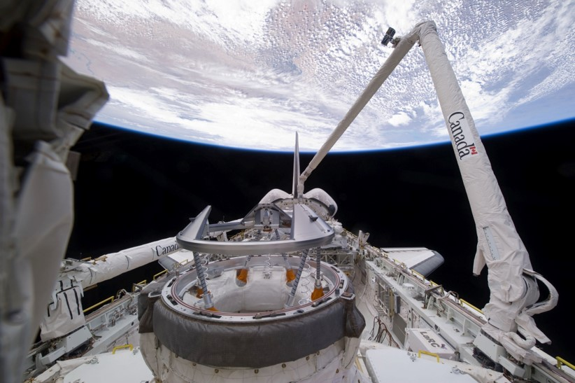
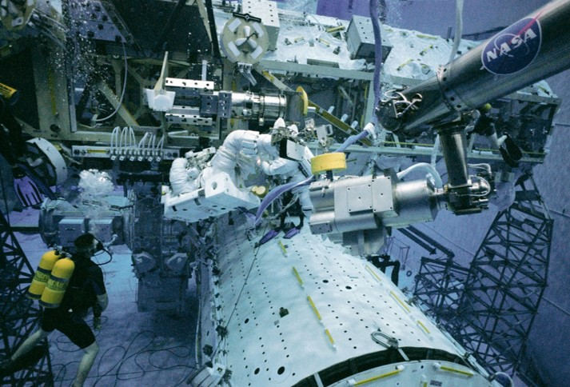
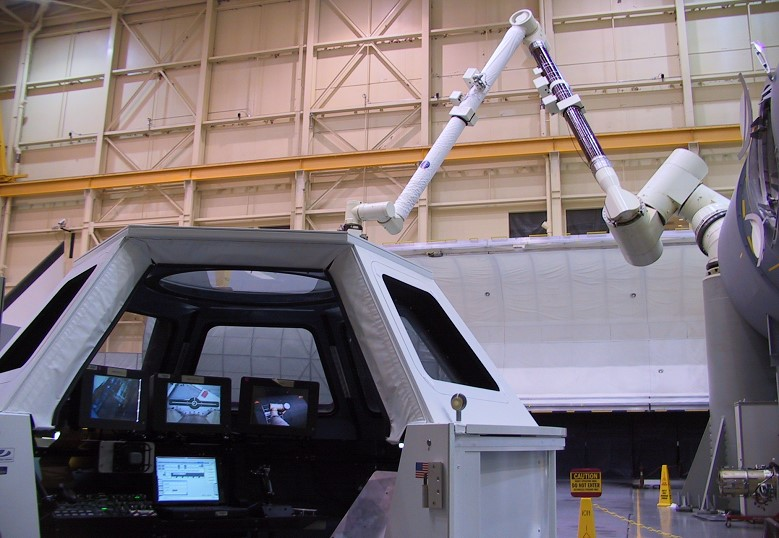
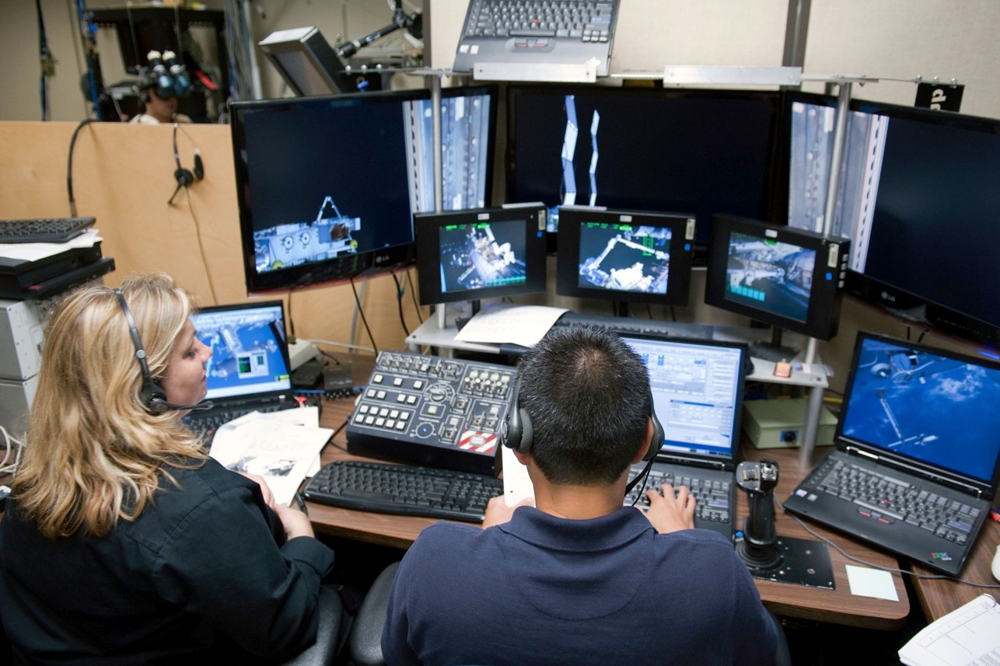
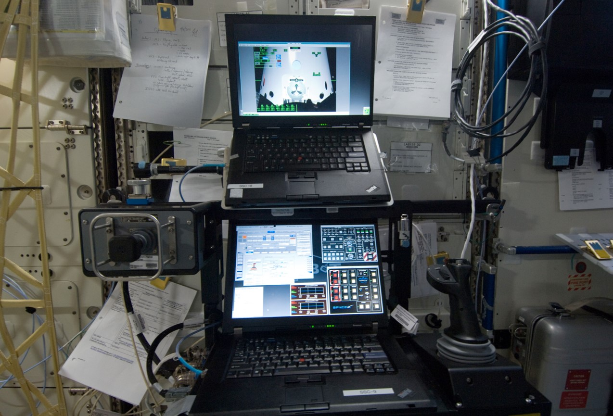
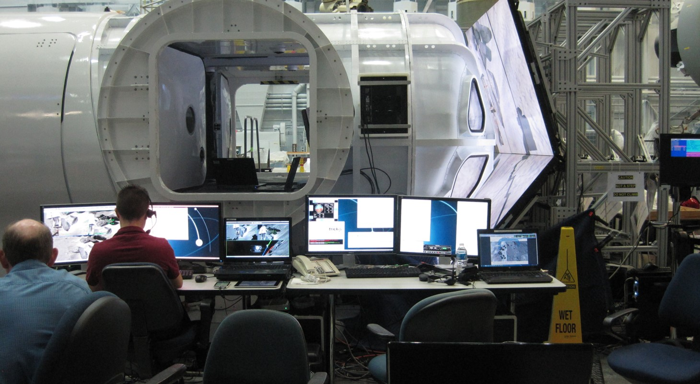
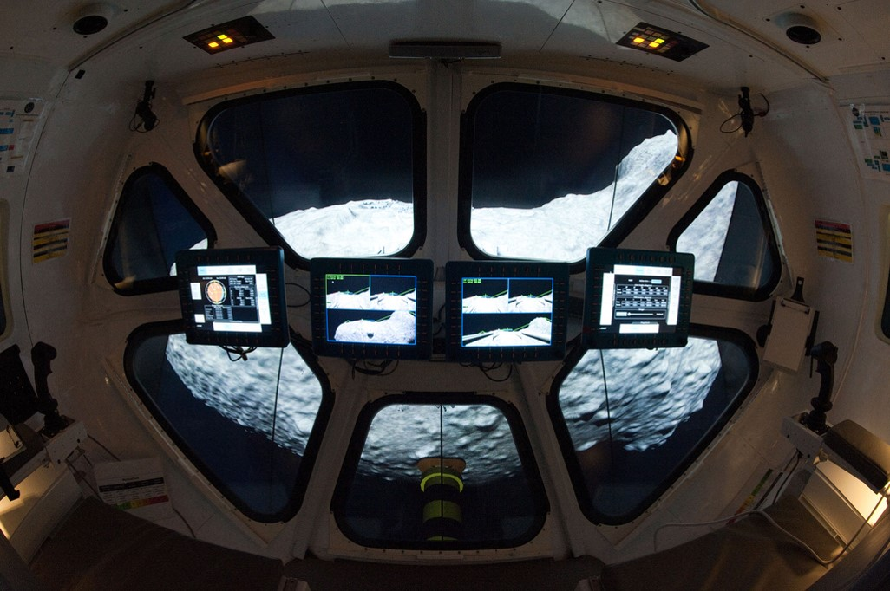

| [Home](Home) → Related Projects |
|---------------------------------|

# Open Source Projects

### [Trick Variable Server Connection](https://github.com/SMASH-Lab/trick_variable_server_connection)
Provides a set of C functions to connect and interact with the Trick variable server.

### [Input Device Framework](https://github.com/nasa/IDF)
Provides an infrastructure for interfacing software with physical input devices.

# NASA Projects

## Shuttle Remote Manipulator System (SRMS)

In the early 1990s, the Software, Robotics, and Simulation Division (ER) at the NASA Johnson Space Center developed Trick as a framework to support operational performance evaluations of the Shuttle Remote Manipulator System (also known as Canadarm). The SRMS simulation allowed engineers to prototype and test SRMS flight software, perform dynamic load analysis, and assisted in both ground and in-flight training. SRMS hardware-in-the-loop simulations are used in both the Neutral Buoyancy Lab (NBL) and the Multi-Use Remote Manipulator Development Facility (MRMDF).

## Systems Engineering Simulator (SES)

[Systems Engineering Simulator (SES)](images/SES.jpg)

The Systems Engineering Simulator (SES) is a real-time, crew-in-the-loop engineering simulator for the space station and other advanced programs. The SES allows NASA engineers to physically model a given Trick simulation and provides a more realistic working environment for training astronauts. The SES has been used to create training environments for space shuttle simulations, SRMS simulations, ISS simulations, and Mars rover simulations, among others.

## Virtual Reality Laboratory

The Virtual Reality Laboratory is an immersive training facility that provides real-time graphics and motion simulators integrated with a tendon-driven robotic device to provide the kinesthetic sensation of the mass and inertia characteristics of large objects. A virtual 3D technical mockup of the ISS allows training astronauts to experience '0G' movement while seated. 

## Robotics On-Board Trainer (ROBoT)

The Robotics On-Board Trainer (ROBoT) is an on-orbit version of the ground-based Dynamics Skills Trainer (DST) that astronauts use for training on a frequent basis.

## Multi-Mission Space Exploration Vehicle (MMSEV)

The Multi-Mission Space Exploration Vehicle (MMSEV) is a modular space vehicle concept that utilizes Trick for training simulations. MMSEV is designed to be an adaptable and versatile vehicle used for both space and surface exploration.

