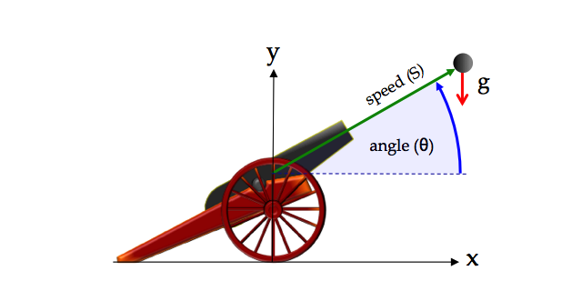
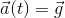
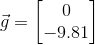
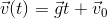
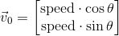
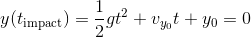
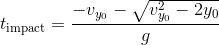

| [Home](/trick) → [Tutorial Home](Tutorial) → A Simple Simulation |
|----------------------------------------------------------------|

<!-- Section -->
<a id=simulating-a-cannonball></a>
## A Simple (non-Trick) Simulation

**Contents**

* [Cannonball Problem Statement](#cannonball-problem-stated)<br>
* [Modeling The Cannonball](#modeling-the-cannonball)<br>
* [A Cannonball Simulation (without Trick)](#a-cannonball-simulation-without-trick)<br>
  - [Listing 1 - **cannon.c**](#listing_1_cannon.c)
* [Limitations Of The Simulation](#limitations-of-the-simulation)<br>

***

In this tutorial, we are going to build a cannonball simulation. We will start out with
a non-Trick-based simulation. Then we will build a Trick-based simulation. Then we
will make incremental improvements to our Trick-based simulation, introducing new
concepts as we go.

The commands following `%` should typed in and executed.

---
 
<a id=cannonball-problem-stated></a>
### Cannonball Problem Statement



**Figure 1 Cannonball**

Determine the trajectory and time of impact of a cannon ball that is fired 
with an initial speed and initial angle. Assume a constant acceleration of
gravity (g), and assume no aerodynamic forces.

---
<a id=modeling-the-cannonball></a>
### Modeling the Cannonball

For this particular problem it's possible to write down equations that
will give us the position, and velocity of the cannon ball for any time (t).
We can also write an equation that will give us the cannon ball’s time of impact.

The cannonball’s acceleration over time is constant. It's just the acceleration of gravity:



On earth, at sea-level, g will be approximately -9.81 meters per second squared.
In our problem this will be in the y direction, so:



Since acceleration is the derivative of velocity with respect to time, the
velocity [ v(t) ] is found by simply anti-differentiating a(t). That is:



where the initial velocity is :



The position of the cannon ball [ p(t) ] is likewise found by anti-differentiating
v(t).


Once we specify our initial conditions, we can calculate the position and
velocity of the cannon ball for any time t.

Impact is when the cannon ball hits the ground, that is when the cannonball’s
y-coordinate again reaches 0.



Solving for t (using the quadratic formula), we get the time of impact:



---
<a id=a-cannonball-simulation-without-trick></a>
### Code For a non-Trick Cannonball Simulation

<a id=listing_1_cannon.c></a>
**Listing 1 - cannon.c**

```c
/* Cannonball without Trick */

#include <stdio.h>
#include <math.h>

int main (int argc, char * argv[]) {

    /* Declare variables used in the simulation */
    double pos[2]; double pos_orig[2] ;
    double vel[2]; double vel_orig[2] ;
    double acc[2];
    double init_angle ;
    double init_speed ;
    double time ;
    int impact;
    double impactTime;

    /* Initialize data */
    pos[0] = 0.0 ; pos[1] = 0.0 ;
    vel[0] = 0.0 ; vel[1] = 0.0 ;
    acc[0] = 0.0 ; acc[1] = -9.81 ;
    time = 0.0 ;
    init_angle = M_PI/6.0 ;
    init_speed = 50.0 ;
    impact = 0;

    /* Do initial calculations */
    pos_orig[0] = pos[0] ;
    pos_orig[1] = pos[1] ;
    vel_orig[0] = cos(init_angle)*init_speed ;
    vel_orig[1] = sin(init_angle)*init_speed ;

    /* Run simulation */
    printf("time, pos[0], pos[1], vel[0], vel[1]\n" );
    while ( !impact ) {
        vel[0] = vel_orig[0] + acc[0] * time ;
        vel[1] = vel_orig[1] + acc[1] * time ;
        pos[0] = pos_orig[0] + (vel_orig[0] + 0.5 * acc[0] * time) * time ;
        pos[1] = pos_orig[1] + (vel_orig[1] + 0.5 * acc[1] * time) * time ;
        printf("%7.2f, %10.6f, %10.6f, %10.6f, %10.6f\n", time, pos[0], pos[1], vel[0], vel[1] );
        if (pos[1] < 0.0) {
            impact = 1;
            impactTime = (- vel_orig[1] - 
                          sqrt(vel_orig[1] * vel_orig[1] - 2.0 * pos_orig[1])
                         ) / -9.81; 
            pos[0] = impactTime * vel_orig[0];
            pos[1] = 0.0;
        }
        time += 0.01 ;
    }

    /* Shutdown simulation */
        printf("Impact time=%lf position=%lf\n", impactTime, pos[0]);

    return 0;
}
```

If we compile and run the program in listing 1:

```bash
% cc cannon.c -o cannon -lm
% ./cannon
```

we will see trajectory data, followed by:

```
Impact time=5.096840 position=220.699644
```
Voila! A cannonball simulation. So why do we need Trick!?

---
 
<a id=limitations-of-the-simulation></a>
### Limitations of the Simulation

For simple physics models like our cannonball, maybe we don't need Trick, but many real-world problems aren't nearly as simple.

* Many problems don't have nice closed-form solutions like our
cannon ball simulation. Often they need to use numerical integration methods,
to find solutions.

* Changing the parameters of our cannon ball simulation, requires that we modify
and recompile our program. Maybe that's not a hardship for a small
simulation, but what about a big one? Wouldn't it be nice if we could change our
simulation parameters, without requiring any recompilation?

* What if we want to be able to run our simulation in real-time? That is, if
we want to be able to synchronize simulation-time with "wall clock" time.

* What if we want to interact with our simulation while its running?

* What if we want to record the data produced by our simulation over time?

In the next section, we'll see how a Trick simulation goes together, and how it helps us to easily integrate user-supplied simulation models with commonly needed simulation capabilites.

---
[Next Page](ATutArchitecture)
