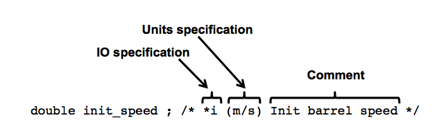

| [Home](/trick) → [Tutorial Home](Tutorial) → Analytical Cannon Simulation |
|-------------------------------------------------------------------------|

<!-- Section -->
<a id=building-and-running-a-trick-based-simulation></a>
# Building & Running a Trick-based Simulation

**Contents**

   * [Organizing the Simulation Code in Directories](#organizing-the-simulation-code-in-directories)<br>
   * [Representing the Cannonball](#representing-the-cannonball)<br>
     - [Listing 2 : **cannon.h**](#listing_2_cannon_h)<br>
     - [The Input/Output (I/O) Specification](#the-input_output-io-specification)<br>
     - [Units Specification](#units-specification)<br>
   * [Initializing the Cannonball Simulation](#initializing-the-cannonball-simulation)<br>
     - [Listing 3 : **cannon_init.c**](#listing_3_cannon_init_c)<br>
   * [Updating the Cannonball State Over Time](#updating-the-cannonball-state-over-time)<br>
     - [listing 4 : **cannon\_analytic.h**](#listing_4_cannon_analytic_h)<br>
     - [listing 5 : **cannon\_analytic.c**](#listing_5_cannon_analytic_c)<br>
   * [Cannonball Cleanup And Shutdown](#cannonball_cleanup_and_shutdown)
     - [listing 6 : **cannon\_shutdown.c**](#listing_6_cannon_shutdown_c)<br>
   * [The Simulation Definition File (S_define)](#simulation-definition-file)<br>
     - [listing 7 : **S_define**](#listing_7_s_define)<br>
   * [Compiling, and Building the Simulation](#compiling-and-building-the-simulation)<br>
     - [Listing 8 : **S_overrides.mk**](#listing_8_s_overrides.mk)
   * [Running the Simulation](#running-the-simulation)<br>
     - [Listing 9 : **input.py**](#listing_9_input_py)

***

In this and subsequent sections, we're going to build and run a Trick-based cannonball simulation.

---
 
<a id=organizing-the-simulation-code-in-directories></a>
### Organizing the Simulation Code in Directories

We'll begin by creating a directory system to hold our simulation source code:

```bash
%  cd $HOME
%  mkdir -p trick_sims/SIM_cannon_analytic
%  mkdir -p trick_sims/SIM_cannon_analytic/models/cannon/src
%  mkdir -p trick_sims/SIM_cannon_analytic/models/cannon/include
```

---
 
<a id=representing-the-cannonball></a>
### Representing the Cannonball

To represent the cannonball model, we need to create a header file (**cannon.h**)
that will contain:

* A CANNON structure to hold the state of the cannonball, and
* Prototypes for cannonball functions

The CANNON data-type contains the cannonball's initial conditions,
its acceleration, velocity, and position, the model time, whether the cannonball
has impacted the ground, and the time of impact.

The prototypes will declare two functions for initializing our CANNON data-type.
We'll discuss these in the next section.

<a id=listing_2_cannon_h></a>
**Listing 2 - `cannon.h`**

```c
/*************************************************************************
PURPOSE: (Represent the state and initial conditions of a cannonball)
**************************************************************************/
#ifndef CANNON_H
#define CANNON_H

typedef struct {

    double vel0[2] ;    /* *i m Init velocity of cannonball */
    double pos0[2] ;    /* *i m Init position of cannonball */
    double init_speed ; /* *i m/s Init barrel speed */
    double init_angle ; /* *i rad Angle of cannon */

    double acc[2] ;     /* m/s2 xy-acceleration  */
    double vel[2] ;     /* m/s xy-velocity */
    double pos[2] ;     /* m xy-position */

    double time;        /* s Model time */

    int impact ;        /* -- Has impact occured? */
    double impactTime;  /* s Time of Impact */

} CANNON ;

#ifdef __cplusplus
extern "C" {
#endif
    int cannon_default_data(CANNON*) ;
    int cannon_init(CANNON*) ;
    int cannon_shutdown(CANNON*) ;
#ifdef __cplusplus
}
#endif

#endif
```

#### Creating The `cannon.h` Header File

Using your favorite text editor, create and save the file `cannon.h` from
**Listing 2**. We will assume from this point that your favorite text editor
is **vi**. So when you see **vi** following the %, just replace it
with **emacs**, **nedit**, **jot**, **wordpad**, **kate**, **bbedit**, or
whatever you like.

```bash
% cd $HOME/trick_sims/SIM_cannon_analytic/models/cannon/include
% vi cannon.h
```

Type, or cut and paste the contents of **Listing 2** and save.

<a id=deciphering-the-trick Comments In The Header File></a>
### Deciphering The Trick Comments In The Header File

In the file above, note the comments at the top, and to the right of each
structure member. These are specially formatted comments that are parsed by Trick.

The comment at the top of the file, containing the keyword `PURPOSE:` (the colon
is part of the keyword) is called a "Trick header". The presence of a Trick
header lets Trick know that it should scan the file to collect information about 
the data types it contains. The full Trick header syntax will be detailed later, for
now, `PURPOSE:` is all that is necessary.

To the right of each structure member is a comment that (optionally) provides
the following information for the member:

1. Input/Output Specification
2. Units Specification
3. Description

These are each described in **Figure 2** and in the sections below.



**Figure 2 - Data Member Comments**

---
 
<a id=the-input_output-io-specification></a>
#### The Input/Output (I/O) Specification

An I/O specification is an optional field that specifies data flow
direction for a variable. The default, `*io` , specifies that both input and
output are allowed.

* `*i` tells Trick that the parameter will be input only.
* `*o` tells Trick that the parameter is output only.
* `*io` is the default and means the parameter may be used for input or output.
* `**` tells Trick that you do NOT want this parameter processed.

---

#### Comment Field
The comment field is extracted and used in GUI tools to describe variables.

---

<a id=units-specification></a>
#### Units Specification
A unit specification indicates the units of measure for a variable. For example,
in the figure above, (m/s) indicates that `init_speed` is a measure of meters
per second. Unit specs allow unit conversions to be performed by the Trick input
file processor, Trick View and plotting tools.

As of Version 17.0, Trick uses [UDUNITS2](http://www.unidata.ucar.edu/software/udunits/),
an Open Source unit conversion package, developed at http://www.unidata.ucar.edu.
It is similar in many respects to Trick's previous unit conversion package, but,
frankly it's a lot better. Like the previous Trick unit conversion package,
UDUNITS2 supports unit-prefixes (for example: kilo, micro, etc.) as well as
unit-composition, the ability to compose unit specifications from previously
defined unit specifications (for example: m/s, kg.m/s^2). Unlike the previous
unit conversion, its units database is much more substantial, it's more
extensible, its design is more capable, and it supports Unicode characters in
unit specifications. 

Below, we are going to see how to specify commonly needed unit specifications
for our Trick simulations. But, we are not going to describe the full capability
of UDUNITS2 package. In order to see **ALL** available unit definitions, one would
need to look at the UDUNITS2 xml files that comprise the units database.

Rather than requiring that, the [Common Units & Unit Prefixes](ATutUnitTables) page
lists optional prefixes, and many of the most commonly used units in simulations
at the Johnson Space Center Engineering Branch.

#### Composite Units (Making Units From Existing Units)
Often, units are composed of other predefined units as in the following unit
specification examples:

* **m/s** (meters per second, speed)
* **m/s^2** (meters per second squared, acceleration)
* **kg.m/s^2** (Newtons, force)
* **m^3** (cubic meters, volume)

Note the operators `/` (division), `.`(multiplication), `^2`(square), and
`^3`(cube) for composing unit specs.
 
#### Scaling Units With Unit Prefixes

Unit prefixes, listed in the table `Unit Prefixes`, below can also be prepended
to unit specifications, as in the following examples:

* **k**m, **kilo**meters
* **M**W, **mega**watts

#### Unicode Characters in Units

Some units and unit-prefixes can also be represented using unicode characters.

For example:

* **^2** can instead be represented as **&#xB2;** (Unicode char U+00B2).
* **^3** can instead be represented as **&#xB3;** (Unicode char U+00B3).
* The prefix **micro**, or **u** can be represented as **&#x3BC;** (Unicode
char U+03BC).
* The unit **ohms** can be represented as **&#x2126;** (Unicode char U+2126
or U+03A9).

So, one could specify **m/s&#xB2;** rather than **m/s^2**, or  **m&#xB3;**
rather than **m^3**, or **&#x3BC;m** rather than **micrometers**. The table below
lists Unicode characters that can be used in units specifications.

<a id=unicode-characters-used-in-units-specifications></a>
### Unicode Characters Used in Units Specifications
| Character | Unicode Number | Unicode Name          | 
|-----------|----------------| ----------------------|
| &#xB0;    | U+00B0         | Degree Sign           |
| &#xB2;    | U+00B2         | Superscript Two       |
| &#xB3;    | U+00B3         | Superscript Three     |
| &#x3A9;	  | U+03A9         | Greek Capital Letter Omega |
| &#x3BC;   | U+03BC         | Greek Small Letter Mu |
| &#x3C0;   | U+03C0         | Greek Small Letter Pi |
| &#x2032;  | U+2032         | Prime                 |
| &#x2033;  | U+2033         | Double Prime          |
| &#x2103;  | U+2103         | Degree Celsius        |
| &#x2109;  | U+2109         | Degree Fahrenheit     |
| &#x2126;  | U+2126         | Ohm Sign              |
| &#x212A;  | U+212A         | Kelvin Sign           |
| &#x212B;  | U+212B         | Angstrom Sign         |

#### Specifying "No Units"

In Trick, a unit specification of "--" means *unit-less*. If your variable
doesn't have units, use "--" as the unit specification.

---
 
<a id=initializing-the-cannonball-simulation></a>
### Initializing the Cannonball Simulation

The Trickless simulation performed a two-part initialization of the
simulation variables. The first part assigned default values to the simulation
parameters. The second part performed calculations necessary to initialize the
remaining simulation variables.

Trick based simulations perform a three-part initialization of simulation
variables. The first part runs "**default-data**" jobs, that is, it calls one or
more user-provided C functions, whose purpose is to set default values for the
simulation's variables. In the second initialization step, Trick executes the
simulation's Python "**input file**". Variable assignments can be made in the input file. 
If a parameter value isn't set in the input file, its default value is used. In the third and final
initialization step, Trick runs "**initialization**" jobs. These perform any
final initialization calculations, needed prior to running the sim.

The two functions in the listing below will serve as the default-data and
initialization jobs for our cannonball simulation. These are the functions for
which we created the prototypes in the cannon.h header file. 

We'll create the python input file in a later section.

<a id=listing_3_cannon_init_c></a>
**Listing 3 - `cannon_init.c`**

```c
/******************************* TRICK HEADER ****************************
PURPOSE: (Set the initial data values)
*************************************************************************/

/* Model Include files */
#include <math.h>
#include "../include/cannon.h"

/* default data job */
int cannon_default_data( CANNON* C ) {

    C->acc[0] = 0.0;
    C->acc[1] = -9.81;
    C->init_angle = M_PI/6 ;
    C->init_speed  = 50.0 ;
    C->pos0[0] = 0.0 ;
    C->pos0[1] = 0.0 ;

    C->time = 0.0 ;

    C->impact = 0 ;
    C->impactTime = 0.0 ;

    return 0 ;
}

/* initialization job */
int cannon_init( CANNON* C) {
   
    C->vel0[0] = C->init_speed*cos(C->init_angle);
    C->vel0[1] = C->init_speed*sin(C->init_angle);

    C->vel[0] = C->vel0[0] ; 
    C->vel[1] = C->vel0[1] ; 

    C->impactTime = 0.0;
    C->impact = 0.0;

    return 0 ; 
}
```

Some important things to note:

* These are just C functions. Trick will have them compiled, and linked into the simulation
executable.

* Both functions' arguments have a pointer to the CANNON data-type which was defined in `cannon.h`.

* Both functions return an **int**. Returning 0 indicates success. Non-zero indicates failure. 
The return values can optionally be used (by setting trick\_ret in the S\_define) to terminate the simulation. 

```bash
% cd $HOME/trick_sims/SIM_cannon_analytic/models/cannon/src
% vi cannon_init.c
```

Type in the contents of **Listing 3** and save.

<a id=updating-the-cannonball-state-over-time></a>
### Updating The Cannonball State Over Time

Trick's job scheduler provides a **"Scheduled"** job type for periodically calling functions when the sim is in RUN (cyclic) mode. 

In the case of our cannonball simulation, where there is an analytical solution, we can
calculate the the cannonball state by evaluating a function at each time step.

<a id=listing_4_cannon_analytic_h></a>
**Listing 4 - `cannon_analytic.h`**

```c
/*************************************************************************
PURPOSE: ( Cannon Analytic Model )
**************************************************************************/
#ifndef CANNON_ANALYTIC_H
#define CANNON_ANALYTIC_H
#include "cannon.h"
#ifdef __cplusplus
extern "C" {
#endif
int cannon_analytic(CANNON*) ;
#ifdef __cplusplus
}
#endif
#endif
```

```bash
% cd $HOME/trick_sims/SIM_cannon_analytic/models/cannon/include
% vi cannon_analytic.h
```

Type in the contents of **Listing 4** and save.

<a id=listing_5_cannon_analytic_c></a>
**Listing 5 - `cannon_analytic.c`**

```c
/*****************************************************************************
PURPOSE:    ( Analytical Cannon )
*****************************************************************************/
#include <stdio.h>
#include <math.h>
#include "../include/cannon_analytic.h"

int cannon_analytic( CANNON* C ) {

    C->acc[0] =  0.00;
    C->acc[1] = -9.81 ;
    C->vel[0] = C->vel0[0] + C->acc[0] * C->time ;
    C->vel[1] = C->vel0[1] + C->acc[1] * C->time ;
    C->pos[0] = C->pos0[0] + (C->vel0[0] + (0.5) * C->acc[0] * C->time) * C->time ;
    C->pos[1] = C->pos0[1] + (C->vel0[1] + (0.5) * C->acc[1] * C->time) * C->time ;
    if (C->pos[1] < 0.0) {
        C->impactTime = (- C->vel0[1] - sqrt( C->vel0[1] * C->vel0[1] - 2 * C->pos0[1]))/C->acc[1];
        C->pos[0] = C->impactTime * C->vel0[0];
        C->pos[1] = 0.0;
        C->vel[0] = 0.0;
        C->vel[1] = 0.0;
        if ( !C->impact ) {
            C->impact = 1;
            fprintf(stderr, "\n\nIMPACT: t = %.9f, pos[0] = %.9f\n\n", C->impactTime, C->pos[0] ) ;
        }
    }
    /*
     * Increment time by the time delta associated with this job
     * Note that the 0.01 matches the frequency of this job
     * as specified in the S_define.
     */
    C->time += 0.01 ;
    return 0 ;
}
```

This routine looks much like the routine found in our Trick-less simulation. It
is the piece that was surrounded by a while-loop. Underneath, Trick will
surround this job with its own while-loop. As in the case of the `cannon_init()`
routine, there is nothing particularly special about `cannon_analytic()`. It is
just another C function that will be compiled into an object, and later, linked
with a number of libraries to create a simulation executable.

```bash
% cd $HOME/trick_sims/SIM_cannon_analytic/models/cannon/src
% vi cannon_analytic.c
```

Type in the contents of **Listing 5** and save.

<a id=cannonball_cleanup_and_shutdown></a>
### Cannonball Cleanup And Shutdown

**shutdown** job types are called by Trick's job scheduler when the simulation ends.
These types of jobs are for doing anything that one might want to do at the end of a simulation, like releasing resources, or doing some final result calculation, or maybe just printing a message.

In our case we're just going to print the final cannon ball state.

<a id=listing_6_cannon_shutdown_c></a>
**Listing 6 - `cannon_shutdown.c `**

```c
/************************************************************************
PURPOSE: (Print the final cannon ball state.)
*************************************************************************/
#include <stdio.h>
#include "../include/cannon.h"
#include "trick/exec_proto.h"

int cannon_shutdown( CANNON* C) {
    double t = exec_get_sim_time();
    printf( "========================================\n");
    printf( "      Cannon Ball State at Shutdown     \n");
    printf( "t = %g\n", t);
    printf( "pos = [%.9f, %.9f]\n", C->pos[0], C->pos[1]);
    printf( "vel = [%.9f, %.9f]\n", C->vel[0], C->vel[1]);
    printf( "========================================\n");
    return 0 ;
}
```

```bash
% cd $HOME/trick_sims/SIM_cannon_analytic/models/cannon/src
% vi cannon_shutdown.c
```

<a id=simulation-definition-file></a>
## The Simulation Definition File (S_define)

To automate the build process of a Trick based simulation, Trick needs to
know user source code locations, data types, functions, variables and scheduling
requirements of a simulations models. This starts with the simulation
definition file (**S_define**), an example of which, that we will use to define
our Cannonball simulation is shown in Listing 7, below.

<a id=listing_7_s_define></a>
**Listing 7 - `S_define`**

```c++
/************************TRICK HEADER*************************
PURPOSE:
    (This S_define works with the RUN_analytic input file)
LIBRARY DEPENDENCIES:
    (
      (cannon/src/cannon_init.c)
      (cannon/src/cannon_analytic.c)
      (cannon/src/cannon_shutdown.c)
    )
*************************************************************/

#include "sim_objects/default_trick_sys.sm"
##include "cannon/include/cannon_analytic.h"

class CannonSimObject : public Trick::SimObject {

    public:
        CANNON cannon;

        CannonSimObject() {
            ("default_data") cannon_default_data( &cannon ) ;
            ("initialization") cannon_init( &cannon ) ;
            (0.01, "scheduled") cannon_analytic( &cannon ) ;
            ("shutdown") cannon_shutdown( &cannon ) ;
        }
} ;

CannonSimObject dyn ;
```


The `S_define` file syntax is C++ with a couple of Trick specific constructs.
Let us dissect this S_define file to see what makes it tick.

### Trick Header

* `PURPOSE:` keyword tells Trick to scan the remainder of the file for data
types, variable definitions, job scheduling specifications and compilation unit
dependencies.

* `LIBRARY_DEPENDENCY: ((cannon/src/cannon_analytic.c) ...` Lists the

*compilation units* (the .c source files), upon which this S_define depends. The
specified source files are the starting point for the recursive determination of
the list of files that need to be compiled and linked to build the simulation.
Trick headers that are included within each of these files may specify additional
source code dependencies, and so forth. Libraries may also be specified for
linking into the final executable.

Trick uses your `$TRICK_CFLAGS` environment variable ([see section 3.2 of the Trick User Guide](/trick/documentation/building_a_simulation/Environment-Variables)) in
conjunction with `cannon/src` to find the listed files. The entire path
name following the `$TRICK_CFLAGS` path must be included.

### Included Files

* `#include "sim_objects/default_trick_sys.sm"` This line is mandatory in an
S_define. It includes predefined data types, variable definitions, and jobs the
that provide standard Trick Simulation functionality.

* `##include "cannon/include/cannon_analytic.h"` The S_define must `##include`
type definitions for all of the classes and structures that it uses. It also
needs to include prototypes for all of the functions that it calls. You may also
put the prototypes in the `S_define` block as shown below. But if you need to
call any of the C functions from the input file then you must include the
prototypes in a header file (the preferred method).

```c++
/*********************************************************************
PURPOSE: (S_define Header)
LIBRARY_DEPENDENCY: ((cannon/src/cannon_analytic.c)
(cannon/src/cannon_init.c)
(cannon/src/cannon_shutdown.c))
*********************************************************************/
#include "sim_objects/default_trick_sys.sm"
##include "cannon/include/cannon.h"
%{
extern "C" {
extern int cannon_analytic(CANNON*) ;
}
%}
class CannonSimObject : public Trick::SimObject {
    public:
        CANNON cannon ;
        CannonSimObject() {
            ("initialization") cannon_init( &cannon ) ;
            ("default_data") cannon_default_data( &cannon ) ;
            (0.01, "scheduled") cannon_analytic( &cannon ) ;
            ("shutdown") cannon_shutdown( &cannon) ;
        }
} ;

CannonSimObject dyn ;
```

**Listing 7a - `Alternate Way of Adding Prototypes to S_define`**

### Data Lines

`Class CannonSimObject : public Trick::SimObject`

The sim object is defined as a C++ class and must be derived from the base class
SimObject.

* `Class CannonSimObject`
The name of the sim_object class is arbitrary.

* `public Trick::SimObject`
As mentioned above, your sim_object class must be derived from the Trick base
class SimObject.

`public : CANNON cannon ;`

* `CANNON` This is the name of the structure typedef that you created in the
cannon.h header.

* `cannon` This is an alias for the CANNON structure. It is mandatory.

* `CannonSimObject()` This is the constructor of the sim_object and it will
contain the job declarations.

### Initialization Job

It is custom to refer to the C-functions created by the developer as **jobs**.
The statement below tells Trick how to handle the `cannon_init()` job.

("initialization") cannon_init( &cannon) ;

* `("initialization")`
This assigns `cannon_init()` a job classification of `initialization`. There are
many classes of jobs. The job classes, for the most part, determine the order
the job is called in the **executive loop**. If there are two jobs of the same
class in the `S_define`, the one seen first in the `S_define` is called first.
Jobs that are classified `initialization` will be called once before the main
executive loop and will not be called again.

* `cannon_init(`
The name of the function we created in $HOME/trick_sims/models/cannon/src/cannon_init.c.

* `&cannon)`
This is the actual value passed to cannon_init(). It is the address of the
object 'CANNON' structure and "cannon" is the alias for the CANNON structure.

### Default Data Job
The default data jobs are called one time before the initialization jobs.

`("default_data") cannon_default_data(&cannon) ;`

* `("default_data")`
This assigns cannon\_default\_data() a job classification of *default_data*.


### Scheduled Job
The next job needs to be called at a regular frequency while the cannonball is
flying in the air. A *scheduled* class job is one of many jobs that can be
called at a given frequency. The only thing new about the declaration for
cannon\_analytic is the additional specification of 0.01.

`(0.01, "scheduled") cannon_analytic(&cannon) ;`


* `(0.01, "scheduled")`
The 0.01 specification tells Trick to run this job every 0.01 seconds (starting
at time=0.0). "scheduled" is the job classification.

### Create The S\_define

```
% cd $HOME/trick_sims/SIM_cannon_analytic
% vi S_define
```

Type in the contents of **Listing 7** and save.

<a id=compiling-and-building-the-simulation></a>
## Compiling, and Building the Simulation

The pieces are in order. The simulation is ready to be built!

### Setting `$TRICK_CFLAGS` and `$TRICK_CXXFLAGS`


Before we continue with the magical building of the cannonball, **PLEASE** take
the time to understand this section. It will save you much heartache and time.

The environment variables **`$TRICK_CFLAGS`** and **`$TRICK_CXXFLAGS`** are used
to provide TRICK, and the compilers that it uses with information that is
necessary to build your sim. Most importantly, they will tell TRICK where to
find your model files. They also provide a way for you to invoke some very useful
compiler options.

* `$TRICK_CFLAGS` is used by the C compiler and by the Trick Interface Code Generator.
* `$TRICK_CXXFLAGS` is for C++ compiler

#### Resolving Relative Paths

In the files that we have created so far, the file paths in `#include` directives
and in the `LIBRARY_DEPENDENCY` sections, are **relative** paths. These paths
are relative to a **base-path**, that we still need to specify.

For example, the `S_define` file listed above, `#includes` the relative path:
`cannon/include/cannon.h`. We intend for this path to be relative to the
`trick_models` directory that we created in our `$HOME` directory. The complete
path to our cannon.h header file should be:


So, we need to specify the base-path(s), to the compilers, and to Trick by adding
-I*dir* options, that contain the base-paths, to `$TRICK_CFLAGS` and
`$TRICK_CXXFLAGS`.

The easiest, and most portable way of setting `TRICK_CFLAGS` for your simulation
is to create a file named **`S_overrides.mk`** in your simulation directory, and
then add the following lines to it:

<a id=listing_8_s_overrides.mk></a>
**Listing 8 - `S_overrides.mk`**

```sh
TRICK_CFLAGS += -Imodels
TRICK_CXXFLAGS += -Imodels
```

When Trick encounters relative paths, these base-paths will be prepended to the
relative paths to create a complete path to the file, thus allowing it to be
located.

#### Additional Compiler Flag Recommendations

Some additional compiler flags recommendations are provided in the `.cshrc` and
`.profile` snippets below. They tell the compilers to provide debugging support
and to check for and warn of possibly dubious code constructs.

##### For Your .profile File
```bash
export TRICK_CFLAGS="-g -Wall -Wmissing-prototypes -Wextra -Wshadow"
export TRICK_CXXFLAGS="-g -Wall -Wextra -Wshadow"

```

##### For Your .cshrc File
```bash
TRICK_CFLAGS= -g -Wall -Wmissing-prototypes -Wextra -Wshadow
TRICK_CXXFLAGS= -g -Wall -Wextra -Wshadow
```

### trick-CP
The source code and environment are set up. The Trick simulation build tool is
called **trick-CP** (Trick Configuration Processor). It is responsible for
parsing through the S_define, finding structures, functions, and ultimately
creating a simulation executable.

```
% cd $HOME/trick_sims/SIM_cannon_analytic
% trick-CP
```

If you typed everything perfectly... Trick is installed properly... there are no
bugs in the tutorial... the stars are aligned... and Trick is in a good mood...
You should, ultimately see :


Now, take a look at the sim directory. Is there an `S_main*.exe` file ??? If so,
cool deal. If not, scream!, then take a look at the next section "Troubleshooting A
Bad Build". If all went well, you will notice several other files now resident in
the `SIM_cannon_analytic` directory.

```bash
% ls
S_default.dat        S_overrides.mk       build
S_define             S_sie.resource       makefile
S_main_Darwin_13.exe S_source.hh          trick
```

#### Troubleshooting A Bad Build

Here are some common problems.

* Trick cannot seem to find a function or structure that you have in your
S_define.
    * Make sure that your TRICK_CFLAGS are set.
    * You have a misspelling.
    * In order for Trick to find a job, argument types must match exactly.
* Trick barfs when building the simulation
    * One of your C routines may not compile because of a C syntax error.
    * Trick was not installed properly on your system.
* trick-CP croaks - You may have a syntax error in your S_define.


<a id=running-the-simulation></a>
## Running The Simulation

You've done a lot of work to get to this point. You've created a header, a
default data job, an initialization job, a scheduled job, and an S_define.
You've also had to set up an environment and trudge through trick-CP errors. The
tiny Trickless main() program may be looking short-n-sweet at this point! There
can't be anything more to do!?!  There is one more file to create to get the
cannonball out of the barrel and into the air.

### Simulation Input File
Every Trick simulation needs an input file. This input file will be simple (only
one line). In practice, input files can get ridiculously complex. The input file
is processed by Python. There is no need to recompile the simulation after
changing the input file. The file is interpreted.

<a id=listing_9_input_py></a>
**Listing 9 - input.py**

```python
trick.stop(5.2)
```

By convention, the input file is placed in a `RUN_*` directory.

```bash
% cd $HOME/trick_sims/SIM_cannon_analytic
% mkdir RUN_test
% cd RUN_test
% vi input.py <edit and save>
```

### Sim Execution
To run the simulation, simply execute the `S_main*exe`:

```bash
% cd $HOME/trick_sims/SIM_cannon_analytic
% ./S_main_*.exe RUN_test/input.py
```

If all is well, something similar to the following sample output will be
displayed on the terminal.

```
IMPACT: t = 5.096839959, pos[0] = 220.699644186

========================================
      Cannon Ball State at Shutdown     
t = 5.2
pos = [220.699644186, 0.000000000]
vel = [0.000000000, 0.000000000]
========================================
     REALTIME SHUTDOWN STATS:
     REALTIME TOTAL OVERRUNS:            0
            ACTUAL INIT TIME:        0.203
         ACTUAL ELAPSED TIME:       12.434
SIMULATION TERMINATED IN
  PROCESS: 0
  ROUTINE: Executive_loop_single_thread.cpp:98
  DIAGNOSTIC: Reached termination time

       SIMULATION START TIME:        0.000
        SIMULATION STOP TIME:        5.200
     SIMULATION ELAPSED TIME:        5.200
        ACTUAL CPU TIME USED:        0.198
       SIMULATION / CPU TIME:       26.264
     INITIALIZATION CPU TIME:        0.144
```

We got the same answer! But, what about the trajectory? In the next section, we’ll see how to record our simulation variables to a file, so we can plot them.

---

[Next Page](ATutRecordingData)
