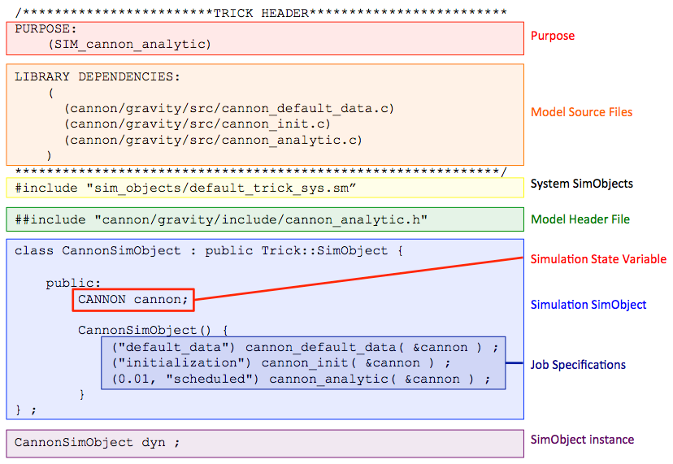

| [Home](/trick) → [Tutorial Home](Tutorial) → Trick Simulation Architecture |
|--------------------------------------------------------|

<!-- Section -->
<a id=architecture-of-a-trick-simulation></a>
## Architecture of a Trick Simulation

**Contents**

* [The Simulation Definition File](#the-simulation-definition-file)<br>
* [The Parts of an S_define](#the-parts-of-an-sdefine)<br>

*** 

We divided our non-Trick simulation code into: 

* Variable declarations 
* Variable default data assignments
* Variable initialization by calculation
* Running the sim
* Cleanup/Shutdown

A Trick-based simulation is organized similarly and is defined in a simulation definition file (S\_define).  The S\_define specifies the data types, functions/methods and scheduling requirements for the simulation's models.  Trick generates a simulation executable based on the S\_define.

---
 
<a id=the-simulation-definition-file></a>
### The Simulation Definition File (S_define)

### Example S_define File



The S_define file specifies and ties together everything necessary to build a
simulation:

* The source code that implements the simulation models.
* The data-types for the model(s) and Trick utilities.
* The specific variable instances of the data-types.
* Job scheduling Specifications

---

<a id=the-parts-of-an-sdefine></a>
### The Parts of an S_define

At the top of the S_define file is a special comment block.  The comment block contains Trick keywords followed by information in parentheses. 

The ```PURPOSE:``` keyword (note that the colon is part of the keyword)
specifies a brief description of the S\_define file. It is mandatory.

```LIBRARY DEPENDENCIES``` specifies the model source files that need to be
compiled before building the simulation. Trick headers in these files
may specify additional source code dependencies, and so forth. Libraries may
also be specified for linking into the final simulation executable.

The ```default_trick_sys.sm``` file defines variables and data-types necessary 
to provide the standard features of any Trick-based simulation. Its inclusion
is mandatory. Every S\_define file should contain the following line:

```#include "sim_objects/default_trick_sys.sm"```

Header files that supply data-types for user-defined models should be
included using ```##include```. Note the double hash (#). 
 
```Trick::SimObject``` is the base-class used to 1) declare data members of a model, and 2) set job scheduling specifications for a model. The example above declares a new class ```CannonSimObject``` that contains one data member ```cannon```, and three job specifications. 

Once a new SimObject-derived class has been defined, we can create an instance of it.
In the example above the variable ```dyn``` is an instance of ```CannonSimObject```.
That is, it is one instance of our cannonball model. If we were to create a second instance of 
```CannonSimObject``` then our simulation would contain two independently runnable cannonball models. 

In the following sections we'll create the parts for a Trick-based cannonball simulation, and build it.

---
[Next Page](ATutAnalyticSim)
