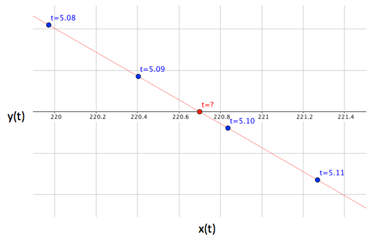

| [Home](/trick) → [Tutorial Home](Tutorial) → Dynamic Events |
|-----------------------------------------------------------|

<!-- Section -->
<a id=dynamic-events-making-contact></a>
# Dynamic Events - Making Contact

**Contents**

* [What are Dynamic Events?](#what-are-dynamic-events)
* [Dynamic Event Jobs](#dynamic-event-jobs)
  - [Finding Events with *regula_falsi()*](#finding-events-with-regula-falsi)
  - [Listing - **cannon_impact()**](listing_cannon_impact)
* [Specifying an Event Boundary](#specifying-an-event-boundary)
* [Calling **regula_falsi()**](#calling-regula-falsi)
* [Updating Our Cannonball Simulation](#updating-our-cannonball-simulation)

***

<a id=what-are-dynamic-events></a>
## What are Dynamic Events?

Our numerical cannon ball simulation still needs to determine the precise time
of impact, *t* when *y(t)=0*.

Remember that the reason for using numerical methods is that simulations often
don't have analytical solutions. So, even though we do have an expression that
will immediately tell us the time of impact of our cannon ball, we're going to
pretend, for now, and for the sake of this tutorial, that we don't.

Let's take a look at the plot of the cannon ball trajectory near *y(t)=0*, in
the figure below. Each blue point represents the state of the cannon ball at the
indicated time step.

Notice that the ball's trajectory crosses *y(t)=0* (the ground) in between our
time steps, somewhere between 5.09 seconds, and 5.10 seconds. So, the question
is, how do we find the exact time that it crosses the y-axis? In Trick, we call
this type of occurrence, when our simulation state is at some boundary that
we've defined, a **dynamic-event**. To find dynamic-events, we use
**dynamic-event** jobs.

**Figure - Cannon Ball Trajectory Near y(t) = 0**


<a id=dynamic-event-jobs></a>
## Dynamic Event Jobs

A dynamic-event job is called periodically, after each integration step.
Its job is to detect when the simulation state crosses a user-defined
event boundary, to take control of integration to find the exact event state
and time, and finally to perform some action as a result. It does
this using the Trick's ```regula_falsi()``` function and ```REGULA_FALSI``` 
data-type to implement the 
[False position method](https://en.wikipedia.org/wiki/False_position_method).

<a id=finding-events-with-regula-falsi></a>
### Finding Events with *regula_falsi()*

The ```regula_falsi()``` function is the heart of a dynamic event function.
It's job is to:

1. monitor the simulation state produced by each integration step,
2. detect when the state crosses a specified event boundary, and
3. guide Trick's integration scheduler to find that event. 

Progress toward finding the event state is recorded in a ```REGULA_FALSI``` 
variable.

The function ```cannon_impact()```, listed below is the dynamic event job
function that we'll use for our cannonball simulation.

<a id=listing_cannon_impact></a>
**Listing - cannon_impact()**

```c
double cannon_impact( CANNON* C ) {
    double tgo ; /* time-to-go */
    double now ; /* current integration time. */
    
    C->rf.error = C->pos[1] ;              /* Specify the event boundary. */
    now = get_integ_time() ;               /* Get the current integration time */
    tgo = regula_falsi( now, &(C->rf) ) ;  /* Estimate remaining integration time. */ 
    if (tgo == 0.0) {                      /* If we are at the event, it's action time! */
        now = get_integ_time() ;
        reset_regula_falsi( now, &(C->rf) ) ; 
        C->impact = 1 ;
        C->impactTime = now ;
        C->vel[0] = 0.0 ; C->vel[1] = 0.0 ;
        C->acc[0] = 0.0 ; C->acc[1] = 0.0 ;
        fprintf(stderr, "\n\nIMPACT: t = %.9f, pos[0] = %.9f\n\n", now, C->pos[0] ) ;
    }
    return (tgo) ;
}
```

In the following two sections, we'll discuss the details of how this and other
dynamic event jobs work.

<a id=specifying-an-event-boundary></a>
### Specifying an Event Boundary

* ```REGULA_FALSI.error```

An event boundary is defined by a user-supplied error-function of the simulation
state. After each integration step, the dynamic event job evaluates the error
function at the current state and then assigns the error-value to
```REGULA_FALSI.error```. The ```REGULA_FALSI``` object is then passed into
```regula_falsi()``` as an argument.

The magnitude of the error should indicate how close the given state is to
the event state, and the sign of the error should indicate which side of the
boundary the given state is on. An error-value of 0 should indicate that the
given state is the same as the event state.

In our ```cannon_impact``` function above, the assignment
```C->rf.error = C->pos[1] ;``` defines our cannonball's event boundary, that
is, the surface of the ground. When ```C->pos[1]``` is positive, the ball is
above the surface. When negative, it's below the surface. When zero, it's at
the surface.

* ```REGULA_FALSI.mode```

Notice that a sign change of the error-value, between consecutive states
indicates that the state has crossed the event boundary. In our cannonball
simulation, we only care about the situation in which the error changes from
positive to negative. A situation in which the error crosses from negative
to positive simply won't occur, so we don't really care. But what if we did
care, because, for example, we wanted to detect when the cannon ball hit a
ceiling?

The enumeration member variable ```REGULA_FALSI.mode``` allows us to specify
the crossing directions in which we are interested. Possible are values :

1. **Any** - (default) specifies that an event occurs when the boundary is
crossed from either direction, that is, from positive to negative or from
negative to positive.
2. **Increasing** - specifies that an event occurs only when the boundary is
crossed from negative to positive.
3. **Decreasing** - specifies that an event occurs only when the boundary is
crossed from positive to negative.

So, in our cannon ball simulation, we could set ```C->rf.mode``` to
```Decreasing``` to explicitly indicate that the only events we care about are
positive to negative boundary crossings. Or, we could just let the mode default
to ```Any```, because the cannonball doesn't start below the ground.

* ```REGULA_FALSI.error_tol```

To specify the how small the error should be before declaring success, set 
```REGULA_FALSI.error_tol```. The default error tolerance is 1.0e-15.

<a id=calling-regula-falsi></a>
### Calling regula_falsi()

Given the current integration time, from ```get_integ_time()```, and a pointer
to the ```REGULA_FALSI``` variable, ```regula_falsi()``` returns an estimate 
of amount of integration time necessary to reach the event.

When the estimate (tgo in our example) is equal to 0.0, we've found the event.
At this point, the actions meant to result from the event should be performed.

In the action block, the first thing you'll want to do is the get the current
simulation time. This is the event time. Then you'll want to reset the
```REGULA_FALSI``` object to it's default state with ```reset_regula_falsi()```.
After do whatever needs to happen as a result of the event. In
our cannon ball simulation, we want the ball to stop moving when it hits the
ground. So, we set its state-derivatives to zero. 

If we had wanted our ball to bounce instead of just stopping, we
could instead have changed the balls velocity vector to account for the rebound,
and energy loss.

Regardless of its value, the time estimate is returned by the dynamic event job,
to the Trick integration scheduler to let it know what its next integration step
size should be.

When the dynamic event job returns 0.0, the integration scheduler will return to
its normal behavior of integrating from the current state to the next integer
multiple of the integloop time step.

<a id=updating-our-cannonball-simulation></a>
## Updating Our Cannonball Simulation 

### Step 1 - Modifications to ```cannon.h```

To the #include directives near the top of the file, add:

```
#include "trick/regula_falsi.h"
```

then add the following new member to the CANNON struct :

```REGULA_FALSI rf ; ```

### Step 2 - Modifications to ```cannon_numeric.h```

Add the following prototype for our new dynamic event job function, **cannon_impact**
below the existing **cannon_deriv** prototype.

```c++
double cannon_impact(CANNON*) ;
```

### Step 3 - Modifications to ```cannon_numeric.c```

Add the [cannon_impact](#listing_cannon_impact) function, listed above, to the bottom of **cannon_numeric.c**.

### Step 4 - Modifications to ```SIM_cannon_numeric/S_define```

Add the following job specification, to run our cannon_impact job.

```
("dynamic_event") cannon_impact( &cannon) ;
```

to the end of the list of jobs in the CannonSimObject.

### Step 5 - Build the Simulation

```cd``` to the ```SIM_cannon_numeric``` directory, and type:

```trick-CP``` to build or re-build the simulation.

If all goes well, you should see:

```Trick Build Process Complete```

### Step 6 - Run the Simulation

Execute the Simulation:

```./S_main_Darwin_16.exe RUN_test/input.py```

You should see:

```
IMPACT: t = 5.096839959, pos[0] = 220.699644186

========================================
      Cannon Ball State at Shutdown
t = 5.2
pos = [220.699644186, 0.000000000]
vel = [0.000000000, 0.000000000]
========================================
```

**It's the same answer we got from our analytic simulation!**

[Next Page](TutVariableServer)
