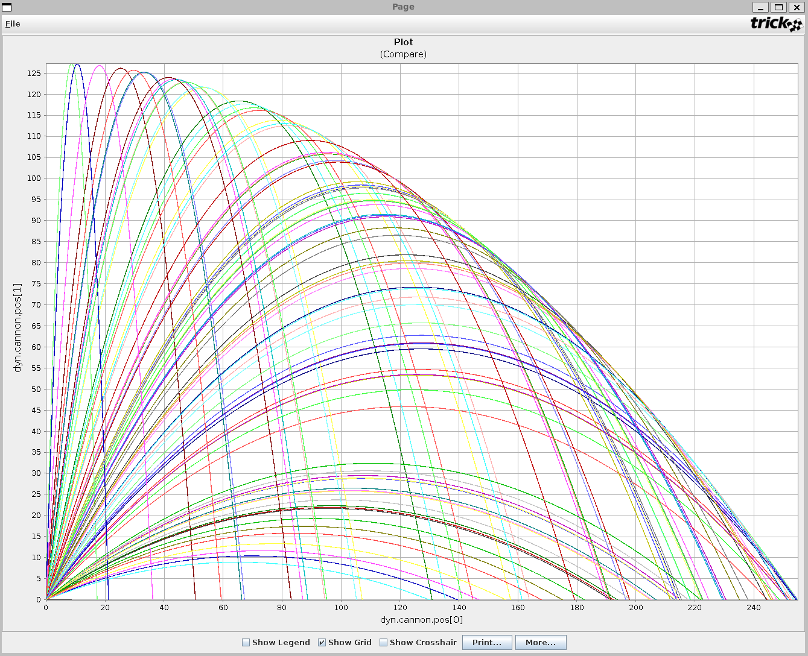
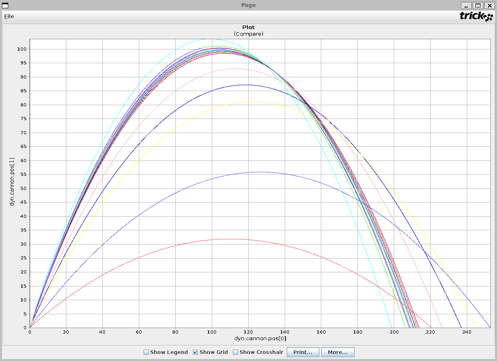

| [Home](/trick) → [Tutorial Home](Tutorial) → Monte Carlo |
|--------------------------------------------------------|

# Monte Carlo

**Contents** //Fix this later

* [What are Dynamic Events?](#what-are-dynamic-events)
* [Dynamic Event Jobs](#dynamic-event-jobs)
  - [Finding Events with *regula_falsi()*](#finding-events-with-regula-falsi)
  - [Listing - **cannon_impact()**](listing_cannon_impact)
* [Specifying an Event Boundary](#specifying-an-event-boundary)
* [Calling **regula_falsi()**](#calling-regula-falsi)
* [Updating Our Cannonball Simulation](#updating-our-cannonball-simulation)

***

<a id=what-is-monte-carlo></a>
## What is Monte Carlo?

Monte Carlo is an advanced simulation capability provided by Trick that allows users to repeatedly run copies of a simulation with different input values. Users can vary the input space of a simulation via input file, random value generation, or by calculating values from previous Monte Carlo runs in a process called optimization. This tutorial will show you how to modify the cannon_numeric simulation to take advantage of this capability.

**For a thorough explanation of Monte Carlo and its features, read the [Monte Carlo User Guide](/trick/documentation/simulation_capabilities/UserGuide-Monte-Carlo).**

## The Task
**What would be the optimal launch angle required to ensure our cannonball travels the furthest distance?** Let us assume that we have no conception of physics or trigonometry and that we don't already know the answer.

<p align="center">
	
</p>

## Input Files
Input files allow you to specify the exact values you want on a particular simulation run. Input files are the most precise implementation, but they require more effort to setup and modify later down the road. Input files can contain multiple (tab or space) delimited columns filled with numerical information.

### Value List
Create the following text file in your simulation directory with the name **angle\_value\_list**:

```
0.1
0.2
0.3
0.4
0.5
0.6
0.7
0.8
0.9
1
1.1
1.2
1.3
1.4
1.5

```
This text file will be used to assign the cannon's initial angle. Remember that this angle is in radians.

### Updating our Input File
The input file must be adjusted to run the simulation using Monte Carlo techniques.

```
% cd $HOME/trick_sims/SIM_cannon_analytic/RUN_test
% vi input.py
```

The simulation must be told to enable Monte Carlo, recognize a Monte Carlo variable, and connect the variable to the cannon init angle. To accomplish this, change the input file to include the following:

```python

exec(open("Modified_data/cannon.dr").read())

# Enable Monte Carlo.
trick.mc_set_enabled(1)

# Sets the number of runs to perform to 15. Trick will not exceed the number of values in an input file.
trick.mc_set_num_runs(15)

# Create and add a new Monte Carlo File variable to the simulation.
mcvar_launch_angle = trick.MonteVarFile("dyn.cannon.init_angle", "angle_value_list", 1, "rad") 
trick.mc_add_variable(mcvar_launch_angle)

# Stop Monte Carlo runs after 25 seconds of simulation time
trick.stop(25)

# Stop Monte Carlo runs if they take longer than 1 second of real time
trick.mc_set_timeout(1)
```

After the file has been adjusted, save it and run the simulation.

```
% cd ..
% ./S_main*.exe RUN_test/input.py
```

The terminal will display a fairly verbose Monte Carlo process detailing each run. After completion, information about each run will be put into a MONTE_RUN_test directory. 

In order to complete our task, it will be necessary to plot each run to compare the distance achieved by each cannon. Open up the Trick Data Product application with the following command.

```
trick-dp &
```

<p align="center">
	
</p>

Right click the MONTE_RUN_test directory and select **Add run(s)**. Then open quick plot by clicking the blue lightning bolt. Expand the dyn.cannon.pos[0-1] variable in the left pane and create a curve with pos[1] as the Y axis and pos[0] as the X axis. Finally, click the comparison plot button in the actions menu.

<p align="center">
	
</p>

The various curves show the trajectories of each cannon run. It may be necessary to hide the legend if all the run names cover up the plot.

## Random Input Generation
Random Input Generation provides users with the ability to statistically generate input values along a Gaussian or Poisson distribution. Random generation is less precise than an input file, but it is more extensible and much easier to modify. Modify the input file again to use a gaussian distribution to generate launch angles.

### Script
```python
exec(open("Modified_data/cannon.dr").read())

# Enable Monte Carlo.
trick.mc_set_enabled(1)

# Run 100 randomly generated variables.
trick.mc_set_num_runs(100)

# Create a Monte Carlo Random variable.
mcvar_launch_angle = trick.MonteVarRandom("dyn.cannon.init_angle", trick.MonteVarRandom.GAUSSIAN, "rad")

# Set the random number generator seed.
mcvar_launch_angle.set_seed(1)

# Set the standard deviation for this bellcurve.
mcvar_launch_angle.set_sigma(30)

# Set the center of the bellcurve.
mcvar_launch_angle.set_mu(3.141592 / 4) # PI/4

# Set the maximum and minimum values to be generated.
mcvar_launch_angle.set_max(3.141592 / 2) # PI/2
mcvar_launch_angle.set_min(3.141592 / 12) #PI/12

# The min and max are absolute values, not relative to mu.
mcvar_launch_angle.set_min_is_relative(False)
mcvar_launch_angle.set_max_is_relative(False)

# Add the variable.
trick.mc_add_variable(mcvar_launch_angle)

# Stop Monte Carlo runs after 25 seconds of simulation time
trick.stop(25)

# Stop Monte Carlo runs if they take longer than 1 second of real time
trick.mc_set_timeout(1)
```

Run the script and plot the curves the same way as before. You will end up with something similar to this:

<p align="center">
	
</p>

## Optimization
Optimization is the process of evaluating the previous run's data for use in the next run. In essence, you are optimizing each subsequent run and closing in on a specific value; in this instance, we are closing in on the optimal launch angle.

### optimization.h
We need to create two new Trick jobs to house our optimization logic. Create this file in your include directory.

```C
/******************************* TRICK HEADER ****************************
PURPOSE: Function prototypes for Monte Carlo optimization.
*************************************************************************/

#ifndef OPTIMIZATION_H
#define OPTIMIZATION_H

#include "../include/cannon.h"

#ifdef __cplusplus
extern "C" {
#endif

int cannon_slave_post(CANNON *);
int cannon_master_post(CANNON *);

#ifdef __cplusplus
}
#endif
#endif
```

### optimization.c
What we are doing in these two functions is sending the slave's cannon structure from after the run has completed back to the master. The master then analyzes the data and sends the new run information to the slave. This cycles over and over again until we hit the number of runs specified in our input script. Create this file in your src directory.

```C
/******************************* TRICK HEADER ****************************
PURPOSE: Monte Carlo optimization functions.
*************************************************************************/

#include "../include/optimization.h"
#include "../include/cannon.h"
#include "sim_services/MonteCarlo/include/montecarlo_c_intf.h"

int cannon_slave_post(CANNON *C)
{
    mc_write((char*) C, sizeof(CANNON));
    return 0;
}

int cannon_master_post(CANNON *C)
{
    CANNON run_cannon;
    static double previous_distance = 0;
    static double increment = 0.2; // Remember radians

    // Get the run's cannon back from slave.
    mc_read((char*) &run_cannon, sizeof(CANNON));

    // Optimization logic.
    if(run_cannon.pos[0] < previous_distance)
    {
        // Cut the increment in half and reverse the direction.
        increment /= 2;
        increment *= -1;
    }
    
    C->init_angle += increment;
    previous_distance = run_cannon.pos[0];
    return 0;
}
```

### Script

```python
exec(open("Modified_data/cannon.dr").read())

# Enable Monte Carlo.
trick.mc_set_enabled(1)

# Run 25 optimizations.
# The more runs, the more precise your variable will end up assuming you wrote your optimization logic correctly.
trick.mc_set_num_runs(50)

# Create a calculated variable and add it to Monte Carlo.
mcvar_launch_angle = trick.MonteVarCalculated("dyn.cannon.init_angle", "rad")
trick.mc_add_variable(mcvar_launch_angle)

# Stop Monte Carlo runs after 25 seconds of simulation time
trick.stop(25)

# Stop Monte Carlo runs if they take longer than 1 second of real time
trick.mc_set_timeout(1)
```

### Simulation Definition
The last thing that we need to do is modify our simulation definition file and add the two new Trick jobs. As you can see, we have added a new library dependency, a new ## inclusion, and two new constructor jobs.

```C++

/************************TRICK HEADER*************************
PURPOSE:
    (S_define file for SIM_cannon_numeric)
LIBRARY DEPENDENCIES:
    (
      (cannon/src/cannon_init.c)
      (cannon/src/cannon_numeric.c)
      (cannon/src/cannon_shutdown.c)
      (cannon/src/optimization.c)
    )
*************************************************************/

#include "sim_objects/default_trick_sys.sm"
##include "cannon/include/cannon_numeric.h"
##include "cannon/include/optimization.h"

class CannonSimObject : public Trick::SimObject {

    public:
        CANNON cannon;

        CannonSimObject() {
            ("default_data") cannon_default_data( &cannon ) ;
            ("initialization") cannon_init( &cannon ) ;
            ("derivative") cannon_deriv( &cannon ) ;
            ("integration") trick_ret= cannon_integ( & cannon ) ;
            ("dynamic_event") cannon_impact( &cannon ) ;
             ("monte_slave_post") cannon_slave_post( &cannon ) ;
            ("monte_master_post") cannon_master_post( &cannon ) ;
            ("shutdown") cannon_shutdown( &cannon ) ;
        }
} ;

CannonSimObject dyn ;
IntegLoop dyn_integloop (0.01) dyn ;
void create_connections() {
    dyn_integloop.getIntegrator(Runge_Kutta_4, 4);
}
```

Run the script and plot the curves. 

```
% trick-CP
...
% ./S_main*.exe RUN_test/input.py
```

Once the simulation is complete, the x-y position plot should look like this:

<p align="center">
	
</p>