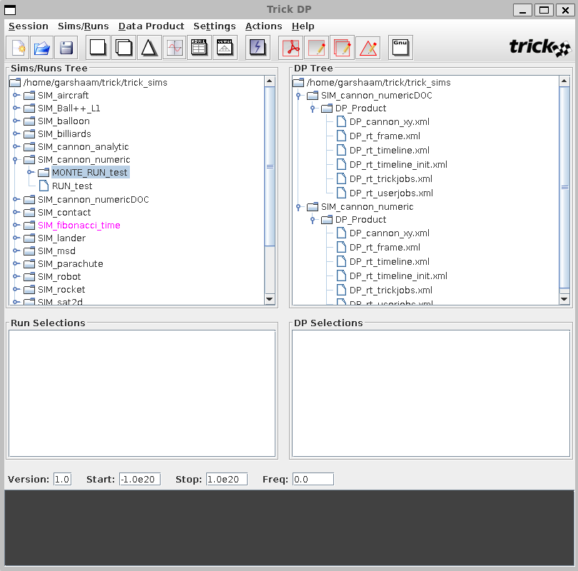
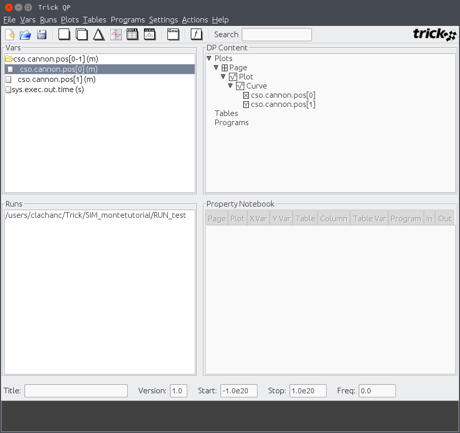
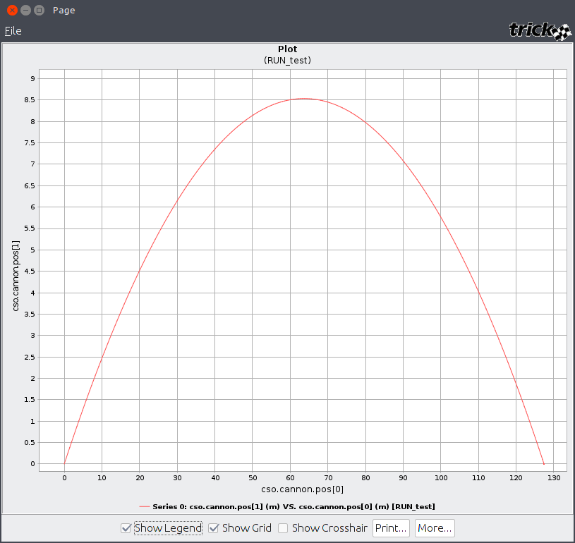
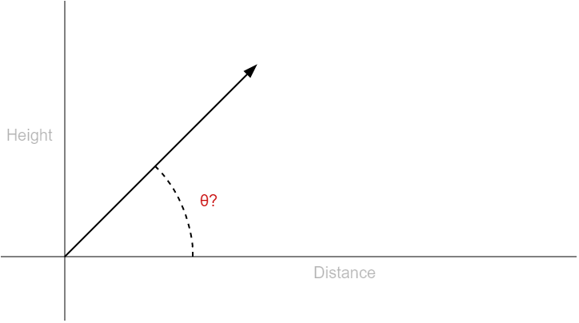
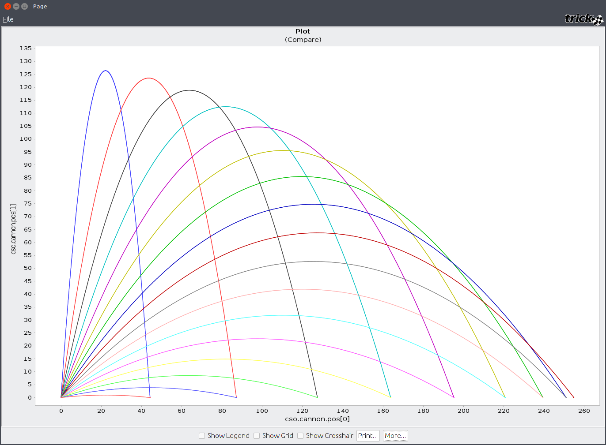
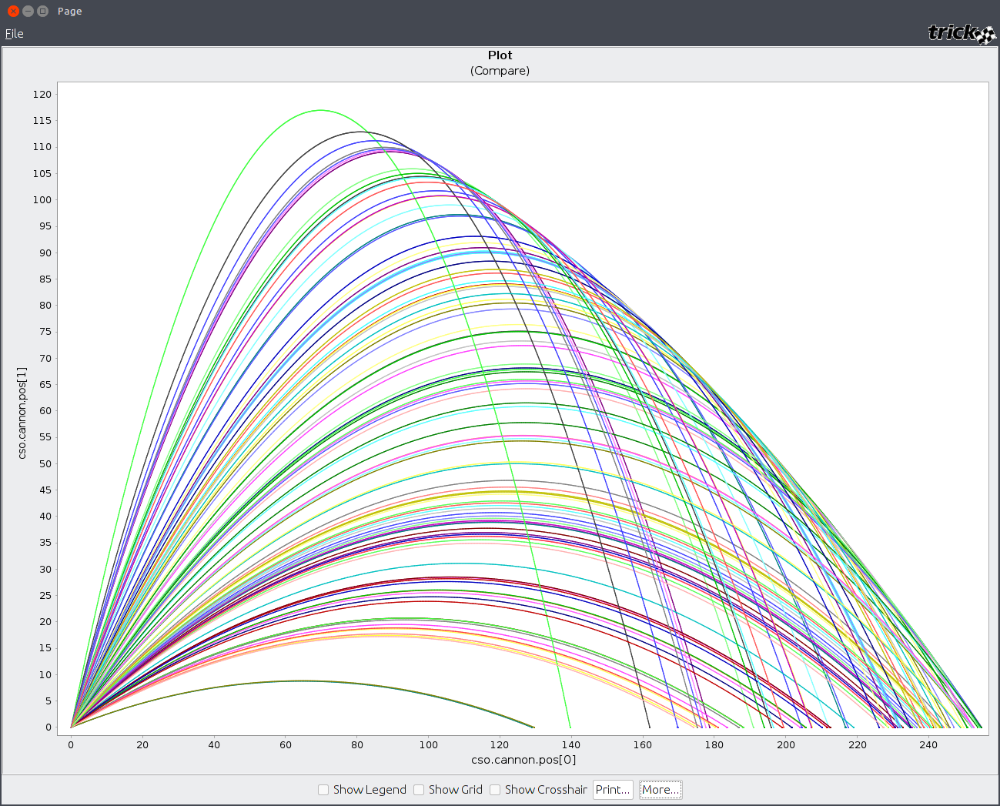
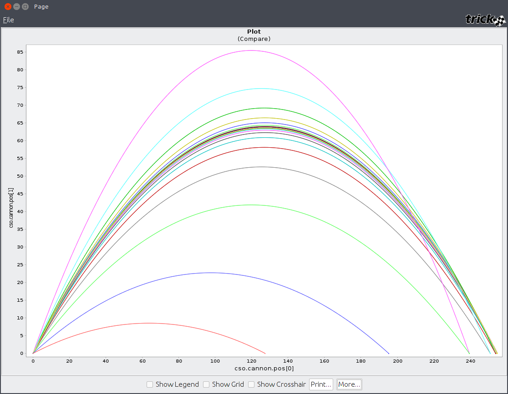

| [Home](/trick) → [Tutorial Home](Tutorial) → Monte Carlo |
|--------------------------------------------------------|

Monte Carlo is an advanced simulation capability provided by Trick that allows users to repeatedly run copies of a simulation with different input values. Users can vary the input space of a simulation via input file, random value generation, or by calculating values from previous Monte Carlo runs in a process called optimization. This tutorial will show you how to develop simulations that can take advantage of this capability.

**For a thorough explanation of Monte Carlo and its features, read the [Monte Carlo User Guide](/trick/documentation/simulation_capabilities/UserGuide-Monte-Carlo).**

## Core Simulation
The core simulation this tutorial is built around is a slight modification of the Analytical Cannon simulation created earlier in the tutorial. **The primary modification made was to change the *init_angle* attribute from radians to degrees.**

### cannon.h
This header file contains the cannon structure we are going to use to create our simulation object and function prototypes we will use to specify our Trick jobs. 

```C
/*
PURPOSE: Cannon structure and simulation functions.
*/
#ifndef CANNON_H
#define CANNON_H
#include "trick_utils/comm/include/tc.h"
#include "trick_utils/comm/include/tc_proto.h"

typedef struct
{
	double vel0[2];		// *i m		Initial velocity of the cannonball.
	double pos0[2];		// *i m		Initial position of the cannonball.
	double init_speed;	// *i m/s	Initial barrel speed.
	double init_angle;	// *i °		Launch angle of cannon.

	double acc[2];		// m/s2		xy-acceleration
	double vel[2];		// m/s		xy-velocity
	double pos[2];		// m		xy-position

	double time;		// s		Model time.
	double timeRate;	// --		Model time per sim time.

	int impact; 		// --		Has impact occured?
	double impactTime;	// s		Time of impact.

} CANNON;

#ifdef __cplusplus
extern "C" {
#endif

// Function prototypes.
int cannon_default_data(CANNON*);
int cannon_init(CANNON*);
int cannon_analytic(CANNON*);

#ifdef __cplusplus
}
#endif
#endif // #ifndef CANNON_H
```

### cannon.c
This .c file contains the logic used to advance our simulation as well as the default data and initial data we wish to with our cannon object.
```C
/*
PURPOSE: Cannon model simulation jobs and logic.
*/

#include <math.h>
#include "../include/cannon.h"
#include "trick/exec_proto.h"

// Default data job.
int cannon_default_data( CANNON* C )
{
    C->acc[0] = 0.0;
    C->acc[1] = -9.81;

    C->init_angle = 15;
    C->init_speed  = 50.0;

    C->pos0[0] = 0.0;
    C->pos0[1] = 0.0;

    C->time = 0.0;

    C->impact = 0;
    C->impactTime = 0.0;

    return 0;
}

// Initialization job.
int cannon_init( CANNON* C)
{
    C->vel0[0] = C->init_speed*cos(C->init_angle * .0174533);
    C->vel0[1] = C->init_speed*sin(C->init_angle * .0174533);

    C->vel[0] = C->vel0[0];
    C->vel[1] = C->vel0[1];

    C->impactTime = 0.0;
    C->impact = 0.0;

    return 0;
}

// Model simulation logic.
int cannon_analytic( CANNON* C )
{
    C->acc[0] =  0.00;
    C->acc[1] = -9.81;

    C->vel[0] = C->vel0[0] + C->acc[0] * C->time;
    C->vel[1] = C->vel0[1] + C->acc[1] * C->time;
	
    C->pos[0] = C->pos0[0] + (C->vel0[0] + (0.5) * C->acc[0] * C->time) * C->time;
    C->pos[1] = C->pos0[1] + (C->vel0[1] + (0.5) * C->acc[1] * C->time) * C->time;
    if (C->pos[1] < 0.0)
    {
        C->impactTime = (- C->vel0[1] - sqrt( C->vel0[1] * C->vel0[1] - 2 * C->pos0[1]))/C->acc[1];
        C->pos[0] = C->impactTime * C->vel0[0];
        C->pos[1] = 0.0;
        C->vel[0] = 0.0;
        C->vel[1] = 0.0;
        if (!C->impact)
        {
            C->impact = 1;
            fprintf(stderr, "\n\nIMPACT: ModelTime = %.9f, pos = %.9f\n\n", C->impactTime, C->pos[0]);
        }
    }

    C->time += 0.01 ;
    return 0 ; 
}
```

### Simulation Definition
The simulation definition file simply sets up our simulation objects and configures their respective Trick jobs.
```C++
/*
PURPOSE: Monte tutorial simulation definition.
LIBRARY DEPENDENCIES: ((cannon/src/cannon.c))
*/

#include "sim_objects/default_trick_sys.sm"
##include "cannon/include/cannon.h"

class CannonSimObject : public Trick::SimObject
{
    public:
        CANNON cannon;

        CannonSimObject()
        {
            ("default_data") cannon_default_data(&cannon);
            ("initialization") cannon_init(&cannon);
            (0.01, "scheduled") cannon_analytic(&cannon);
        }
};

CannonSimObject cso;
```

### Data Recording
Visualizing the differences between the various Monte Carlo methods requires us to first establish a data recording file. In order to do this, the simulation must first be compiled; run the following command in your shell and compile the simulation above.

```
trick-CP
```

After successfully compiling the simulation, open the Trick Data Recording Editor with the following 
shell command:

```
trick-dre &
```

<p align="center">
	
</p>

#### Steps
01. In the left pane will be *cso*, the CannonSimObject we created. Expand this tree and double click on the pos[2] variable. Ensure the variable appears in the "Selected Variables" section at the bottom.
01. At the top, change DR Cycle from 0.1 to 0.01.
01. Save the data recording file in the simulation directory.

### Test Run
Create a sub-directory called *RUN_test* in your simulation directory. In this new directory create an input file named *test.py*. This input file executes the data recording file you saved above and stops the simulation after 10 seconds of simulation time.

```python
execfile("monte_cannon.dr")
trick.stop(10)
```

After running the input file, open up the Trick Data Product application with the following command.

```
trick-dp &
```

<p align="center">
	
</p>

Find the RUN_test in the Runs Tree panel and add it to your run selections. Click the blue lightning bolt to open Trick Quick Plot.


<p align="center">
	
</p>

Expand the cso.cannon.pos[0-1] variable in the left pane and create a curve with pos[1] as the Y axis and pos[0] as the X axis. Once your DP Content looks like the above image, click the comparison plot button in the actions menu.

<p align="center">
	
</p>

In each of the bellow sections, you can repeat these steps to visualize the differences between Monte Carlo implementations.

## The Task
**What would be the optimal launch angle required to ensure our cannonball travels the furthest distance?** Let us assume that we have no conception of physics or trigonometry and that we don't already know the answer.

<p align="center">
	
</p>

## Input Files
Input files allow you to specify the exact values you want on a particular simulation run. Input files are the most precise implementation, but they require more effort to setup and modify later down the road. Input files can contain multiple (tab or space) delimited columns filled with numerical information.

### Value List
Create the following text file in your simulation directory with the name **angle\_value\_list**:

```
5
10
15
20
25
30
35
40
45
50
55
60
65
70
75
80
85

```

### Script
Create a new directory called RUN_file and place the following python script in it with the name **file.py**:

```python
# -*- coding: UTF-8 -*-

execfile("monte_cannon.dr")

# Enable Monte Carlo.
trick.mc_set_enabled(1)

# Sets the number of runs to perform to 20. Trick will not exceed the number of values in an input file.
trick.mc_set_num_runs(20)

# Create and add a new Monte Carlo File variable to the simulation.
mcvar_launch_angle = trick.MonteVarFile("cso.cannon.init_angle", "angle_value_list", 1, "°") 
trick_mc.mc.add_variable(mcvar_launch_angle)

# Stop the simulation run after 15 seconds of simulation time.
trick.stop(15)

```

Run the simulation with file.py as your input file and plot the runs like you did earlier. You will see something similar to the following:

<p align="center">
	
</p>

## Random Input Generation
Random Input Generation provides users with the ability to statistically generate input values along a Gaussian or Poisson distribution. Random generation is less precise than an input file, but it is more extensible and much easier to modify.

### Script
```python
# -*- coding: UTF-8 -*-
execfile("data/monte_cannon.dr")

# Enable Monte Carlo.
trick.mc_set_enabled(1)

# Run 100 randomly generated variables.
trick.mc_set_num_runs(100)

# Create a Monte Carlo Random variable.
mcvar_launch_angle = trick.MonteVarRandom("cso.cannon.init_angle", trick.MonteVarRandom.GAUSSIAN, "°")

# Set the random number generator seed.
mcvar_launch_angle.set_seed(1)

# Set the standard deviation for this bellcurve.
mcvar_launch_angle.set_sigma(30)

# Set the center of the bellcurve.
mcvar_launch_angle.set_mu(45)

# Set the maximum and minimum values to be generated.
mcvar_launch_angle.set_max(90)
mcvar_launch_angle.set_min(0)

# The min and max are absolute values, not relative to mu.
mcvar_launch_angle.set_min_is_relative(False)
mcvar_launch_angle.set_max_is_relative(False)

# Add the variable.
trick_mc.mc.add_variable(mcvar_launch_angle)

# Stop the run after 15 simulation seconds.
trick.stop(15)
```

Run the script and plot the curves. You will end up with something similar to this:

<p align="center">
	
</p>

## Optimization
Optimization is the process of evaluating the previous run's data for use in the next run. In essence, you are optimizing each subsequent run and closing in on a specific value; in this instance, we are closing in on the optimal launch angle.

### optimization.h
We need to create two new Trick jobs to house our optimization logic. Create this file in your include directory.

```C
/*
PURPOSE: Function prototypes for Monte Carlo optimization.
*/

#ifndef OPTIMIZATION_H
#define OPTIMIZATION_H

#include "../include/cannon.h"

#ifdef __cplusplus
extern "C" {
#endif

int cannon_slave_post(CANNON *);
int cannon_master_post(CANNON *);

#ifdef __cplusplus
}
#endif
#endif
```

### optimization.c
What we are doing in these two functions is sending the slave's cannon structure from after the run has completed back to the master. The master then analyzes the data and sends the new run information to the slave. This cycles over and over again until we hit the number of runs specified in our input script. Create this file in your src directory.

```C
/*
PURPOSE: Monte Carlo optimization functions.
*/

#include "../include/optimization.h"
#include "../include/cannon.h"
#include "sim_services/MonteCarlo/include/montecarlo_c_intf.h"

int cannon_slave_post(CANNON *C)
{
    mc_write((char*) C, sizeof(CANNON));
    return 0;
}

int cannon_master_post(CANNON *C)
{
    CANNON run_cannon;
    static double previous_distance = 0;
    static double increment = 10;

    // Get the run's cannon back from slave.
    mc_read((char*) &run_cannon, sizeof(CANNON));

    // Optimization logic.
    if(run_cannon.pos[0] < previous_distance)
    {
        // Cut the increment in half and reverse the direction.
        increment /= 2;
        increment *= -1;
    }
    
    C->init_angle += increment;
    previous_distance = run_cannon.pos[0];
    return 0;
}
```

### Script

```python
# -*- coding: UTF-8 -*-

execfile("data/monte_cannon.dr")

# Enable Monte Carlo.
trick.mc_set_enabled(1)

# Run 50 optimizations.
# The more runs, the more precise your variable will end up assuming you wrote your logic correctly.
trick.mc_set_num_runs(50)

# Create a calculated variable and add it to Monte Carlo.
mcvar_launch_angle = trick.MonteVarCalculated("cso.cannon.init_angle", "°")
trick_mc.mc.add_variable(mcvar_launch_angle)

# Stop the run after 15 seconds.
trick.stop(15)
```

### Simulation Definition
The last the we need to do is modify our simulation definition file and add the two new Trick jobs. As you can see, we have added a new library dependency, a new ## inclusion, and two new constructor jobs.
```C++
/*
PURPOSE: Monte tutorial simulation definition.
LIBRARY DEPENDENCIES: ((models/src/cannon.c) (models/src/optimization.c))
*/

#include "sim_objects/default_trick_sys.sm"
##include "models/include/cannon.h"
##include "models/include/optimization.h"

class CannonSimObject : public Trick::SimObject
{
    public:
        // Cannon object we are wrapping with CannonSimObject.
        CANNON cannon;

        // Constructor.
        CannonSimObject()
        {
            ("default_data") cannon_default_data(&cannon);
            ("initialization") cannon_init(&cannon);
            (0.01, "scheduled") cannon_analytic(&cannon);
            ("monte_slave_post") cannon_slave_post(&cannon);
            ("monte_master_post") cannon_master_post(&cannon);
        }
} ;

CannonSimObject cso;
```

Run the script and plot the curves. You will see this:

<p align="center">
	
</p>
