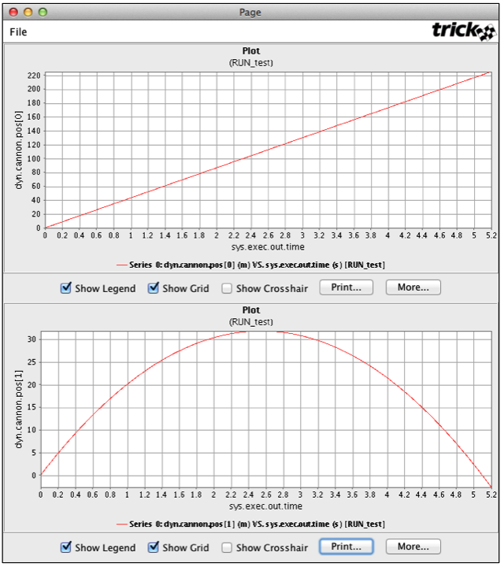
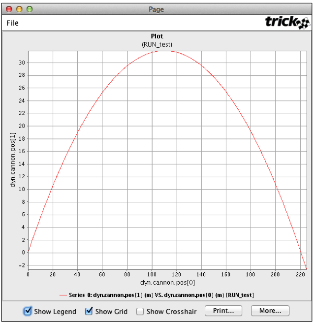

| [Home](/trick) → [Tutorial Home](Tutorial) → Plotting Recorded Data |
|-------------------------------------------------------------------|

<a id=viewing-recorded-data></a>
## Viewing Recorded Data

To view recorded data, Trick provides an application called **quick plot**.
**NOTE:** The GUI or plot graph figures may be shown differently on your
machine due to the differences of the platforms and ongoing changes.

### Using Trick Quick Plot
Begin by launching trick-dp (trick data products GUI).

```bash
% cd $HOME/trick_sims/SIM_cannon_analytic
% trick-dp &
```

#### Plotting Time -vs- Position
1. Double click the pathname containing your sim directory (or single
click the symbol next to the name)
1. Double click the `SIM_cannon_analytic` name in the Sims/Runs pane.
This will reveal the `RUN_test` directory.
1. Double click the `RUN_test` name. This will bring `RUN_test` into
the RUN Selections pane below.
1. Click the blue lightning button in the tool bar to launch quick
plot (qp). The qp GUI will pop up.
1. In qp, right click the `dyn.cannon.pos[0-1](m)` variable in the
left pane and choose **Expand var**. Next double click `dyn.cannon.pos[0](m)`.
This sets up qp to create one page with one plot (time -vs- pos[0]).
1. Now click the `dyn.cannon.pos[1]` variable and drag it to the pane
on the right. Drop it on the line with "Page" (see the white-n-black window
looking icon). This will result in one page containing two plots.
1. In qp, click the plain white sheet icon located on the toolbar. A
single window with two plots should pop up. (See Figure 4)
1. When you are done with the plots you created, close the **Trick
Plot** window which will also close the window with your plot(s).



**Figure 4 - Quick Plot Time -vs- Position**

#### Plotting XPosition -vs- YPosition
1. Right click "Plots" in the "DP Content" pane and choose
"Remove All Pages".
1. Double click dyn.cannon.pos[1].
1. Drag-n-drop the dyn.cannon.pos[0] variable over
the sys.exec.out.time variable in the Plot located in the "DP Content" pane. You
will be asked to confirm the replacement. Click "Ok".
1. To see the plot, click the white sheet icon on the toolbar. Voila!
There is the trajectory! :-) Note that the cannonball goes underground. This
will be fixed later.
1. When you are done, close the **Trick Plot** window.



**Figure 5 - Quick Plot X -vs- Y Position**

#### Creating a DP Specification File
Repeatedly clicking variables in Trick QP gets old, fast. To get around this,
the information needed for this plot will be saved to a file named
`DP_cannon_xy`, and then reused by `trick-dp`. This is an important step,
because extensive use will be made of the `DP_cannon_xy` file.

1. With the Trick QP GUI still up and the x -vs- y position still
chosen, click the `dyn.cannon.pos[1]` variable located in the pane on the right
(in the DP Content pane). The variable should be highlighted. The **Y Var**
notebook page should be visible in the lower right pane.

1. In the **Y Var** notebook page, select **Symbol Style->Square**
from the drop-down menu.

1. In the **Y Var** notebook page, select **Symbol Size->Tiny** from
the drop-down menu.

1. Click the **Apply Change** button (you may have to scroll up to
see the button).

1. Save this information by clicking the menu option **File->Save As**.
Click **New Folder** button to create the `DP_Product` folder. Choose the
directory button `SIM_cannon_analytic/DP_Product`. Enter file name as `DP_cannon_xy`.

1. Close the **Trick QP** GUI, but keep Trick DP up and running.

#### Using trick-dp To View Data
Now that `DP_cannon_xy` has been saved, the data can be viewed with trick-dp.

1. Assuming the **Trick DP** is still up and running from the
previous steps, click **Session->Refresh…** to reveal `DP_cannon_xy.xml` in
the top right pane, **DP Tree**.

1. Make sure that `Sims/Runs->SIM_cannon_analytic/RUN_test` shows up
in the  **Run Selections** pane. If not, then double click it to add it.

1. Choose the `DP_cannon_xy.xml` in the top right pane by double
clicking it. This will bring the `DP_cannon_xy.xml` into the **DP Selections** pane.

1. To see the trajectory again, click the plain white single sheet
button on the toolbar. Zoom in by holding the middle mouse button and drag
across a section of the plot. Then release the mouse button. Notice that there
is a tiny square on each x-y point recorded.

1. Once you are finished with the plot, close the **Trick Plot**
window and Trick DP.


**Figure 6 Zoomed X -vs- Y Position - `DP_cannon_xy`**

---
[Next Page](ATutRunningRealtime)
