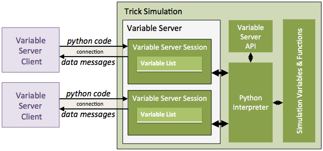
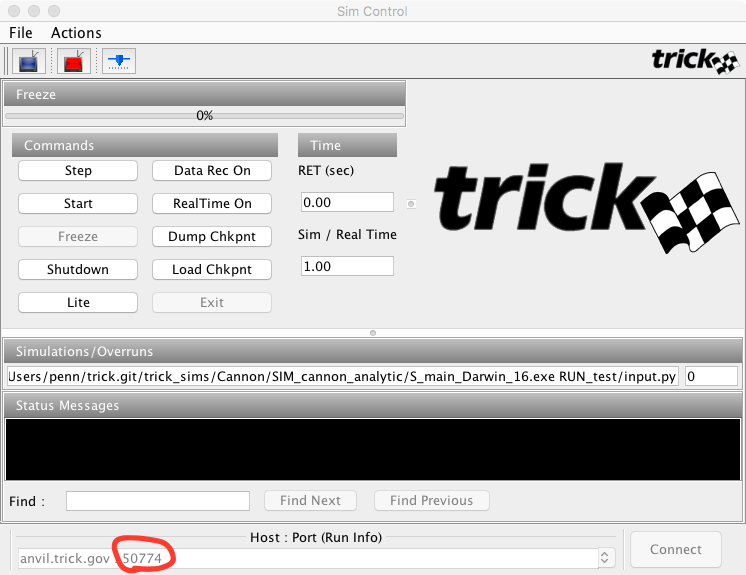

| [Home](/trick) → [Tutorial Home](Tutorial) → Variable Server |
|------------------------------------------------------------|

# Trick Variable Server

**Contents**

* [What Is The Variable Server?](#what-is-the-variable-server)
    * [Variable Server Sessions](#variable-server-sessions)
* [A Simple Variable Server Client](#a-simple-variable-server-client)
    * [Listing - CannonDisplay_Rev1.py](#listing-CannonDisplay_Rev1-py)
    * [Running The Client](#running-the-client)
    * [How The Client Works](#how-the-client-works)
    * [Getting Values Just Once](#getting-values-just-once)
* [A More Realistic Example](#a-more-realistic-example)
    * [Listing - CannonDisplay_Rev2.py](#listing-CannonDisplay_Rev2-py)
    * [Controlling the Simulation Mode from a VS Client](#controlling-the-simulation-mode-from-a-vs-client)
    * [Initializing the Simulation from a VS Client](#initializing-the-simulation-from-a-vs-client)
* [Starting a Client From the Input File](#starting-a-client-from-the-input-file)

***

This tutorial section will demonstrate how to write a Trick variable server
client. We'll be writing the clients in Python, but they can be written in any
language. We'll start out with a minimal client and then proceed to a more
realistic example. We'll be interfacing with our Cannon ball simulation.

***

<a id=what-is-the-variable-server></a>
## What is The Variable Server?

Every Trick simulation contains a **Variable Server**, a TCP/IP network service
for interacting with the simulation while it's running. Like the input-file
processor, the variable server uses a Python interpreter that's bound to the
simulation's variables and functions. So, just as in an input file, one can set
variable values and call functions from a variable server client. A variable
server specific API also exists to get simulation data back to the client. 

The Trick Sim Control Panel, and Trick-View are, for example, both variable
server clients.

<a id=variable-server-sessions></a>
### Variable Server Sessions

Each variable server connection creates a **variable server session**, whose
configuration identifies what, when, and how data will be sent from the server
to the client. A session configuration consists of the following information:

* A list of names of the variables whose values are to be sent in messages to
the client.
* The rate at which messages are transmitted to the client.
* How messages are encoded. (ASCII or binary).
* Whether messages are guaranteed to be time homogenous.
* Whether message transmission is synchronous with the main simulation thread.
* Whether data transmission is paused (inactive), or unpaused (active).
* The debug state of the connection.
* An optional name, to identify the connection when debug messages are enabled.



The primary purpose of the [**variable server API**](#the-variable-server-api)
is to configure the sessions.

## Approach

Calling functions and setting simulation variables using the variable server is
done as in the input file. That is, the client sends Python code to the variable
server where it's executed, to call functions, set variables, or both. In the
following sections we'll see examples of these. We'll also learn how to use the
variable server API to get data back to the client.

<a id=a-simple-variable-server-client></a>
## A Simple Variable Server Client

The listing below implements a very simple variable server client for our
cannonball simulation. It connects to the simulation, requests cannonball
position data, and prints the periodic responses to the screen.

<a id=listing-CannonDisplay_Rev1-py></a>
**Listing - CannonDisplay_Rev1.py**

```python
#!/usr/bin/python
import sys
import socket

# 1.0 Process the command line arguments.
if ( len(sys.argv) == 2) :
    trick_varserver_port = int(sys.argv[1])
else :
    print( "Usage: vsclient <port_number>")
    sys.exit()

# 2.0 Connect to the variable server.
client_socket = socket.socket(socket.AF_INET, socket.SOCK_STREAM)
client_socket.connect( ("localhost", trick_varserver_port) )
insock = client_socket.makefile("r")

# 3.0 Request the cannon ball position.
client_socket.send( "trick.var_pause()\n" )
client_socket.send( "trick.var_ascii()\n" )
client_socket.send( "trick.var_add(\"dyn.cannon.pos[0]\") \n" +
                    "trick.var_add(\"dyn.cannon.pos[1]\") \n"
                  )
client_socket.send( "trick.var_unpause()\n" )

# 4.0 Repeatedly read and process the responses from the variable server.
while(True):
    line = insock.readline()
    if line == '':
        break

    print line
```

<a id=running-the-client></a>
### Running the Client

To run the variable server client :

* Create a new file called *CannonDisplay_Rev1.py* in your home directory,
  and copy the contents of the above listing above into it.
* Make the file executable. Example: ```% chmod +x CannonDisplay_Rev1.py```.
* Execute, but don't "Start" the cannonball simulation.
* Find the variable server port number in the bottom left hand corner of the Sim
Control Panel, as shown below.
* Execute the script with the port number as an argument. Example: 

```$ ~/CannonDisplay_Rev1.py 50774 &```



The output of the script will display three columns of numbers. The left most
number is the [variable server message type](#variable-server-message-types).
Here, a message type of 0 indicates that the message is the (tab delimited) list
of the values we requested. This is the only message type we'll be concerned
with in this tutorial. The two columns to the right of the message number are
the values of ```dyn.cannon.pos[0]``` and ```dyn.cannon.pos[1]```, in the order
that they were specified in the script. 

```
0	55.85863854409634	24.0875895

0	60.18876556301853	25.2730495

0	64.51889258194073	26.36040950000001

0	68.84901960086293	27.34966950000001

0	73.17914661978513	28.24082950000001

```

<a id=how-the-client-works></a>
### How the Client Works

The script first gets the variable server's port number, and creates a TCP/IP
connection to it. The script then configures the variable server session, with
the commands listed below, to periodically send the cannonball position with the
following commands:

* **trick.var_pause()**
* **trick.var_ascii()**
* **trick.var_add("dyn.cannon.pos[0]")**
* **trick.var_add("dyn.cannon.pos[1]")**
* **trick.var_unpause()**

The [**var_pause**](#api-var-pause), and [**var_unpause**](#api-var-unpause)
commands are generally used at the beginning, and ending of variable server
session configurations. [**var_pause**](#api-var-pause) tells the variable
server to stop sending data, if it is. [**var_unpause**](#api-var-unpause),
tells the variable server to start sending data.

The [**var_ascii**](#api-var-ascii) command then tells the variable server to
send messages using an ASCII encoding (rather than binary).

The two [**var_add**](#api-var-add) commands add "dyn.cannon.pos[0]"
and "dyn.cannon.pos[1]" to the session variable list. 

:warning: Please notice that the quotes around the variable names must be
escaped with the '\' (backslash) character.

```
client_socket.send( "trick.var_add(\"dyn.cannon.pos[0]\") \n" +
                    "trick.var_add(\"dyn.cannon.pos[1]\") \n"
                  )
```

When the [**var_unpause**](#api-var-unpause) command is executed, messages
containing the values of the variables listed in the session variable list will
be repeatedly created, and sent to the client.

By default, the variable server sends data every 0.1 seconds (that is, 10 hertz).
This is equivalent to commanding: [**var_cycle(0.1)**](#api-var-cycle).

The script then enters a while-loop that repeatedly 1) waits for, 2) reads, and
3) prints the raw responses from the variable server. The responses are encoded
in ASCII, as specified by [**var_ascii**](#api-var-ascii), and are of the
following format:

```
0\t<variable1-value>[\t<variable2-value>...\t <variableN-value> ]\n
```
<a id=getting-values-just-once></a>
## Getting Values Just Once

Suppose we wanted to get the value of the initial angle of our cannon. We don't
need to get it repeatedly, because it doesn't change. We just want to get it
once, and then to repeatedly get the position data, which changes over time.

For this situation we can use the [**var_send**](#api-var-send) command, which
tells the variable server to send the values specified in the session variable
list immediately, regardless of whether [**var_pause**](#api-var-pause) was
previously commanded.

To demonstrate how this works, let's add the following code to our script, right
after the line where we sent the **var_ascii** command.

```python
client_socket.send( "trick.var_add(\"dyn.cannon.init_angle\")\n")
client_socket.send( "trick.var_send()\n" )
line = insock.readline()
print line
client_socket.send( "trick.var_clear()\n" )
```

In this snippet of code, we add  ```dyn.cannon.init_angle``` to the session
variable list. Then we call [**var_send**](#api-var-send) to tell the variable
server to send us the value, and wait for the response by calling
```insock.readline()```. When it arrives, we print it. Before the script adds
the cannon position variables, we need to remove ```dyn.cannon.init_angle```,
otherwise we'll be getting this in our messages too. We can do this in one of
two ways. We can 1) call [**var_clear**](#api-var-clear) to clear the the list,
or 2) we can call [**var_remove**](#api-var-remove). Specifically we could do
the following:

```client_socket.send("trick.var_remove(\"dyn.cannon.init_angle\")\n )```

So, when we run the modified client, the first three lines of the output should
look something like the following.

```
0	0.5235987755982988

0	0	0

0	0	0
```

The first line contains the message type ( which is zero), followed by the value
of  ```dyn.cannon.init_angle```. Subsequent lines contain the position data like
before.

<a id=a-more-realistic-example></a>
## A More Realistic Example

In the previous example we only called variable server API functions, like
```trick.var_add```, ```trick.var_send```, and so forth. But, we're not
just limited to variable server API calls. The variable server's Python
interpreter is bound to our simulation's variables and many other functions,
including those that we've written ourselves. In this example we'll create a
more interactive client, to initialize our simulation, and to control the
simulation modes.

The listing below implements a GUI client using **Python** and
**tkinter** that allows us to:

 1. Set the initial speed and angle of the cannon ball.
 2. Read and display the current simulation MODE.
 3. Set the simulation mode (using a "fire" button).
 4. Animate the flight of the cannon ball in realtime.

<a id=listing-CannonDisplay_Rev2-py></a>
**Listing - CannonDisplay_Rev2.py**

```python
#!/usr/bin/python
import sys 
import socket
import math
from Tkinter import *

# ----------------------------------------------------------------------
# 1.0 Process the command line arguments, to get the port number.
if ( len(sys.argv) == 2) :
    trick_varserver_port = int(sys.argv[1])
else :
    print( "Usage: vsclient <port_number>")
    sys.exit()

# ----------------------------------------------------------------------
# 2.0 Set client Parameters.
HEIGHT, WIDTH = 500, 800   # Canvas Dimensions
MARGIN = 20                # Margins around the axes
SCALE = 3                  # Scale = 3 pixels per meter
ballRadius = 5             # Ball radius in pixels

# ----------------------------------------------------------------------
# 3.0 Create constants for clarity.
MODE_FREEZE = 1 
MODE_RUN = 5 

# ----------------------------------------------------------------------
# 4.0 Create a variable to indicate that we want to "fire" the cannon,
#     and a callback function to set it.
fireCommand = False
def cannonFire():
    global fireCommand
    fireCommand = True

# ----------------------------------------------------------------------
# 5.0 Create the GUI

# 5.1 Create a Canvas to draw on.
tk = Tk()
canvas = Canvas(tk, width=WIDTH, height=HEIGHT)
tk.title("CannonBall Display")
canvas.pack()

# 5.2  Add a FIRE button, whose callback sets the fireCommand variable.
buttonFrame = Frame()
buttonFrame.pack(side=BOTTOM)
fireButton = Button(buttonFrame,text="fire",command=cannonFire)
fireButton.pack(side=LEFT)

# 5.3 Add an Initial Speed Scale.
speedScale = Scale(buttonFrame, from_=5, to=50, label="Initial Speed", orient=HORIZONTAL)
speedScale.pack(side=LEFT)
speedScale.set(50)

# 5.4 Add an Initial Angle Scale.
angleScale = Scale(buttonFrame, from_=5, to=80, label="Initial Angle", orient=HORIZONTAL)
angleScale.pack(side=LEFT)
angleScale.set(30)

# 5.5 Create coordinate axes on the canvas.
xAxis = canvas.create_line(MARGIN,HEIGHT-MARGIN,WIDTH,HEIGHT-MARGIN)
yAxis = canvas.create_line(MARGIN,HEIGHT-MARGIN,MARGIN,0)

# 5.6 Create an oval object to represent the cannonball.
cannonBall = canvas.create_oval(0,0,ballRadius,ballRadius, fill="orange")

# 5.7 Create a text field on the canvas for the simulation mode display.
modeText = canvas.create_text(WIDTH/2, 20, text="--unknown-mode--")

# 5.8 Create text fields on the canvas for time and position of impact display.
impactTimeText = canvas.create_text(WIDTH/2, 40, text="")
impactPosText =  canvas.create_text(WIDTH/2, 60, text="")

# ----------------------------------------------------------------------
# 6.0 Connect to the variable server.
client_socket = socket.socket(socket.AF_INET, socket.SOCK_STREAM)
client_socket.connect( ("localhost", trick_varserver_port) )
insock = client_socket.makefile("r")

# ----------------------------------------------------------------------
# 7.0 Request the cannon ball position, the sim mode, and the impact info.
client_socket.send( "trick.var_set_client_tag(\"myvsclient\") \n")
client_socket.send( "trick.var_debug(3)\n" )
client_socket.send( "trick.var_pause()\n" )
client_socket.send( "trick.var_ascii()\n" )
client_socket.send( "trick.var_add(\"dyn.cannon.pos[0]\") \n" +
                    "trick.var_add(\"dyn.cannon.pos[1]\") \n" +
                    "trick.var_add(\"trick_sys.sched.mode\")\n" +
                    "trick.var_add(\"dyn.cannon.impact\") \n" +
                    "trick.var_add(\"dyn.cannon.impactTime\") \n" )
client_socket.send( "trick.var_unpause()\n" )

# ----------------------------------------------------------------------
# 8.0 Repeatedly read and process the responses from the variable server.
while(True):
    # 8.1 Read the response line from the variable server.
    line = insock.readline()
    if line == '':
        break

    # 8.2 Split the line into an array of value fields.
    field = line.split("\t")

    # 8.3 Get the position of the ball and update it on the canvas.
    x,y = float(field[1]), float(field[2])
    cx,cy = (x*SCALE+MARGIN), (HEIGHT-y*SCALE-MARGIN)
    canvas.coords(cannonBall,cx-ballRadius,cy-ballRadius,cx+ballRadius,cy+ballRadius)

    # 8.4 Get and display current Sim Mode.
    simMode = int(field[3])
    if simMode == MODE_FREEZE:
        canvas.itemconfigure(modeText, fill="blue", text="FREEZE")
    elif simMode == MODE_RUN:
        canvas.itemconfigure(modeText, fill="red", text="RUN")
    else:
        canvas.itemconfigure(modeText, text="--unknown-mode--")

    # 8.5 When impact occurs display the impact info, and command the sim from RUN mode to FREEZE mode.
    impact = int(field[4])
    if simMode == MODE_RUN:
        if impact:
            # 8.5.1 Display the impact info on the canvas.
            canvas.itemconfigure(impactTimeText, text="Impact time = " + field[5])
            canvas.itemconfigure(impactPosText, text="Impact pos  = (" + field[1] + "," + field[2] + ")")
            # 8.5.2 Command the sim to FREEZE mode.
            client_socket.send( "trick.exec_freeze()\n")

    # 8.6 When the "Fire" button is pressed, command the sim from FREEZE mode to RUN mode.
    if simMode == MODE_FREEZE:
        if fireCommand:
            fireCommand = False
            fireButton.config(state=DISABLED)
            # 8.6.1 Command the sim to assign the slider values to init_speed, and init_angle.
            client_socket.send( "dyn.cannon.init_speed = " + str(speedScale.get()) + " \n")
            client_socket.send( "dyn.cannon.init_angle = " + str(angleScale.get()*(math.pi/180.0)) + " \n")
            # 8.6.2 Command the sim to re-run the cannon_init job.
            client_socket.send( "trick.cannon_init( dyn.cannon )\n")
            # 8.6.3 Command the sim to RUN mode.
            client_socket.send( "trick.exec_run()\n")
    
    # 8.7 Update the Tk graphics.
    tk.update()

# ----------------------------------------------------------------------
# 9.0 Keep the window open, when the data stops.
tk.mainloop()

```

<a id=controlling-the-simulation-mode-from-a-vs-client></a>
### Controlling the Simulation Mode from a VS Client

The current simulation mode is stored in the ```trick_sys.sched.mode``` variable.
So, we request that in addition to our other variables in section 7.0 of the
listing. 

The only simulation modes that are available to our client are FREEZE, and RUN.
The variable server isn't available in other modes. The numeric values of these
modes are:

* MODE_FREEZE = 1 
* MODE_RUN = 5 

To set the simulation mode, we need to use the following functions:

* ```trick.exec_run()``` - commands the sim to RUN mode.
* ```trick.exec_freeze()``` - commands the sim to FREEZE mode.

as in sections 8.5, and 8.6 of the listing.

Don't set ```trick_sys.sched.mode```.

<a id=initializing-the-simulation-from-a-vs-client></a>
### Initializing the Simulation from a VS Client

To set simulation values, we simply create and send Python assignment statements.

```
 client_socket.send( "dyn.cannon.init_speed = " + str(speedScale.get()) + " \n")
 client_socket.send( "dyn.cannon.init_angle = " + str(angleScale.get()*(math.pi/180.0)) 
```

Just because the variable server isn't available during INITIALIZATION mode,
doesn't mean we can't initialize our sim. We can just call our initialization
jobs directly.

```
client_socket.send( "trick.cannon_init( dyn.cannon )\n")
```

<a id=starting-a-client-from-the-input-file></a>
## Starting a Client From The Input File

Rather than having to start a client each and every time from the command line,
we can easily start it from the input file using the function
```trick.var_server_get_port()``` as illustrated in the following input file
script.

```python
#==================================
# Start the variable server client.
#==================================
varServerPort = trick.var_server_get_port();
CannonDisplay_path = os.environ['HOME'] + "/CannonDisplay_Rev2.py"
if (os.path.isfile(CannonDisplay_path)) :
    CannonDisplay_cmd = CannonDisplay_path + " " + str(varServerPort) + " &" ;
    print(CannonDisplay_cmd)
    os.system( CannonDisplay_cmd);
else :
    print('Oops! Can\'t find ' + CannonDisplay_path )
```

Add this to the bottom of RUN_test/input.py to give it a try.
***

## Appendix

<a id=variable-server-message-types></a>
### Variable Server Message Types
| Name              | Value | Meaning |
|-------------------|-------|---------|
| VS\_IP\_ERROR     | -1    | Protocol Error|
| VS\_VAR\_LIST     |  0    | A list of variable values. |
| VS\_VAR\_EXISTS   |  1    | Response to var\_exists( variable_name )|
| VS\_SIE\_RESOURCE |  2    | Response to send_sie_resource|
| VS\_LIST\_SIZE    |  3    | Response to var_send_list_size or send_event_data|
| VS\_STDIO         |  4    | Values Redirected from stdio if var_set_send_stdio is enabled| 

<a id=the-variable-server-api></a>
### The Variable Server API

``
The following functions are a subset of variable server API functions that are
used in this tutorial:

<a id=api-var-add></a>
**var\_add( variable_name )** -
Add a name to the session variable list. The value of the added variable will
transmitted in subsequent variable server messages.

<a id=api-var-ascii></a>
**var\_ascii()** -
Set data response messages to the following ASCII encoded format (default):

**0\t**\<variable**1**-value\>[**\t**\<variable**2**-value\>...**\t** \<variable**N**-value\> ]**\n**

Where:

* **N** is the number of variables in the session variable list.
* **\t** is a tab character.  

<a id=api-var-binary></a>
**var\_binary()** -
Set response encoding to binary.

<a id=api-var-cycle></a>
**var\_cycle( period )** -
Set data response message period in seconds. (default = 0.1 seconds, i.e., 10 hertz)

<a id=api-var-pause></a>
**var\_pause()** -
Halt periodic responses.

<a id=api-var-unpause></a>
**var\_unpause()** -
Resume periodic responses.

<a id=api-var-send></a>
**var\_send()** -
Send response immediately.

<a id=api-var-clear></a>
**var\_clear()** -
Clear the session variable list.

<a id=api-var-exit></a>
**var\_exit()** -
End the connection to the variable server.

<a id=api-var-remove></a>
**var\_remove( variable_name )** -
Remove the given name from the session variable list.

<a id=api-var-set-client-tag></a>
**var\_set\_client\_tag( text )** - Name the current connection, for debugging. 

<a id=api-var-debug></a>
**var\_debug( level )** -
Set the debug level. Set level to 3 for all debug messages, and 0 for no debug messages.

<a id=api-var-sync></a>
**var\_sync( mode )** 

Set the synchronization mode of the variable server session, where the modes are:

* **0 = fully asynchronous** (default)

  This means that periodic data messages are not guaranteed to
  be time homogeneous. That is, data may not all be associated with
  a the exact same sim time. The variable server data messages are
  written from a thread other than the main thread.
 
* **1 = sync data gather, async socket write**

  This means that periodic data messages are guaranteed to
  be time homogeneous, but are written from a thread other
  than the main simulation thread.

* **2 = sync data gather, sync socket write**

  This means that periodic data messages are guaranteed to
  be time homogeneous, but are written from the main simulation thread.

[Next Page](ATutMonteCarlo)
