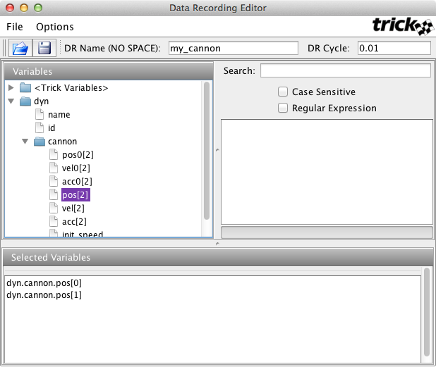

#THE TRICK TUTORIAL

Trick 16.0 Release

##1.0 Introduction

Trick is a NASA/Opensource simulation framework for running time-based physics
models. It builds executable simulations with a common architecture, using user
supplied simulation definition files and user supplied "model code". A Trick
based simulation, automatically provides many capabilites such realtime
synchronization, job scheduling, simulation state save and restore (checkpoint),
data-recording, interactive variable manipulation (variable server), numeric
state integration and an input processor. It also includes tools for plotting
recorded data, and many other supporting utilities and libraries.

Trick is writtien in C/C++ and Java and supports both Linux and MacOSX computer
operating systems.

This tutorial covers the basic concepts for developing and operating Trick
simulations. It assumes absolutely no previous knowledge of Trick, and
should be self-contained, with no need for outside references other than maybe a
C book, and/or a UNIX book. By the end of the tutorial you should know how to
build a Trick simulation of your own from the ground up. The approach of the
tutorial is hands-on.

The intent here is not to teach about simulation math models, nor to teach about
C programming, nor UNIX, but rather to teach about the Trick architecture and
its capabilities.

The name "Trick" is handed down from motocross. It is not an acronym. It is
slang for "really cool"... or something of that nature. :-)

##2.0 Installing Trick

If Trick is not already installed on your machine, then you will need to do that
first, by following the directions at:

<https://github.com/nasa/Trick/wiki/Installing-Trick>

Once Trick is installed on your machine, you will need add the Trick **bin**
directory to your execution path. For the sake of example, let us assume that
you installed Trick in your home directory, and you named your Trick directory
**trick.git**. If you named it something different, then use that name instead
in the scripts below.

If you are using **tcsh**, then add the following lines to your **.cshrc** file.

```
setenv TRICK_HOME ${HOME}/trick.git
setenv PATH ${PATH}:${TRICK_HOME}/bin
```

Or, if you are using **bash**, then add the following lines to your **.profile**
file.

```
export TRICK_HOME="${HOME}/trick.git"
export PATH=${PATH}:${TRICK_HOME}/bin
```

Close and then re-open your terminal window.

##3.0 Cannonball Simulation
Now that you are a Trick user, you can begin creating simulations. In this
tutorial, we are going to build a cannonball simulation. We will start out with
non-Trick-based simulation. Then we will build a Trick-based simulation. Then we
will make incremental improvements to our Trick-based simulation, introducing new
concepts as we go.

The commands following `%` % are ones that you should execute.

##3.1 Cannonball Problem Stated


**Figure 1 Cannonball**

Determine the trajectory of a cannonball that is fired from a cannon, with an
initial speed and initial angle. Assume no air friction. The only force acting
on the ball will be gravity.

##3.2 Cannonball Problem Solved Without Trick
This is simple enough.  Why not code this without a simulation toolkit?  Here
is some code that will simulate the cannonball.

```
/* Cannonball without Trick */

#include <stdio.h>
#include <math.h>

int main (int argc, char * argv[]) {

    /* Declare variables used in the simulation */
    double pos[2]; double pos_orig[2] ;
    double vel[2]; double vel_orig[2] ;
    double acc[2];
    double init_angle ;
    double init_speed ;
    double time ;

    /* Initialize data */
    pos[0] = 0.0 ; pos[1] = 0.0 ;
    vel[0] = 0.0 ; vel[1] = 0.0 ;
    acc[0] = 0.0 ; acc[1] = -9.81 ;
    time = 0.0 ;
    init_angle = M_PI/6.0 ;
    init_speed = 50.0 ;

    /* Do initial calculations */
    pos_orig[0] = pos[0] ;
    pos_orig[1] = pos[1] ;
    vel_orig[0] = cos(init_angle)*init_speed ;
    vel_orig[1] = sin(init_angle)*init_speed ;

    /* Run simulation */
    while ( pos[1] >= 0.0 ) {
        vel[0] = vel_orig[0] + acc[0]*time ;
        vel[1] = vel_orig[1] + acc[1]*time ;
        pos[0] = pos_orig[0] + vel_orig[0]*time + (0.5)*acc[0]*time*time ;
        pos[1] = pos_orig[1] + vel_orig[1]*time + (0.5)*acc[1]*time*time ;
        time += 0.01 ;
    }

    /* Shutdown simulation */
        printf("Impact time=%lf position=%lf\n", time, pos[0]);

    return 0;
}

```
**Listing 1 - Trickless Cannonball Code - cannon.c**

If we compile and run the program in listing 1:

```
% cc cannon.c -o cannon -lm
% ./cannon
```

we will see:

```
Impact time=5.110000 position=220.836478
```

Voila! A cannonball simulation.  Who needs Trick?  Since our livelihood rests
on the development of the Trick simulation package, we had better defend the need!

Actually, this simple main() program gives a glimpse of the overall architecture
of Trick.  The program could be divided into five distinct parts:

1. Declarations.
2. Data initialization.
3. Initialization routines.
4. Simulation executive.
5. Cleanup/Shutdown.

##3.3 Where The Trickless Simulation Breaks Down
There are some problems in the hand-made simulation from section 3.2.

1. It doesn't give an accurate answer! The impact wouldn't necessarily occur
on a 0.01 second boundary.
2. This hand-made simulation architecture will not scale well. The bigger it
gets the more brittle it will become.  As it grows in size and complexity, it
will be harder and harder to maintain.  It will be more and more difficult to
add new features, such as drag, jets or environment without major reorganization.
3. Most real-world problems do not have closed-form solutions like our cannon
ball simulation. More complex simulation models will probably need to use
numerical integration methods to find solutions.
4. This simulation can't be run in real-time. There is no notion of synchronzing
simulation-time with "wall clock" time. The sim runs as quick as it can in its
while() loop. 
5. This simulation leaves us no trail for analysis.  There is no data recorded.
No pretty plots.
6. In order to modify the angle of the cannon, we are forced to put a new value
in the program and recompile!  Wouldn't it be nice to be able to read the angle
from an input file?
7. There is no notion of units in the simulation.

There are more limitations with the Trickless version, but we'll stop at seven
for this tutorial.

After the discussion on the shortcomings of our hand-made
simulation, we might add a few things to the list of things we want from a
simulation package:

1. Data recording.
2. Notion of real-time (with an option of running as fast as it can!).
3. Scalability.
4. Modularity.
5. Plotting package.
6. Input file processor so we can change our parameters without recompiling!
7. An integration scheme for propagating states.

##3.4 Cannonball Simulated Using Trick
This tutorial is all about writing simulations with Trick. Why don't we try
that?!?  At this point you should have Trick installed on your computer. If not,
see section 2.0.

Going back to our Trick-less version we saw there were five parts:

1. data declarations,
2. data initialization,
3. initialization routines,
4. simulation executive, and
5. shutdown.

Here goes!  We shall begin writing a cannonball simulation using Trick.

###3.4.1   Creating A Directory System To Hold Simulation Source
We begin by creating a directory system to hold our simulation source code:

```
%  cd $HOME
%  mkdir -p trick_sims/SIM_cannon_analytic
%  mkdir -p trick_sims/SIM_cannon_analytic/models/cannon/src
%  mkdir -p trick_sims/SIM_cannon_analytic/models/cannon/include
```

###3.4.2 Representing the Cannonball

Next, we need to create a structured data type to represent our cannonball as is 
listed below in file `cannon.h`. We'll call this data structure **CANNON**, and
it will contain the cannon ball's state variables, and its initial conditions.

```
/*************************************************************************
  PURPOSE: (Represent the state and initial conditions of a cannonball)
**************************************************************************/
#ifndef _cannon_h_
#define _cannon_h_

typedef struct {
    double pos0[2] ;    /* *i (m) Init position of cannonball */
    double vel0[2] ;    /* *i (m/s) Init velocity of cannonball */
    double acc0[2] ;    /* *i (m/s2) Init acceleration of cannonball */

    double pos[2] ;     /* (m) xy-position */
    double vel[2] ;     /* (m/s) xy-velocity */
    double acc[2] ;     /* (m/s2) xy-acceleration */
    double init_speed ; /* *i (m/s) Init barrel speed */
    double init_angle ; /* *i (r) Angle of cannon */

} CANNON ;
#endif
```
**Listing 2 - `cannon.h`**

In addition to the type definition of our CANNON structure, this file has
specially formatted comments at the top of the file, and to the right of
each structure member.

A comment at the top of a file, containing the keyword :`PURPOSE:` (the colon
is part of the keyword) is call a "Trick header". The presence of a Trick
header lets Trick know that it should scan the remainder of the file to collect
and store information about the data types it contains. Trick header may may
contain additional keywords, but we'll get to that later.

To the right of each structure member is a comment that (optionally) provides
the following information for the member:

1. Input/Output Specification
2. Units Specification
3. Description

These are each described in **Figure 2** and in the sections below.


**Figure 2 - Data Member Comments**

####3.4.2.1 The Input/Output (I/O) Specification

An I/O specification is an optional field that specifies allowed data flow
direction for a variable. The default, `*io` , specifies that both input and
output are allowed.

* `*i` tells Trick that the parameter will be input only.
* `*o` tells Trick that the parameter is output only.
* `*io` is the default and means the parameter may be used for input or output.
* `**` tells Trick that you do NOT want this parameter processed.

####3.4.2.2 Unit Specification
A unit specification states the units of measure for a variable. This allows
unit conversions to be easily performed in Trick's input file processor, Trick
View, and when creating pretty plots.

If the variable you are putting a comment next to is unit-less, use "--" as a
unit. Refer to the Trick user's guide for a complete list of units that Trick
understands. To see a summary of the list, issue the following command:

```
% trick-ICG -u
```

####3.4.2.3 Description
The description field is extracted and used in GUI tools to describe variables.

###3.4.3 Creating The `cannon.h` Header File

Using your favorite text editor, create and save the file `cannon.h` from
**Listing 2**. We'll assume from this point that your favorite text editor
is **vi**. So when you see **vi** following the %, just replace it
with **emacs**, **nedit**, **jot**, **wordpad**, **kate**, **bbedit**, or
whatever you like.

```
% cd $HOME/trick_sims/SIM_cannon_analytic/models/cannon/include
% vi cannon.h
```

Type in the contents of **Listing 2** and save.

###3.4.4 Cannon Ball Function Prototypes
For our cannon ball sim, we're also going to create a header file containing
prototypes for the C functions we need to create. A prototype is a declaration
that tells the compiler just enough information about a function so that the
compiler can generate a call to it. A prototype provides the functions name, its
argument types and its return type, but omits the body of the function body.

```
/****************************************************************
PURPOSE: (Prototypes for Cannonball job functions)
*****************************************************************/
#ifndef _cannon_proto_h_
#define _cannon_proto_h_

#include "cannon.h"

#ifdef __cplusplus
extern "C" {
#endif

int cannon_default_data(CANNON*);
int cannon_init(CANNON*) ;
int cannon_analytic(CANNON*) ;

#ifdef __cplusplus
}
#endif

#endif
```
**Listing 3 - `cannon_proto.h`**

```
% vi cannon_proto.h
```

Type in the contents of **Listing 3** and save.

###3.4.5 Default Data
In the Trickless simulation, variables were declared. After declarations, the
variables were initialized. In the previous sections (3.4.2- 3.4.3), variables
were declared in a structure. In this section, default values will be assigned
to the variables. In Trick there are multiple methods for setting the default
values of variables:

* assignment statements in the input file
* default data file, or
* default data job

The method we'll use here will be the **default data** job. The default data job
function is listed below. More information of default data jobs in section 3.5.5.


```
/*********************************************************************
PURPOSE: (Set the default data values)
**********************************************************************/
#include "cannon/include/cannon.h"
#include "cannon/include/cannon_proto.h"

int cannon_default_data(CANNON* C)
{
    const double PI = 3.141592 ;
    C->pos[0] = 0.0 ;
    C->pos[1] = 0.0 ;
    C->acc[0] = 0.0 ;
    C->acc[1] = -9.81 ;
    C->init_angle = PI/6 ;
    C->init_speed = 50.0 ;

    return(0) ;
}
```
**Listing 4 - `cannon_default_data.c`**

There are some interesting features to note:

* This is just a C function. Trick will use a C compiler to create an object out
of this routine. Eventually, through Trick parsing, code generation & compilation
(and a little Trick voodoo), the object will be linked into a simulation
executable. Since this is C code, you have the full power of the C language. You
may make full use of any external libraries, whether system libraries or your
own libraries.
* The CANNON structure referenced in the argument list is the typedef found
in `cannon.h`. Trick needs to know what structure the variable is associated
with so it can assign the default value to the appropriate variable.
* If a routine returns an int, which is not mandatory, Trick will use the
value of the returned integer. If the routine returns a negative value, the
simulation will terminate itself, otherwise normal operations occur.

```
% cd ../src
% vi cannon_default_data.c
```
Type in the contents of **Listing 4** and save.

###3.4.6 Cannonball Initialization Source - cannon_init.c
Data declarations are now complete. Default values have been assigned to the
declared variables. This brings us to routines that initialize data.

```
/*********************************************************************
PURPOSE: (Initialize the cannonball)
*********************************************************************/
#include <math.h>
#include "cannon/include/cannon.h"
#include "cannon/include/cannon_proto.h"

int cannon_init( CANNON* C) {

    C->pos0[0] = C->pos[0] ;
    C->pos0[1] = C->pos[1] ;

    C->vel[0] = C->init_speed*cos(C->init_angle);
    C->vel[1] = C->init_speed*sin(C->init_angle);
    C->vel0[0] = C->vel[0] ;
    C->vel0[1] = C->vel[1] ;

    C->acc0[0] = C->acc[0] ;
    C->acc0[1] = C->acc[1] ;

return(0) ; }
```
**Listing 5 - `cannon_init.c`**

```
% vi cannon_init.c
```
Type in the contents of **Listing 5** and save.

###3.4.7 Cannonball Model Source - cannon_analytic.c
The data has been declared and initialized. It is time to use the data! For
instructive purposes, the most obvious route will be taken. Assume, given a time
stamp, that the position of the ball is known. In this particular case, the
position is known for each time stamp (i.e., there is an analytical solution).

```
/*********************************************************************
PURPOSE: ( Analytical Cannon )
*********************************************************************/
#include <stdio.h>
#include "cannon/include/cannon.h"
#include "cannon/include/cannon_proto.h"

int cannon_analytic(CANNON* C) {
    static double time = 0.0 ;
    C->acc[0] = 0.0 ;
    C->acc[1] = -9.81 ;
    C->vel[0] = C->vel0[0] + C->acc0[0]*time ;
    C->vel[1] = C->vel0[1] + C->acc0[1]*time ;
    C->pos[0] = C->pos0[0] + C->vel0[0]*time + (0.5)*C->acc0[0]*time*time ;
    C->pos[1] = C->pos0[1] + C->vel0[1]*time + (0.5)*C->acc0[1]*time*time ;

    /*
     * Increment time by the time delta associated with this job
     * Note that the 0.01 matches the frequency of this job
     * as specified in the S_define.
     */
    time += 0.01 ;
    return(0);
}
```
**Listing 6 - `cannon_analytic.c`**

This routine looks much like the routine found in our Trick-less simulation. It
is the piece that was surrounded by a while-loop. Underneath, Trick will
surround this job with its own while-loop. As in the case of the `cannon_init()`
routine, there is nothing particularly special about `cannon_analytic()`. It is
just another C function that will be compiled into an object. Later, with much
magic, the object will be linked into a simulation executable.

```
% vi cannon_analytic.c
```
Type in the contents of **Listing 6** and save.

###3.4.8	Cannonball Cleanup And Shutdown
We vote for skipping the shutdown routine. Save your fingers some typing!

##3.5	Pulling It All Together With The Simulation Definition File
To automate the build process of a Trick based simulation, Trick needs to
"learn" about the specific variables, data types, functions, and scheduling
requirements of a simulation's models. This starts with the simulation definition
file (**S_define**), an example of which, that we'll use to define our Cannonball
simulation is shown in Listing 7, below.

```
/*********************************************************************
PURPOSE: (S_define Header)
LIBRARY_DEPENDENCY: ((cannon/src/cannon_analytic.c)
                     (cannon/src/cannon_init.c)
                     (cannon/src/cannon_default_data.c))
*********************************************************************/
#include "sim_objects/default_trick_sys.sm"

##include "cannon/include/cannon.h"
##include "cannon/include/cannon_proto.h"

class CannonSimObject : public Trick::SimObject {
    public:
        CANNON cannon ;
        CannonSimObject() {
            ("initialization") cannon_init( &cannon ) ;
            ("default_data") cannon_default_data( &cannon ) ;
            (0.01, "scheduled") cannon_analytic( &cannon ) ;
        }
} ;

CannonSimObject dyn ;
```
**Listing 7 - `S_define`**

The `S_define` file syntax is C++ with a couple of Trick specific constructs.
Let's dissect this S_define file to see what makes it tick.

###3.5.1 Trick Header

* `PURPOSE:` keyword tells Trick to scan the remainder of the file for data
types, variable definitions, job scheduling specifications and compilation unit
dependencies.
* `LIBRARY_DEPENDENCY: ((cannon/src/cannon_analytic.c) ...` Lists the
*compilation units* (the .c source files), upon which this S_define depends. The
specified source files are the starting point for the recursive determination of
the list of files that need to be compiled and linked to build the simulation.
Trick headers that are included within each of these files may specify additional
source code dependencies, and so forth. Libraries may also be specified for
linking into the final executable.

Trick uses your `$TRICK_CFLAGS` environment variable (see section 3.6.1) in
conjunction with `cannon/src` to find the listed files. The entire path
name following the `$TRICK_CFLAGS` path must be included.

###3.5.2 Included Files

* `#include "sim_objects/default_trick_sys.sm"` This line is mandatory in an
S_define. It includes predefined data types, variable definitions, and jobs the
that provide standard Trick Simulation funtionality.

* `##include "cannon/include/cannon.h"` All classes or structures that
are referenced in the `S_define` file must have the file that the class/structure
is defined in listed with a `##include` statement.

* `##include "cannon/include/cannon_proto.h"`
The above `##include` file was created in section 3.4.7. It contains the
prototypes of all of the C jobs. It is required to allow C++ access to the C
functions referenced in the `S_define` file. You may also put the prototypes in
the `S_define` block as shown below. But if you need to call any of the C
functions from the input file then you must include the prototypes in a header
file (the preferred method).

```
/*********************************************************************
PURPOSE: (S_define Header)
LIBRARY_DEPENDENCY: ((cannon/src/cannon_analytic.c)
(cannon/src/cannon_init.c)
(cannon/src/cannon_default_data.c))
*********************************************************************/
#include "sim_objects/default_trick_sys.sm"
##include "cannon/include/cannon.h"
%{
extern "C" {
extern int cannon_analytic(CANNON*) ;
extern int cannon_init(CANNON*) ;
extern int cannon_default_data(CANNON*);
}
%}
class CannonSimObject : public Trick::SimObject {
    public:
        CANNON cannon ;
        CannonSimObject() {
            ("initialization") cannon_init( &cannon ) ;
            ("default_data") cannon_default_data( &cannon ) ;
            (0.01, "scheduled") cannon_analytic( &cannon ) ;
        }
} ;
```
**Listing 7a - `Alternate Way of Adding Prototypes to S_define`**

###3.5.3 Data Lines
`Class CannonSimObject : public Trick::SimObject {`

The sim object is defined as a C++ class and must be derived from the base class
SimObject.

* `Class CannonSimObject`
The name of the sim_object class is arbitrary.
* `public Trick::SimObject`
As mentioned above, your sim_object class must be derived from the Trick base
class SimObject.

`public : CANNON cannon ;`

* `CANNON` This is the name of the structure typedef that you created in the
cannon.h header.
* `cannon` This is an alias for the CANNON structure. It is mandatory.
* `CannonSimObject() {` This is the constructor of the sim_object and it will
contain the job declarations.

###3.5.4 Initialization Job
It is custom to refer to the C-functions created by the developer as **jobs**.
The statement below tells Trick how to handle the `cannon_init()` job.

("initialization") cannon_init( &cannon) ;

* `("initialization")`
This assigns `cannon_init()` a job classification of `initialization`. There are
many classes of jobs. The job classes, for the most part, determine the order
the job is called in the **executive loop**. If there are two jobs of the same
class in the `S_define`, the one seen first in the `S_define` is called first.
Jobs that are classified `initialization` will be called once before the main
executive loop and will not be called again.

* `cannon_init(`
The name of the function we created in $HOME/trick_sims/models/cannon/src/cannon_init.c.

* `&cannon)`
This is the actual value passed to cannon_init(). It is the address of the
object's cannon structure and "cannon" is the alias for the CANNON structure.

###3.5.5 Default Data Job
The default data jobs are called one time before the initialization jobs.

`("default_data") cannon_default_data(&cannon) ;`

* `("default_data")`
This assigns cannon\_default\_data() a job classification of *default_data*.


###3.5.6 Scheduled Job
The next job needs to be called at a regular frequency while the cannonball is
flying in the air. A *scheduled* class job is one of many jobs that can be
called at a given frequency. The only thing new about the declaration for
cannon\_analytic is the additional specification of 0.01.

`(0.01, "scheduled") cannon_analytic(&cannon) ;`


* `(0.01, "scheduled")`
The 0.01 specification tells Trick to run this job every 0.01 seconds (starting
at time=0.0). "scheduled" is the job's classification.

###3.5.7 Create The S\_define

```
% cd $HOME/trick_sims/SIM_cannon_analytic
% vi S_define
```
Type in the contents of **Listing 7** and save.

###3.6 Building the Simulation

The pieces are in order. The simulation is ready to be built!

###3.6.1 Setting `$TRICK_CFLAGS` and `$TRICK_CXXFLAGS`


Before we continue with the magical building of the cannonball, **PLEASE** take
the time to understand this section. It will save you much heartache and time.

The environment variables **`$TRICK_CFLAGS`** and **`$TRICK_CXXFLAGS`** are used
to provide TRICK, and the compilers that it uses with information that is
necessary to build your sim. Most importantly, they will tell TRICK where to
find your model files. They also provide a way for you to invoke some very useful
compiler options.

* `$TRICK_CFLAGS` is used by the C compiler and by Trick's Interface Code Generator.
* `$TRICK_CXXFLAGS` is for C++ compiler

#### Resolving Relative Paths

In the files that we've created so far, the file paths in `#include` directives
and in the `LIBRARY_DEPENDENCY` sections, are **relative** paths. These paths
are relative to a **base-path**, that we still need to specify.

For example, the `S_define` file listed above, `#includes` the relative path:
`cannon/include/cannon.h`. We intend for this path to be relative to the
`trick_models` directory that we created in our `$HOME` directory. The complete
path to our cannon.h header file should be:


So, we need to specify the base-path(s), to the compilers, and to Trick by adding
-I*dir* options, that contain the base-paths, to `$TRICK_CFLAGS` and
`$TRICK_CXXFLAGS`.

The easiest, and most portable way of setting `TRICK_CFLAGS` for your simulation
is to create a file named **`S_overrides.mk`** in your simulation directory, and
then add the following lines to it:

```
TRICK_CFLAGS += -Imodels
TRICK_CXXFLAGS += -Imodels
```
**Listing 8 - `S_overrides.mk`**

When Trick encounters relative paths, these base-paths will be prepended to the
relative paths to create a complete path to the file, thus allowing it to be
located.


#### Additional Compiler Flag Recommendations

Some additional compiler flags recommendations are provided in the `.cshrc` and
`.profile` snippets below. They tell the compilers to provide debugging support
and to check for and warn of possibly dubious code constructs.

##### For Your .cshrc File

```
TRICK_CFLAGS= -g -Wall -Wmissing-prototypes -Wextra -Wshadow
TRICK_CXXFLAGS= -g -Wall -Wextra -Wshadow
```

#####For Your .profile File
```
export TRICK_CFLAGS="-g -Wall -Wmissing-prototypes -Wextra -Wshadow"
export TRICK_CXXFLAGS="-g -Wall -Wextra -Wshadow"

```

###3.6.2 trick-CP
The source code and environment are set up. Trick's simulation build tool is
called **trick-CP** (Trick Configuration Processor). It is responsible for
parsing through the S_define, finding structures, functions, and ultimately
creating a simulation executable. Give it a whirl.

```
% cd $HOME/trick_sims/SIM_cannon_analytic
% trick-CP
```

If you typed everything perfectly... Trick is installed properly... there are no
bugs in the tutorial... the stars are aligned... and Trick is in a good mood...
You should, ultimately see :


Now, take a look at the sim directory. Is there an `S_main*.exe` file ??? If so,
cool deal. If not, scream!, then take a look at section 3.6.2.1. If all went
well, you will notice several other files now resident in the `SIM_cannon_analytic`
directory. 

```
% ls
S_default.dat        S_overrides.mk       build
S_define             S_sie.resource       makefile
S_main_Darwin_13.exe S_source.hh          trick
```

####3.6.2.1 Troubleshooting A Bad Build

Here are some common problems.

* Trick cannot seem to find a function or structure that you have in your
S_define.
    * Make sure that your TRICK_CFLAGS are set. See section 3.6.1.
    * You have a misspelling.
    * In order for Trick to find a job, argument types must match exactly.
* Trick barfs when building the simulation
    * One of your C routines may not compile because of a C syntax error.
    * Trick was not installed properly on your system.
* trick-CP croaks - You may have a syntax error in your S_define.

##3.7 Running The Simulation
You've done a lot of work to get to this point. You've created a header, a
default data job, an initialization job, a scheduled job, and an S_define.
You've also had to set up an environment and trudge through trick-CP errors. The
tiny Trickless main() program may be looking short-n-sweet at this point! There
can't be anything more to do!?!  There is one more file to create to get the
cannonball out of the barrel and into the air.

###3.7.1 Simulation Input File
Every Trick simulation needs an input file. This input file will be simple (only
one line). In practice, input files can get ridiculously complex. The input file
is processed by Python. There is no need to recompile the simulation after
changing the input file. The file is interpreted.

```
trick.stop(5.2)
```

**Listing 9 - Input File - input.py**

By convention, the input file is placed in a RUN_* directory.

```
% cd $HOME/trick_sims/SIM_cannon_analytic
% mkdir RUN_test
% cd RUN_test
% vi input.py <edit and save>
```

###3.7.2 Sim Execution
To run the simulation, simply execute the `S_main*exe`:

```
% cd $HOME/trick_sims/SIM_cannon_analytic
% ./S_main_*.exe RUN_test/input.py
```

If all is well, something similar to the following sample output will be
splashed on the terminal.

```
SIMULATION TERMINATED IN
  PROCESS: 0
  ROUTINE: Executive_loop_single_thread.cpp:98
  DIAGNOSTIC: Reached termination time

       SIMULATION START TIME:        0.000
        SIMULATION STOP TIME:        5.200
     SIMULATION ELAPSED TIME:        5.200
        ACTUAL CPU TIME USED:        0.176
       SIMULATION / CPU TIME:       29.491
     INITIALIZATION CPU TIME:        0.172
```

###3.7.3 What Happened?
Now what? The simulation has run? What did it do? In the immortal words of Elmer
Fudd, "Where did he go?" Why was it so fast? Isn't Trick "real time"? Where is
the trajectory?

To get a peek into the simulation, you may, among other things, record data and
stripchart data while running real-time.

###3.7.4 Recording Data

####3.7.4.1 Creating A Data Recording File
Recording data is possible when running real-time and non-real-time (as fast as
the computer will run). In order to record data, it is necessary to create a
"data recording file". You may create the file using a GUI called dre (data
recording editor --- aka Dr. Dre) or you may create it manually.

####3.7.4.2 Creating a Data Recording File Using DRE

```
% cd $HOME/trick_sims/SIM_cannon_analytic
% mkdir Modified_data
% trick-dre &
```



**Figure 3 - Data Recording Editor (dre)**

* **Step 1.** In the "DR Name" entry box, enter my_cannon.
* **Step 2.** In the "DR Cycle" entry box, change 0.1 to 0.01.
* **Step 3.** In the "Variables" pane, double-click dyn, then double-click cannon.
* **Step 4.** Double-click pos[2]. The result should result in  dyn.cannon.pos[0]
and dyn.cannon.pos[1] appearing in the "Selected Variables" pane.
* **Step 5.** Choose File->Save. In the "Save" dialog, enter the file name
cannon.dr. Save cannon.dr in the Modified_data directory.
* **Step 6.** Exit dre.

Storing the data recording file `cannon.dr` into a directory called `Modified_data`
is not mandatory. It is just common convention. You may view `cannon.dr` it is a
text file.

####3.7.4.3 Running The Simulation And Recording Data
The simulation must know about the data recording file created in the last
section. This is accomplished by adding execfile to the simulation input file.

```
% cd $HOME/trick_sims/SIM_cannon_analytic/RUN_test
% vi input.py
```

Add the line:

```
 execfile("Modified_data/cannon.dr")
```
to the top of the `input.py` file and then save it.

```  
% cd ..
% ./S_main*.exe RUN_test/input.py
```

After the simulation runs, data will be dumped into the `RUN_test` directory.
The data, in this case, is recorded in binary form.


##3.8 Viewing Data
To view the data which was recorded, another hill needs climbing. Trick's
"data products" must be learned. In this section, the data will be viewed using
an application called **quick plot**. **NOTE:** The GUI or plot graph figures
may be shown differently on your machine due to the differences of the platforms
and ongoing changes.

###3.8.1 Using Trick's Quick Plot
Begin by launching trick-dp (trick data products GUI).

```
% cd $HOME/trick_sims/SIM_cannon_analytic
% trick-dp &
```

####3.8.1.1 Plotting Time -vs- Position
* **Step 1.** Double click the pathname containing your sim directory (or single
click the symbol next to the name)
* **Step 2.** Double click the `SIM_cannon_analytic` name in the Sims/Runs pane.
This will reveal the `RUN_test` directory.
* **Step 3.** Double click the `RUN_test` name. This will bring `RUN_test` into
the RUN Selections pane below.
* **Step 4.** Click the blue lightning button in the tool bar to launch quick
plot (qp). The qp GUI will pop up.
* **Step 5.** In qp, right click the `dyn.cannon.pos[0-1](m)` variable in the
left pane and choose **Expand var**. Next double click `dyn.cannon.pos[0](m)`.
This sets up qp to create one page with one plot (time -vs- pos[0]).
* **Step 6.** Now click the `dyn.cannon.pos[1]` variable and drag it to the pane
on the right. Drop it on the line with "Page" (see the white-n-black window
looking icon). This will result in one page containing two plots.
* **Step 7.** In qp, click the plain white sheet icon located on the toolbar. A
single window with two plots should pop up. (See Figure 4)
* **Step 8.** When you are done with the plots you created, close the **Trick
Plot** window which will also close the window with your plot(s).


**Figure 4 - Quick Plot Time -vs- Position**

####3.8.1.2 Plotting XPosition -vs- YPosition
* **Step 1.** Right click "Plots" in the "DP Content" pane and choose
"Remove All Pages".
* **Step 2.** Double click dyn.cannon.pos[1].
* **Step 3.** Drag-n-drop the dyn.cannon.pos[0] variable over
the sys.exec.out.time variable in the Plot located in the "DP Content" pane. You
will be asked to confirm the replacement. Click "Ok".
* **Step 4.** To see the plot, click the white sheet icon on the toolbar. Voila!
There is the trajectory! :-) Note that the cannonball goes underground. This
will be fixed later.
* **Step 5.** When you are done, close the **Trick Plot** window.
*


**Figure 5 - Quick Plot X -vs- Y Position**


####3.8.1.3 Creating a DP Specification File
Repeatedly clicking variables in Trick QP gets old, fast. To get around this,
the information needed for this plot will be saved to a file named
`DP_cannon_xy`, and then reused by `trick-dp`. This is an important step,
because extensive use will be made of the `DP_cannon_xy` file.

* **Step 1.** With the Trick QP GUI still up and the x -vs- y position still
chosen, click the `dyn.cannon.pos[1]` variable located in the pane on the right
(in the DP Content pane). The variable should be highlighted. The **Y Var**
notebook page should be visible in the lower right pane.

* **Step 2.** In the **Y Var** notebook page, select **Symbol Style->Square**
from the drop-down menu.

* **Step 3.** In the **Y Var** notebook page, select **Symbol Size->Tiny** from
the drop-down menu.

* **Step 4.** Click the **Apply Change** button (you may have to scroll up to
see the button).

* **Step 5.** Save this information by clicking the menu option **File->Save As**.
Click **New Folder** button to create the `DP_Product` folder. Choose the
directory button `SIM_cannon_analytic/DP_Product`. Enter file name as `DP_cannon_xy`.

* **Step 6.** Close the **Trick QP** GUI, but keep Trick DP up and running.

####3.8.1.4 Using trick-dp To View Data
Now that `DP_cannon_xy` has been saved, the data can be viewed with trick-dp.

* **Step 1.** Assuming the **Trick QP** is still up and running from the
previous steps, click **Session->Refresh…** to reveal `DP_cannon_xy.xml` in
the top right pane, **DP Tree**.

* **Step 2.** Make sure that `Sims/Runs->SIM_cannon_analytic/RUN_test` shows up
in the  **Run Selections** pane. If not, then double click it to add it.

* **Step 3.** Choose the `DP_cannon_xy.xml` in the top right pane by double
clicking it. This will bring the `DP_cannon_xy.xml` into the **DP Selections** pane.

* **Step 4.** To see the trajectory again, click the plain white single sheet
button on the toolbar. Zoom in by holding the middle mouse button and drag
across a section of the plot. Then release the mouse button. Notice that there
is a tiny square on each x-y point recorded.

* **Step 5.** Once you are finished with the plot, close the **Trick Plot**
window and Trick DP.


**Figure 6 Zoomed X -vs- Y Position - `DP_cannon_xy`**

##3.9 Running Real-Time
Recall that the cannonball run was 5.2 seconds, yet when the simulation ran, it
was done in a flash of CPU time. This section will add real-time synchronization.

###3.9.1 Making A Real-time Input File

Similar to making a data recording file, a real-time input file is needed.


```
trick.frame_log_on()
trick.real_time_enable()
trick.exec_set_software_frame(0.1)
trick.itimer_enable()
trick.exec_set_enable_freeze(True)
trick.exec_set_freeze_command(True)
trick.sim_control_panel_set_enabled(True)
```

**Listing 10 - Real Time File `realtime.py`**

```
% cd $HOME/trick_sims/SIM_cannon_analytic/Modified_data
% vi realtime.py <edit and save>
```

Here is a brief explanation.

**`trick.frame_log_on()`** - tells the simulation to log the performance of the
simulation (i.e., how it is running with respect to the real-world time).

**`trick.real_time_enable()`** - tells the simulation to run in real-time
synchronization.

**`trick.exec_set_software_frame(0.1)`** - tells the simulation the frequency of
the "heartbeat" of the simulation. If the simulation were sending out packets of
information to a graphics server, the "heartbeat" might be 50 HZ (0.02). Trick
synchronizes with the system clock on multiples of the rt_software_frame. If it
is beating the system clock, it pauses. If it is falling behind, it registers
"timeouts" and attempts to catch up.

**`trick.itimer_enable()`** - allows other processes to run while Trick is
waiting for the beginning of the next software frame to start the simulation's
jobs. If interval timers are not used, Trick will spin waiting for the next beat.

**`trick.exec_set_freeze_command()`** - brings up the simulation in a frozen
(non-running) state.

**`trick.exec_set_enable_freeze()`** - allows the user to toggle the simulation
from a frozen state to a running state at will.

**`trick.sim_control_panel_set_enabled(True)`** or
**`simControlPanel = trick.SimControlPanel() & trick.add_external_application(simControlPanel)`** - brings up the simulation control panel GUI.

The `realtime.py` file must be included in the RUN_test/input.py file. When
finished, the latest version of the input file should look like the following:

```
execfile("Modified_data/realtime.py")
execfile(“Modified_data/cannon.dr”)
trick.stop(5.2)
```


```
% cd $HOME/trick_sims/SIM_cannon_analytic/RUN_test
% vi input.py <edit and save>
```

###3.9.2 Using The Sim Control Panel
Fire up the cannonball again.

```
% cd $HOME/trick_sims/SIM_cannon_analytic
% ./S_main*.exe RUN_test/input.py &
```

The **simulation control panel** should popup now. In the `realtime.py` file, we
instructed Trick to start in a **freeze** state. Currently, the ball is sitting
in the base of the barrel. To fire it, the **Start** button must be clicked on
the simulation control panel in the **Commands** box.

* **Step 1.** Click **Start** on simulation control panel. The simulation will
run in sync with real-time.

* **Step 2.** Once the simulation is finished, click the **Exit** button.
Some items to note about the simulation control panel for your future use:
    * You may freeze the simulation at any point, and then restart.
    * You may freeze the simulation, then "dump a checkpoint" of the current
    state. This state is reloadable (i.e., you may jump to a previous/future
    point in the sim by loading the appropriate checkpoint).
    * You may toggle between real-time and non-real-time.
    * If the simulation lags behind real-time, it will log these as overruns
    (does not complete all jobs during the software frame) and display them in
    the tiny box next to the simulation name. If the simulation overruns, the
    sim will run as fast as it can "to catch up" to where it should be.
    * Using the File menu at the top, you may set a freeze point in the future.

##3.10 Viewing Real-Time Data with Trick View (TV)

###3.10.2 About Trick View
Trick View (TV) is an application for viewing/setting simulation variables in
real-time. TV can be launched from the input file, or may be launched directly
from the sim control panel. You can also leave TV running between simulation
runs. In this case You'll need to click the "Connect" button in the lower right
corner of the TV GUI to re-connect to the simulation.

####3.10.2.1 TV Without An Input File
* **Step 1.** Fire up the simulation:

```
% cd $HOME/trick_sims/SIM_cannon_analytic
% ./S_main*exe RUN_test/input.py &
```
* **Step 2.** Start TV by either clicking the blue TV icon button or choosing
the sim control panel’s menu option: **Actions->Start TrickView**. The TV
GUI should pop up.

* **Step 3.** In the **Variable Hierarchy Tree** pane, on the left side of the
GUI, double-click `dyn`, and then double-click `cannon`.

* **Step 4.** Let's pick some variables to view. Double-click on `pos[2]`, and
`vel[2]`. These variables will be added to the **Variable Table** pane on the
right.

* **Step 5.** Since we've gone to the trouble, let’s go ahead and save these
selections.

    * Click the **Save** button on the TV toolbar, or select **File->Save** from
    the main menu.
    * Save to the `SIM_cannon_analytic` directory, and name the file "TV_cannon".

* **Step 6.** On the sim control panel, choose **Actions->FreezeAt**. Enter in a
time of 2.0 seconds. Click **OK**.

* **Step 7.** On the sim control panel, click the **Start** button to put the
simulation into action. Notice that TV's parameter values changed. When the
simulation time reaches 2.0 seconds, the cannon ball position will be [86.17, 30.33].

* **Step #.** In the Trick View variable table, select `dyn.cannon.pos[0]` and
`dyn.cannon.pos[1]`. You can use SHIFT-click to select both. With these
variables high-lighted, select **Actions->Strip Chart** on the menu bar. The
Strip Chart GUI should then appear, and represent each of the two variables as a
squiggly line, and unique color of its own. Also verify that the two values of
dyn.cannon.pos as represented in TV, and Stripchart agree.

* **Step 8.** Let's now force the Y position of the cannonball to drop to 10
meters. To do this, click on the dyn.cannon.pos[1] variable on the TV Parameter
table. Replace 30.325... with 10.0 as a new position. Hit **Enter** to set the
variable with the new value. The stripchart should show the drop from 30 meters
to 10 meters.

* **Step 10.** Notice that dyn.cannon.vel[0] is 43.30... meters per second. To
view it in feet per second:
    * Left Click on the variable dyn.cannon.vel[0] on the Variable table.
    * Left Click on the "m/s" in the Unit column to bring up a drop-down list.
    * Select **ft/s**. Notice that the value of dyn.cannon.vel[0] changes to
    142.06... ft/s.

* **Step 11.** Resume the simulation run by clicking the **Start** button on the
sim control panel. Notice that the trajectory assumes its predetermined path.
This is because we are giving the cannonball a position as a function of time.

####3.10.2.2 TV With An Input File
If this simulation were run over and over, it would be laborious to
clickety-click the variables each time. It would be advantageous to use the
TV_cannon file we saved off in the last step. There are two ways to do this.

#####3.10.2.2.1 Loading A TV Input File Directly From TV

* **Step 1.** Fire up the cannon.

```
% cd $HOME/trick_sims/SIM_cannon_analytic
% S_main*exe RUN_test/input.py
```

* **Step 2.** Choose "Actions->Start Trick View" from sim control panel.

* **Step 3.** Click the file **Open** or **Open** with a blue circle icon button on
the TV toolbar or select File->Open or File->Open & Set from the main menu.

* **Step 4.** Select the TV_cannon file saved off in the last run. The Parameter
table on the right is cleared and replaced with all the saved variables.

* **Step 5.** If "Set" is chosen for opening a TV file, all saved values are
restored as well. Otherwise, only variables are loaded to the Parameter table.
If only "Set" is selected, corresponding vaiable values are restored without the
Parameter table being changed.
This simulation is simple since we have a limited number of parameters. The
streamlining is more pronounced when the simulation has thousands of variables,
in which the process for selecting variables would become awfully repetitious.

#####3.10.2.2.2 Allowing The Simulation To Load A TV Input File
It even gets tiresome clicking the TV input file from TV. The following example
shows how to configure the simulation to automatically launch the TV with the
parameters of interest. The syntax for this file is similar to the stripchart
input file.
Again, we need to incorporate the TV input file into our ever expanding
simulation input file.

```
execfile("Modified_data/realtime.py")
execfile("Modified_data/cannon.dr")

trick.trick_view_add_auto_load_file("TV_cannon.tv")
trick.stop(5.2)
```
**Listing 9a - Simulation TV Input File - input.py**

```
% cd $HOME/trick_sims/SIM_cannon_analytic/RUN_test
% vi input.py <edit and save>
```

You may now run the sim and verify that TV pops up automatically.


## 4.0 Dynamics - State Propagation Using Numerical Integration

The type of model that we created in the last section relied on the fact that the cannon ball problem has an closed-form solution:


from which we can immediately calculate the cannon ball state
[position, velocity] at any arbitrary time. In real-world simulation
problems, this will almost never be the case.

In this section we will model the cannon ball using **numeric integration**, a technique that can be used when no closed-form solution exists. Instead of calculating state(n) by simply evaluating a function, it will be calculated by integrating the state's time derivatives [velocity, acceleration] over the simulation time step from t(n-1) to t(n); adding that to the previous state(n-1).

Trick’s built-in integration scheme allows one to choose from amongst several well-known integration algorithms, such as **Euler**, **Runge Kutta 2**, **Runge Kutta 4**, and others. To provide simulation developers with a means of getting data into and out of these algorithms, Trick defines the following two job classes:

1. **derivative** class jobs - for calculating the state's time derivatives.
2. **integration** class jobs - for integrating the state's time derivatives from time t(n-1) to t(n), to produce the next state.

A special **integ_loop** job scheduler coordinates the calls to these jobs. Depending on the chosen integration algorithm, these jobs are called one or more times per integration time step. For the Euler integration algorithm, they are each only called once. For Runge Kutta 4 integration algorithm they are each called 4 times per integration time step.

## 4.1 Derivative Class Jobs

The purpose of a derivative class job is to generate a model's time derivatives when it is called by the integration loop scheduler. If these derivatives are dependent on the results of the corresponding integration, then they and the time dependent quantities on which they depend should be calculated in the derivative job.

For "F=ma" type models, derivative jobs calculate acceleration, by dividing the sum of the forces applied to the object, whose state we are propagating, at a given time, by its mass.

If acceleration is constant, then it doesn't really need to be calculated in a derivative job. But if acceleration is a function of time, as when it's a function of one or more of the model's state variables, then it needs to be calculated in a derivative job. Note that the time dependent quantities from which acceleration is calculated should also be calculated in the derivative job. 

In the corresponding integration class job, the acceleration is then integrated to produce velocity, and velocity is integrated to produce position.

### 4.1.1 Example: A Skydiver

Suppose we want to model a skydiver plummeting to Earth. In our model we decide to account for two forces that are acting on the skydiver:

1. The force of gravity.
2. The atmospheric drag force.

The force of gravity can be calculated using Newton's law of gravitation:


and the drag force can be calculated using the drag equation:


Notice that the force of gravity is dependent upon the skydiver's position, which is an integration result. Therefore the force of gravity needs to be calculated in the derivative class job, prior to summing the forces.

Similarly, the drag force has state variable dependencies. It's obviously dependent on velocity, but also notice that the atmospheric air density is a function of altitude (position). So, it too should be calculated in the derivative job.

Again, if the derivatives are dependent on the results of the corresponding integration, then those derivatives and the time dependent quantities on which they depend should be calculated in the derivative job. 

## 4.1 Integration Class Jobs
The purpose of a integration class job is to integrate the derivatives that were calculated in the corresponding derivative jobs, producing the next simulation state from the previous state.

Integration jobs generally look very similar. That is because they are expected to do the same five things:

1. Load the state into the integrator.
2. Load the state derivatives into the integrator.
3. Call the integrate() function.
4. Unload the updated state from the integrator.
5. Return the value that was returned by the integrate() call.

Using the integration interface functions, `load_state()`, `load_deriv()`, `integrate()`, and `unload_state()` requires that `integrator_c_intf.h` be included. And of course the data structure(s) that define the model's state will also have to be included.

The value returned from `integrate()`, and stored in the `ipass` variable below, tells the Trick integration scheduler the status of the state integration. It returns the last integration step number until it's finished, when it returns 0. For example, if the integrator is configured for Runge Kutta 4, a four step integration algorithm, then `integrate()` will return 1 the first time it's called, 2 the second time, 3 the third, and 0 the fourth time, indicating that it's done.

## 4.2 Configuring The Integration Scheduler
Producing simulation states by numerical integration requires that the derivative and integration jobs be called at the appropriate rate and times. This requires a properly configured integration scheduler. 

First,an integration schduler has to be instanciated in the S_define.
Then, in the input files

1. In the S_define file, define the integration with a declaration of the following form:

**IntegLoop** *integLoopName* ( *integrationTimeStep* ) *listOfSimObjectNames* ;

   * Jobs within a simObject that are tagged "derivative" or "integration" will be dispatched to the associated integration scheduler.

In the input file, call the IntegLoop's **getIntegrator()** method to specify the the integration algorithm of choice and the number of state variables to be integrated.

*integLoopName*.getIntegrator( *algorithm*, *N* );

* *algorithm* is a enumeration value that indicates the numerical integration algorithm to be used, such as: `trick.Euler`, `trick.Runge_Kutta_2`, `trick.Runge_Kutta_4`. A complete list can be seen Integrator.hh, in `${TRICK_HOME}/include/trick/Integrator.hh` .

* N is the number of state variables to be integrated.

## 4.3 Updating the Cannonball Sim to use Numerical Integration
Rather than type everything again, let's copy the simulation. 

First let's clean up.

```
UNIX Prompt> cd $HOME/trick_sims/SIM_cannon_analytic
UNIX Prompt> make spotless
```
And then copy the sim directory.

```
UNIX Prompt> cd ..
UNIX Prompt> cp -r SIM_cannon_analytic SIM_cannon_integ
```

### 4.3.1 Creating a Derivative Class Job for the Cannonball Sim
In the case of the cannon ball sim, we are making numerous simplifications, like assuming that the acceleration of gravity is constant (in real life, it's not) and ignoring aerodynamic drag. This means that our cannon ball simulation isn't as accurate as it might be, but for our purposes here, which is to teach how to use Trick, it should be fine.

```
/*********************************************************************
PURPOSE: ( Trick integration )
*********************************************************************/
#include "cannon/include/cannon.h"
#include <math.h>

int cannon_deriv(CANNON* C) {
    C->acc[0] = 0.0 ;
    C->acc[1] = -9.81 ;
    return(0);
}
```

```
UNIX Prompt> cd SIM_cannon_integ/models/cannon/src
UNIX Prompt> vi cannon_deriv.c <edit and save>
```


###4.3.2 Creating A Cannonball Integration Job

For our cannon ball sim, our integration job needs to:

1. Load the cannon ball state ( pos[] and vel[] ) into the integrator.
2. Load the cannon ball state derivatives ( vel[] and acc[] )into the integrator.
3. Call the integrate() function.
4. Unload the updated state from the integrator into pos[] and vel[].
5. Return the value that was returned by the integrate() call.

**IMPORTANT**:
The functions `load_state()`, `load_deriv()`, and `unload_state()` take a variable number of parameters. When calling these functions, the last parameter **MUST ALWAYS BE NULL**. The NULL value marks the end of the parameter list. Forgetting the final NULL will likely cause the simulation to crash and ... It won't be pretty.

```
/*********************************************************************
PURPOSE: ( Try Trick integration )
*********************************************************************/

#include "sim_services/Integrator/include/integrator_c_intf.h"
#include "cannon/include/cannon.h"

int cannon_integ(CANNON* C) {
int ipass;
      load_state(
         &C->pos[0] ,
         &C->pos[1] ,
         &C->vel[0] ,
         &C->vel[1] ,
         NULL);
         
      load_deriv(
         &C->vel[0] ,
         &C->vel[1] ,
         &C->acc[0] ,
         &C->acc[1] ,
         NULL);
      ipass = integrate();
      
   unload_state(
       &C->pos[0] ,
       &C->pos[1] ,
       &C->vel[0] ,
       &C->vel[1] ,
       NULL );
       
   return(ipass);
}

```

```
UNIX Prompt> vi cannon_integ.c
```

###4.3.3 Update `cannon_proto.h` File

Because we've created two new functions, we need to add their prototypes to our `cannon_proto.h` file.

```
UNIX Prompt> cd ../include
UNIX Prompt> vi cannon_proto.h
```

Add the following two lines into `cannon_proto.h` just above `int cannon_default_data(CANNON*);`

```
int cannon_integ(CANNON*) ;
int cannon_deriv(CANNON*) ;
```

###4.3.4 Update `S_define` File

```
/****************************************************************
PURPOSE: (S_define Header)
LIBRARY_DEPENDENCY: ((cannon/src/cannon_integ.c)
                     (cannon/src/cannon_deriv.c)
                     (cannon/src/cannon_init.c)
                     (cannon/src/cannon_default_data.c))
****************************************************************/

#include "sim_objects/default_trick_sys.sm"
##include "cannon/include/cannon.h"
##include "cannon/include/cannon_proto.h"

class CannonSimObject : public Trick::SimObject {
    public:
       CANNON cannon ;
       CannonSimObject() {
       
          ("initialization") cannon_init( &cannon ) ;
          ("default_data") cannon_default_data( &cannon ) ;
          ("derivative") cannon_deriv( &cannon) ;
          ("integration" trick_ret= cannon_integ( & cannon);
          
       }
};

CannonSimObject dyn ;
IntegLoop dyn_integloop (0.01) dyn ;
```


###4.3.5 Update `input.py` File
```
dyn_integloop.getIntegrator(trick.Runge_Kutta_4, 4)
```
`dyn_integloop` – is the name of your IntegLoop from the S_define.

`trick.Runge_Kutta_4` – this is the chosen integration algorithm.

The second argument is the number of variables that are to be integrated. There are four variables for this simulation (pos[0], pos[1], vel[0], vel[1]).

##4.5 Running The Cannonball With Trick Integration

There is nothing different about running with Trick integration. We just need to build the simulation and run it.

```
UNIX Prompt>  	cd $HOME/trick_sims/SIM_cannon_integ
UNIX Prompt>  	trick-CP
```

If the sim builds successfully, then run it.

```
UNIX Prompt>  	./S_main*exe RUN_test/input.py &
```

Run the simulation to completion


###4.5.1	Integration Versus Analytical
Let’s compare the analytical "perfect" simulation with latest version using Trick integration.

1.	Start the trick data products:

`UNIX Prompt>  	trick_dp &`

There should be the two SIMs in the "Sims/Runs" pane of trick_dp: 

`SIM_cannon_analytic`, and `SIM_cannon_integ`.

2.	Double click `SIM_cannon_analytic->RUN_test`
This will move `SIM_cannon_analytic/RUN_test` to the selection box.

3.	Double click `SIM_cannon_integ->RUN_test`
Now the two RUNs we wish to compare will be present in the selection box.

4.	Double click `SIM_cannon_analytic/DP_cannon_xy`
DP_cannon_xy will be moved into the selection box.

5.	Click the Co-Plot button (collated white sheets icon) located on the menu bar.
Voila!  The curves appear the same, but there is a slight difference.
Living with less than a billionth of a meter difference will not cause us to lose sleep.  However, we still don’t like it!  It is no fun being a sloppy perfectionist!

## TO BE CONTINUED ...
