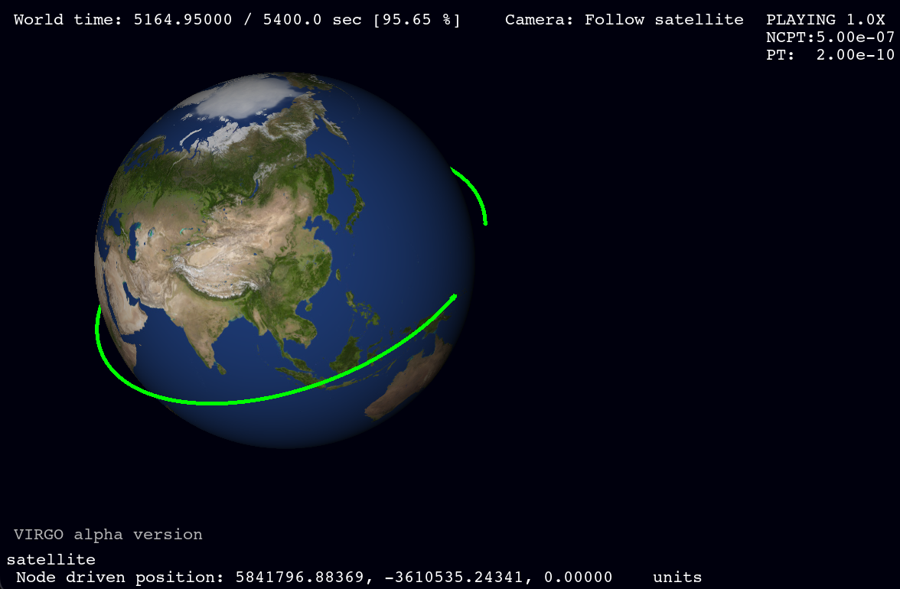
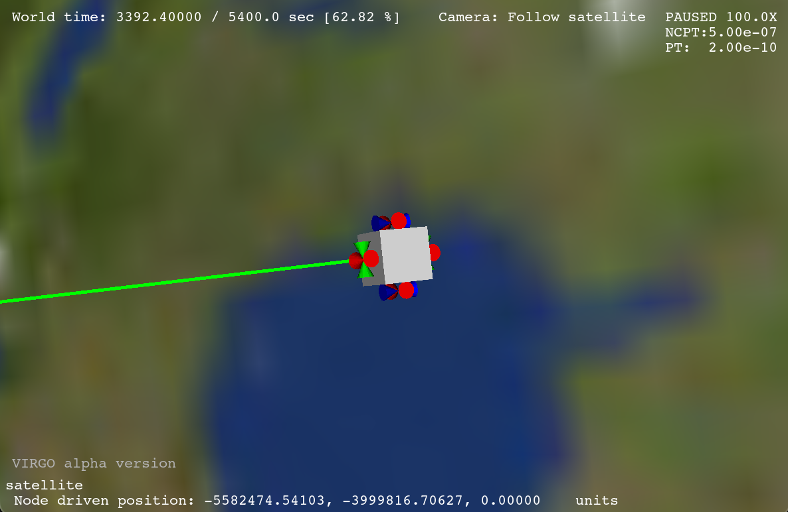

# VIRGO

VIRGO: **V**ersatile **I**maging and **R**endering for **G**alactic **O**perations. A Practical, Analytical, and Hardworking 3D Visualization tool for simulation data leveraging python-VTK.  Designed by and for engineers at NASA JSC (Johnson Space Center), VIRGO gives users insight into simulation data when typical 2D plots are insufficient. This project is developed specifically for engineers in the GNC division of the Engineering Directorate but aims to provide functionality for the [Trick](https://github.com.nasa/trick)-using community and beyond. 




VIRGO is an extensible, well-tested, and robustly documented python module which can consume simulation data in different ways. The simplest data source supported is a typical `*.csv`  (comma-separated-value) text file containing a time history of object positions in 3D space. For example, imagine you had a file `log_state.csv` that describes the motion of a satellite in space and looks like this:

```csv
time (s),  position[0] (m),  position[1] (m),  position[2] (m),
     0.0,              0.0,              0.0,              0.0, 
     1.0,              1.0,              1.0,              1.0, 
     2.0,              2.0,              2.0,              2.0, 
     3.0,              3.0,              3.0,              3.0, 
     4.0,              4.0,              4.0,              4.0, 
```
VIRGO can read this file and playback the position of the object described by the `position` array over the timeframe 0.0 - 4.0 seconds. In this example the x-position is `position[0]`, y-position is `position[1]`, and z-position is `position[2]` . In VIRGO terminology this file is considered a simple **data source**.

The **scene** defines what **actors** (the rendered objects) look like and links that object to a **data source**. VIRGO defines scenes using YAML files that look like this:

```yaml
# This section defines what objects (actors) are in the scene
# In this example there is only one actor named satellite
actors:
  satellite:           # User-defined name for this actor
    mesh: PREFAB:cube  # 3D representation of the object, a cube
    scale: 1.0         # The cube is 1 unit wide/tall/deep
    # This subsection defines what data source alias drives the actor
    driven_by:
      time: time       # Time is defined as time: from section below
      pos: sat_pos     # Position is defined as sat_pos alias

# This section defines what to read from a trickpy data source
data_source:
  trickpy:
    time: 
      group: state # 'state' comes from log_state.csv
      var: time    # The name for time (1st column 1st row of log_state.csv)
    sat_pos:       # User-defined alias for satellite x,y,z position values
      group: state       # 'state' comes from log_state.csv
      var: position[0-2] # Variables comprising sat_pos alias
```

**TODO: add image or video of this cube moving through space.**

## Module Dependencies

This module requires python3.11 or later and the `pip` packages listed in `requirements.txt`. To pull down these packages to a standard python3.11 virtual environment run the following in the directory you wish to create the `.venv`:
```bash
# Create a python3 virtual environment
python3.11 -m venv .venv && source .venv/bin/activate 
# Install virgo dependencies
pip3 install --upgrade pip && pip3 install -r requirements.txt
```
Once the `.venv` is created, you can source the environment in any shell before running scripts using VIRGO:

```bash
source .venv/bin/activate
```

## Contributing

TBD

