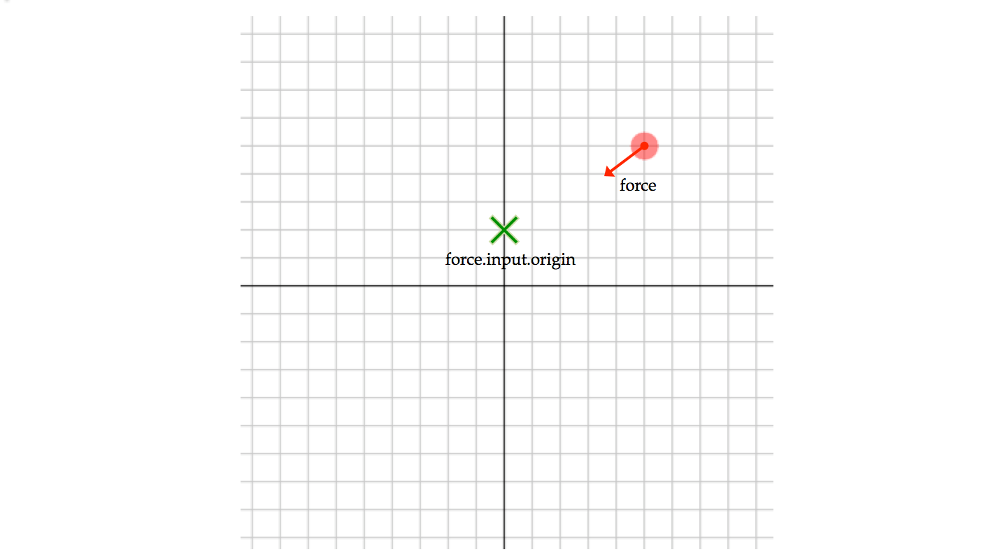
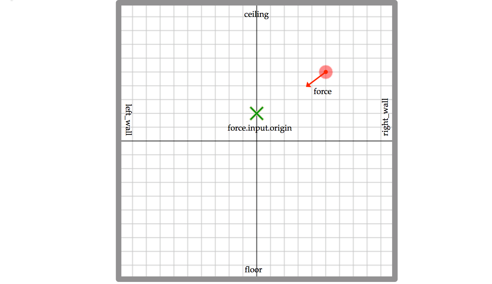

# Ball Sims

## SIM\_ball\_L1

This is a simulation of a ball under the influence of a force field. 
The force on the ball is of constant magnitude, and always directed
toward a fixed point.

#### Inputs
|   Parameter                  | Units | Default |
|:---------------------------- |:-----:|:-------:|
| ball.force.input.origin[2]   |   m   | { 0.0, 2.0 } |
| ball.force.input.force       |   N   |   8.0   |
| ball.state.input.mass        |   kg  |   10.0  |
| ball.state.input.speed       |  m/s  |   2.0   |
| ball.state.input.elevation   |  rad  |   45 &#xB0; x (180/&#x3C0;)  |
| ball.state.input.position[2] |   m   | { 5.0, 5.0 }  |

#### Outputs
|   Parameter                       | Units |
|:--------------------------------- |:-----:|
| ball.state.output.position[2]     |   m   |
| ball.state.output.velocity[2]     |   m   |
| ball.state.output.acceleration[2] |   m   |

## SIM\_ball\_L2

This simulation is a derivation of SIM\_ball\_L1. It uses Trick "dynamic-events" to simulate walls, off of which the ball can bounce.

#### Inputs 
*(In addition to those of SIM\_ball\_L1)*
These parameters define the coordinates of the walls.

|   Parameter                         | Units | Default |
|:----------------------------------- |:-----:|:-------:|
| ball.force.input.floor\_y\_pos      |   m   |  -10.0  |
| ball.force.input.right_wall\_x\_pos |   m   |   10.0  |
| ball.force.ceiling\_y\_pos          |   m   |   10.0  |
| ball.force.left_wall\_x\_pos        |   m   |  -10.0  |

The outputs are the same as those of SIM\_ball\_L1.

## SIM\_ball\_L3

This simulation is a derivation of SIM\_ball\_L2. The SIM\_ball\_L3 S_define instanciates two ballSimObject's rather than just one.