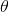
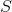
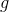
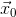
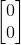
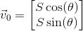
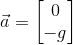
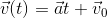
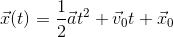
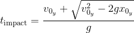

# SIM\_cannon\_analytic

---

This is first of eight Trick-based simulations that one builds in the Trick
Tutorial (Section 4). It's purpose is to introduce some of the fundamentals
of building a Trick simulation.

Here we simulate the flight of a cannon ball. We want to know the position and
velocity of the cannon ball over time, given an initial position, and
velocity, and subject to the following assumptions and limitations:

* The **only** force acting on the cannon ball is gravity.
* The acceleration of gravity (g) is **constant** and equal to -9.81 meters per
  second squared.
* The surface of the ground is defined as where y=0.

## Parameterization 
The following parameters are given default values in a "default_data" job called 
**cannon\_default\_data**. Their values can be changed in the **input.py** file.

| Name             | Sim Variable           | Type      | Units   |  Symbol                           | default |
|------------------|------------------------|-----------|---------|:---------------------------------:|---------|
| Barrel Angle     | dyn.cannon.init\_angle | double    | radians |   | 30*(&#x3C0;/180) |
| Speed            | dyn.cannon.init\_speed | double    | m/s     |       | 50.0             |
| Gravity          | dyn.cannon.g           | double    | m/s     |           | 9.81            | 
| Initial Position | dyn.cannon.pos0        | double[2] | m       |   |  |

## Initialization
The initial velocity is calculated in an "initialization" job.

|     Name         | Sim Variable    | Type      | Units | Calculation                   |
|------------------|:----------------|-----------|-------|-------------------------------|
| Initial Velocity | dyn.cannon.vel0 | double[2] | m/s   |  |

## State Propagation
For each time-step, the following are calculated in a "scheduled" job. Though acceleration is
constant in this simulation, it usually isn't for "F=ma" type simulations.

|     Name         | Sim Variable   | Type      | Units     | Calculation                      |
|------------------|:---------------|-----------|-----------|----------------------------------|
| Acceleration     | dyn.cannon.acc | double[2] | m/s&#xB2; |      |
| Velocity(t)      | dyn.cannon.vel | double[2] | m/s       |  |
| Position(t)      | dyn.cannon.pos | double[2] | m         |  |

## Calculating When the Ball Impacts the Ground.
The cannon ball will impact the ground, when y-element of the position vector is zero.

|     Name         | Sim Variable          | Type   | Units | Calculation                    |
|------------------|:----------------------|--------|-------|--------------------------------|
| Time of Impact   | dyn.cannon.impactTime | double | s     |  |

<!--
t_{\textrm{impact}} = \frac{ -v_{0_y} - \sqrt{v_{0_y}^2 - 2 g x_{0_y} }}{g}
-->

