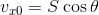
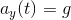
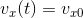
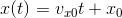
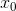
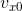
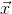
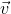

# SIM\_cannon\_analytic
---
This is first of eight Trick-based simulations that one builds in the Trick
Tutorial (Section 3). It's purpose is to introduce some of the fundamentals
of building a Trick simulation.

Here we simulate the flight of a cannon ball. We want to know the position and velocity of the cannon ball over time, given an initial position, and
velocity, and subject to the following assumptions and limitations:

* The **only** force acting on the cannon ball is gravity.
* The acceleration of gravity (g) is **constant** and equal to -9.81 meters per
  second squared.
* The surface of the ground is defined as where y=0.

### Solution

This problem has a closed-form solution, so that's what is used.

<!--
Tex: v_{x0}=S\cos\theta
-->

<!--
Tex: v_{y0}=S\sin\theta
-->

The cannon ball will impact the ground, when y(t)=0 at:

### CANNON Object
Model Variable                              | Simulation Variable | Type    | Units
--------------------------------------------|---------------------|---------|-------
,     | CANNON.pos0[2]      |double[2]| m
, | CANNON.vel0[2]      |double[2]| m/s
           | CANNON.init\_angle  |double   | r
                | CANNON.init\_speed  |double   | m/s
             | CANNON.pos[2]       |double[2]| m
             | CANNON.vel[2]       |double[2]| m/s

