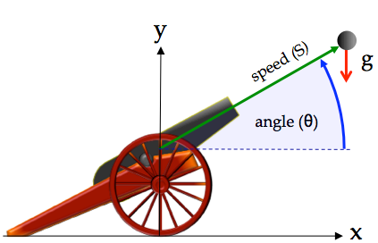

# SIM\_cannon\_integ

### The Simulation

This is a simulation of a cannon shooting a cannonball. Given the initial position of the cannon ball, the muzzle velocity (speed) of the cannon ball, and the elevation angle of the cannon barrel the simulation computes the cannon ball's trajectory and time of impact with the ground.

The acceleration of gravity is assumed to be -9.81 m/s2.

 
 
 
 
