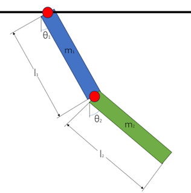

# Double Compound Pendulum 

 

A double compound pendulum is a mechanical system consisting of two bodies, one which is attached to a fixed base on one end and the other which is attached to the loose end of the first. “Compound” refers to the fact that the mass of the system is not concentrated completely at one point. These pendulums are both free to rotate about their attachment point, provided they maintain the above constraints. 

## Simplifications 

SIM_DoubleCompoundPendulum will neglect the effects of friction and air resistance. We present a classic example of a chaotic system, as slight variations in initial values can cause drastic differences and unpredictable behavior long term. 

The purpose of this sim is to model a double compound pendulum’s movement and at any given point calculate: 

1.  Angular momentum 

2.  Potential energy 

3.  Kinetic energy 

4.  Total energy 

In this simulation, you can set the initial conditions to what you’d like, and the equations within the sim will simulate how the simulation will behave given the starting conditions. 

## Changing Inputs to the Simulation 

Go to the input file from the SIM_DoubleCompoundPendulum directory 

    vi RUN_DoubleCompoundPendulum/input.py/ 

In this file is where you can change the starting angle of the system, the mass values, the lengths of the masses, and the simulation run time.

## Building and Running the Simulation 

In order to build a Trick simulation, the Trick-specific command **`trick-CP`** must be run to begin compilation process. **`trick-CP`** is located in the Trick `bin` directory. Run the **`trick-CP`** command in the SIM_DoubleCompoundPendulum directory. Upon successful compulation, the following message will be displayed in the terminal: 

    === Simulation make complete === 
To run, type in the terminal while in the SIM_DoubleCompoundPendulum directory: 

    %S_main_*.exe RUN_test/input.py 

## Kinematics of the System

To  the motion of this pendulum, we start by getting the kinematic equations associated with it. The following equations present the position in the x and y directions of the center of mass of each mass on the pendulum. 

 

 

Once you have these values, you can differentiate them in order to derive the velocity of each pendulum: 

 

 

Finally, you can use these values to derive the potential and kinetic energy of the system. 

### Energy in the System 

#### Potential Energy 

The general equation for potential energy: 

 

Can be applied to our simulation by just plugging in the values we have for the y components of position. 

 

For the purpose of simplicity in coding, we included 2 variables to make the potential energy equation less hairy. 

Hence: 

 

 

#### Kinetic Energy 

When deriving kinetic energy there is both translational and rotational energy, and the equation must account for both. Hence the general equation for kinetic energy is as follows. 

 

If we plug in the position, velocity, and inertia for a slim rod where they belong in this equation, we arrive at an equation for kinetic energy as follows. 

 

Using the following trigonometric identities as well as variables to simplify the equation 

 

 

We arrive at the equation used in the simulation. 

 

## Angular Momentum 
Angular Momentum is equal to inertia times the angular velocity of an object. As such, our equation for inertia comes out to:

## Results with Default Parameterization

