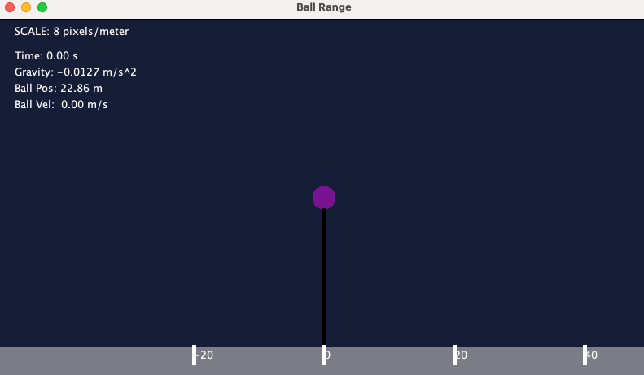

# New Years Eve Balldrop Simulation

The New Years Eve Ball is 75 feet high and takes 60 seconds to descend. This simulation allows a demonstration of the force of gravity assuming all other forces are negligable.



## Building the Simulation

1. Build the simulation excecutable.
   
```bash
cd SIM_balldrop
```

```bash
trick-CP
```

3. Build the graphics client.
   
```bash
cd models/graphics
```

```bash
make
```

## Running the Simulation

1. Run the simulation .exe accoording the the input file.
   
```bash
cd ../../../SIM_balldrop
```

```bash
./S_main_*.exe RUN_test/input.py
```

## Dynamics Model

The force acting on our ball will be gravity only.

To determine the position of the ball, we use the fundamental kinematics equations that $v = at\$ and $\text{pos} = \frac{1}{2}at^2 \$
