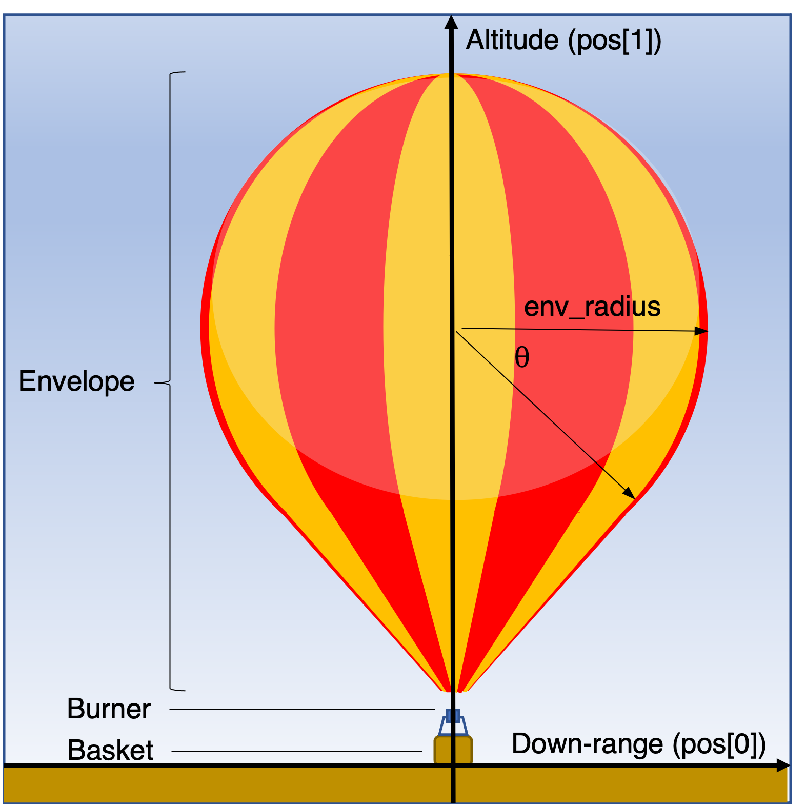
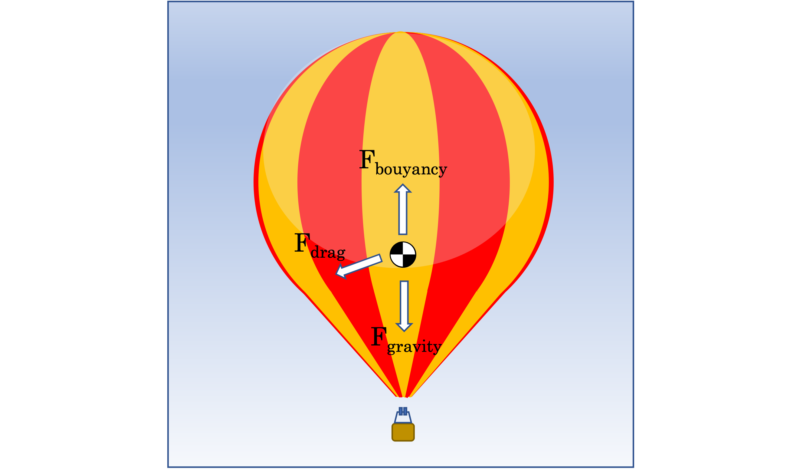
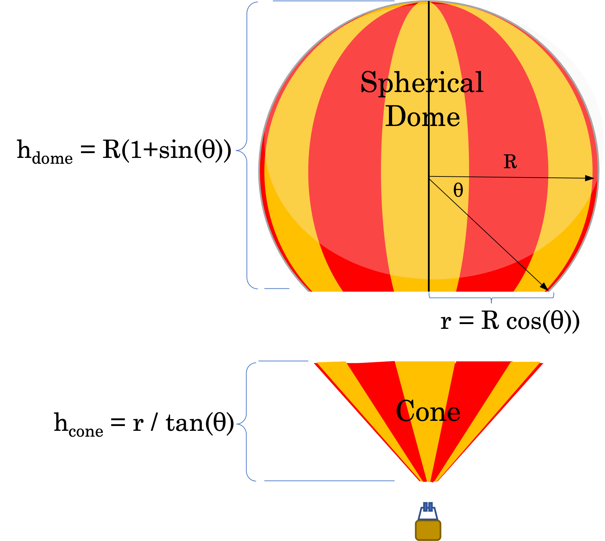

# Hot-Air Balloon Simulation
A hot-air balloon is a lighter than air air-craft consisting of 1) an envelope (the big air-bag), 2) a burner system to heat the air in the envelope, and 3) a basket to carry fuel and passengers.

As the air inside the envelope is heated it becomes less dense than the cooler outside air, making the balloon more buoyant. This is how we will control the balloon, by changing the temperature of the air in the balloon’s envelope.




The characteristics of the outside-air will be determined using a static atmospheric model called the US Standard Atmosphere.

The forces acting on our balloon will be those of gravity, buoyancy and aerodynamic drag.



To determine the balloon’s motion, we first need to know it’s acceleration. We can determine this by calculating and summing the forces acting on the balloon, and then dividing that sum by the balloons total mass.


To help us calculate these forces we’ll use a static atmosphere model called The US Standard Atmosphere.

To find the state of the balloon, we integrate acceleration over time to get velocity. We then integrate velocity over time to get position.

## Force of Gravity
Applying the acceleration of gravity to Newton’s 2nd Law:


At sea-level, **g** is around 9.81 m/s2. But as altitude increases **g** decreases. To determine **g** for a given altitude we’ll use the ```US_STD_gravity()``` function from the provided function library.

### Balloon Mass

The total balloon mass is the sum of the fixed mass and the mass of the heated air inside the balloon envelope.


#### Balloon Fixed Mass
The fixed mass is simply the sum of the balloon component masses:

| Balloon Component    | mass     |
|----------------------|----------|
| Envelope.            | 113.4 kg |
| Basket               | 63.5 kg  |
| Burner System        | 206.4 kg |
| Payload (passengers) | 300.0 kg |
| -------------------- | ---------|
| **m_fixed**          | **683.3 kg** |


### Mass of Air in the Balloon

The mass of the air in the balloon envelope is the product of the volume of the balloon envelope and the density of the heated air within the envelope.


### Balloon Volume

To calculate the volume the the balloon, we separate the balloon into two parts: 1) a spherical dome and 2) a cone.


**R** represents the radius of the spherical part. **&#x3B8;** represents angle at which the spherical part of the balloon transitions to the cone. The height (h) for each of the spherical and conical parts is given shown in the diagram. They are each used in their respective volume calculations below.

The volume of the spherical dome is:


The volume of the cone is:


The total volume of the envelope is the sum of the two component volumes.


### Air Density
To calculate air density (𝝆) we use the following form of the Ideal Gas Law.


* p is just the standard pressure (in pascals) at the balloon's current altitude. Use ```US_STD_pressure(altitude)```.
* R-{air} is the specific gas constant for dry air. R-{air} = 287.055 J/kg K
* T is the temperature of the gas in kelvin. The conversion from Celsius to kelvin is T-kelvin = T-celcius + 273.15.

## Force of Buoyancy

Buoyancy is a force on an object, that opposes gravity, by a fluid within which it’s immersed. This force is equal to the mass of the displaced fluid times the acceleration of gravity.


Here, we can do that same calculation for air mass as before, using
Eq#4, but this time with 𝝆 = US_STD_density(altitude), which assumes U.S Standard temperature at the given altitude.


## Force of Drag

As the balloon moves upward, or downward, it will be subjected to an atmospheric drag force. Drag is a function of the balloon’s shape [
presented by the coefficient of drag (Cd)], the density of the air (𝝆), and the cross-sectional area (A) perpendicular to the velocity (v). The drag force points in the opposite direction as the velocity.


For our balloon, we’ll assume Cd = 0.5, the coefficient of drag for a sphere.
Since the balloon will be moving through our “standard atmosphere” 𝝆 = ```US_STD_density(altitude)```.

We’ll calculate the cross-sectional area (A) from the radius of the spherical portion of our balloon.


