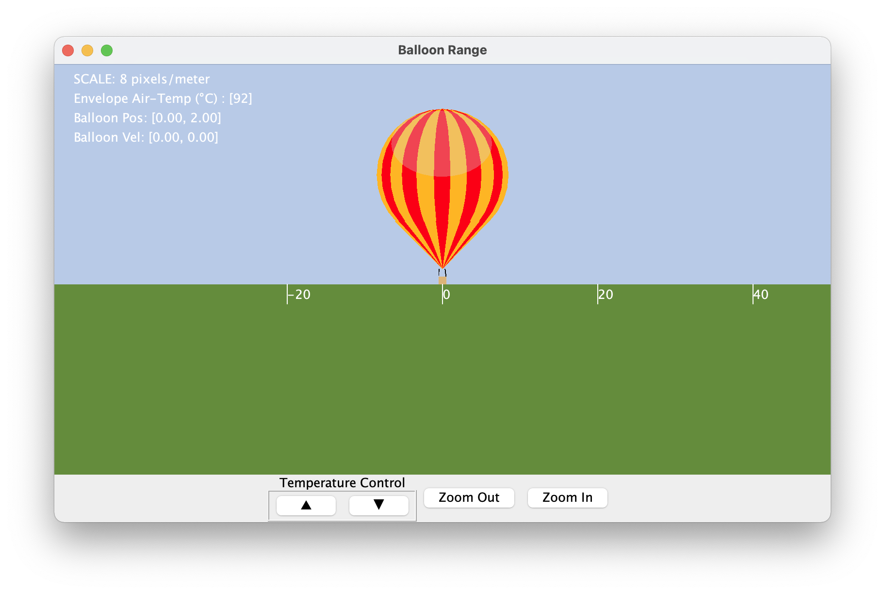

# Hot-Air Balloon Simulation
A hot-air balloon is a lighter than air aircraft consisting of

1. an envelope (the big air-bag),
2. a burner system to heat the air in the envelope, and
3. a basket to carry fuel and passengers.

The motion of the balloon is controlled by changing the temperature of the air within the envelope. As the temperature of the air within the envelope increases, its density, and therefore its mass decreases. When the total mass of the balloon becomes less the mass of the cooler outside air that it displaces, the balloon ascends.


## Building the Simulation
In the ```SIM_balloon``` directory, type **```trick-CP```** to build the simulation executable. When it's complete, you should see:

```
=== Simulation make complete ===
```
Now **cd** into ```models/graphics/``` and type **make**. This builds the graphics client for the simulation.

## Running the Simulation
In the SIM_balloon directory:

```
% S_main_*.exe RUN_test/input.py
```
The Sim Control Panel, and a graphics client called "Balloon Range" should appear.

Click the Start on the Trick Sim Control Panel.

## U.S. Standard Atmosphere Model

The US Standard Atmosphere is a static model of pressure, temperature, density, gravitational acceleration, and viscosity as functions of altitude. 

In the ```models/atmosphere``` directory of SIM_balloon we've implemented the following four C-language functions using data found at [www.engineeringtoolbox.com](https://www.engineeringtoolbox.com/standard-atmosphere-d_604.html). The functions are valid for altitudes between -1000 meters and 80,000 meters.

```double US_STD_density( double alt_m);```

Returns atmospheric density (kg/m3) at the given altitude (m).

```double US_STD_gravity( double alt_m);```

Returns acceleration of gravity (m/s2) at the given altitude (m).

```double US_STD_temperature( double alt_m);```

Returns atmospheric temperature (℃) at the given altitude (m).

```double US_STD_pressure( double alt_m);```

Returns atmospheric pressure (pascals) at the given altitude (m).

## Dynamics Model

The forces acting on our balloon will be those of gravity, buoyancy and aerodynamic drag.


To determine the balloon’s motion, we first need to know it’s acceleration. We can determine this by calculating and summing the forces acting on the balloon, and then dividing that sum by the balloons total mass.

<a id=Equation-1></a>


To help us calculate these forces we use the US Standard Atmosphere model described above.

To find the state of the balloon, we integrate acceleration and velocity, over time, to get velocity and position.

---

### Force of Gravity

Applying the acceleration of gravity to Newton’s 2nd Law:

<a id=Equation-2></a>


At sea-level, **g** is around 9.81 m/s2. But as altitude increases **g** decreases. To determine **g** for a given altitude we use the ```US_STD_gravity(altitude)``` function from the atmosphere model library.

#### Balloon Mass

The total balloon mass is the sum of the fixed mass and the mass of the heated air inside the balloon envelope.

<a id=Equation-3></a>


##### Balloon Fixed Mass

The fixed mass is simply the sum of the balloon component masses:

| Balloon Component    | mass (m)   |
|----------------------|-----------:|
| Envelope             |   113.4 kg |
| Basket               |    63.5 kg |
| Burner System        |   206.4 kg |
| Payload (passengers) |   300.0 kg |
| -------------------- | -------------|
| **m<sub>fixed</sub>**| **683.3 kg** |

#### Mass of Air in the Balloon

The mass of the air in the balloon envelope is the product of the volume of the balloon envelope and the density of the heated air within the envelope.

<a id=Equation-4></a>


#### Balloon Volume

To calculate the volume the the balloon, we separate the balloon into two parts:

1. a spherical dome and
2. a cone.


**R** represents the radius of the spherical dome. **&#x3B8;** represents angle at which the spherical dome transitions to the cone. The height (h) for each of the spherical and conical parts is given shown in the diagram. They are each used in their respective volume calculations below.

The volume of the spherical dome is:

<a id=Equation-5**></a>


The volume of the cone is:

<a id=Equation-6></a>


The total volume of the envelope is the sum of the two component volumes.

<a id=Equation-7></a>


#### Air Density
To calculate air density (𝝆) we use the following form of the Ideal Gas Law.

<a id=Equation-8></a>


* p is just the standard pressure (in pascals) at the balloon's current altitude. Use ```US_STD_pressure(altitude)```.
* R<sub>air</sub> is the specific gas constant for dry air. R<sub>air</sub> = 287.055 J/kg K.
* T is the temperature of the gas in kelvin. The conversion from celsius to kelvin is T<sub>kelvin</sub> = T<sub>celsius</sub> + 273.15.

---

### Force of Buoyancy

Buoyancy is a force on an object, that opposes gravity, by a fluid within which it’s immersed. This force is equal to the mass of the displaced fluid times the acceleration of gravity.

<a id=Equation-9></a>


Here, we can do that same calculation for air mass as before, using
[Equation #4](#Equation-4), but this time with 𝝆 = ```US_STD_density(altitude)```, which assumes U.S Standard temperature at the given altitude.

---

### Force of Drag

As the balloon moves upward, or downward, it will be subjected to an atmospheric drag force. Drag is a function of the balloon’s shape [ represented by the coefficient of drag (C<sub>d</sub>) ], the density of the air (𝝆), and the cross-sectional area (A) perpendicular to the velocity (v). The drag force points in the opposite direction as the velocity.

<a id=Equation-10></a>


For our balloon, we’ll assume C<sub>d</sub> = 0.5, the coefficient of drag for a sphere.
Since the balloon will be moving through our “standard atmosphere” 𝝆 = ```US_STD_density(altitude)```.

We’ll calculate the cross-sectional area (A) from the radius of the spherical portion of our balloon.

<a id=Equation-11></a>


## Graphics

Before running the simulation, the graphics client needs to be compiled. ```cd``` into ```models/graphics```, and run ```make```.



When the simulation is run, the client will automatically be launched.

## References

* [https://www.engineeringtoolbox.com/molecular-mass-air-d_679.html](https://www.engineeringtoolbox.com/molecular-mass-air-d_679.html)
* [https://www.engineeringtoolbox.com/standard-atmosphere-d_604.html]
(https://www.engineeringtoolbox.com/standard-atmosphere-d_604.html)
* [https://en.wikipedia.org/wiki/Ideal_gas_law]
(https://en.wikipedia.org/wiki/Ideal_gas_law)
* [https://en.wikipedia.org/wiki/Hot-air_balloon]
(https://en.wikipedia.org/wiki/Hot-air_balloon)
* [https://www.balloon-rides.com/atics-facts.htm]
(https://www.balloon-rides.com/atics-facts.htm)
