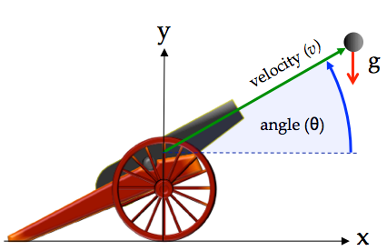
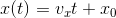
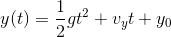
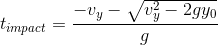
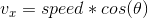
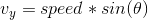

#SIM\_cannon\_analytic
---
This is first of eight Trick-based simulations that one builds in the Trick
Tutorial (Section 3). It's purpose is to introduce the fundamentals of building
a Trick simulation.

Here we simulate the flight of a cannon ball, given an initial position, and
velocity subject to the following assumptions and limitations:

* The **only** force acting on the cannon ball is gravity.
* The acceleration of gravity (g) is constant and equal to -9.81 meters per
  second squared.
* The surface of the ground is defined as where y=0.

--
### Approach

Since this problem has a closed-form solution, that's what we use :

The time when the cannon ball impacts the ground is:

--
### Inputs
Variable               | Type           | Units
-----------------------|----------------|-------
dyn.cannon.pos0        | double[2]      | m
dyn.cannon.init\_angle | double         | r
dyn.cannon.init\_speed | double         | m/s

The initial velocity is :

,

--
### Outputs
Variable               | Type           | Units
-----------------------|----------------|--------
dyn.cannon.pos         | double[2]      | m
dyn.cannon.vel         | double[2]      | m/s
