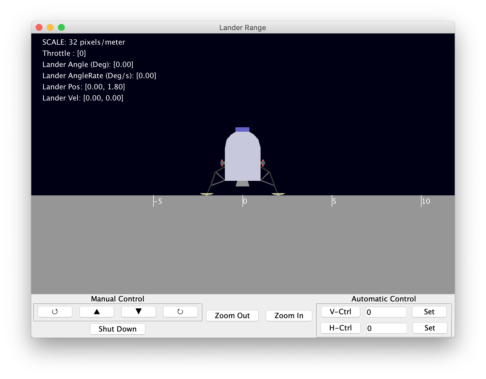
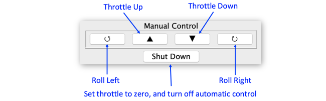
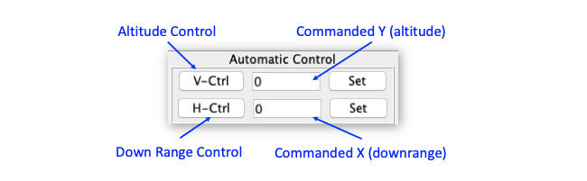

# SIM_lander


SIM_lander simulates a lunar lander, with manual and automatic controls.

### Building the Simulation
In the SIM\_lander directory, type **trick-CP** to build the simulation executable. When it's complete, you should see:

```
=== Simulation make complete ===
```
Now **cd** into models/graphics/ and type **make**. This builds the display client for the simulation.

### Running the Simulation
In the SIM_lander directory:

```
% S_main_*.exe RUN_test/input.py
```
The Sim Control Panel, and a GUI called "Lander Range" should appear.

Click the Start on the Trick Sim Control Panel.



Using the controls shown below have fun!






## Initial Conditions
To set the initial state of the lander, edit the following variables in the input file.

Variable                                  | Type           | Units
------------------------------------------|----------------|-------
dyn.lander.pos                            | double[2]      | m
dyn.lander.vel                            | double[2]      | m
dyn.lander.angle                          | double         | rad
dyn.lander.angleDot                       | double         | rad/s
