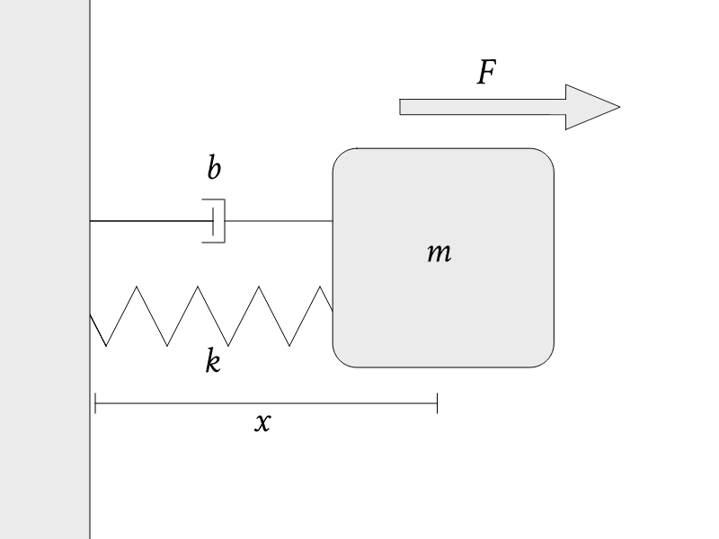
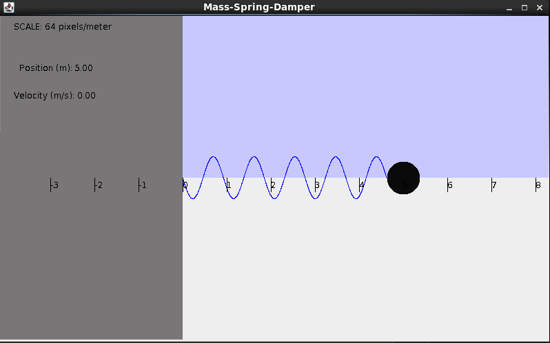
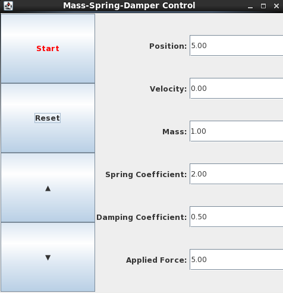

# SIM_MSD

SIM\_MSD is a simulator for a mass-spring-damper system.



 The system is described by the equation _mẍ_ + _bẋ_ + _kx_ = _F_, where:

 _m_ is the mass of an object.

 _x_ is the position of the mass.

 _b_ is the damping coefficient.

 _k_ is the spring coefficient.

 _F_ is an external force applied to the mass.

---
### Building the Simulation

In the SIM_MSD directory, execute **trick-CP** to build the simulation executable. When it's complete, you should see:

```
=== Simulation make complete ===
```

Now **cd** into models/Graphics/ and type **make**. This builds the display client for the simulation.

### Running the Simulation
In the SIM_MSD directory:

```
% ./S_main_*.exe RUN_test/input.py
```

The following windows should appear:





### Controlling the Simulation
Click **Start** to begin the simulation.

Click **Reset** to freeze the simulation and reset the position and velocity to
their initial conditions.

Change **Position** and **Velocity** to adjust the initial conditions for those
attributes.

Change **Mass**, **Spring Coefficient**, **Damping Coefficient**, and **Applied
Force** to adjust initial conditions _**and**_ also update the sim in real-time.


---
The following inputs can be set in any of the RUN_*/input.py files to change
the inputs on startup
### Inputs

Variable    | Type      | Units | Default Value
----------  |-----------|-------|--------------
dyn.msd.x_0 | double    | m     | 5.0
dyn.msd.v_0 | double    | m/s   | 0.0
dyn.msd.b   | double    | N.s/m | 0.5
dyn.msd.k   | double    |  N/m  | 2.0
dyn.msd.F   | double    | N     | 5.0
dyn.msd.m   | double    | kg    | 1.0

---
Some sample input.py files have been created to demonstrate different
mass-spring-damper conditions
### Samples

Path                    |Type
------------------------|----------------------------------------------
RUN_underdamp/input.py  |Underdamped Harmonic Oscillator
RUN_critdamp/input.py   |Critically Damped Harmonic Oscillator
RUN_overdamp/input.py   |Overdamped Harmonic Oscillator
RUN_nodamp/input.py     | Simple Harmonic Oscillator (No Damping Force)
