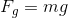
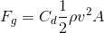
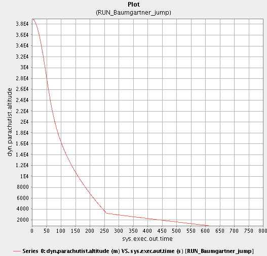

# SIM_parachute

### Background
On October 14, 2012, 43-year-old Austrian daredevel Felix Baumgartner broke the
world record for the highest-ever skydive after jumping from a balloon at an
altitude of 127,852 feet. He reached a top speed of 843.6 mph, spent approximately
4 minutes 19 seconds in free-fall, and landed safely approximately 11 minutes
after jumping.

### Simulation
The simulation only considers the forces of gravity and drag, and only motion in
the vertical. The acceleration of the skydiver is determined by summing the
forces of gravity and drag acting on him and then dividing by his mass. His
velocity is determined by integrating his acceleration over time, and his
altitude by integrating his velocity over time.

Desired outputs are:
* Plot of altitude vs. time.
* Plot of velocity vs. time.
* Time of touchdown.

##### Gravity

Where:

* m = mass of the skydiver.
* g = acceleration of gravity.

##### Drag

Where:

* Cd = Coefficient of drag
* &#0961; = air density
* v = instantaneous velocity
* A = cross-sectional area of the jumper

#### Air Density and Gravity Data
The table at:
<http://www.engineeringtoolbox.com/standard-atmosphere-d_604.html>
provides both gravity (g) and air density (&#0961;) at various altitudes.
From these data we interpolate, to approximate the air density and gravity at
specific altitudes.

#### Parachute Deployment
Parachute deployment is modeled, using a Trick event (in input.py) that simply
increases the skydiver's

1. cross-sectional area (A) and
2. coefficient of drag (Cd).

at the specified time.

### Felix Baumgartner Jump Scenario

* dyn.groundAltitude = 1000
* dyn.parachutist.altitude = 38969.6 meters
* dyn.parachutist.velocity = 0.0
* dyn.parachutist.area = 0.75
* dyn.parachutist.Cd = 0.75
* dyn.parachutist.mass = 82.0

At 4 minutes and 19 seconds, pop the chute:

* dyn.parachutist.Cd = 1.3
* dyn.parachutist.area = 30.0

#### Results

##### Altitude vs Time

##### Velocity vs Time

