# Planar Robotic Manipulator Simulation

SIM_robot is a 2-dimensional planar robotic simulation of a 2 degree of freedom manipulator.  It is a kinematic simulation, which means that it concerns itself solely with the position and velocity of the links but does not model or account for forces and torques.  This helps keep the simulation more simple and easier to comprehend, while also providing the necessary framework to serve as an adequate example of the general layout of a robotics simulation.  The controller described below and implemented in the simulation is both simple and extremely common.  It is used extensively in both kinematic and dynamic robotic modeling and control.

The simulation calculates both forward and inverse kinematics and implements some common control schemes to allow the user to control the manipulator in a variety of ways.  Only the tip (or end-effector) position of the manipulator is controlled, not the orientation of the last link.

Included is a graphics and user interface client which allows the user to view the motion of the robotic arm in the sim and to send moding and control inputs to the manipulator in real time.  A circle indicates the maximum extent of the workspace of the manipulator.


## Building the Simulation
In order to build a Trick simulation, the Trick-specific command **```trick-CP```** must be run to begin compilation process.  **```trick-CP```** is located in the Trick ```bin``` directory.  Run the **```trick-CP```** command in the SIM_robot directory.  Upon successful compilation, the following message will be displayed in the terminal:

```
=== Simulation make complete ===
```

The assocated graphics/user interface client should also be built automatically.

## Running the Simulation
In the SIM_robot directory:

```
% S_main_*.exe RUN_test/input.py
```
The Sim Control Panel, and a graphics client called "Robot Range" should appear.

The sim will come up in Freeze mode.  Click Start on the Trick Sim Control Panel and the simulation time should start advancing.

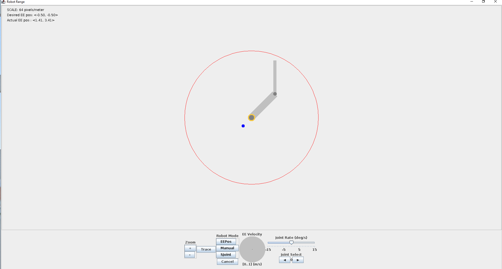


## User Control Options

There are three control modes available for this manipulator:  Single, Manual, and EEPos.  Each will be described below.  Furthermore, the gui provides a toggle to enable tracing the end-effector (or tip) position.

### Single Joint Mode
**Single Joint Mode** is the most straightfoward control mode in the simulation.  It simply commands a selected joint to move with the angular velocity commanded.  The user interface provides a button to select Single as your mode, a Joint select button to choose the desired joint, and a slider to command a desired joint velocity.

### Manual Mode
**Manual Mode** enables control of the motion of the end-effector with a desired velocity.  This mode commands the end-effector to move in the desired direction at the desired rate until either the velocity command is changed or the arm reaches a singularity (described below).  The gui has an "EE Velocity" interface for interacting in this mode.  The gray circle is like a dial, where the angle and location of the selected point in the circle determine the commanded direction and rate of the end-effector.  For example, clicking directly underneath the center of the circle on the edge will command the end-effector to move straight down as fast as the mode allows.  This input can be changed while moving, allowing the user to maneuver the end-effector however they see fit in real time.

### End-Effector Position Mode
**End-Effector Position Mode** commands the end-effector to autonomously move to the selected point in the workspace.  The user clicks anywhere on the gui display and the end-effector will attempt to move to that location.  Clicking elsewhere on the gui will change the selected position and the manipulator will begin moving towards the new one.  Singularities and reach limits may prevent it from reaching the point, however.  The manipulator makes no effort to avoid these as a lesson in owning the consequences of one's actions.

## Kinematics of the System
The kinematics of a robotic manipulator describe both the position and velocity of the manipulator at any point on the robot.  Kinematics do not include accelerations, forces, or moments in their description.

In this sim, we will discuss both forward and inverse kinematics.  Forward kinematics give the position/velocity of any location of interest on the manipulator given a set of joint angles/velocities.  Inverse kinematics go in the reverse:  Given a desired location/velocity for some point of interest on the manipulator, the equations supply the necessary joint angles/velocities.

The position of the end-effector is highly non-linear and heavily coupled with respect to the joint angles required to produce said position.  However, the velocity of the end-effector is linearly related to the joint velocities required to produce it, which forms the basis of the controller described below.  The non-linearity of the position equations, and the linearity of the velocity equations, will be shown in the next sections.

For a robotic system, the number of directions the end-effector can move is determined by the number of degrees of freedom, i.e. the number of joints, and how they are layed out.  In general, each joint allows motion in another direction.  This two degree-of-freedom manipulator can move in $x$ and $y$, but not $Z$.  Adding more degrees of freedom than you need to move in all your desired directions makes a system *kinematically redundant*, and while those are super fun and interesting, they are beyond the scope of this tutorial.


### How to Layout Points, Frames, and Joint Angles
The position of the end-effector relative to some fixed Base frame location can be calculated by knowing the joint angles of the manipulator and the lengths of the manipulator links.  First we will assign some points of interest along the manipulator that need to be kept track of during the forward kinematics calcualtions.  We will define the point around which the first link's rotation is centered as point $a$, the point of the second link's rotation $b$, and the tip of the manipulator (our end-effector) as $e$.  The distance between $a$ and $b$ will be defined as $L1$ and between $b$ and $e$ as $L2$.

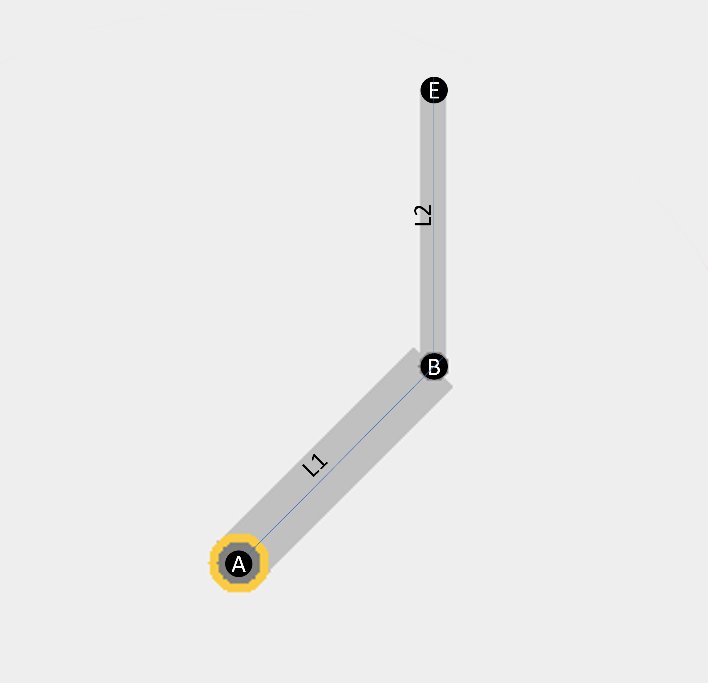

But points of interest are of no use without frames of reference, so we need to define some frames in which we can define the relative locations of these points.  Let's define a fixed, static Base (or Origin) frame O centered on point $a$.  This frame will give us a reference frame to keep track of the location of points $a$, $b$, and $e$.  Point $a$ is fixed, point $b$ moves when the first joint angle changes, and point $e$ moves when either joint angle changes.  We need to keep track of how the links change their orientation with respect to both the base frame O and to each other.  To do this we define reference coordinate frames to each link that move along with it.  The convention for this sim is to point the X-axis of each frame along the length of these straight links, so that the X-axis points from each point of interest to the next ($a$ to $b$, $b$ to $e$).  Frame O is fixed, allowing a constant reference frame to refer back to at any time.

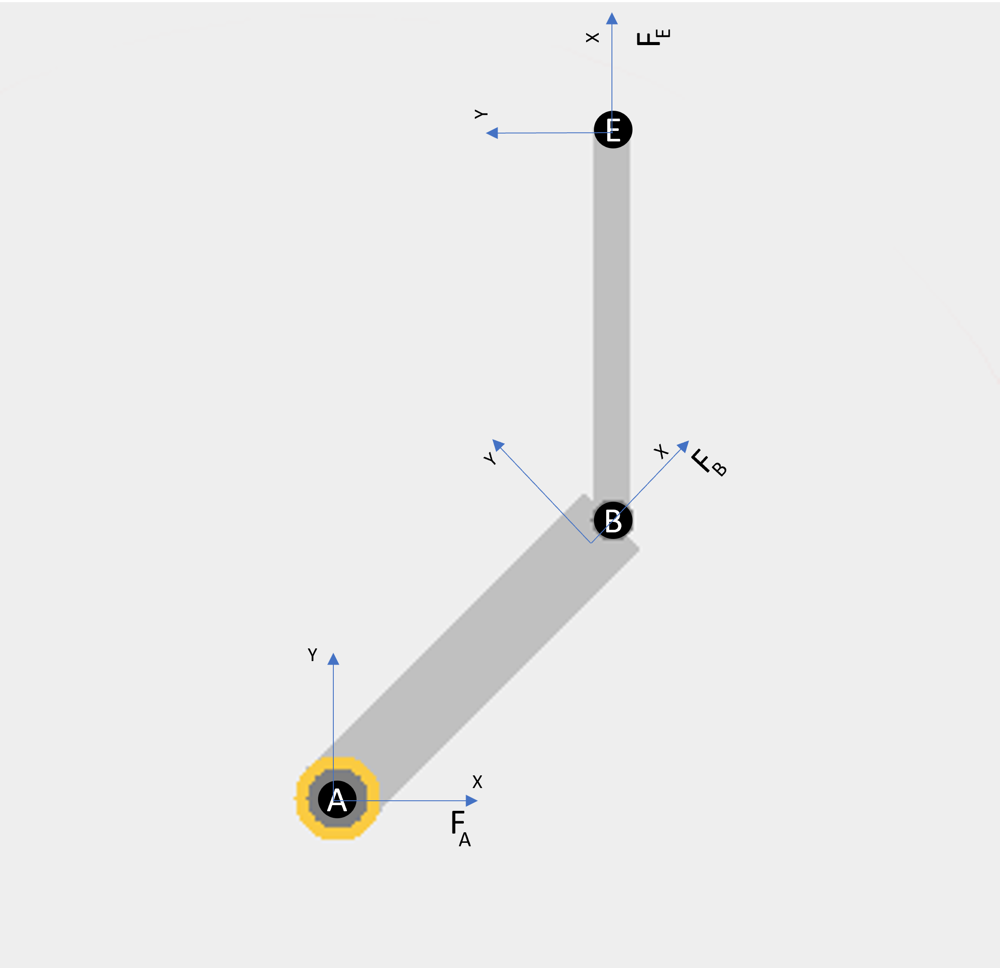

Note:  Frames are not fixed to one point, and can be moved around translationally wherever is convenient to help you visualize frame rotations.  However, their orientations with respect to other frames is *not* arbitrary, and in this example are defined by the joint angles $q$.  Sometimes it is convenient to place two frames on top of each other and co-located their origins (as seen in the figures above described generic frame rotations).  Sometimes it is convenient to place the frames for each link on the tip of the link, to help visual the relative rotation between the previous link and the next one.  You get to decide!  Put them anywhere and everywhere, they're free of charge.


We also need to keep track of the joint angles, since they can and will change during the run (otherwise it's less a manipulator and more a sculpture).  Let's define the joint angles as $q1$ and $q2$, making 0 rotation align all three frames so that they are all oriented the same way.  This way any rotation of a link can be easily described with joint angles $q1$ and $q2$.

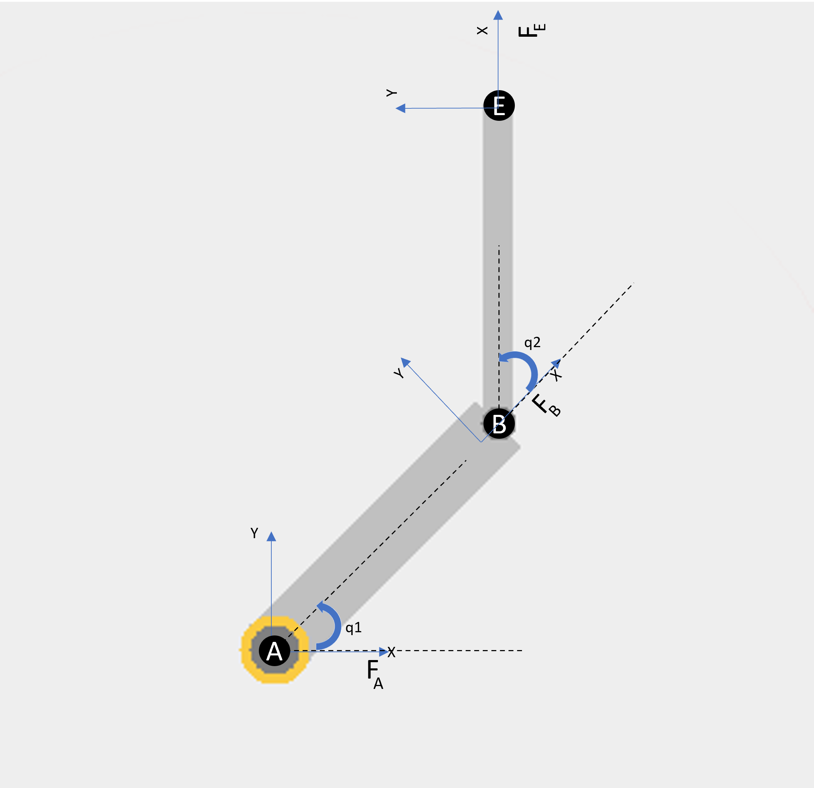


Now everything of importance to the kinematics of the system has been named and labeled.  The base and joint frames allow us to keep track of the relative location of the points on the manipulator with respect to each other and the base, fixed inertial reference frame.  The joint angles allow us to describe every possible location of each of the points in any frame.

### Frame Rotations
Given that a robot will have *at least* as many frames as it has moveable links, we need to be able to transform the information about the manipulator from one frame to another.  This is called frame rotation.  One can construct a *rotation matrix* if the relative orientation of any two frames is known with respect to each other.  In this example, we will be rotating between frames O, A, and B (specifically, from A and B back to O to express everything in O).

In general, if you have two frames, A and B, rotated with respect to each other by an angle $q$, then you can determine how the unit vectors which make up frame B relate to frame A:

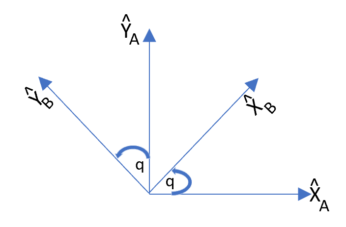

Unit vectors (such as $\hat{X}_A$ and $\hat{Y}_A$) are by definition length 1.  The cosine of the angle $q$ is defined as the length of the adjacent side divided by the hypotenuse.  Since the length of the hypotenuse has to be 1, $cos(q)$ is equal to the length of the adjacent side.  For $sin(q)$, you use the opposite side instead of the adjacent.

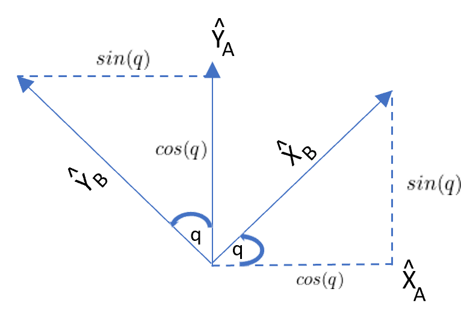

Given the information above, $X_B$ and $Y_B$ can be described with respect to frame A as:

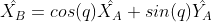


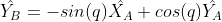

These equations together can be written in matrix form as

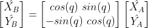

This matrix is called a rotation matrix, from Frame A to Frame B, commonly denoted as


This is the rotation matrix from Frame A to Frame B.  The subscript frame (here, A) is the "from" frame and the superscript frame (here, B) is the "to" frame.  If you take any vector described in frame A and pre-multiply it by this rotation matrix, you will get the same vector but expressed in frame B.  More often than not, you will actually be more concerned with rotation from Frame B back to Frame A.  To do this, you would need the inverse of the matrix (which reverses the frame transformation order).  Luckily, rotations matrices are *orthonormal*, and one characteristic of matrices like this is that the inverse of this matrix is equal to the transpose (which is much easier to find in general).

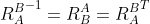

This is the bread and butter of kinematics, so you will definitely see this again.


### Position of the End-Effector
The position of the tip of manipulator can be described by calculating the vectors from points $a$ to $b$ and from $b$ to $e$ and adding them together.  Vectors can be added together if they are described in the same frame.  Vectors are simply lengths in a particular direction.

The vector from points $a$ to $b$ is a function of the joint angle $q1$ and the length of the link $L1$ (described in the base frame O).  The vector from points $b$ to $e$ is a function of the joint angle $q2$ and the length of the link $L2$ (described in the first link's frame A).

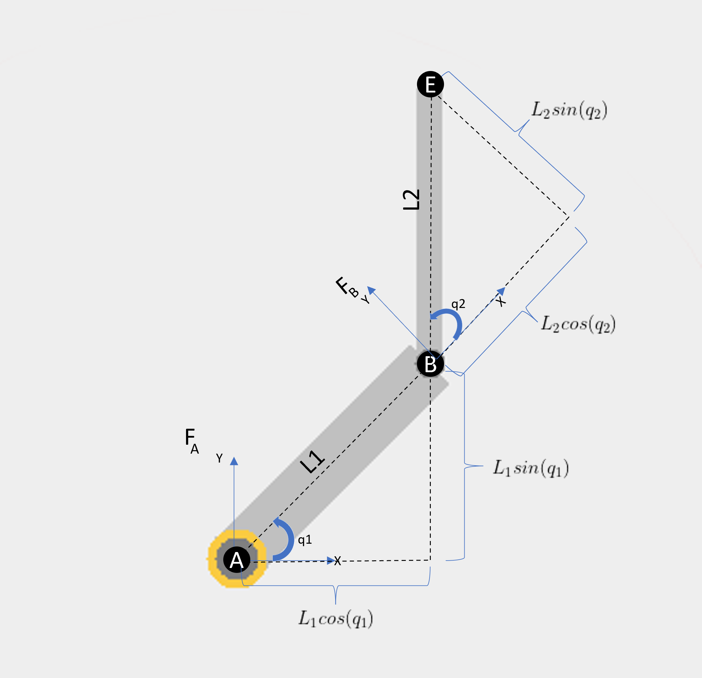

As can be seen in the figure above, the $x$ and $y$ components of the vector which goes from point $a$ to point $b$ is shown to be

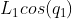

and


expressed in the base frame O.

The $x$ and $y$ components of the vector from $b$ to $e$ is shown to be

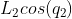

and

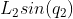

expressed in the first link's frame, A.  

In frame A, the vector from $a$ to $b$ is simply

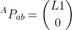

because the axes of frame A rotate with the first link, so the vector always points along the $x$-axis of frame A.  Similarly, the vector from $b$ to $e$ in frame B is

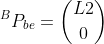

If we add the vectors from $a$ to $b$ to $e$ together, we'll get a vector from $a$ to $e$.  This will tell us the location of the end-effector, which is what we're really after:

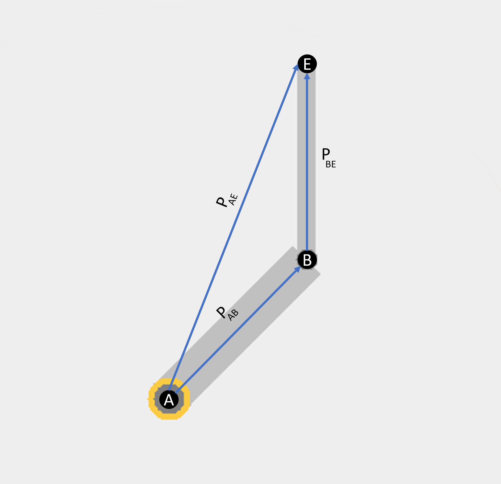

However they can't be added until they are all expressed in the same frame.  To do that, we will rotate $P_{ab}$ and $P_{be}$ into frame O, the static base frame, and then add them together.  In order to do that, we will use rotation matrices as discussed in the previous section.

First, rotate the vector $P_{OB}$ into frame O by use of the rotation matrix from frame A into frame O (remembering that $R_A^B = R{_B^A}^T$)

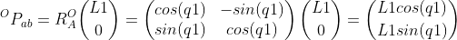

This matches what was shown earlier, that the vector $P_{ab}$ in frame O had components that match what was just derived using rotation matrices.

For the vector $P_{BE}$, two transformations are needed.  First, from frame B back to A, then from A back to O.  Rotation matrices can be prepended as long as the origin and destination frames line up logically.  In this case, a vector in frame B is being rotated to frame A, and that resultant vector is then rotated to frame O:

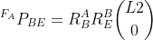

which leads to 

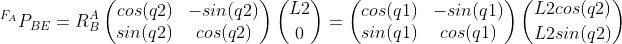

which finally gives

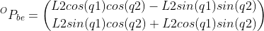.

Now the vectors $P_{ab}$ and $P_{be}$ can be added together, since they are both expressed in frame O

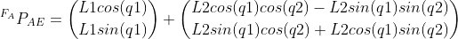

which, after some trigonometric wizardry, boils down to

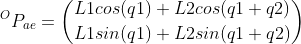


### Velocity of the End-Effector

Now that the position of all the points of interest are calculated, we need to find the velocities as well.  For this example the only point of interest for which we will calculate the velocity is for point $e$, the tip of the manipulator.  In general, for more complex robotic systems, the velocity of each point is calculated through a process known as *velocity propagation*, which uses cross products of the angular velocities and the position vectors from point to point to calculate the velocities for each point.  These velocities are then rotated into a common base frame and summed to generate a total velocity term for each point of interest.  For simpler manipulators, like the one described here, it is faster and easier to simply take a time derivative of the position vector.

The velocity of the end-effector via time derivation of the position vector $^{O}P_{ae}$ is

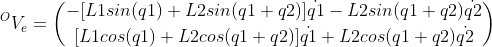

Notice that the velocity terms in that vector can be easily separated into coefficients of the joint angular velocities, $\dot{q1}$ and $\dot{q2}$.  Unlike the position vector, which has joint angle dependencies scattered throughout and can't be separated out into neat pieces (i.e. it's highly nonlinear), the velocity vector can be broken into neat pieces.  

The matrix of form of the velocity equation is given as 

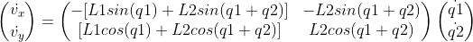


### The Jacobian

The matrix given above is known as the Jacobian

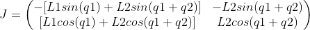

The Jacobian of a robotic system describes the mapping from angular joint velocities to linear end-effector velocities.  Inverse kinematics relies on the calculation of the Jacobian and, more crucially, its inverse.  With the Jacobian defined, you can now determine the required joint velocities at any configuration to generate a desired end-effector velocity with the equation

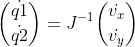

This equation forms the basis of the *resolved-rate controller* below, allowing the manipulator to move the end-effector in any desired direction as long as the Jacobian can be inverted.  But what happens when a Jacobian *can't* be inverted?

### Singularities

Singularities occur when the Jacobian matrix can't be inverted.  A singular matrix is one whose inverse's values go to infinity.  This happens because the deteminant of the matrix goes to 0, and when you divide by the determinant to calculate the inverse everything goes *kablooey*.  In robotics, singularities refer specifically to the Jacobian matrix defined above going singular.  Robotic singularities occur when the desired velocity can't physically be commanded.  In the case here, we are trying to control the end-effector velocity, and the Jacobian depends explicitly on the joint angles $q1$ and $q2$.  That implies that a manipulator goes singular when it is in a configuration (i.e. the joints are at specific angles) that cannot produce some end-effector velocity, regardless of how high the joint velocities go.  In practice, this typically occurs when the tip of the manipulator is either pushed all the way out to the workspace boundary (in the graphics client, this boundary is the red circle around the outside of the manipulator) or when it gets curled up on itself in a weird, pretzel-like way.

For simple manipulators like the one presented here, looking at the configurations that make the determinant of the jacobian go to zero will provide insight into the configurations that cause singularities.  The determinant of the Jacobian is given as

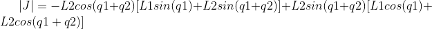


After a lot of trig, this can be whittled down to show that the manipulator is in a singular configuration when $q2 = 0$ or $q2 = 180$degrees.  These positions correspond to the manipulator stretching all the way out to the workspace boundary or bending around a laying one joint on top of the other.  In both cases, the manipulator is incapable of moving in the $x$-direction in frame A.  You can see the effects of a singularity on the controller by moving the end-effector in the same direction until it reaches the workspace boundary.  Once it reaches the boundary, there's really no telling what will happen.

Note that the determinant is not a good metric to measure *how close* a manipulator is to singularity, only when it's actually fully singular.  Determinants don't monotonically approach zero as the manipulator approaches a singular configuration.

With a physical manipulator, singularities are very dangerous.  If they are not handled and prevented, the controller will demand infinite joint rates out of the manipulator.  Since real motors can't provide infinite rates, they all just spin in whatever direction as fast and as hard as they can.  This causes the manipulator to fling itself about wildly, smashing whatever happens to be in the workspace with it.  This is why all manipulators should have caution tape on the floor around them in a perimeter a bit outside their workspace, so if the manipulator *does* go singular it can't reach anybody.  More manipulators are damaged or destroyed by unmanaged singularites than by aliens, lasers, and monsters combined.

## Control Modes

There are three control modes implemented in the simulation and are detailed below.  All of these are fairly standard and give a good idea of how to implement robotic controllers in Trick.  There are no joint limits implemented in the sim as there would be in a real robot.

### Single Joint Mode
**Single Joint Mode** controls the joint velocity of a single joint, plain and simple.  On the gui, select **SJoint** on the "Robot Mode" section and then you can select the joint with the select arrow buttons and drag the rate slider either way.  Because there are no *inverse kinematics* involved (we're just applying a joint rate) this is the only mode inmplemented where singularities are not a concern.  Singularities only occur when the required joint rates to produce a desired motion of a point of interest are calculated, and here we're just demanding pure joint rates.


### Manual Mode
**Manual Mode** moves the end-effector with a particular *velocity* (direction and speed).  The control interface for this mode is the "EE Velocity" portion with the gray circle.  Select **Manual** in the "Robot Mode" section.  Then by clicking anywhere in the cirle, you apply that end-effector velocity to the manipulator (the velocity is described in frame O, the base frame).  Points selected closer to the center of the circle will move the end-effector slower, and points closer to the edge of the circle move it faster.  The direction of motion is determined by the angle from the center of circle.

In this mode, you *do* have to watch out for singularities because the inverse Jacobian is being calculated to generate the required joint rates to produce the end-effector velocity you choose.  You'll know when you hit one.

The required joint rates are determined by the formula mentioned in the Jacobian section


where the end-effector velocity terms are now the *desired* end-effector velocities.

### End-Effector Position Mode
**End-Effector Position Mode** takes a desired end-effector *position* and commands the manipulator to move towards it.  It does this iteratively, moving incrementally every command cycle closer to the point and checking its position with respect to the desired position.  Once the end-effector is close enough to the desired position, it stops moving and congratulates itself on a job well done.

The control interface for this mode is actually the workspace of the manipulator in the graphics client.  Select **EEPos** from the "Robot Mode" section of the gui and click anywhere in or near the workspace.  A dot will appear indicating the desired location of the end-effector, and the manipulator will move that direction.  This is another mode impacted by singularities, and forcing the manipulator to either reach outside the workspace or put the end-effector on the base origin will result in fireworks.  It's especially noticable if you turn on **Trace** before you try to break it.

The methodolgy behind this is actually a combination of a PD[^1] controller and Manual Mode.  The difference is calculated between the desired and current end-effector position

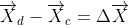

This is used as the proportional offset in a PD controller with some gain $K_P$.  To act as a mitigating control, the desired velocity is defined to be 0.  This allows a smoother motion near the goal, as any end-effector velocity acts as a drag.  The PD control formulation ends up looking like


These desired velocities are then fed into the same Manual Mode controller, and the position offset is updated every cycle until it is "close enough."

[^1]:  PD controllers are a subset of the broader PID controller implementation.  PID controllers are very common and are used in a wide variety of situations.  There are mountains of articles explaining what they are and how they work to be found in the wilds of the internet.  PID controllers have proportional (P), integral (I), and derivative (D) components.  Robotic manipulators often don't employ the integral component because it is ill-suited to systems whose desired control point never sits still, which is why the controller implemented here is simply a PD controller instead.

### Singularity Management

By default, the simulation checks for singularities and cancels the motion that would result in a singularity (and takes the manipulator out of mode).  However, if you want to see the consequences of maneuvering through a singularity, it can be disabled.

In the input file RUN_2DPlanar/input.py, add this line at the bottom

Manip2D.robot.kinemat.checkSingularities = False

For maximum effect, turn on **Trace** while it does this.


