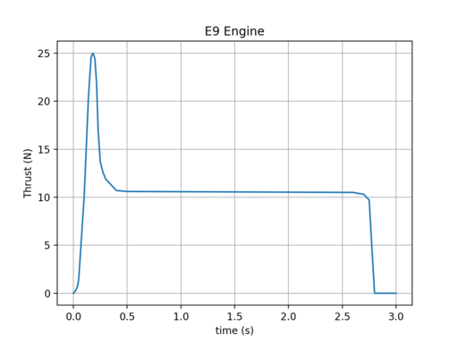
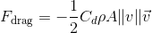
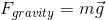
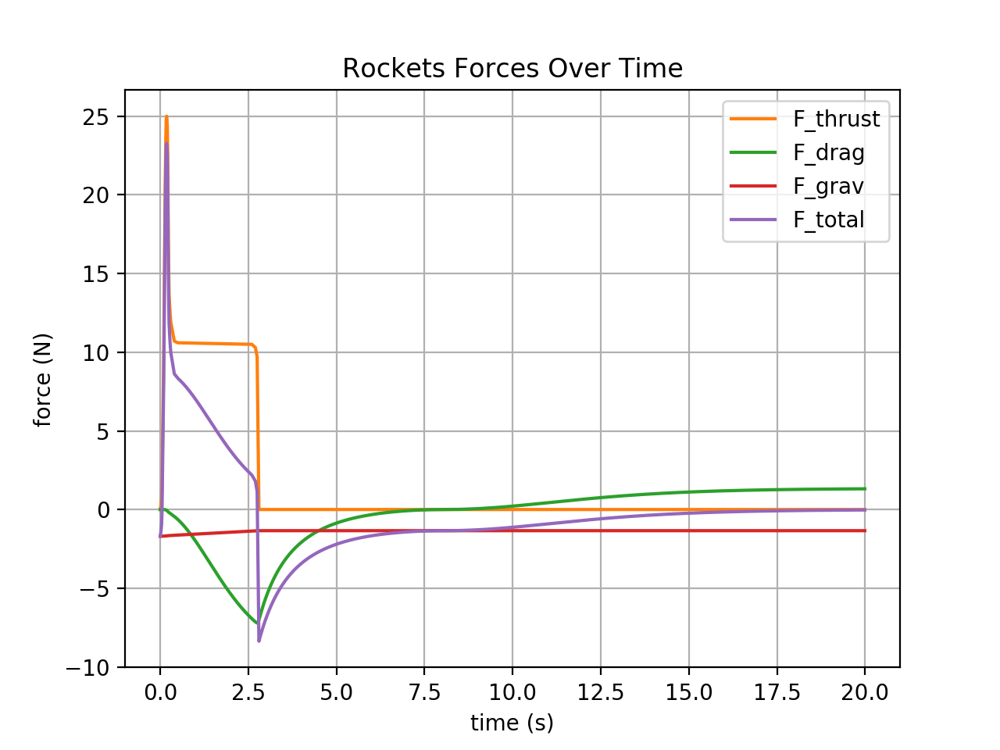
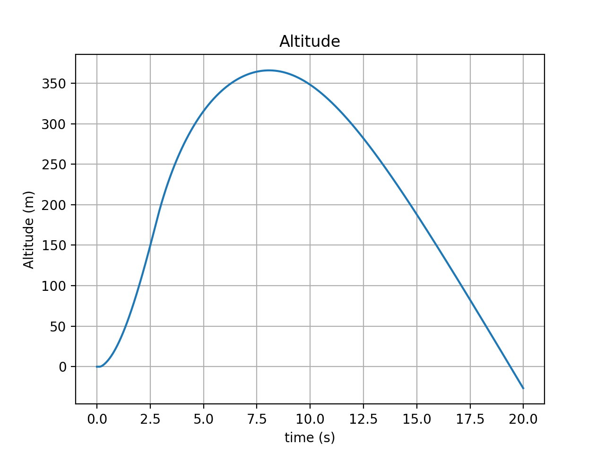
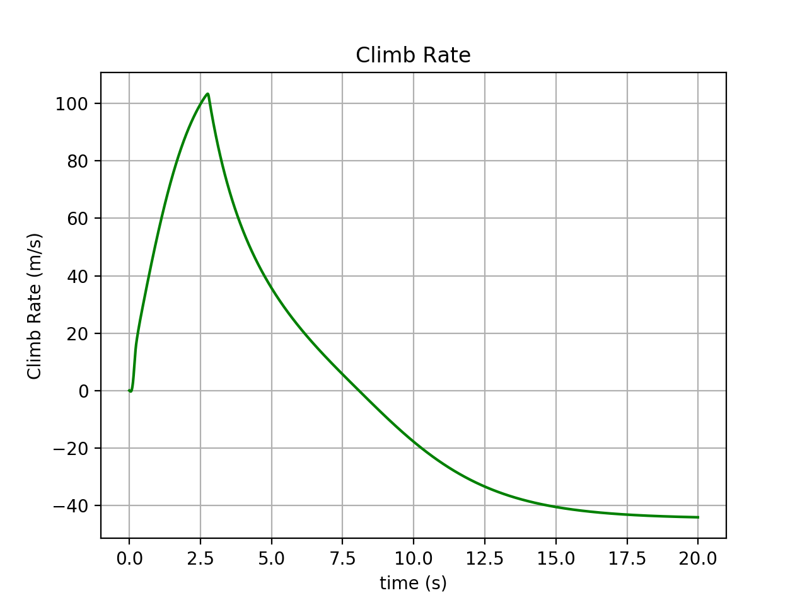
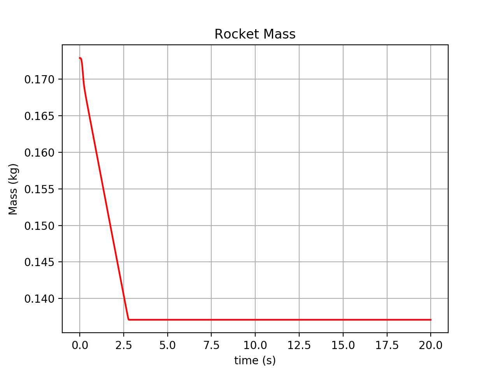

The following describes a Trick-based simulation of a model rocket under the forces of thrust,
gravity and drag, using the parameters and equations shown below. 

### Thrust Force

In our model rocket simulation, we use an Estes E9 motor by default.  It's thrust profile is shown below.

| Name                                | Units      | Value      |
|-------------------------------------|------------|------------|
| rocket.motor.thrust\_sample\_times  |     s      | 0.000, 0.010, 0.020, 0.030, 0.040, 0.050, 0.100, 0.110, 0.120, 0.130,0.140, 0.155, 0.165, 0.180, 0.190, 0.200, 0.215, 0.230, 0.250, 0.275, 0.300, 0.400, 0.500, 2.600, 2.700, 2.725, 2.750, 2.800, 100.0 |
| rocket.motor.thrust\_sample\_values |     N      | 0.0,  0.1,  0.3,  0.5,  0.8,  1.5, 10.0, 12.6, 15.2, 17.8, 20.4, 23.0, 24.6, 25.0, 24.8, 24.4, 22.0, 17.0, 13.7, 12.6, 11.9, 10.7, 10.6, 10.5, 10.3, 10.0,  9.7, 0.0, 0.0 |
| rocket.motor.thrust\_sample\_count  |    --      |   29         |
    

### Drag Force
The drag on the model rocket will be calculated using the drag equation shown below:

| Symbol | Name                          | Units      | Value      |
|--------|-------------------------------|------------|------------|
| &#x3C1;| rocket.env.air\_density       | kg/m&#xB3; | 1.2        |
| Cd     | rocket.coefficient\_of\_drag  | (unitless) | 0.75       |
| A      | rocket.cross\_sectional\_area | m&#xB2;    | 0.0015     |
| v      | rocket.velocity               |   m/s      | Initially 0.0, Updated by integration of rocket-acceleration over time.|

### Gravitation Force

| Symbol | Name                        | Units     | Value      |
|--------|-----------------------------|-----------|------------|
| g      | rocket.env.gravity          | m/s&#xB2; | -9.81      |
| m      | rocket.total\_mass          | kg        | Initially [Eq#2]. Updated by integration of rocket-mass-rate. |

### Mass
As the rocket motor burns, it expels mass, at high speed. Initially the rocket
motor contains all of its propellant mass. When it burns out, it contains no propellant mass.

| Name                          | Units | Value  |
|-------------------------------|-------|--------|
| rocket.empty\_mass            | kg    | 0.1162 |
| rocket.motor.total\_mass      | kg    | 0.0567 |
| rocket.motor.propellant\_mass | kg    | 0.0358 |

## Initialization

| Name                         | Units | Value |
|------------------------------|-------|-------|
| rocket.motor.exhaust\_speed  | m/s   | Calculated by [Eq#1] |
| rocket.motor.total\_impulse  | N s   | Calculated by integrating motor thrust over time. |
| rocket.total\_mass           | kg    | Calculated by [Eq#2] |
| rocket.velocity              | m/s   | 0.0   |
| rocket.position              | m     | 0.0   |
| rocket.mission\_time         | s     | 0.0   |

[Eq#1] **exhaust-speed** = rocket.motor.total\_impulse / rocket.motor.propellant\_mass

[Eq#2] **rocket.total\_mass (@t=0)** = rocket.empty\_mass + rocket.motor.total\_mass (@t=0).

## State Derivatives

| Name                        | Units | Value  |
|-----------------------------|-------|--------|
| rocket.mission\_time\_rate  | s     | 1.0    |
| rocket.thrust\_force        | N     | Interpolation of E9 Engine Thrust function |
| rocket.mass\_rate           | kg/s  | Calculated by [Eq#3] |
| rocket.drag\_force          | N     | Calculated by [Eq#4] |
| rocket.gravity\_force       | N     | Calculated by [Eq#5] |
| rocket.total\_force         | N     | Calculated by [Eq#6] |
| rocket.acceleration         | N     | Calculated by [Eq#7] |

[Eq#3] **rocket.mass\_rate** =  &#x2016; rocket.thrust\_force &#x2016; / rocket.motor.exhaust\_speed

[Eq#4] **rocket.drag\_force** = - 0.5 &#xd7; rocket.coefficient\_of\_drag &#xd7; rocket.env.air\_density &#xd7; rocket.cross\_sectional\_area &#xd7; rocket.velocity &#xd7; &#x2016; rocket.velocity &#x2016;

[Eq#5] **rocket.gravity\_force** = rocket.total\_mass &#xd7; rocket.env.gravity

[Eq#6] **rocket.total\_force** = rocket.thrust\_force + rocket.drag\_force + rocket.gravity\_force

[Eq#7] **rocket.acceleration** = rocket.total\_force  / rocket.total\_mass

## State Integration

| Name                   | Units     | Value                                                      |
|------------------------|-----------|------------------------------------------------------------|
| rocket.mission\_time   | s         | Numerical integration of rocket.mission\_time\_rate. |
| rocket.total\_mass     | kg        | Numerical integration of rocket.mass\_rate.  |
| rocket.velocity        | m/s       | Numerical integration of rocket.acceleration.|
| rocket.position        | m/s&#xB2; | Numerical integration of rocket.velocity.    |

## Results with Default Parameterization

