# SIM_splashdown

SIM_splashdown is a simulation of a space craft crew module dropping into a body of water. 

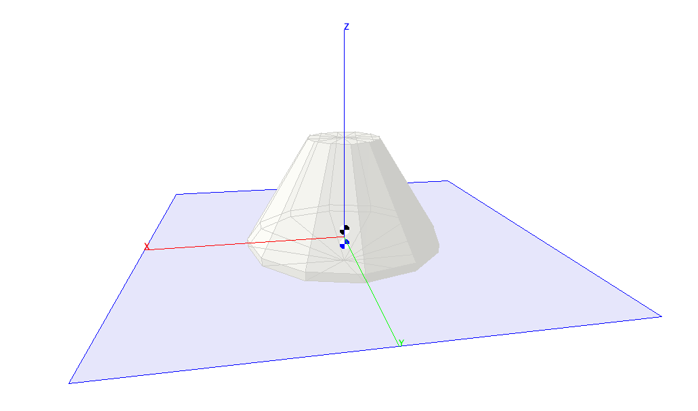

## Building the Simulation
In the ```SIM_splashdown ``` directory, type **```trick-CP```** to build the simulation executable. When it's complete, you should see:

```
=== Simulation make complete ===
```
Now **cd** into ```models/CrewModuleGraphics/``` and type **mvn package**. This builds the graphics client for the simulation.

## Running the Simulation
In the SIM_splashdown directory:

```
% S_main_*.exe RUN_test/input.py
```
The Sim Control Panel, and a graphics client called "CM Display" should appear.

Click the Start on the Trick Sim Control Panel.

Click and drag the mouse on the display to change the viewing orientation.

The black and white center of gravity symbol indicates the center of gravity of the vehicle.

The blue and white center of gravity symbol indicates the center of gravity of the water that is displaced by the vehicle, that is: the center of buoyancy.

<!--

| Variable | Definition|
|---|---|
|| Center of buoyancy, that is, the center of gravity of the displaced water mass.|
|| Center of mass of the vehicle. [Frame??]|
|| Force of buoyancy acting on the vehicle.|
|| Force of gravity.|
||Total force acting on the vehicle.|
||Inertia Tensor of the vehicle in the body frame of reference.|
||Inertia Tensor of the vehicle in the world frame of reference.|
||Linear momentum of the vehicle.|
||Body to World rotation matrix.|
||Body to World rotation matrix derivative with respect to time.|
|| Torque acting on the vehicle.|
|| Volume of the water displaced by the vehicle.|
|| Angular momentum of the vehicle.|
||Angular velocity of the vehicle.|
||Acceleration of gravity.|
||Mass of displaced water.|
||Mass of vehicle.|
||Angular velocity Skew matrix |
||Vehicle position.|
||Vehicle velocity.|

# Coordinate Systems

Coordinate systems here are all right-handed. That is, if the right thumb points along the Z-axis, then the fingers move from the X-axis to the Y-axis as you close your hand.

## Body Coordinates
The geometry of the crew module is defined in **body** coordinates.
The origin of this coordinate system is the center of gravity of the vehicle.
Positive Z is toward the top of the vehicle.
 
## World Coordinates

-->

## Dynamics Model

### Vehicle State

The vehicle state is defined by the following variables. These are calculated by numerically integrating force, velocity, torque, and body rotation rate over time.

<a id=linear_momentum></a>
#### Linear momentum

The linear momentum of the vehicle is determined by integrating the [total force](#total_force) on the vehicle over time.

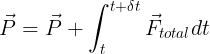

- **```crewModule.dyn.momentum```** ( double[3] )

<a id=position></a>
#### Position

The position of the vehicle is determined by integrating the [linear velocity](#linear_velocity) of the vehicle over time.

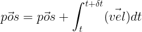

- **```crewModule.dyn.position```** ( double[3] )

<a id=angular_momentum></a>
#### Angular momentum

The angular momentum of the vehicle is determined by integrating the [total torque](#total_torque) of the vehicle over time.

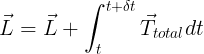

- **```crewModule.dyn.angular_momentum```** ( double[3] )

<a id=body_rotation></a>
#### Body rotation

The body rotation matrix of the vehicle is determined by integrating the [body rotation rate](#body_rotation_rate) matrix of the vehicle over time.

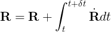

- **```crewModule.dyn.R```** ( double[3][3] )

### Vehicle State Derivatives and Dependencies

<a id=total_force></a>
#### Total Force
The total force acting on the crew module is the sum of the [force of gravity](#force_of_gravity), the [force of buoyancy](#force_of_buoyancy), and the [force of drag](#force_of_drag).  

<a id=Equation-1></a>
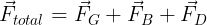

- **```crewModule.dyn.force_total```** ( double[3] )


<a id=force_of_gravity></a>
#### Force of Gravity
By Newton’s 2nd Law, the force of gravity on the vehicle is the [mass of the vehicle](#vehicle_mass) times the [acceleration of gravity](#acceleration_of_gravity).

<a id=Equation-2></a>
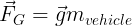

- **```crewModule.dyn.force_gravity```** ( double[3] )

<a id=acceleration_of_gravity></a>
#### Acceleration of Gravity

In this simulation the acceleration is fixed at:

<a id=acceleration_of_gravity_equation></a>
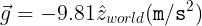

<a id=vehicle_mass></a>
#### Vehicle Mass

Default value of the vehicle mass is:

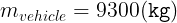

- **```crewModule.dyn.mass_vehicle```** ( double )

<a id=force_of_buoyancy></a>
#### Force of Buoyancy

Buoyancy is a force on an object, that opposes gravity, by a fluid within which it’s immersed. This force is equal to the [mass of the displaced water](#displaced_mass) times the [acceleration of gravity](#acceleration_of_gravity).

<a id=Equation-3></a>
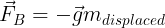

- **```crewModule.dyn.force_buoyancy```** ( double[3] )


<a id=force_of_drag></a>
#### Drag force

This drag force is not accurate. It's simply opposes the [linear velocity](#linear_velocity), as a means of sapping energy from the system. 

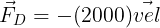

- **```crewModule.dyn.force_drag```** ( double[3] )

<a id=displaced_mass></a>
#### Displaced Mass

The displaced mass of the water is equal to the [density of water](#density_of_water) times its [displaced volume](#displaced_volume).

<a id=Equation-4></a>
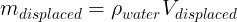

- **```crewModule.dyn.mass_displaced```** (double)

<a id=density_of_water></a>
#### Density of Water

Default value is the density of sea water:

<a id=Equation-4></a>
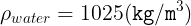

- **```crewModule.dyn.density_of_water```** (double)

<a id=total_torque></a>
#### Total Torque

The total torque acting on the crew module is the sum of the [buoyancy torque](#buoyancy_torque), and [drag torque](#drag_torque).

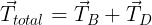

- **```crewModule.dyn.torque_total```** (double[3])

<a id=buoyancy_torque></a>
#### Buoyancy Torque

The [force of buoyancy](#force_of_buoyancy) acts on the [center of buoyancy](#center_of_buoyancy), that is: the center of mass of the displaced water. So the torque on the vehicle due to buoyancy is:

<a id=Equation-5></a>
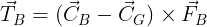

- **```crewModule.dyn.torque_buoyancy```** (double[3])

<a id=drag_torque></a>
#### Drag Torque

We won't even pretend this drag torque is accurate. It's simply opposes the [angular velocity](#angular_velocity), as a means of sapping energy from the system, to settle the rocking of the crew module.  

<a id=Equation-6></a>
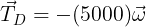

- **```crewModule.dyn.torque_drag```** (double[3])

<a id=angular_velocity></a>
#### Angular Velocity

The angular velocity of the vehicle is a function of the [angular momentum](#angular_momentum), the vehicle [inertia tensor](#inertia_tensor) and the [vehicle body rotation](#body_rotation).

<a id=Equation-7></a>
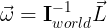

where:

<a id=Equation-8></a>
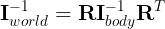

- **```crewModule.dyn.angular_velocity```** (double[3])

<a id=body_rotation_rate></a>
#### Body Rotation Rate

The body rotation rate is the product of the skew-symetric-matrix form of the [angular velocity](#angular_velocity), and the [body rotation](#body_rotation) matrix.

<a id=Equation-9></a>
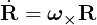

- **```crewModule.dyn.Rdot```** (double[3][3])


<a id=linear_velocity></a>
#### Linear Velocity

The linear velocity of the vehicle is the [linear momentum](#linear_momentum) of the vehicle divided by its [mass](#vehicle_mass).

<a id=Equation-10></a>
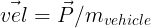

- **```crewModule.dyn.velocity```** (double[3])

<a id=inertia_tensor></a>
#### Inertia Tensor

Default value is:

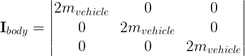

- **```crewModule.dyn.I_body ```** (double[3][3])

---

The following convenience function:

**```crewModule.dyn.init_inertia_tensor(double A, double B, double C);```**

sets the diagonal elements as follows:

```
I_body[0][0] = mass_vehicle * (B*B + C*C);
I_body[1][1] = mass_vehicle * (A*A + C*C);
I_body[2][2] = mass_vehicle * (A*A + B*B);
```

All other ```I_body``` elements are set to 0.

---

<a id=displaced_volume></a>
#### Displaced Volume

The displaced volume is the volume that is 1) within the vehicle and 2) within the body of water.

<a id=Equation-11></a>
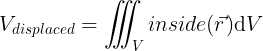

- **```crewModule.dyn.volume_displaced```** (double)

<a id=center_of_buoyancy></a>
#### Center of Buoyancy

The center of buoyancy is the center of gravity of the displaced volume of water.

<a id=Equation-12></a>
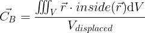

- **```crewModule.dyn.center_of_buoyancy```** (double[3])

<a id=vehicle_shape></a>
## Vehicle Shape

In this simulation, the shape of the crew module is defined by a sphere, a cone, and a plane, as shown in the picture below.

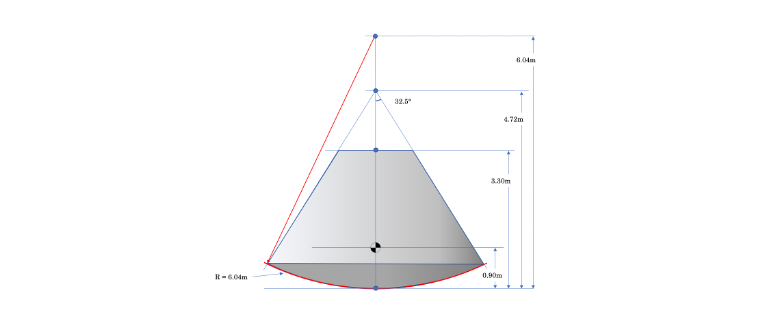

```bool CrewModuleShape::containsPoint(double (&test_point)[3])``` returns ```true``` if the given point is 1) in the sphere, 2) in the cone, and 3) on the correct side of the plane.

<a id=inside_pseudo_function></a>
The pseudo-function ```inside(double p[3])``` used in the integrals [above](#displaced_volume) represents logic that determines whether a point is within the displaced volume of water. A point is within the displaced volume if 1) it is within the crew module volume, that is ```containsPoint``` returns ```true```, and 2) it is below the surface of the water, that is the z component of the point is less than 0. 
