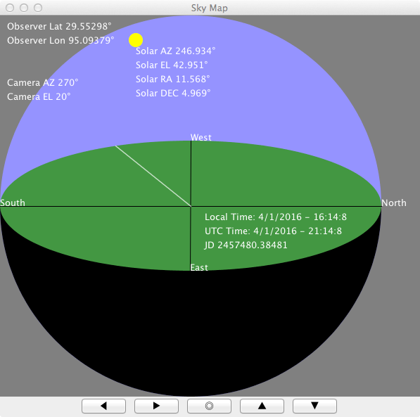

# SIM\_sun

### The Simulation
SIM\_sun is a simulation of the Sun's movement across the sky.
Given the location (latitude, longitude) of an observer on the
Earth, the timezone (offset from UTC), and a starting local time,
this simulation calculates the position of the Sun in the sky over time.

### Inputs
Variable                                       | Type           |  Units
-----------------------------------------------|----------------|-------
sun\_predictor.sun.observer\_latitude          | double         | degree
sun\_predictor.sun.observer\_longitude         | double         | degree
sun\_predictor.sun.observer\_offset\_from\_UTC | int            | hr
sun\_predictor.sun.local\_time                 | CALENDAR\_DATE | --

### CALENDAR\_DATE
Member                     |  Type              |  Units
---------------------------|--------------------|---------
year                       |  int               | --
month                      |  int               | --
day                        |  int               | day
hour                       |  int               | hour
min                        |  int               | min
sec                        |  double            | s

### Outputs
Variable                                         | Type           | Units
-------------------------------------------------|----------------|--------
sun\_predictor.sun.JD                            | double         | day
sun\_predictor.sun.right\_ascension              | double         | degree
sun\_predictor.sun.declination                   | double         | degree
sun\_predictor.sun.hour\_angle                   | double         | degree
sun\_predictor.sun.local\_sidereal\_time         | double         | s
sun\_predictor.sun.sidereal\_time\_at\_Greenwich | double         | s
sun\_predictor.sun.solar\_azimuth                | double         | degree
sun\_predictor.sun.solar\_elevation              | double         | degree
sun\_predictor.sun.local\_time                   | CALENDAR\_DATE | --
sun\_predictor.sun.utc                           | CALENDAR\_DATE | --

**NOTE:** 0 <= Solar Azimuth < 360 degrees. North = 0, East = 90, South = 180, West = 270.

### Scenarios

#### [RUN_Winter](RUN_Winter/RESULTS.md)

#### [RUN_Summer](RUN_Summer/RESULTS.md)

### References
Meeus, Jean, (1998) "Astronomical Algorithms", Willmann-Bell, Inc. ISBN 0-943396-61-1.
