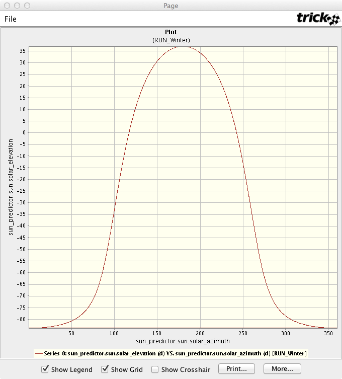
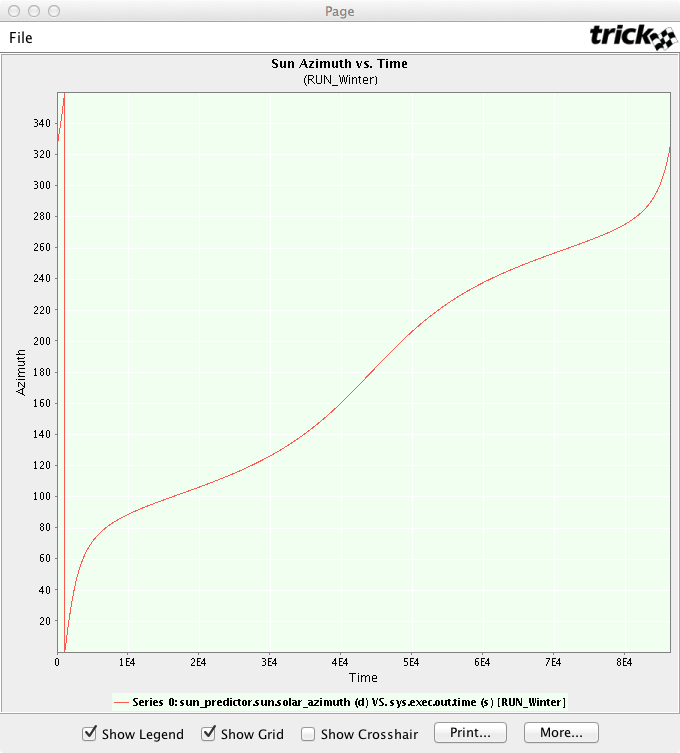
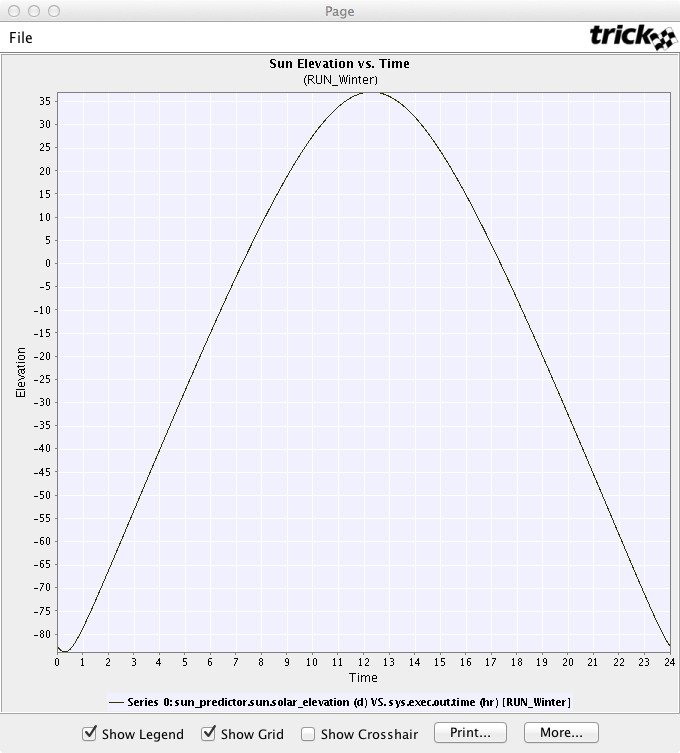

# RUN_Winter
Starting from midnight, the morning of December 21, 2006, at the
NASA Johnson Space Center, main gate. Simulation is run for 86400
(simulated) seconds (1 simulated day).

Variable                                       |  Value
-----------------------------------------------|---------
sun\_predictor.sun.observer\_latitude          | 29.55298 (d)
sun\_predictor.sun.observer\_longitude         | 95.09379 (d)
sun\_predictor.sun.observer\_offset\_from\_UTC | -6 (hours)
sun\_predictor.sun.local\_time.year            | 2006
sun\_predictor.sun.local\_time.month           | 12
sun\_predictor.sun.local\_time.day             | 21
sun\_predictor.sun.local\_time.hour            | 0
sun\_predictor.sun.local\_time.min             | 0
sun\_predictor.sun.local\_time.sec             | 0

## Plots
### Elevation vs. Azimuth

### Azimuth vs. Local Time

### Elevation vs. Local Time

