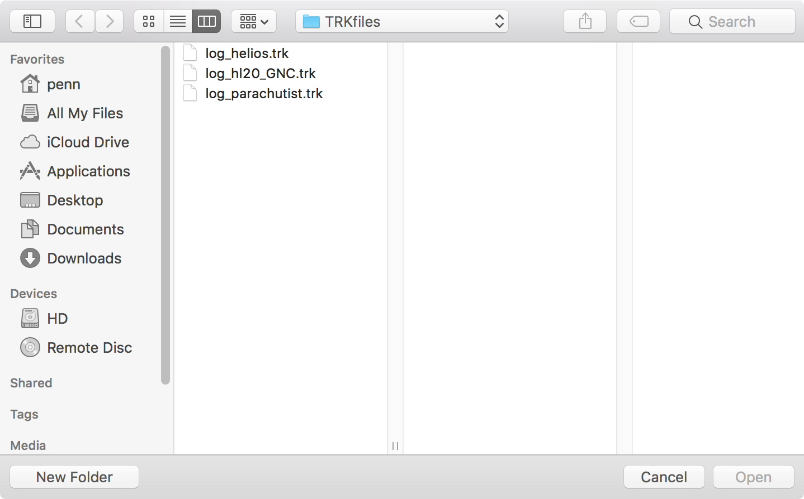
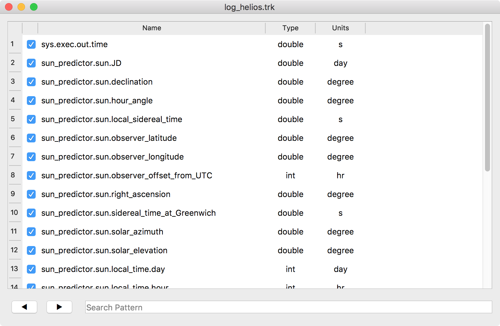
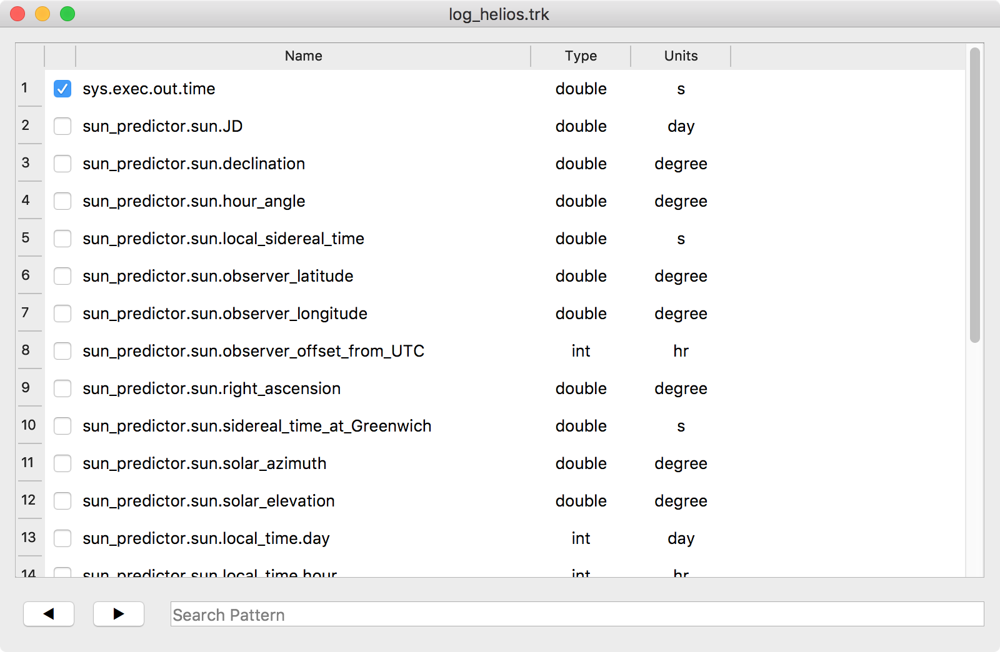

# trkConvert

Convert selected sets of variables in Trick binary data recording files (.trk) to comma separated values (.csv). In the future, more formats may be added as needed.

## Building trkConvert

trkConvert requires the [Qt Application Framework](https://www.qt.io).

When Qt is installed, building the application is as simple as:

```
% qmake
% make
% cp trkConvert $TRICK_HOME/bin/trkConvert
```

## Running trkConvert

**% trkConvert [name.trk] &**

```
% trkConvert &
```



```
% trkConvert log_helios.trk &
```
The resulting window displays the names, data types and units of the variables recorded in the .trk file. The check marks, to the left indicate which variables would be recorded in an exported format.


The check boxes can be individually selected and cleared with a mouse-click.
They can be collectively selected and cleared from the Edit menu.



## Variable Search

Python-like regular expressions
A search pattern is Python-like regular expression that matches any part of a variable name. To search, type the pattern, and press **Return** or **Enter**.

Subsequent searches for the pattern can be performed using the arrow buttons.

* Right arror searches forward
* Left arrow searches backward.

## Exporting Selected Values
Export selected values to CSV, or other format from the **File** menu. 