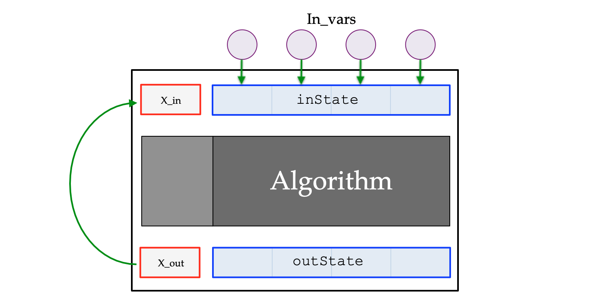
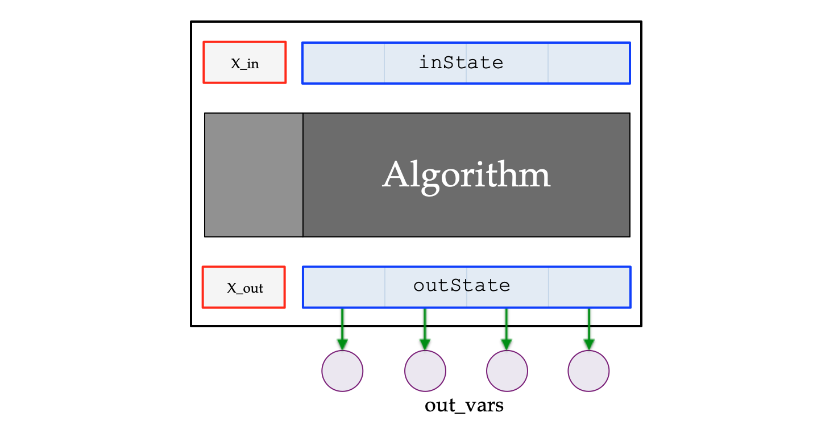
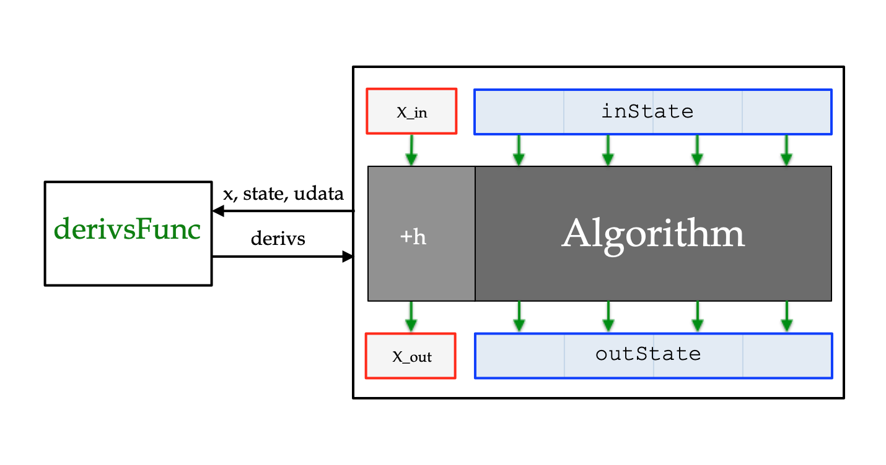
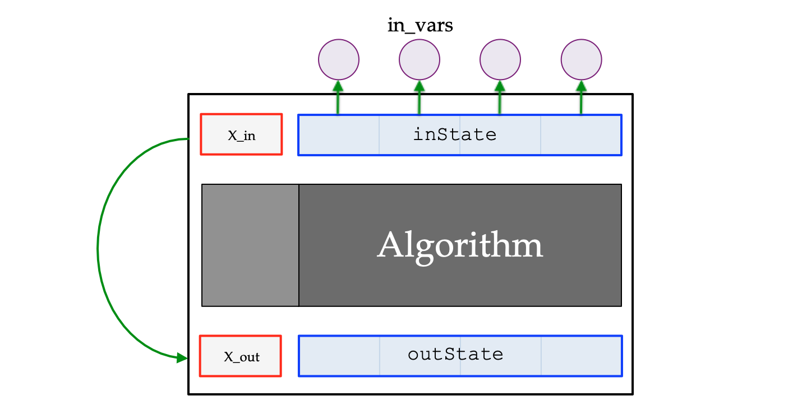
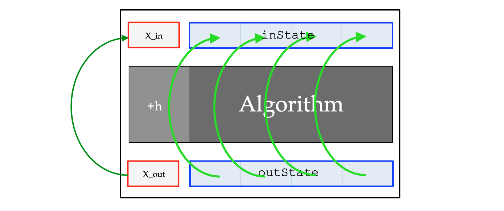
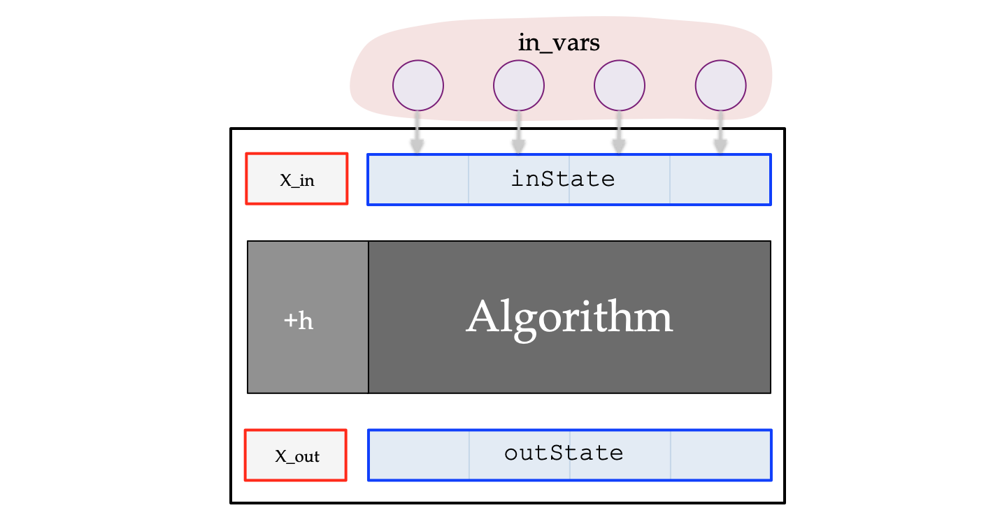

# Stand-Alone Integration Library

## Contents

* [Introduction](#Introduction)
* [class Integrator](#class-Integrator)
* [typedef DerivsFunc](#typedef-DerivsFunc)
* [class FirstOrderODEIntegrator](#class-FirstOrderODEIntegrator)
* [typedef RootErrorFunc](#typedef-RootErrorFunc)
* [class FirstOrderODEVariableStepIntegrator](#class-FirstOrderODEVariableStepIntegrator)
* [class EulerIntegrator](#class-EulerIntegrator)
* [class HeunsMethod](#class-HeunsMethod)
* [class RK2Integrator](#class-RK2Integrator)
* [class RK4Integrator](#class-RK4Integrator)
* [class RK3_8Integrator](#class-RK3_8Integrator)
* [typedef Derivs2Func](#typedef-Derivs2Func)
* [class EulerCromerIntegrator](#class-EulerCromerIntegrator)
* [class ABM2Integrator](#class-ABM2Integrator)
* [class ABM4Integrator](#class-ABM4Integrator)
* [enum SlopeConstraint](#enum-SlopeConstraint)
* [class RootFinder](#class-RootFinder)

<a id=Introduction></a>
## Introduction
The Stand-Alone Integration Library can be used within a Trick simulation, or independent of it.

Some examples of using these integrators can be found in the **examples/** directory.

* [CannonBall](examples/CannonBall/README.md) uses the RK2Integrator.
* [MassSpringDamper](examples/MassSpringDamper/README.md) uses the EulerCromerIntegrator.
* [Orbit](examples/Orbit/README.md) uses the EulerCromerIntegrator.
* [DoubleIntegral](examples/DoubleIntegral/README.md) shows an example of a double integral.

<a id=class-Integrator></a>
## class Integrator

### Description
This base-class represents a numerical **integrator**.

### Data Members
|Member    |Type        |Access   |Description|
|----------|------------|---------|-----------|
|X_in      |```double```|Protected|Independent variable value of the input state.|
|X_out     |```double```|Protected|Independent variable value of the output state.|
|default_h |```double```|Protected|Default integration step-size|
|user_data |```void*``` |Protected|A pointer to user defined data that will be passed to user-defined functions when called by the Integrator. |

### Constructor

#### ```Integrator(double h, void* udata);```

|Parameter|Type        |Description  |
|---------|------------|-------------|
|h        |```double```| Default integration step-size |
|udata    |```void*``` | A pointer to user defined data that will be passed to user-defined functions when called by the Integrator. |


### Destructor

#### ```virtual ~Integrator() {}```


### Public Member Functions

<a id=method-Integrator::step></a>
#### ```virtual void step()```
Derived classes should override this method to perform a numeric integration step, and then call [```advanceIndyVar()```](#method-Integrator::advanceIndyVar) to advance the independent variable.  The default behavior of this member-function is to call ```advanceIndyVar()```.

<a id=method-Integrator::load></a>
#### ```virtual void load()```
Derived classes should override this method to load/prepare the integrator for the next integration step. The default behavior is to set the input value of the independent variable to its previous output value, i.e, ```X_in = X_out```.


<a id=method-Integrator::unload></a>
#### ```virtual void unload()```
Derived classes should override this method to disseminate the values of the output state to their respective destinations. The default behavior is to do nothing.

<a id=method-Integrator::integrate></a>
#### ```void integrate()```
Call ```load()```, ```step()```, and ```unload()``` in that order.


<a id=method-Integrator::undo_integrate></a>
#### ```virtual double undo_integrate()```
Derived classes should override this member function to **undo** the effect of ```integrate()``` and return that last step-size. The behavior of this function is to set the output value of the independent variable to its previous input value, i.e, ```X_out = X_in```, and then return the default step-size ```default_h```.


<a id=method-Integrator::getIndyVar></a>
#### ```double getIndyVar()```
Returns the value of the independent variable (i.e, the variable over which you are integrating) If you are integrating over time, this value will be the accumulated time.


<a id=method-Integrator::setIndyVar></a>
#### ```double setIndyVar( double t)```
Sets the value of the independent variable. (i.e, the variable over which you are integrating) If you are integrating over time, this will be the accumulated time.

### Protected Member Functions

<a id=method-Integrator::advanceIndyVar></a>
#### ```void advanceIndyVar()```
This member function advances the independent variable by the default integration step-size.


<a id=typedef-DerivsFunc></a>
## typedef DerivsFunc

### Description
This typedef defines a type of C/C++ function whose purpose is to populate
a state derivative array.

```
typedef void (*DerivsFunc)( double x, double state[], double derivs[], void* udata);
```
where:

|Parameter|Type         |Direction|Description|
|---------|-------------|---------|-----------|
|x        |```double``` |IN       |Independent variable.|
|state    |```double*```|IN       |Array of state variable values.|
|derivs   |```double*```|OUT      |Array into which derivatives are to be returned.|
|udata    |```void*```  |IN       |Pointer to user_data.|

#### Example
```
void my_derivs( double t, double state[], double deriv[], void* udata) { ... }
```

<a id=class-FirstOrderODEIntegrator></a>
## class FirstOrderODEIntegrator
Derived from [```Integrator```](#class-Integrator).

### Description

This class represents an integrator for a first order [Ordinary Differential Equation]([https://en.wikipedia.org/wiki/Ordinary_differential_equation).

### Data Members
Those inherited from [Integrator](#class-Integrator) plus:

|Member     |Type              |Access   |Description|
|-----------|------------------|---------|-----------|
|state_size |```unsigned int```|Protected|Size of the state vector.|
|inState    |```double*```     |Protected|Input state vector to the integrator.|
|outState   |```double*```     |Protected|Output state vector from the integrator.|
|inVars     |```double**```    |Protected|Array of pointers to the variables from which input state vector values are copied.|
|outVars    |```double**```    |Protected|Array of pointers to the variables to which output state vector values are copied.|
|derivs_func|[```DerivsFunc```](#typedef-DerivsFunc)|Protected|Function thats generates the function (an array of state derivatives) to be integrated.|

This class introduces:

* Input and output state arrays.
* A function that calculates state-derivatives for the integration algorithm.
* Array of pointers to variables from which to load the input state array, and array of pointers to variables to which to unload the output state array.


### Constructor

```
FirstOrderODEIntegrator( double h,
                         int N,
                         double* in_vars[],
                         double* out_vars[],
                         DerivsFunc func,
                         void* user_data); 
```
where:

<a id=FOODEConstructorParameters></a>

|Parameter    |Type         |Description|
|-------------|-------------|-----------|
|h            |```double``` |Default integration step-size. |
|N            |```int```    |Number of state variables to be integrated|
|in_vars      |```double*```|Array of pointers to the state variables from which we ```load()``` the integrator state (```in_vars``` and ```out_vars``` will generally point to the same array of pointers.)|
|out_vars     |```double*```|Array of pointers to the state variables to which we ```unload()``` the integrator state (```in_vars``` and ```out_vars``` will generally point to the same array of pointers.)|
| derivs_func |[```DerivsFunc```](#typedef-DerivsFunc)| Function thats generates the function (the derivatives) to be integrated. |
|user_data    |```void*```  | A pointer to user defined data that will be passed to a DerivsFunc when called by the Integrator. |

In addition to the above constructor, this class provides:

* a copy constructor,
* a destructor,
* an assignment operator,
* an insertion operator,
* the public member functions inherited from [class Integrator](#class-Integrator),
* and the following public member functions:

### Public Member Functions

<a id=method-FirstOrderODEIntegrator::load></a>
#### ```void load()```
**Overrides**  [Integrator::load()](#method-Integrator::load)

Load the integrator's initial state from the variables specified by **in_vars**. Set the initial value of the independent variable for the next step to the final value of the previous step. 



<a id=method-FirstOrderODEIntegrator::unload></a>
#### ```void unload()```
**Overrides** [Integrator::unload()](#method-Integrator::unload)

Unload the integrator's result state to the variables specified by **out_vars**.



<a id=method-FirstOrderODEIntegrator::step></a>
#### ```virtual void step()```
**Overrides** [Integrator::step()](#method-Integrator::step)

Derived classes should override this method to calculate ```outState``` using some integration algorithm, using ```X_in```, ```inState```, and ```derivs_func```, and ```default_h```. The over-riding method should also pass the ```user_data``` when calling the ```DerivsFunc```. The default algorithm is Euler.


#### ```void integrate()```
**Inherited** from [Integrator::integrate()](#method-Integrator::integrate)

<a id=method-FirstOrderODEIntegrator::undo_integrate></a>
#### ```virtual void undo_integrate()```
**Overrides** [Integrator::undo_integrate()](#method-Integrator::undo_integrate)

Undo the effect of the last integration step.



<a id=method-FirstOrderODEIntegrator::load_from_outState></a>
#### ```void load_from_outState()```

Load ```inState``` from ```outState```, rather than from the variables referenced by ```in_vars```.



<a id=method-FirstOrderODEIntegrator::set_in_vars></a>
#### ```double** set_in_vars( double* in_vars[])```

This function specifies the variables from which ```inState``` values are to be copied, when ```load()``` is called. The number of elements in this array must equal the number of state variables. Return a pointer to the previous array so that it can be deleted if necessary.



<a id=method-FirstOrderODEIntegrator::set_out_vars></a>
#### ```double** set_out_vars( double* out_vars[])```
This function specifies the variables to which ```outState``` values are to be copied, when ```unload()``` is called. The number of elements in this array must equal the number of state variables. Return a pointer to the previous array so that it can be deleted if necessary.


<a id=method-FirstOrderODEIntegrator::getIndyVar></a>
#### ```double getIndyVar()```
**Inherited** from [Integrator::getIndyVar()](#method-Integrator::getIndyVar)

<a id=method-FirstOrderODEIntegrator::setIndyVar></a>
#### ```double setIndyVar()```
**Inherited** from [Integrator::setIndyVar()](#method-Integrator::setIndyVar)

### Protected Member Functions

#### ```advanceIndyVar()```
**Inherited** from [Integrator::advanceIndyVar()](#method-Integrator::advanceIndyVar)


<a id=typedef-RootErrorFunc></a>
## typedef RootErrorFunc

### Description

This typedef defines a type of C/C++ function whose purpose is to specify the job of a [```RootFinder```](#class-RootFinder).

```
typedef double (*RootErrorFunc)( double x, double state[], RootFinder* root_finder, void* udata);
```

where:

|Parameter   |Type             |Direction|Description|
|------------|-----------------|---|--------|
|x           |```double```     |In | Independent variable |
|state       |```double*```    |In | Array of state variable values |
|root_finder |[```RootFinder*```](#class-RootFinder)|In | Class for finding the roots of a function.|
|udata       |```void*```      |In | A pointer to user_data.|

A function of type **RootErrorFunc** should:

1. Specify a (math) function f(x) whose roots [x : f(x)=0] the RootFinder is meant to find. 
    - f(x) is usually a function of the state variables. State variables are themselves functions of x.
2. Call [```root_finder->find_roots(x, y)```](#member-find_roots), where y = f(x). If it returns 0.0, it's found a root of f(x).
3. Specify what to do as a result of finding a root.
4. Return the value returned by ```root_finder->find_roots()```.

### Example RootErrorFunc from the Cannonball example
```
double impact( double t, double state[], RootFinder* root_finder, void* udata) {
    double root_error = root_finder->find_roots(t, state[1]);
    if (root_error == 0.0) {
        root_finder->init();
        state[2] =  0.9 * state[2];
        state[3] = -0.9 * state[3];
    }
    return (root_error);
}
```
In this example :

* the independent variable is t.
* y = f(t) = state[1], that is the y (vertical) component of the cannonball position.
* When ```root_finder->find_roots``` returns 0.0, then the result of finding the root (i.e, [t:state[1]=0]) is to "bounce" the cannon ball, by negating the y component of the velocity, and reducing the magnitude of the velocity by 10%. 

<a id=class-FirstOrderODEVariableStepIntegrator></a>
## class FirstOrderODEVariableStepIntegrator
Derived from [FirstOrderODEIntegrator](#class-FirstOrderODEIntegrator).

### Description

This class represents a first order ODE integrator whose step-size can be varied. 

### Data Members
Those inherited from [FirstOrderODEIntegrator](#class-FirstOrderODEIntegrator) plus:

|Member              |Type                |Access   |Description|
|--------------------|--------------------|---------|-----------|
| root_finder        |[```RootFinder*```](#class-RootFinder)|Private|Pointer to a RootFinder object.|
| root\_error\_func  |[```RootErrorFunc```](#typedef-RootErrorFunc)|Private|Function that specifies what happens when a function-root is found.|
|last_h| ```double```|Protected| Value of h used in the last integration step. |

### Constructor

```
FirstOrderODEVariableStepIntegrator( double h,
                                     unsigned int N,
                                     double* in_vars[],
                                     double* out_vars[],
                                     DerivsFunc dfunc,
                                     void* udata);
```
[Constructor Parameters](#FOODEConstructorParameters) are those of [FirstOrderODEIntegrator](#class-FirstOrderODEIntegrator).

In addition to the above constructor, this class provides:

* a copy constructor,
* a destructor,
* an assignment operator,
* an insertion operator,
* the public member functions inherited from [FirstOrderODEIntegrator](#class-FirstOrderODEIntegrator),
* and the following public member functions:

<a id=FirstOrderODEVariableStepIntegrator::publicMemberFunctions></a>
### Public Member Functions

<a id=method-FirstOrderODEVariableStepIntegrator::load></a>
#### ```void load()```
**Inherited** from [FirstOrderODEIntegrator::load()](#method-FirstOrderODEIntegrator::load)


<a id=method-FirstOrderODEVariableStepIntegrator::unload></a>
#### ```void unload()```
**Inherited** from [FirstOrderODEIntegrator::unload()](#method-FirstOrderODEIntegrator::unload)


<a id=method-FirstOrderODEVariableStepIntegrator::step></a>
#### ```void step()```
**Overrides** [FirstOrderODEIntegrator::step()](#method-FirstOrderODEIntegrator::step)

This function calls the virtual function ```variable_step()``` (below) with the default step-size. Then, if a RootFinder has been specified using ```add_Rootfinder()``` (below), search that interval for roots .

<a id=method-FirstOrderODEVariableStepIntegrator::integrate></a>
#### ```void integrate()```
**Inherited** from [Integrator::integrate()](#method-Integrator::integrate)

<a id=method-FirstOrderODEVariableStepIntegrator::undo_integrate></a>
#### ```double undo_integrate()```
**Overrides** [FirstOrderODEIntegrator::undo_integrate()](#method-FirstOrderODEIntegrator::undo_integrate)                                          
Call ```FirstOrderODEIntegrator::undo_integrate()```, and then return ```last_h```.

<a id=method-FirstOrderODEVariableStepIntegrator::load_from_outState></a>
#### ```load_from_outState()```
**Inherited** from [FirstOrderODEIntegrator::load\_from\_outState()](#method-FirstOrderODEIntegrator::load_from_outState)

<a id=method-FirstOrderODEVariableStepIntegrator::set_in_vars></a>
#### ```set_in_vars()```
**Inherited** from [FirstOrderODEIntegrator::set\_in\_vars()](#method-FirstOrderODEIntegrator::set_in_vars)

<a id=method-FirstOrderODEVariableStepIntegrator::set_out_vars></a>
#### ```set_out_vars()```
**Inherited** from [FirstOrderODEIntegrator::set\_out\_vars()](#method-FirstOrderODEIntegrator::set_out_vars)

<a id=method-FirstOrderODEVariableStepIntegrator::variable_step></a>
#### ```virtual void variable_step( double h)```

|Parameter   |Type         |Description|
|------------|-------------|-----------------------|
| h          |```double``` | Integration step-size that overrides the default step-size.|

Derived classes should override this method to calculate ```outState``` using some integration algorithm, given ```h```, ```X_in```, ```inState```, and ```derivs_func```. The over-riding method should also pass the ```user_data``` when calling the ```DerivsFunc```. 


<a id=method-FirstOrderODEVariableStepIntegrator::add_Rootfinder></a>
#### ```void add_Rootfinder( RootFinder* root_finder, RootErrorFunc rfunc)```

|Parameter   |Type         |Description|
|------------|-------------|-----------------------|
| root_finder|[```RootFinder*```](#class-RootFinder)| RootFinder object.      |
| rfunc      |[```RootErrorFunc```](#typedef-RootErrorFunc)| User supplied function  whose purpose is to specify the job of a RootFinder. |

Configure the integrator to find roots of state-element vs. independent-variable functions.

<a id=method-FirstOrderODEIntegrator::getIndyVar></a>
#### ```double getIndyVar()```
**Inherited** from [Integrator::getIndyVar()](#method-Integrator::getIndyVar)

<a id=method-FirstOrderODEIntegrator::setIndyVar></a>
#### ```double setIndyVar()```
**Inherited** from [Integrator::setIndyVar()](#method-Integrator::setIndyVar)

### Protected Member Functions

#### ```advanceIndyVar()```
**Inherited** from [Integrator::advanceIndyVar()](#method-Integrator::advanceIndyVar)

<a id=class-EulerIntegrator></a>
## class EulerIntegrator
Derived from [FirstOrderODEVariableStepIntegrator](#class-FirstOrderODEVariableStepIntegrator).

### Description
The Euler method is a first order numerical integration method. It is the simplest, explicit [Runge-Kutta](https://en.wikipedia.org/wiki/Runge–Kutta_methods) method.

### Data Members
Those inherited from [FirstOrderODEVariableStepIntegrator](#class-FirstOrderODEVariableStepIntegrator).

### Constructor
```
EulerIntegrator( double h,
                 int N,
                 double* in_vars[],
                 double* out_vars[],
                 DerivsFunc func,
                 void* user_data)
```
Constructor Parameters are those of [FirstOrderODEVariableStepIntegrator](#class-FirstOrderODEVariableStepIntegrator).

In addition to the above constructor, this class provides:

* a copy constructor,
* a destructor,
* an assignment operator,
* an insertion operator,
* the public member functions inherited from [FirstOrderODEVariableStepIntegrator](#class-FirstOrderODEVariableStepIntegrator),
* and the following public member functions:

### Public Member Functions

* All of the [Public Member Functions of FirstOrderODEVariableStepIntegrator](#FirstOrderODEVariableStepIntegrator::publicMemberFunctions), plus :

<a id=method-FirstOrderODEVariableStepIntegrator::variable_step></a>
#### ```void variable_step( double h)```
**Overrides** [FirstOrderODEVariableStepIntegrator::variable_step()](#method-FirstOrderODEVariableStepIntegrator::variable_step)

Calculates ```outState``` from ```h```, ```X_in```, ```inState```, and
```derivs_func```, using the Euler method.


<a id=class-HeunsMethod></a>
## class HeunsMethod
Derived from [FirstOrderODEVariableStepIntegrator](#class-FirstOrderODEVariableStepIntegrator).
### Description
This integrator implements 
[Heun's Method](https://en.wikipedia.org/wiki/Heun%27s_method).

### Data Members
Those inherited from [FirstOrderODEVariableStepIntegrator](#class-FirstOrderODEVariableStepIntegrator).

### Constructor
```
HeunsMethod( double h,
             int N,
             double* in_vars[],
             double* out_vars[],
             DerivsFunc func,
             void* user_data)
```
[Constructor Parameters](#FOODEConstructorParameters) are those of [FirstOrderODEIntegrator](#class-FirstOrderODEIntegrator).

In addition to the above constructor, this class provides:

* a copy constructor,
* a destructor,
* an assignment operator,
* an insertion operator,
* the public member functions inherited from [FirstOrderODEVariableStepIntegrator](#class-FirstOrderODEVariableStepIntegrator),
* and the following public member functions:

### Public Member Functions

* All of the [Public Member Functions of FirstOrderODEVariableStepIntegrator](#FirstOrderODEVariableStepIntegrator::publicMemberFunctions).

<a id=method-FirstOrderODEVariableStepIntegrator::variable_step></a>
#### ```void variable_step( double h)```
**Overrides** [FirstOrderODEVariableStepIntegrator::variable_step()](#method-FirstOrderODEVariableStepIntegrator::variable_step)

Calculates ```outState``` from ```h```, ```X_in```, ```inState```, and
```derivs_func```, using the Heun's method.

<a id=class-RK2Integrator></a>
## class RK2Integrator
Derived from [FirstOrderODEVariableStepIntegrator](#class-FirstOrderODEVariableStepIntegrator).
### Description
```RK2Integrator``` implements the second order, explicit, [Runge-Kutta](https://en.wikipedia.org/wiki/Runge–Kutta_methods) method whose Butcher tableau is as follows.


### Data Members
Those inherited from [FirstOrderODEVariableStepIntegrator](#class-FirstOrderODEVariableStepIntegrator).

### Constructor
```
RK2Integrator( double h,
               int N,
               double* in_vars[],
               double* out_vars[],
               DerivsFunc func,
               void* user_data)
```
[Constructor Parameters](#FOODEConstructorParameters) are those of [FirstOrderODEIntegrator](#class-FirstOrderODEIntegrator).

In addition to the above constructor, this class provides:

* a copy constructor,
* a destructor,
* an assignment operator,
* an insertion operator,
* the public member functions inherited from [FirstOrderODEVariableStepIntegrator](#class-FirstOrderODEVariableStepIntegrator),
* and the following public member functions:

### Public Member Functions

* All of the [Public Member Functions of FirstOrderODEVariableStepIntegrator](#FirstOrderODEVariableStepIntegrator::publicMemberFunctions).

<a id=method-FirstOrderODEVariableStepIntegrator::variable_step></a>
#### ```void variable_step( double h)```
**Overrides** [FirstOrderODEVariableStepIntegrator::variable_step()](#method-FirstOrderODEVariableStepIntegrator::variable_step)

Calculates ```outState``` from ```h```, ```X_in```, ```inState```, and
```derivs_func```, using the Runge-Kutta 2 method.


<a id=class-RK4Integrator></a>
## class RK4Integrator
Derived from [FirstOrderODEVariableStepIntegrator](#class-FirstOrderODEVariableStepIntegrator).
### Description
```RK4Integrator``` implements the fourth order, explicit, [Runge-Kutta](https://en.wikipedia.org/wiki/Runge–Kutta_methods) method whose Butcher tableau is as follows.


### Data Members
Those inherited from [FirstOrderODEVariableStepIntegrator](#class-FirstOrderODEVariableStepIntegrator).

### Constructor
```
RK4Integrator( double h,
               int N,
               double* in_vars[],
               double* out_vars[],
               DerivsFunc func,
               void* user_data)
```
[Constructor Parameters](#FOODEConstructorParameters) are those of [FirstOrderODEIntegrator](#class-FirstOrderODEIntegrator).

In addition to the above constructor, this class provides:

* a copy constructor,
* a destructor,
* an assignment operator,
* an insertion operator,
* the public member functions inherited from [FirstOrderODEVariableStepIntegrator](#class-FirstOrderODEVariableStepIntegrator),
* and the following public member functions:

### Public Member Functions

* All of the [Public Member Functions of FirstOrderODEVariableStepIntegrator](#FirstOrderODEVariableStepIntegrator::publicMemberFunctions).

<a id=method-FirstOrderODEVariableStepIntegrator::variable_step></a>
#### ```void variable_step( double h)```
**Overrides** [FirstOrderODEVariableStepIntegrator::variable_step()](#method-FirstOrderODEVariableStepIntegrator::variable_step)

Calculates ```outState``` from ```h```, ```X_in```, ```inState```, and
```derivs_func```, using the Runge-Kutta 4 method.

<a id=class-RK3_8Integrator></a>
## class RK3_8Integrator
Derived from [FirstOrderODEVariableStepIntegrator](#class-FirstOrderODEVariableStepIntegrator).
### Description
```RK3_8Integrator``` implements the fourth order, explicit, [Runge-Kutta](https://en.wikipedia.org/wiki/Runge–Kutta_methods) method whose Butcher tableau is as follows.


### Data Members
Those inherited from [FirstOrderODEVariableStepIntegrator](#class-FirstOrderODEVariableStepIntegrator).

### Constructor
```
RK3_8Integrator( double h,
                 int N,
                 double* in_vars[],
                 double* out_vars[],
                 DerivsFunc func,
                 void* user_data)
```
[Constructor Parameters](#FOODEConstructorParameters) are those of
[FirstOrderODEIntegrator](#class-FirstOrderODEIntegrator).

In addition to the above constructor, this class provides:

* a copy constructor,
* a destructor,
* an assignment operator,
* an insertion operator,
* the public member functions inherited from [FirstOrderODEVariableStepIntegrator](#class-FirstOrderODEVariableStepIntegrator),
* and the following public member functions:

### Public Member Functions

* All of the [Public Member Functions of FirstOrderODEVariableStepIntegrator](#FirstOrderODEVariableStepIntegrator::publicMemberFunctions).

<a id=method-FirstOrderODEVariableStepIntegrator::variable_step></a>
#### ```void variable_step( double h)```
**Overrides** [FirstOrderODEVariableStepIntegrator::variable_step()](#method-FirstOrderODEVariableStepIntegrator::variable_step)

Calculates ```outState``` from ```h```, ```X_in```, ```inState```, and
```derivs_func```, using the Runge-Kutta 3/8 method.

<a id=class-ABM2Integrator></a>
## class ABM2Integrator
Derived from [FirstOrderODEIntegrator](#class-FirstOrderODEIntegrator).
### Description

The ABM2Integrator implements the second-order Adams-Bashforth-Moulton predictor/corrector method. Adams methods maintain a history of derivatives rather than calculating intermediate values like Runge-Kutta methods.

### Data Members
Those inherited from [FirstOrderODEIntegrator](#class-FirstOrderODEIntegrator).

### Constructor
```
ABM2Integrator ( double h,
                 int N,
                 double* in_vars[],
                 double* out_vars[],
                 DerivsFunc func,
                 void* user_data)
```
[Constructor Parameters](#FOODEConstructorParameters) are those of [FirstOrderODEIntegrator](#class-FirstOrderODEIntegrator).

In addition to the above constructor, this class provides:

* a copy constructor,
* a destructor,
* an assignment operator,
* an insertion operator,
* the public member functions inherited from [[FirstOrderODEIntegrator](#class-FirstOrderODEIntegrator).

<a id=class-ABM4Integrator></a>
## class ABM4Integrator
Derived from [FirstOrderODEIntegrator](#class-FirstOrderODEIntegrator).

### Description
The ABM2Integrator implements the second-order Adams-Bashforth-Moulton predictor/corrector method. Adams methods maintain a history of derivatives rather than calculating intermediate values like Runge-Kutta methods.

### Data Members
Those inherited from [FirstOrderODEIntegrator](#class-FirstOrderODEIntegrator).

### Constructor
```
ABM4Integrator ( double h,
                 int N,
                 double* in_vars[],
                 double* out_vars[],
                 DerivsFunc func,
                 void* user_data)
```

[Constructor Parameters](#FOODEConstructorParameters) are those of [FirstOrderODEIntegrator](#class-FirstOrderODEIntegrator).

In addition to the above constructor, this class provides:

* a copy constructor,
* a destructor,
* an assignment operator,
* an insertion operator,
* the public member functions inherited from [FirstOrderODEIntegrator](#class-FirstOrderODEIntegrator).


<a id=typedef-Derivs2Func></a>
## typedef Derivs2Func

### Description
This typedef defines a type of C/C++ function whose purpose is to populate
an array of accelerations, given velocities and positions.

```
typedef void (*Derivs2Func)( double t, double x[], double v[], double a[], void* udata);
```
where:

|Parameter|Type         |Direction|Description|
|---------|-------------|---------|-----------|
|t        |```double``` |IN       |Independent variable.|
|x        |```double*```|IN       |Array of position values.|
|v        |```double*```|IN       |Array of velocity values.|
|a        |```double*```|OUT      |Array into which accelerations are to be returned.|
|udata    |```void*```  |IN       |Pointer to user_data.|

#### Example
```
void G( double t, double x[], double v[], double g_out[], void* udata) {
    MassSpringDamper* msd = (MassSpringDamper*)udata;
    g_out[0] = -(msd->k/msd->mass) * x[0]
               -(msd->c/msd->mass) * v[0];
}
```

<a id=class-EulerCromerIntegrator></a>
## class EulerCromerIntegrator
Derived from [Integrator](#class-Integrator).

### Description
EulerCromer is integration method that conserves energy in oscillatory systems better than Runge-Kutta. So, it's good for mass-spring-damper systems, and orbital systems.

It calculates the next state, from the current state as follows:


**a(v(n), x(n), t)** [above] is the function of type [```Derivs2Func```](#typedef-Derivs2Func) below.

### Data Members
Those inherited from [Integrator](#class-Integrator) plus:

|Member     |Type              |Access   |Description |
|-----------|------------------|---------|------------|
|nDimensions|```unsigned int```|Protected|Number of dimensions in position, velocity, and acceleration vectors. Typically 1,2, or 3.|
| pos_p     |```double**```    |Protected|Array of pointers to variables from which we ```load()``` and to which we ```unload()``` the position values .|
| vel_p     |```double**```    |Protected|Array of pointers to variables from which we ```load()``` and to which we ```unload()``` the velocity values .|
| pos_in    |```double*```     |Protected|Position input array.|
| vel_in    |```double*```     |Protected|Velocity input array.|
| pos_out   |```double*```     |Protected|Position output array.|
| vel_out   |```double*```     |Protected|Velocity output array.|
| g_out     |```double*```     |Protected|Array of accelerations returned from gderivs.|
| gderivs   |[```Derivs2Func```](#typedef-Derivs2Func)|Protected|A function that returns accelerations.|
| last_h    |```double```|Value of h used in the last integration step.|


### Constructor
```
EulerCromerIntegrator(double dt,
                      int N,
                      double* xp[],
                      double* vp[],
                      Derivs2Func gfunc,
                      void* user_data)
```

|Parameter  |Type         |Description|
|-----------|-------------|-----------------------|
| dt        |```double``` |Default time step value. Sets Integrator::default_h. |
| N         |```int```    |Sets nDimensions above.|
| xp        |```double*```|Sets pos_p above.|
| vp        |```double*```|Sets vel_p above.|
| gfunc |[```Derivs2Func```](#typedef-Derivs2Func)| Sets gderivs above. |
|user_data  |```void*```  | Sets Integrator::user_data. |

In addition to the above constructor, this class provides:

* a copy constructor,
* a destructor,
* an assignment operator,
* an insertion operator,
* the public member functions inherited from [Integrator](#class-Integrator).

### Public Member Functions

#### ```void step( double dt)```

|Parameter   |Type         |Description|
|------------|-------------|-----------------------|
| dt         |```double``` | Integration step-size that overrides the default step-size.|

This function calculates ```pos_out``` and ```vel_out``` from ```dt```, ```X_in```, ```pos_in```, ```vel_in```, ```f_func```, and ```gfunc``` using the Euler-Cromer method.

#### ```void step()```

This function calls ```step(dt)``` (above) with the default step-size.

#### ```void load()```
**Overrides** [Integrator::integrate()](#method-Integrator::integrate)
Load the integrator's initial state from the variables specified by **xp**, and **vp**. Set the initial value of the independent variable for the next step to the final value of the previous step.

#### ```void unload()```
**Overrides** [Integrator::integrate()](#method-Integrator::integrate)

Unload the integrator's result state (**pos\_out**, and **vel\_out**) to the variables specified by **xp**, and **vp**.

#### ```void integrate()```
**Inherited** from [Integrator::integrate()](#method-Integrator::integrate)

#### ```double undo_integrate()```
**Overrides** [Integrator::undo_integrate()](#method-Integrator::undo_integrate)

Undo the effect of the last integration step.

<a id=method-FirstOrderODEIntegrator::getIndyVar></a>
#### ```double getIndyVar()```
**Inherited** from [Integrator::getIndyVar()](#method-Integrator::getIndyVar)

<a id=method-FirstOrderODEIntegrator::setIndyVar></a>
#### ```double setIndyVar()```
**Inherited** from [Integrator::setIndyVar()](#method-Integrator::setIndyVar)

### Protected Member Functions

#### ```advanceIndyVar()```
**Inherited** from [Integrator::advanceIndyVar()](#method-Integrator::advanceIndyVar)

<a id=enum-SlopeConstraint></a>
## enum SlopeConstraint

### Description

| Value             | Meaning |
|-------------------|---------|
| Negative          | Require slope of the function to be negative at the root.|
| Unconstrained     | No slope constraint.|
| Positive          | Require slope of the function to be positive at the root.|

<a id=class-RootFinder></a>
## class RootFinder

### Description
The RootFinder class uses the [Regula-Falsi](https://en.wikipedia.org/wiki/Regula_falsi)  method to find roots of a math function. A root is a value of **x** such that **f(x)=0**.

### Data Members
|Member            |Type        |Access |Description |
|------------------|------------|-------|------------|
| f_upper          |```double```|Private|Error-function value upper bound.|
| x_upper          |```double```|Private|Independent variable value upper bound.|
| upper_set        |```bool```  |Private|True = bound is valid. False = not valid.|
| f_lower          |```double```|Private|Error-function value lower bound.|
| x_lower          |```double```|Private|Independent variable value lower bound.|
| lower_set        |```bool```  |Private|True = bound is valid. False = not valid.|
| prev\_f_error    |```double```|Private|Absolute value of the previous root function value.|
| f\_error\_tol    |```double```|Private|How close is close enough.|
| iterations       |```int```   |Private|Number of Regula Falsi iterations.|
| slope_constraint |[```SlopeConstraint```](#enum-SlopeConstraint)|Private|Find roots with this slope sign.|
| f_slope          |[```SlopeConstraint```](#enum-SlopeConstraint)|Private|Current root function slope.|


### Constructors

#### ```RootFinder()```
Default constructor that calls ```void RootFinder::init()``` below.

#### ```RootFinder(double tolerance, SlopeConstraint constraint)```

|Parameter   |Type         |Description|
|------------|-------------|-----------------------|
| tolerance  |```double``` | Error tolerance. |
| constraint |[```SlopeConstraint```](#enum-SlopeConstraint)|  |

### Public Member Functions

#### ```void init( double tolerance, SlopeConstraint constraint)```
Initialize the RootFinder with the given tolerance, and SlopeConstraint.

#### ```void RootFinder::init()``` 
Initialize the RootFinder with the method above with:

* tolerance = ```0.00000000001```
* slope_constraint = ```Unconstrained```

<a id=member-find_roots></a>
#### ```double find_roots( double x, double f_error )```
* Returns **DBL_MAX** if no root is detected.
* Returns **0.0** if a root is detected, and the estimated error in f(x) is within tolerance.
* Returns **an estimated correction in x** if a root is detected, but the estimated error in f(x) is not within tolerance.
