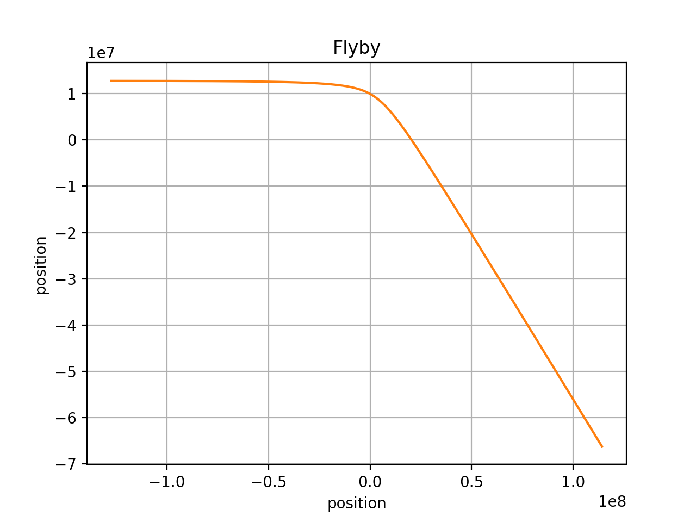
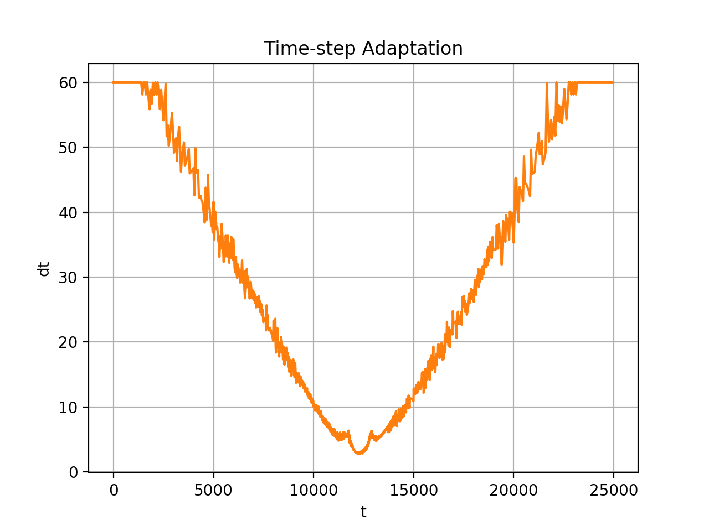

# Flyby

The Flyby program uses the **SA::RKF45Integrator** class to simulate
an asteroid passing near Earth.

For each numerical integration time-step, the simulation program prints:

1. time (s)
2. the size of the last time step
2. 2D position vector (m)
3. 2D velocity vector (m/s)

to ```stdout```, in Comma Separated Values (CSV) format.

### Building & Running the Simulation Program

Generate the results as follows:

```
$ make
$ ./Flyby > flyby.csv
```
### Plotting the Results
The Python script, ```plot_position.py``` is provided to plot the results
in ```flyby.csv ``` using (Python) matplotlib.

Plot the asteroid path as follows:

```
$ python plot_position.py
```
The following shows the path of the asteroid for 25000 seconds (about 7 hours).
The asteroid starts about 20 Earth-radii from the Earth, traveling at 10000 meters per second ( about 22000 miles per hour). The Earth is at 0,0.


The normal (maximum) step-size (dt) for this simulation is 60 seconds. As the asteroid approaches Earth, and gravitational acceleration increases, the RKF45Integrator decreases its step-size to maintain accurancy. The step-size reaches a minimum of about 3 seconds when closest to Earth. As the asteroid retreats, the step-size returns to normal.

With RKF45, a max step-size of 60 seconds, and epsilon = 0.000000001, this 25000 second simulation requires 1513 steps. With RK4 and a step-size of 3 seconds (to maintain the required accuracy), this simulation would require about 8300 steps. So, it would appear that the overhead of RKF45 can be a worthwhile investment in time.

In a simulation where the asteroid were mostly flying through open space, and rarely encountering another planet, the payoff would be much bigger.




