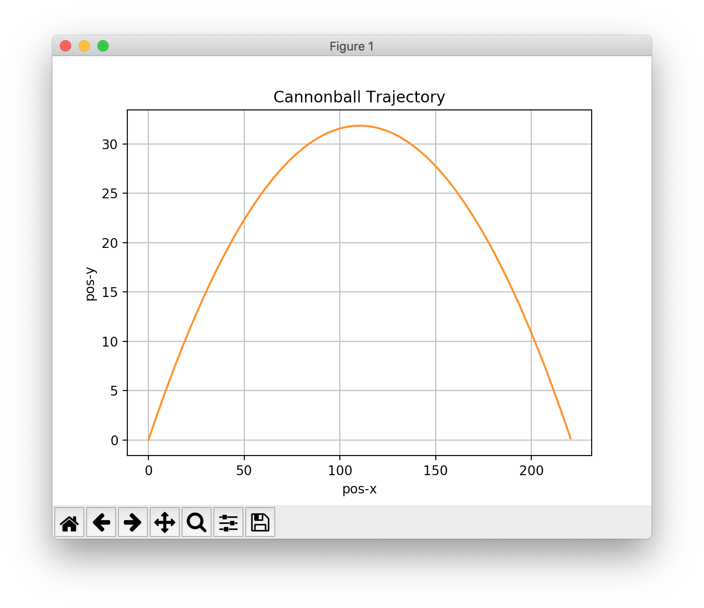

# CannonBall

The CannonBall program is an example of using the SA::RK2Integrator
to create a simple cannon ball simulation. 

For each numerical integration time-step, the simulation program prints:

1. time (s)
2. 2D position vector (m)
3. 2D velocity vector (m/s)

to ```stdout```, in Comma Separated Values (CSV) format.

### Building & Running the Simulation Program

Generate the results as follows:

```
$ make
$ ./CannonBall > cannon.csv
```
### Plotting the Results
The Python script, ```plot_trajectory.py``` is provided to plot the results
in ```cannon.csv``` using (Python) matplotlib.

Plot the cannon ball trajectory as follows:

```
$ python plot_trajectory.py
```


