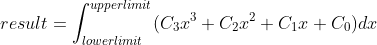
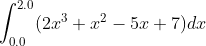

# DefiniteIntegral

This is a code example of using SAIntegrator to compute a definite integral.

This program will use the SA::RK4Integrator compute an integral of the form :



It's specifically parameterized to compute :



The correct answer is 14+2/3.

```
$ make
$ ./DefiniteIntegral
Integral = 14.6667.
```


